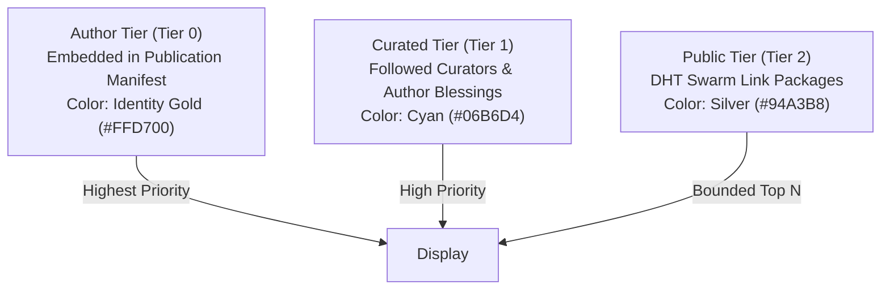

# 3D Optical Transclusion Beams, Link Topologies, and Spatial Framing Architecture

An architectural specification and design document for 3D volumetric
transclusion ribbons, butterfly xanalinks, multi-document spring physics,
perspective camera framing, and multi-tier blessing discovery across `gleditor`
and `xudu`.

---

## 1. Philosophical Foundations: The Visible Butterfly Link

In traditional web browsers and hypermedia systems, links are unidirectional
"jump cuts" that destroy the reader's current context to load a foreign page.

In Project Xanadu, Theodor Holm Nelson demanded that **both ends of a link
remain visible simultaneously**:
1. **The Butterfly Link**: A link connects a Left List of primedia spans to a
   Right List of primedia spans. Links attach to content addresses rather than
   ephemeral screen positions.
2. **Volumetric Optical Beams**: Transclusions and links manifest as continuous
   3D geometric ribbons spanning the physical space between documents.
3. **Emergent Identity vs. Explicit Assertion**:
   - **Transclusion Prisms (Identity Gold `#FFD700`)**: Spontaneously emerge
     between identical primedia spans quoted across different documents.
   - **Xanalinks (Cyan `#06B6D4` / Magenta `#D946EF`)**: Explicit relational
     connections asserted by authors, critics, or curators.

```
    ┌──────────────────────────┐                      ┌──────────────────────────┐
    │     Document A (Near)    │                      │     Document B (Far)     │
    │  [Page 1]                │                      │  [Page 1]                │
    │  "Universal transclusion │══════════════════════╡  "Universal transclusion │ (Identity Gold Band)
    │   guarantees invariance."│  (Identity Ribbon)   │   guarantees invariance."│
    │                          │                      │                          │
    │  [Page 2]                │                      │  [Page 2]                │
    │  "Author commentary..."  │╌╌╌╌╌╌╌╌╌╌╌╌╌╌╌╌╌╌╌╌╌╌┤  "Critique of premise."  │ (Commentary Amber Strand)
    └──────────────────────────┘                      └──────────────────────────┘
```

---

## 2. Spatial Geometry and Multi-Document Framing

When multiple documents are berthed alongside each other in 3D space, their
relative positions and camera frustum must adjust dynamically to preserve visual
balance and prevent line-of-sight occlusions.

### 1. Document Stack Extent (`pageStackExtent`)
A document consists of one or more vertical pages separated by page gaps:

```cpp
struct PageStackExtent {
  float top{};    // World Y coordinate of highest page top
  float bottom{}; // World Y coordinate of lowest page bottom
};
```

### 2. Centroid Alignment Leveling (`centroidAlignmentDeltaY`)
To prevent visual disorientation when comparing documents of differing page
counts, the viewport levels documents by their vertical geometric centers:

$$\Delta Y = Y_{\text{midA}} - Y_{\text{midB}} = \frac{A_{\text{top}} + A_{\text{bottom}}}{2} - \frac{B_{\text{top}} + B_{\text{bottom}}}{2}$$

### 3. Analytical Perspective Framing (`framingDistance`)
To ensure that all active documents and their connecting link beams remain
fully visible within the viewport without manual zooming, `xudu` computes the
exact camera standoff distance $D$:

$$D = \max\left(\frac{H \cdot m}{2 \tan(\text{fov}_Y / 2)}, \frac{W \cdot m}{2 \cdot \text{aspect} \cdot \tan(\text{fov}_Y / 2)}\right)$$

where:
- $H, W$ are the combined bounding height and width of the document mesh.
- $m$ is the safety margin multiplier (default: $1.15$).
- $\text{fov}_Y$ is the vertical field of view ($45^\circ$).

### 4. Non-Planar 3D Bypass Routing (`bypassRoute`)
When intermediate documents sit between the source and target endpoints, a
straight line beam would intersect the intervening page text.
`bypassRoute()` constructs a smooth quadratic Bezier arc dipping into negative
$Z$-depth behind the document plane:

$$\vec{P}(t) = (1-t)^2 \vec{P}_0 + 2(1-t)t \vec{P}_{\text{ctrl}} + t^2 \vec{P}_1, \quad \vec{P}_{\text{ctrl}} = \frac{\vec{P}_0 + \vec{P}_1}{2} - \begin{bmatrix} 0 \\ 0 \\ Z_{\text{depth}} \end{bmatrix}$$

---

## 3. GPU Instanced Beam Rendering Pipeline

Ribbons are rendered in a single pass using GPU hardware instancing via
[`Beams`](include/gleditor/beams.hpp) and [`src/beams.cpp`](src/beams.cpp).

### 1. 48-Byte Instance Data Layout (`Beams::Row`)
```cpp
struct Row {
  std::array<float, 3> from{};  ///< Start point in world space
  float width{};                ///< Beam width in world units
  std::array<float, 3> to{};    ///< End point in world space
  std::uint32_t colour{};       ///< Packed RGBA8 colour
  std::uint32_t tag{};          ///< Optical tag / picking ID
  std::array<float, 2> along{}; ///< Route range [alongFrom, alongTo]
};
```

### 2. Vertex Stage Procedural Geometry (`beam.vert.glsl`)
The vertex shader constructs oriented quad strips entirely from `gl_VertexID`
with zero per-vertex VBO storage:
1. Calculates the beam run vector: $\vec{u} = \vec{P}_{\text{to}} - \vec{P}_{\text{from}}$.
2. Computes the perpendicular tangent: $\vec{s} = \text{cross}(\vec{u}, \begin{bmatrix}0 & 0 & 1\end{bmatrix}^T)$.
3. Expands vertices along $\vec{s}$ scaled by $\text{beamWidth} / 2$.

### 3. Fragment Stage Optical Synthesis (`beam.frag.glsl`)
The fragment shader synthesizes physical glass optical effects in a single pass:
1. **Polished Optical Core**:
   $$I_{\text{core}} = \exp\left(-(3.2 \cdot |v_{\text{across}}|)^2\right)$$
2. **Fresnel Edge Sheen**:
   $$I_{\text{rim}} = \text{smoothstep}(0.65, 0.95, |v_{\text{across}}|) \cdot (1.0 - \text{smoothstep}(0.95, 1.0, |v_{\text{across}}|))$$
3. **Traveling Photonic Pulse Waves**:
   $$P(v_{\text{along}}) = \exp\left(-36.0 \cdot (\text{fract}(3.0 \cdot v_{\text{along}} - t) - 0.5)^2\right)$$

---

## 4. Margin Anchor Brackets & Multi-Lane Stacking

To indicate link presence without obscuring page typography:
- Anchor brackets render inside the document margins flush with the text
  baseline.
- When multiple links overlap a single paragraph,
  [`drawMarginAnchorLane()`](apps/xudu/beams.cpp) partitions the margin into
  up to **4 parallel vertical lanes**, preventing color collisions.

```
  Margin Lane 0: [===] Author Link (Gold)
  Margin Lane 1:   [=======] Curator Comment (Cyan)
  Margin Lane 2:     [===] Public Annotation (Silver)
```

---

## 5. Multi-Tier Link Discovery & Blessing Hierarchy

In the Docuverse, anyone may publish links to any document without asking
permission. To prevent spam and visual clutter while preserving freedom of
annotation, `xudu` implements a three-tier prominence hierarchy
([`LinkDiscoveryEngine`](apps/xudu/core/link_discovery.hpp)):



### 1. Author Blessings (`Blessing`)
An author can cryptographically endorse an external third-party `LinkPackage`
by signing a `Blessing` token. The discovery engine elevates blessed packages
directly to the `Curated` prominence tier.

### 2. Bounded Public Discovery
Public link packages discovered via the Mainline DHT are ranked by community
weight and bounded by `maxPublicPackages` (default: 10), ensuring the 3D viewport
remains clean and readable.

---

## 6. Implementation File Map

| Component | Source Files | Description |
| :--- | :--- | :--- |
| **Beam Manager** | [`apps/xudu/beams.hpp/.cpp`](apps/xudu/beams.hpp) | `LinkBeams`, strand layout, and dangling link resolution |
| **GPU Beam Pipeline** | [`include/gleditor/beams.hpp`](include/gleditor/beams.hpp), [`src/beams.cpp`](src/beams.cpp) | Hardware instanced quad ribbon renderer and picking |
| **Spatial Framing** | [`apps/xudu/core/framing.hpp/.cpp`](apps/xudu/core/framing.hpp) | Centroid alignment, camera distance, and bypass routing |
| **Link Layout** | [`apps/xudu/core/link_layout.hpp/.cpp`](apps/xudu/core/link_layout.hpp) | Span intersection, anchor placement, and strand grouping |
| **Blessings Registry** | [`apps/xudu/core/blessing.hpp/.cpp`](apps/xudu/core/blessing.hpp) | Cryptographic author endorsements for external link packages |
| **Discovery Engine** | [`apps/xudu/core/link_discovery.hpp/.cpp`](apps/xudu/core/link_discovery.hpp) | Prominence ranking and subscription filtering |
| **Shaders** | [`assets/shaders/beam.vert.glsl`](assets/shaders/beam.vert.glsl), [`beam.frag.glsl`](assets/shaders/beam.frag.glsl) | GLSL vertex geometry and fragment optical shading |
| **Unit Tests** | [`tests/xudu/beams.cpp`](tests/xudu/beams.cpp), [`tests/lib/beams.cpp`](tests/lib/beams.cpp) | Framing geometry, strand generation, and optical tests |
