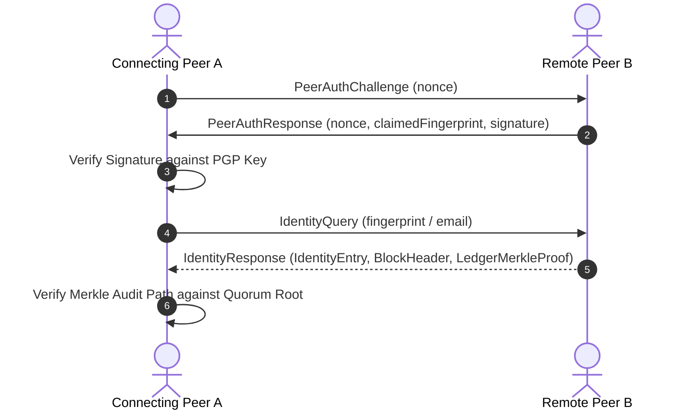
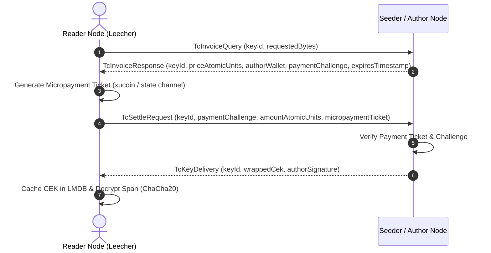

# BEP 10 BitTorrent Wire Protocol Extensions Specification

An architectural specification and reference document for all custom BEP 10
(BitTorrent Extension Protocol) extensions across the `gleditor`, `xudu`, and
`zigzag` systems.

---

## 1. Overview: The Swarm as a Sovereign Transport Layer

In traditional decentralized systems, identity, collaborative live editing, and
micropayments are delegated to separate network sidecars, HTTP servers, or
blockchain RPC nodes. In the Xanadulogical architecture of `xudu` and `gleditor`,
**the BitTorrent peer wire is the sole transport layer**.

By building on **BEP 10 (Extension Protocol for BitTorrent)**:
1. **Zero Additional Ports**: All metadata, identity handshakes, live ops, and
   payment settlement travel over the single established BitTorrent TCP/uTP peer
   socket.
2. **Unified NAT Traversal & Encryption**: All traffic inherits libtorrent's
   built-in hole punching, UPnP, NAT-PMP, and MSE/PE stream encryption.
3. **Swarm Locality**: Peers collaborating on a specific Xanadoc or quoting the
   same permascroll interact directly over the swarm carrying that content.

---

## 2. BEP 10 Framing, Handshake & Message Multiplexing

### Handshake Negotiation (`add_handshake` / `on_extension_handshake`)

When two peers connect, they exchange standard BEP 10 extension handshake
dictionaries. Each client advertises the extensions it supports in the `"m"`
sub-dictionary, mapping the canonical extension name to its preferred local
integer message ID:

```
{
  "m": {
    "xudu_live_op": 1,
    "xudu_identity_lookup": 2,
    "xudu_oracle_vote": 3,
    "xudu_oracle_verify": 4,
    "xudu_transcopyright": 5
  }
}
```

When receiving `on_extension_handshake(node)`, each plugin extracts the
corresponding remote message ID assigned by the remote peer. Outgoing messages
are then sent using the remote peer's advertised ID.

### Packet Framing Format

Every BEP 10 extended packet on the wire adheres to standard BitTorrent
message framing:

```
┌───────────────────────────────┬───────────────────────────────┐
│ Length Prefix (4 bytes, BE)   │ Total bytes following length  │
├───────────────────────────────┼───────────────────────────────┤
│ Message ID (1 byte)           │ 20 (0x14 = kBtMsgExtended)    │
├───────────────────────────────┼───────────────────────────────┤
│ Extended Message ID (1 byte)  │ Remote Extension ID (1..5)    │
├───────────────────────────────┼───────────────────────────────┤
│ Payload (Variable bytes)      │ Bencoded or Typed Frame Body  │
└───────────────────────────────┴───────────────────────────────┘
```

### Universal Extended Envelope (`identity_serialization.hpp`)

For identity, voting, and transcopyright messages, the payload begins with a
1-byte `MessageType` enum followed by canonical Bencoded payload data:

$$\text{ExtendedPayload} = \text{MessageType (1 byte)} \parallel \text{BencodeDict}$$

```cpp
enum class MessageType : std::uint8_t {
  // Identity Lookup & Authentication
  IdentityQuery           = 0x01,
  IdentityResponse        = 0x02,
  PeerAuthChallenge       = 0x03,
  PeerAuthResponse        = 0x04,
  ConnectionDenial        = 0x05,

  // Oracle Consensus & Voting
  OracleVoteBroadcast     = 0x10,
  OracleConsensusQuery    = 0x11,
  OracleConsensusResponse = 0x12,

  // Oracle Email Attestation
  EmailVerifyRequest      = 0x20,
  EmailVerifyChallengeAck = 0x21,
  EmailVerifyAttestation  = 0x22,

  // Transcopyright Micropayments
  TcInvoiceQuery          = 0x30,
  TcInvoiceResponse       = 0x31,
  TcSettleRequest         = 0x32,
  TcKeyDelivery           = 0x33
};
```

---

## 3. Extension Catalog

```
┌───────────────────────┬──────────┬───────────────────────────────────────┐
│ Extension Name        │ Local ID │ Core Functionality                    │
├───────────────────────┼──────────┼───────────────────────────────────────┤
│ xudu_live_op          │ 1        │ Collaborative editing without text    │
│ xudu_identity_lookup  │ 2        │ Identity queries & peer authentication│
│ xudu_oracle_vote      │ 3        │ Oracle vote gossip & quorum consensus │
│ xudu_oracle_verify    │ 4        │ Out-of-band email attestation         │
│ xudu_transcopyright   │ 5        │ Per-byte micropayment & CEK unlocking │
└───────────────────────┴──────────┴───────────────────────────────────────┘
```

---

## 4. Specification: `xudu_live_op` (ID: 1)

### Purpose
Enables real-time collaborative multi-user editing on active Xanadocs.
Crucially, **zero raw text is transmitted in live ops**: all modifications
reference immutable 48-byte canonical descriptors (`GlobalSpan`) and
microversion hashes, preventing local spool pollution and guaranteeing
deterministic OT/CRDT convergence.

### Bencode Schema
```
{
  "t": <int: operation_type (Insert=1, Delete=2, Transclude=3, Link=4)>,
  "o": <int: target_offset_in_doc>,
  "s": <int: scroll_id>,
  "l": <int: length_bytes>,
  "c": <string: author_fingerprint_hex>,
  "d": <string: microversion_id_hex>
}
```

### Operation Flow
1. Author types text locally into their sovereign `UserPermascroll` (Slot 0).
2. The client commits the span to its local spool and generates a `GlobalSpan`.
3. The client broadcasts `xudu_live_op` containing the descriptor.
4. Remote peers receive the descriptor and stage the operation into their local
   `Store` without downloading raw text until rendered.

---

## 5. Specification: `xudu_identity_lookup` (ID: 2)

### Purpose
Provides two-way cryptographic peer authentication, identity resolution, and
Merkle inclusion proof delivery.



### Message Formats

#### 1. `PeerAuthChallenge` (`0x03`)
Sent immediately after extension handshake to gate the connection.
```
{ "n": <32-byte binary nonce>, "t": <int: timestamp> }
```

#### 2. `PeerAuthResponse` (`0x04`)
Proves private key possession for the claimed PGP identity.
```
{
  "n": <32-byte binary nonce>,
  "c": <20-byte binary fingerprint>,
  "s": <64-byte binary signature>
}
```

#### 3. `IdentityQuery` (`0x01`)
Lookup request by fingerprint or email address.
```
{ "fp": <20-byte binary fingerprint>, "email": <string: normalized_email> }
```

#### 4. `IdentityResponse` (`0x02`)
Delivers the identity record, block header, and Merkle audit path.
```
{
  "entry": {
    "fp": <20-byte binary fingerprint>,
    "email": <string: email>,
    "name": <string: identity_name>,
    "key": <string: armored_public_key>,
    "time": <int: timestamp>,
    "seq": <int: sequence>,
    "rev": <int: revoked_flag>,
    "sig": <64-byte signature>
  },
  "header": {
    "idx": <int: block_index>,
    "time": <int: timestamp>,
    "prev": <32-byte previous_hash>,
    "root": <32-byte merkle_root>,
    "id_cnt": <int: identity_count>,
    "vt_cnt": <int: vote_count>
  },
  "proof": {
    "leaf_idx": <int: leaf_index>,
    "max_idx": <int: max_index>,
    "path": [
      { "h": <32-byte hash>, "l": <int: is_left_flag> }, ...
    ]
  }
}
```

---

## 6. Specification: `xudu_oracle_vote` (ID: 3)

### Purpose
Gossip network for weighted community votes electing the active Oracle quorum.

### Message Formats

#### 1. `OracleVoteBroadcast` (`0x10`)
Broadcasts a new vote endorsing an Oracle candidate.
```
{
  "voter": <20-byte voter_fingerprint>,
  "candidate": <20-byte candidate_oracle_fingerprint>,
  "time": <int: vote_timestamp>,
  "seq": <int: monotonic_sequence>,
  "sig": <64-byte detached_signature>
}
```

#### 2. `OracleConsensusQuery` (`0x11`) & `OracleConsensusResponse` (`0x12`)
Synchronizes candidate vote tallies and the active quorum root between peers.
```
{
  "quorum_size": <int: requested_quorum_size>,
  "candidates": [
    { "fp": <20-byte fingerprint>, "weight": <int: total_weighted_power> }, ...
  ],
  "root": <32-byte ledger_root>
}
```

---

## 7. Specification: `xudu_oracle_verify` (ID: 4)

### Purpose
Out-of-band email attestation protocol between authors and elected Oracles.

### Message Formats

#### 1. `EmailVerifyRequest` (`0x20`)
Author requests an email verification challenge from an elected Oracle.
Gated by Hashcash Proof-of-Work to eliminate spam.
```
{
  "req_fp": <20-byte author_fingerprint>,
  "email": <string: target_email>,
  "time": <int: timestamp>,
  "pow": {
    "ver": <int: 1>,
    "bits": <int: difficulty_bits (>= 20)>,
    "res": <string: resource_identifier>,
    "salt": <string: random_salt_hex>,
    "nonce": <int: proof_nonce>
  },
  "sig": <64-byte author_signature>
}
```

#### 2. `EmailVerifyChallengeAck` (`0x21`)
Author returns the secret token received via out-of-band email (SMTP/DKIM).
```
{
  "req_fp": <20-byte author_fingerprint>,
  "token": <32-byte secret_challenge_token>,
  "sig": <64-byte author_signature>
}
```

#### 3. `EmailVerifyAttestation` (`0x22`)
Oracle delivers the signed attestation token.
```
{
  "oracle": <20-byte oracle_fingerprint>,
  "target": <20-byte author_fingerprint>,
  "email": <string: verified_email>,
  "issued": <int: issuance_timestamp>,
  "expires": <int: expiration_timestamp>,
  "sig": <64-byte oracle_signature>
}
```

---

## 8. Specification: `xudu_transcopyright` (ID: 5)

### Purpose
Decentralized per-byte micropayment invoicing and Content Encryption Key (CEK)
delivery for Ted Nelson's Transcopyright.



### Message Formats

#### 1. `TcInvoiceQuery` (`0x30`)
Requests an invoice for an encrypted span.
```
{ "key_id": <32-byte key_id>, "bytes": <int: requested_byte_count> }
```

#### 2. `TcInvoiceResponse` (`0x31`)
Delivers pricing and payment parameters.
```
{
  "key_id": <32-byte key_id>,
  "price": <int: price_atomic_units (nano-xu)>,
  "flat": <int: flat_fee_flag>,
  "currency": <string: currency_symbol ("XU", "SAT")>,
  "wallet": <20-byte author_wallet_fingerprint>,
  "pubkey": <32-byte author_public_key>,
  "challenge": <32-byte payment_challenge_nonce>,
  "expires": <int: expiration_epoch>
}
```

#### 3. `TcSettleRequest` (`0x32`)
Delivers the micropayment settlement proof.
```
{
  "key_id": <32-byte key_id>,
  "challenge": <32-byte payment_challenge_nonce>,
  "amount": <int: amount_atomic_units>,
  "payer_wallet": <20-byte payer_fingerprint>,
  "payer_pubkey": <32-byte payer_public_key>,
  "ticket": <string: micropayment_ticket_data>,
  "sig": <64-byte payment_proof_signature>
}
```

#### 4. `TcKeyDelivery` (`0x33`)
Delivers the wrapped Content Encryption Key.
```
{
  "key_id": <32-byte key_id>,
  "cek": <binary: wrapped_or_plain_cek>,
  "sig": <64-byte author_signature>
}
```

---

## 9. Security, Peer Gating & Isolation Model

### Peer Gating (`IdentityPeerPlugin`)
1. **Challenge Timeout**: A connecting peer has 10 seconds to respond to a
   `PeerAuthChallenge`. If unanswered, the peer is disconnected.
2. **Signature Failure**: If an authentication signature or attestation token
   fails cryptographic verification, `isolateAndDisconnect()` immediately drops
   the connection and blacklists the remote IP.
3. **Sybil & Spam Throttle**: Any peer issuing more than 5 failed queries per
   minute or submitting invalid Hashcash PoW is banned for 1 hour.

---

## 10. Implementation File Reference

| Component | Files | Description |
| :--- | :--- | :--- |
| **Live Op Plugin** | [`apps/xudu/core/swarm.cpp`](apps/xudu/core/swarm.cpp) | `XuduPeerPlugin` & `XuduTorrentPlugin` (`xudu_live_op`) |
| **Identity Controller** | [`apps/xudu/core/identity/identity_network_controller.hpp/.cpp`](apps/xudu/core/identity/identity_network_controller.hpp) | `IdentityPeerPlugin` & `IdentityTorrentPlugin` (Extensions 2, 3, 4, 5) |
| **Message Layouts** | [`apps/xudu/core/identity/identity_layout.hpp`](apps/xudu/core/identity/identity_layout.hpp) | Struct definitions for all wire messages |
| **Bencode Serialization** | [`apps/xudu/core/identity/identity_serialization.hpp/.cpp`](apps/xudu/core/identity/identity_serialization.hpp) | Zero-copy encoders and decoders for all wire frames |
| **PoW Engine** | [`apps/xudu/core/identity/identity_validation.hpp/.cpp`](apps/xudu/core/identity/identity_validation.hpp) | `HashcashEngine` verifier, miner, and anti-replay cache |
| **Unit Tests** | [`tests/xudu/identity_test.cpp`](tests/xudu/identity_test.cpp), [`tests/xudu/transcopyright_test.cpp`](tests/xudu/transcopyright_test.cpp) | BEP 10 encoding, decoding, and network integration tests |
