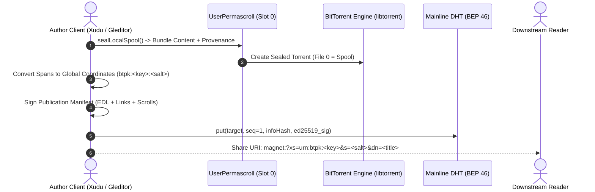
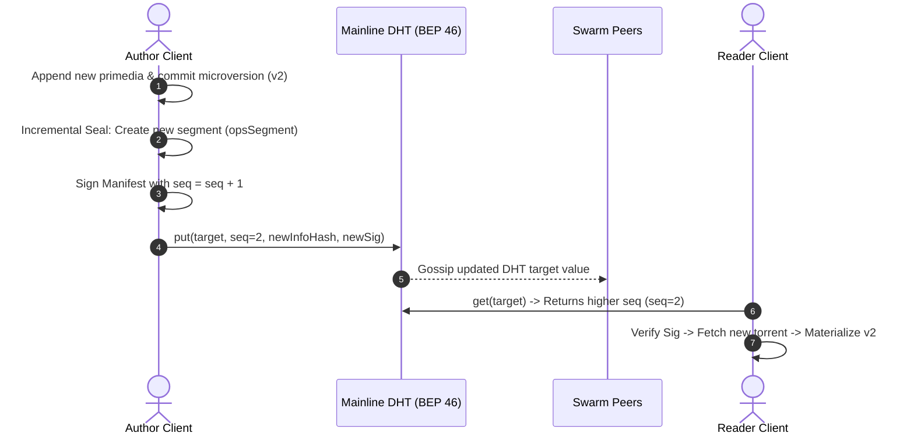
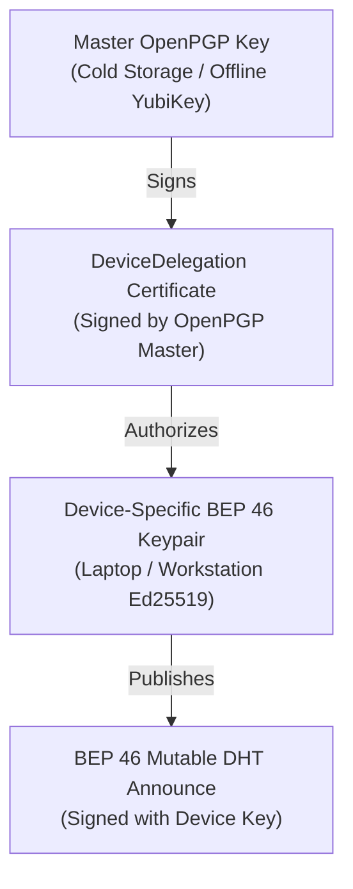

# BEP 46 Publication, Republishing, and Author Corpus Discovery

An architectural specification and design document for publishing xanadocs as
BEP 46 mutable torrents, incremental republishing with sequence-numbered DHT
pointers, and discovering an author's entire body of published work using their
public key across `gleditor`, `xudu`, and `zigzag`.

---

## 1. Foundations: The Naming Problem in Append-Only Docuverses

In BitTorrent, content is addressed by its **InfoHash** (the SHA-1 or SHA-256
hash of the `.torrent` metainfo dictionary). Content addressing guarantees
immutability and integrity: the hash specifies the exact file list, piece
length, and piece hashes.

However, content addressing creates a fundamental paradox for living documents
and append-only permascrolls:

$$\text{Content-Addressed BitTorrent} \implies \text{Appending produces a different InfoHash}$$

If a xanadoc or permascroll were named by its info hash, every subsequent edit,
revision, or append would produce a new address. Every external quotation,
transclusion, or bookmark referencing the earlier hash would go stale or fail to
reflect the author's ongoing revisions.

### The Solution: BEP 46 Mutable Torrents as Permanent Names

**BEP 46 (BEP 44 / BEP 46)** introduces cryptographic public key indirection to
the Mainline DHT. Instead of addressing a document by its ephemeral torrent
hash, a xanadoc is addressed by:

$$\text{Permanent Name} = (\text{Publisher Ed25519 Public Key}, \text{Salt})$$

The DHT stores an authenticated, sequence-numbered pointer:

$$\text{DHT Record} = \langle \text{Target}, \text{Seq}, \text{InfoHash}, \text{Sig} \rangle$$

where:
- $\text{Target} = \text{SHA-1}(\text{PublicKey} \parallel \text{Salt})$ is the
  20-byte DHT routing slot.
- $\text{Seq}$ is a monotonically increasing 64-bit integer.
- $\text{InfoHash}$ is the BitTorrent info hash of the current publication.
- $\text{Sig} = \text{Ed25519\_Sign}_{\text{PrivKey}}(\text{Salt}, \text{Seq}, \text{InfoHash})$
  guarantees that only the author can move the pointer.

The public key never changes. What it points to updates dynamically as the
author publishes new revisions.

---

## 2. Initial Publication Lifecycle

When an author publishes a xanadoc for the first time, the document transitions
from a private, local coordinate space into a globally addressable publication:



### 1. Local Permascroll Sealing (`sealLocalSpool`)
- The author's append-only primedia spool (`UserPermascroll`) is packaged into a
  BitTorrent metainfo file.
- **Byte Invariance**: The content is always located at file index 0, starting
  at stream offset 0. Local span offsets map 1:1 to global stream coordinates.
- **Signed Provenance**: The torrent bundles the author's OpenPGP provenance
  claim and detached signature directly into the metainfo file, binding the
  author's identity to the exact piece hashes.

### 2. Global Coordinate Translation (`globalise`)
The document's Edit Decision List (EDL) is translated from internal `ScrollId`
indices into canonical `GlobalSpan` records:

```cpp
struct GlobalSpan {
  std::string scroll;     // "btpk:<pubkey_hex>:<salt>" or "file:<ih_hex>:<idx>"
  std::uint64_t start{};   // Fixed byte offset in the scroll
  std::uint64_t length{};  // Span length in bytes
};
```

### 3. Signed Publication Manifest (`Publication`)
The author signs the canonical Bencoded publication manifest containing:
- `publisher`: The author's Ed25519 public key.
- `salt`: Document identifier.
- `version`: The microversion ID (e.g. `2a4`).
- `sequence`: Publication sequence number ($\text{seq} = 1$).
- `pieces`: The sequence of `GlobalSpan` references forming the document text.
- `scrolls`: The manifest table defining how to fetch and resolve referenced
  scrolls.
- `signature`: Ed25519 signature over the canonical manifest.

---

## 3. Incremental Republishing Lifecycle

When an author makes further edits, fixing errors or appending chapters, they
republish the document without breaking existing citations or re-uploading
earlier primedia:



### Incremental Sealing (`SealState`)
- `sealLocalSpool()` carries forward all previously sealed segments. Only new
  bytes and newly recorded microversion operations (`opsSegments`) are packaged
  into a new torrent.
- Existing coordinate offsets remain strictly untouched.
- Bandwidth is conserved: readers who already hold earlier segments only
  download the newly added delta segment.

### Sequence Monotonicity & Anti-Rollback
- Under BEP 44 / 46 rules, DHT nodes reject any `put` request whose sequence
  number is less than or equal to the current sequence on record:
  $$\text{seq}_{\text{new}} > \text{seq}_{\text{current}}$$
- When a reader queries the DHT via `SwarmContentSource::resolveMutableLink()`,
  DHT nodes return the highest sequence observed.
- The reader verifies the author's signature over the sequence and info hash,
  completely preventing replay attacks or malicious rollbacks.

---

## 4. Author Corpus Discovery: Finding an Author's Entire Body of Work

A central challenge in decentralized publishing is discovering all works created
by an author without relying on a centralized search engine or central platform.

`xudu` achieves complete author corpus discovery through **deterministic DHT
salt namespacing** anchored to the author's sovereign public key:

```
                              [ Author Ed25519 PublicKey ]
                                           │
         ┌──────────────────┬──────────────┴──────────────┬──────────────────┐
         │                  │                             │                  │
    salt = ""          salt = "scroll"             salt = "doc:..."     salt = "curations"
         │                  │                             │                  │
   [ Master Index ]  [ Lifetime Permascroll ]      [ Xanadoc Slices ]  [ Link Packages ]
   Target: SHA1(K)    Target: SHA1(K || "scroll")   Target: SHA1(...)   Target: SHA1(...)
```

### The Salt Namespacing Convention

| Salt Pattern | Purpose | Description |
| :--- | :--- | :--- |
| `salt = ""` or `"index"` | **Author Master Catalog** | Root catalog listing all published document salts, titles, dates, and latest microversion IDs. |
| `salt = "permascroll"` | **Author Permascroll** | Lifelong append-only primedia stream carrying all raw text typed by this author. |
| `salt = "doc:<slug>"` | **Specific Xanadoc** | Individual published documents (e.g. `doc:possiplex-chapter-1`). |
| `salt = "curations"` | **Curated Link Packages** | Standalone link packages curated by this author referencing external documents. |
| `salt = "identity_ledger"` | **Identity Declaration** | Signed OpenPGP / BEP 46 cross-attestation and identity consensus record. |

### Discovering the Entire Corpus in Practice
1. **Direct Root Lookup**: A reader holding an author's public key $K$ queries
   the DHT for the bare target $\text{Target}_{\text{root}} = \text{SHA-1}(K)$.
2. **Catalog Materialization**: The DHT returns the info hash for the author's
   master catalog. The reader downloads the catalog publication manifest.
3. **Corpus Traversal**: The catalog contains the signed list of all active
   document salts published by the author:
   ```yaml
   author: "9b8c7d6e5f4a3b2c1d0e9f8a7b6c5d4e3f2a1b0c"
   updated: 1700000000
   documents:
     - salt: "doc:hypertext-foundations"
       title: "Foundations of Hypertext"
       version: "3f1"
       uri: "magnet:?xs=urn:btpk:9b8c...&s=646f633a687970657274657874...&dn=Foundations"
     - salt: "doc:transcopyright-mechanics"
       title: "Transcopyright Economics"
       version: "1a0"
       uri: "magnet:?xs=urn:btpk:9b8c...&s=646f633a7472616e73636f70...&dn=Economics"
   ```
4. **Autonomous Resolution**: The client can subscribe to, mirror, or transclude
   any document in the author's corpus with zero third-party intermediaries.

---

## 5. Dual-Key Delegation: Bridging OpenPGP and BEP 46

To support multi-device authoring without exposing master keys on untrusted or
mobile hardware, `xudu` implements **Dual-Key Delegation** (`DeviceDelegation`
in [`user_permascroll.hpp`](apps/xudu/core/user_permascroll.hpp)):



1. **Master Identity**: The author's canonical identity is an OpenPGP key
   registered in the Merkle identity ledger.
2. **Delegation Certificate**: The master key signs an offline `DeviceDelegation`
   certificate granting publishing authority to a specific device's Ed25519 key
   (`DeviceKeys`) for a bounded time window.
3. **Transparent Verification**: Readers resolve BEP 46 updates signed by the
   device key and verify the delegation certificate against the author's master
   fingerprint.

---

## 6. Security and Consistency Analysis

| Threat Scenario | Vector | Mitigation |
| :--- | :--- | :--- |
| **Unauthorized Pointer Mutation** | Malicious peer attempts to point an author's name to a phishing torrent. | DHT nodes verify Ed25519 signature against the public key; rejected at DHT routing layer. |
| **Stale Read / Eclipse Attack** | Malicious node returns an old sequence number ($\text{seq}=1$ instead of $\text{seq}=5$). | Reader queries multiple DHT nodes across distinct routing buckets and takes $\max(\text{seq})$. |
| **Key Loss / Rotation** | Device key is lost or compromised. | Master OpenPGP key publishes a `revoked = true` tombstone to the Merkle ledger and issues a fresh delegation certificate. |
| **Spool Re-Indexing Corruption** | Authoring tool shifts offsets during edits. | Spool is strictly append-only; byte coordinates are immutable and never re-indexed. |

---

## 7. Implementation File Map

| Component | Files | Description |
| :--- | :--- | :--- |
| **BEP 46 Math & Link Parsing** | [`apps/xudu/core/mutable_link.hpp/.cpp`](apps/xudu/core/mutable_link.hpp) | `MutableLink`, `PublicKey`, `SecretKey`, `DhtTarget`, and `mutableSigningBuffer` |
| **Publication Pipeline** | [`apps/xudu/core/publication.hpp/.cpp`](apps/xudu/core/publication.hpp) | `publish()`, `publishDocument()`, `sealLocalSpool()`, `globalise()`, and `localise()` |
| **DHT Swarm Resolver** | [`apps/xudu/core/swarm.hpp/.cpp`](apps/xudu/core/swarm.hpp) | `SwarmContentSource::resolveMutableLink()` and DHT `get`/`put` integration |
| **Device Delegation** | [`apps/xudu/core/user_permascroll.hpp/.cpp`](apps/xudu/core/user_permascroll.hpp) | `DeviceDelegation` certificate generation and verification |
| **Discovery Engine** | [`apps/xudu/core/link_discovery.hpp/.cpp`](apps/xudu/core/link_discovery.hpp) | Multi-tier author, curator, and public package ranking |
| **Automated Tests** | [`tests/xudu/mutable_link.cpp`](tests/xudu/mutable_link.cpp), [`publication.cpp`](tests/xudu/publication.cpp), [`swarm.cpp`](tests/xudu/swarm.cpp) | BEP 44/46 test vectors, round-trip serialization, and swarm netns tests |
