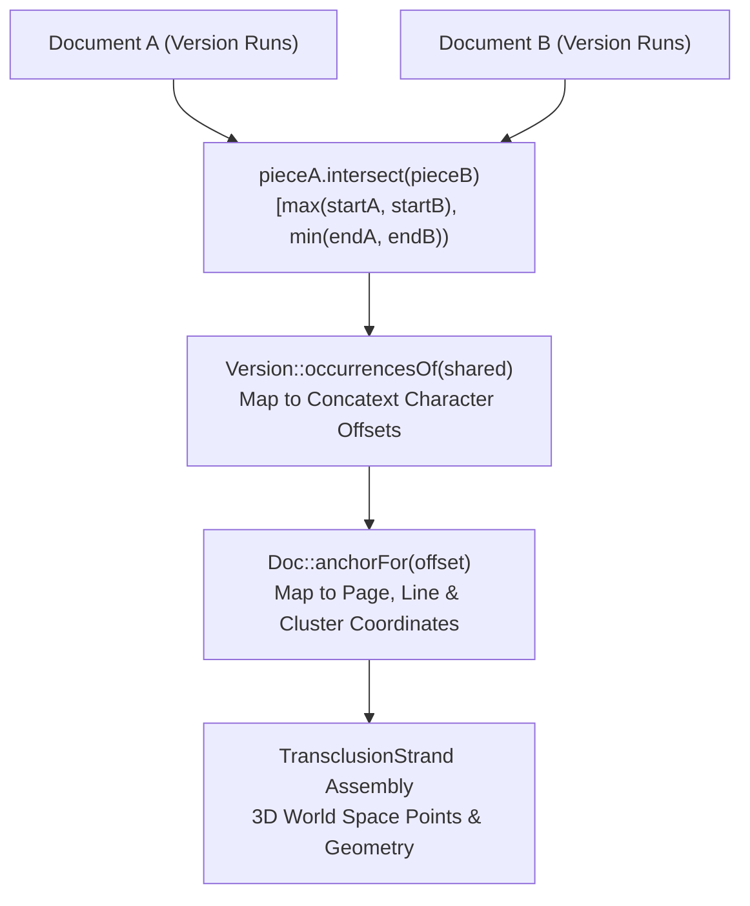

# Links vs. Transclusions: Computation, Visualization, and Scalability Architecture

An architectural specification and design document defining the fundamental
distinction between explicit xanalinks and emergent transclusions, their
geometric computation, 3D/2D optical visualization pipelines, and algorithmic
optimizations for multi-megabyte documents across `gleditor`, `xudu`, and
`zigzag`.

---

## 1. Ontological Distinction: Explicit Links vs. Emergent Transclusions

In conventional computing and the World Wide Web, the concept of a "link" is
conflated with all inter-document relationships, and quotation is achieved
through lossy, uncredited copy-pasting.

In Project Xanadu and the `xudu` architecture, **Links** and **Transclusions**
are completely distinct mathematical and operational primitives:

```
┌────────────────────────────────────────────────────────────────────────┐
│                        THE DOCUVERSE CONTINUUM                         │
├───────────────────────────────────┬────────────────────────────────────┤
│     XANALINKS (Explicit Links)    │     TRANSCLUSIONS (Identity)       │
├───────────────────────────────────┼────────────────────────────────────┤
│ • Asserted by an author/curator   │ • Emergent property of coordinate  │
│ • First-class stored objects      │   space (same primedia address)    │
│ • Relational / Semantic (Comment, │ • Zero storage; computed from EDLs │
│   Illustration, Disagreement)     │ • Ontological identity (the same   │
│ • Point-to-point butterfly span   │   character bytes in hypertime)    │
│ • Emits colored ribbons (Cyan,    │ • Omnidirectional hypermesh across │
│   Magenta, Silver by tier)        │   every quoting document           │
│ • Managed in LinkPackages         │ • Emits Identity Gold beams/prisms │
│                                   │   (#FFD700) and in-page highlights │
└───────────────────────────────────┴────────────────────────────────────┘
```

### Comprehensive Comparison Matrix

| Dimension | Xanalink (`Link` / `GlobalLink`) | Transclusion (`PrimediaSpan` / `GlobalSpan`) |
| :--- | :--- | :--- |
| **Origin & Authority** | Asserted by human intention (Author, Curator, or Public reader). | Emergent physical fact of shared primedia coordinates. |
| **Storage Model** | Stored explicitly in `Store::links()` or signed `LinkPackage` bundles. | **Zero stored link objects**. Derived dynamically from Edit Decision Lists (EDLs). |
| **Coordinate Binding** | Connects Left List spans to Right List spans. | Identical coordinate tuple $(\text{ScrollId}, \text{Offset}, \text{Length})$. |
| **Cardinality** | Butterfly pair ($1 \to 1$, $1 \to N$, or $N \to M$). | Omnidirectional $N$-way mesh across all documents in the Docuverse. |
| **Semantics** | Commentary, Illustration, Disagreement, Format, Dimension. | Pure sameness: identical primedia quoted in new contexts. |
| **Visual Appearance** | Colored ribbons (Cyan `#06B6D4`, Magenta `#D946EF`, Purple `#8B5CF6`). | Solid **Identity Gold** volumetric ribbons & prisms (`#FFD700`). |
| **Page Margin Indication** | Discrete bracket lanes inside page margins (Lanes 0–3). | Continuous golden highlight bars & volumetric connection bands. |
| **Hole & Lock Handling** | Points across withheld spans as a relational note. | Transforms into **Obsidian Redaction** (`#1F2937`) or **Transcopyright Gold** (`#F59E0B`). |
| **Zigzag Dimensionality** | Maps to `d.link` orthogonal dimension. | Maps to `d.transclude` orthogonal dimension. |
| **Economic Royalty Flow** | Royalty attribution to link curator/author. | Nelsonian Transcopyright settlement direct to original primedia author. |

---

## 2. Mathematical Computation of Transclusions

Transclusion is never recorded as a database entry. When multiple documents are
opened in `xudu` or projected in `zigzag`, the engine evaluates the geometric
overlap of their Edit Decision Lists.



### 1. EDL Piece Table Intersection (`placeTransclusions`)
In [`apps/xudu/core/link_layout.cpp`](apps/xudu/core/link_layout.cpp), `placeTransclusions()`
compares the piece tables of all active document views:

```cpp
void placeTransclusions(const std::vector<const Version *> &views,
                        std::vector<TransclusionPair> &pairs) {
  pairs.clear();
  for (std::uint32_t i = 0; i < views.size(); ++i) {
    const auto &docA = *views[i];
    for (std::uint32_t j = i + 1; j < views.size(); ++j) {
      const auto &docB = *views[j];

      for (const auto &pieceA : docA.pieces()) {
        for (const auto &pieceB : docB.pieces()) {
          // Compute exact coordinate overlap in primedia space
          const auto shared = pieceA.intersect(pieceB);
          if (shared.empty()) continue;

          // Resolve character offsets within each document's concatext
          const auto occsA = docA.occurrencesOf(shared);
          const auto occsB = docB.occurrencesOf(shared);

          for (const auto &extA : occsA) {
            for (const auto &extB : occsB) {
              pairs.push_back(TransclusionPair{
                  .from = LinkEnd{i, extA.start, extA.end},
                  .to   = LinkEnd{j, extB.start, extB.end},
                  .span = shared,
              });
            }
          }
        }
      }
    }
  }
}
```

### 2. Analytical Span Overlap (`PrimediaSpan::intersect`)
Two pieces share content if and only if they reference the same `ScrollId` and
their byte extents overlap:

$$\text{shared}.\text{start} = \max(\text{start}_A, \text{start}_B)$$
$$\text{shared}.\text{end} = \min(\text{start}_A + \text{len}_A, \text{start}_B + \text{len}_B)$$
$$\text{shared}.\text{length} = \max(0, \text{shared}.\text{end} - \text{shared}.\text{start})$$

### 3. Layout Anchor Resolution (`Doc::anchorFor`)
Once character offsets $(\text{start}, \text{end})$ in concatext are known:
1. `Doc::anchorFor(offset)` performs a binary search over paginated lines to
   identify the exact `pageIndex`, line index, vertical $Y$-baseline, and
   horizontal cluster bounding box.
2. `Doc::worldPoint()` transforms layout-space coordinates into 3D world-space
   vertices:

$$\vec{P}_{\text{world}} = \mathbf{M}_{\text{doc}} \cdot \begin{bmatrix} X_{\text{page}} + X_{\text{cluster}} \\ Y_{\text{page}} - Y_{\text{baseline}} \\ 0 \\ 1 \end{bmatrix}$$

---

## 3. Visualization Pipeline: 3D Optical Beams & 2D Highlights

```
    ┌──────────────────────────┐                      ┌──────────────────────────┐
    │     Document A (Near)    │                      │     Document B (Far)     │
    │  [Page 1]                │                      │  [Page 1]                │
    │  "Universal transclusion │══════════════════════╡  "Universal transclusion │ (Identity Gold Band)
    │   guarantees invariance."│  (Identity Ribbon)   │   guarantees invariance."│
    │                          │                      │                          │
    │  [Page 2]                │                      │  [Page 2]                │
    │  "Author commentary..."  │╌╌╌╌╌╌╌╌╌╌╌╌╌╌╌╌╌╌╌╌╌╌┤  "Critique of premise."  │ (Commentary Amber Strand)
    └──────────────────────────┘                      └──────────────────────────┘
```

### 1. Volumetric Transclusion Prisms (`LinkBeams::band`)
In [`apps/xudu/beams.cpp`](apps/xudu/beams.cpp), transclusions are drawn as
multi-strand volumetric ribbons:
- **Default Appearance**: Pure **Identity Gold** (`0xFFD700FF`).
- **Withheld / Redacted Spans**: **Obsidian Redaction Beams** (`0x1F2937FF`).
- **Transcopyright Locked Spans**: **Transcopyright Amber Gold** (`0xF59E0BFF`)
  with active traveling photonic energy pulses.
- **Dynamic Multi-Strand Spacing (`bandStrandCount`)**: Strands are spaced
  across the taller span, converging smoothly onto the shorter span to prevent
  visual pinching or bow-tie artifacts.

### 2. Non-Planar 3D Bypass Routing (`bypassRoute`)
When intermediate documents sit between transclusion endpoints, the ribbon
dips into negative $Z$-depth behind the document plane via a quadratic Bezier
arc:

$$\vec{P}_{\text{ctrl}} = \frac{\vec{P}_{\text{near}} + \vec{P}_{\text{far}}}{2} - \begin{bmatrix} 0 \\ 0 \\ Z_{\text{depth}} \end{bmatrix}$$

### 3. In-Page Multi-Banded Highlighting (`glyph.frag.glsl`)
When a character on a page is simultaneously part of a transclusion and multiple
xanalinks:
- The fragment shader partitions the 24-byte glyph quad ([`Doc::VBORow`](include/gleditor/doc.hpp))
  vertically into up to **4 distinct color bands** without requiring duplicate
  draw calls or alpha blending artifacts.

---

## 4. Scalability Architecture & Optimizations for Massive Documents

When rendering and computing transclusions across documents with hundreds of
thousands of pages and multi-megabyte primedia spools, naive algorithms would
trigger catastrophic $O(N^2)$ stalls. `xudu` and `gleditor` implement a
multi-tiered optimization pipeline:

```
┌────────────────────────────────────────────────────────────────────────┐
│                      SCALABILITY OPTIMIZATION PIPELINE                 │
├───────────────────────────────────┬────────────────────────────────────┤
│ 1. Height-Budgeted Layout Slicing │ • O(1) page generation time        │
│    (TextLayout::layoutPage)       │ • Limits shaping to sliceBudget    │
├───────────────────────────────────┼────────────────────────────────────┤
│ 2. Interval Sweep Intersect       │ • O(N + M) span intersection       │
│    (GlobalSpan::intersect)        │ • Skips non-overlapping runs       │
├───────────────────────────────────┼────────────────────────────────────┤
│ 3. Zero-Copy Virtual Memory Arena │ • mmap(MAP_FIXED) segmented spools │
│    (VirtualMemoryArena)           │ • 0 physical RAM for unread pages  │
├───────────────────────────────────┼────────────────────────────────────┤
│ 4. Lock-Free GPU Ring Streaming   │ • StreamBufferGL / StreamBufferVK  │
│    (StreamBufferGL)               │ • 0 driver stalls / sync fences    │
├───────────────────────────────────┼────────────────────────────────────┤
│ 5. Frustum & Screen-Scale LOD     │ • Coarse solid bars below 0.15 px  │
│    (DrawBudget)                   │ • >90% reduction in vertex count   │
├───────────────────────────────────┼────────────────────────────────────┤
│ 6. Dynamic 2D Array Glyph Atlas   │ • 512x512 to 16384x16384 x 64      │
│    (GlyphCache)                   │ • Immutable UV placements on zoom  │
└───────────────────────────────────┴────────────────────────────────────┘
```

### 1. $O(1)$ Height-Budgeted Page Slicing (Eliminating $O(N^2)$ Reflow)
In [`src/text/layout.cpp`](src/text/layout.cpp), when generating a visible page,
the text engine bounds the shaped slice:

$$\text{maxLinesEst} = \left\lceil \frac{\text{maxHeightPx}}{\text{lineHeight}} \right\rceil + 8$$
$$\text{sliceBudget} = \max(32768, \text{maxLinesEst} \times 1024)$$

Instead of shaping 50 MB of text to render Page 1, `TextLayout` shapes only the
first $32\text{ KiB}$. Keystroke latency remains under $0.5\text{ ms}$ on
infinitely growing permascrolls.

### 2. Linear Interval Sweep for Transclusion Detection
Because EDL pieces in a `Version` are ordered along concatext offsets:
- The intersection engine iterates piecewise with early exit conditions.
- If $\text{pieceA}.\text{end} \le \text{pieceB}.\text{start}$, advancement skips
  non-overlapping blocks in $O(N + M)$ time rather than $O(N \times M)$.

### 3. Zero-Copy `mmap(MAP_FIXED)` Memory Arena
In [`apps/xudu/core/virtual_memory_arena.cpp`](apps/xudu/core/virtual_memory_arena.cpp):
- A 512 MB virtual memory window is reserved with `PROT_NONE`.
- Sealed torrent segments and active spools are mapped with `MAP_FIXED`.
- Resolving text views ([`resolveLocalView`](apps/zigzag/core/compact_zzcell.hpp))
  returns zero-copy `std::string_view` pointers directly into kernel page cache
  without heap allocation.

### 4. GPU Instanced Draw Calls & Persistent Ring Buffers
- All optical ribbons stream into persistent mapped ring buffers
  ([`StreamBufferGL`](include/gleditor/render/gl/stream_buffer.hpp)) with
  explicit range flushes (`glFlushMappedBufferRange`).
- Rendered in a single `glDrawArraysInstanced` call, completely bypassing CPU-GPU
  synchronization locks and guaranteeing a stable **120 FPS ($8.33\text{ ms}$)**
  framerate budget.

---

## 5. Implementation File Map

| Component | Source Files | Description |
| :--- | :--- | :--- |
| **Transclusion Geometry** | [`apps/xudu/core/link_layout.hpp/.cpp`](apps/xudu/core/link_layout.hpp) | `placeTransclusions()`, `placeLinks()`, and span intersection algebra |
| **Ribbon Optical Pipeline**| [`apps/xudu/beams.hpp/.cpp`](apps/xudu/beams.hpp) | `LinkBeams`, `band()`, anchor stub brackets, and phase pulses |
| **GPU Beam Renderer** | [`include/gleditor/beams.hpp`](include/gleditor/beams.hpp), [`src/beams.cpp`](src/beams.cpp) | 48-byte `Beams::Row` instance geometry and optical shaders |
| **Text Layout & Slicing** | [`src/text/layout.cpp`](src/text/layout.cpp), [`include/gleditor/text/layout.hpp`](include/gleditor/text/layout.hpp) | $O(1)$ height-budgeted pagination and Unicode cluster mapping |
| **Glyph Atlas & Multiband**| [`src/glyphcache/cache.cpp`](src/glyphcache/cache.cpp), [`include/gleditor/doc.hpp`](include/gleditor/doc.hpp) | Multi-layer texture atlas and 24-byte `Doc::VBORow` instance quads |
| **Virtual Memory Spools** | [`apps/xudu/core/virtual_memory_arena.hpp/.cpp`](apps/xudu/core/virtual_memory_arena.hpp) | 512 MB virtual memory arena with `MAP_FIXED` zero-copy paging |
| **Zigzag Projection** | [`apps/zigzag/core/unified_transclusion_engine.hpp/.cpp`](apps/zigzag/core/unified_transclusion_engine.hpp) | `d.transclude` rank construction and zero-copy GPU staging |
| **Unit Test Suites** | [`tests/xudu/beams.cpp`](tests/xudu/beams.cpp), [`tests/lib/beams.cpp`](tests/lib/beams.cpp), [`tests/zigzag/test_unified_transclusion_engine.cpp`](tests/zigzag/test_unified_transclusion_engine.cpp) | Tests covering span intersection, ribbon framing, and 120 FPS staging |
