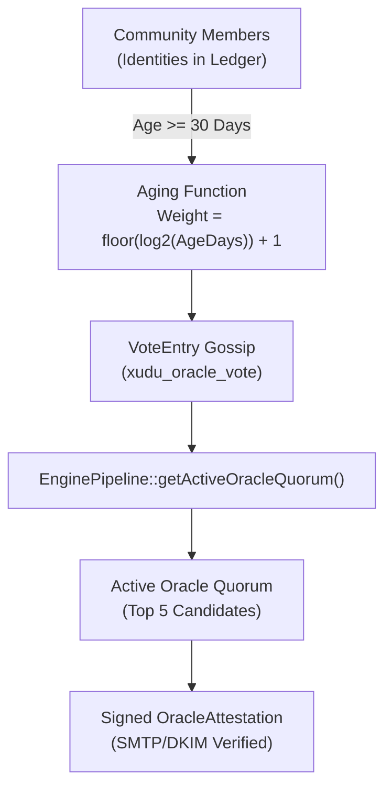
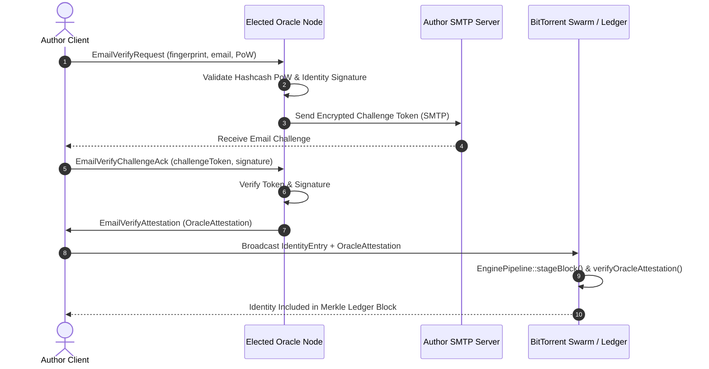

# Decentralized Oracle Identity Model for Verified Authorship

An architectural specification and design document for the decentralized Merkle
identity ledger, weighted Oracle consensus, SMTP/DKIM attestation pipeline, and
BEP 10 wire extensions across `gleditor`, `xudu`, and `zigzag`.

---

## 1. Motivation: Cryptographic Provenance vs. Human Identity

In Project Xanadu and the Docuverse, content is permanently addressed and
transcluded across document boundaries. To establish trust, an author's edits
must be bound to an immutable cryptographic identity (an OpenPGP key fingerprint
or BEP 46 Ed25519 keypair).

However, raw 40-character hexadecimal fingerprints (e.g.
`9B8C7D6E5F4A3B2C1D0E9F8A7B6C5D4E3F2A1B0C`) are opaque to human readers.
Traditional solutions rely on centralized Certificate Authorities (CAs) or
corporate OAuth providers (e.g. Google, GitHub), re-introducing the very
centralization, censorship vulnerabilities, and platform capture that Xanadu
was designed to eliminate.

The **Decentralized Oracle Identity Model** provides a sovereign, trustless
identity verification architecture:
1. **Append-Only Merkle Identity Ledger**: An immutable, publicly auditable log
   linking OpenPGP keys to verified real-world email addresses and profiles.
2. **$O(\log N)$ Inclusion Proofs**: Clients verify author authenticity in
   sub-millisecond time via lightweight Merkle audit paths without downloading
   the full global ledger.
3. **Sybil-Resistant Weighted Oracle Consensus**: A decentralized quorum of
   elected verification Oracles, chosen through non-linear time-weighted
   community voting.
4. **Out-of-Band Attestation**: Oracles verify domain ownership and email
   control via cryptographic SMTP/DKIM challenge-response and issue signed,
   ephemeral attestation tokens.
5. **BEP 10 Gossip Protocol**: Peer-to-peer identity queries, vote propagation,
   and attestation exchange integrated directly into BitTorrent swarms.

---

## 2. Merkle Identity Ledger Architecture

The ledger is implemented as an append-only tree of identity records and
consensus votes using `microsoft/merklecpp` (in [`merkle_ledger.hpp`](apps/xudu/core/merkle_ledger.hpp)
and [`identity_validation.hpp`](apps/xudu/core/identity/identity_validation.hpp)).

```
                      [ Block Header ]
                  (merkleRoot, prevHash, idx)
                             │
                     ┌───────┴───────┐
                 [Node 0-3]      [Node 4-7]
                 ┌───┴───┐       ┌───┴───┐
               [0-1]   [2-3]   [4-5]   [6-7]
               ┌─┴─┐   ┌─┴─┐   ┌─┴─┐   ┌─┴─┐
              L0  L1  L2  L3  L4  L5  L6  L7
              ▲   ▲   ▲   ▲   ▲   ▲   ▲   ▲
              │   │   │   │   │   │   │   │
        Identities & Votes (IdentityEntry / VoteEntry)
```

### Data Structures (`identity_layout.hpp`)

```cpp
/// A single verified identity record in the Merkle ledger.
struct IdentityEntry {
  Fingerprint fingerprint{};       // 20-byte / 40-hex PGP fingerprint
  std::string email;              // Normalized email (e.g. "ada@example.org")
  std::string identityName;       // Display name ("Ada Lovelace")
  std::string publicKeyArmored;   // ASCII-armored OpenPGP public key
  std::uint64_t timestamp{};      // Registration Unix epoch
  std::uint64_t sequence{};       // Monotonic sequence index
  bool revoked{false};            // Revocation / tombstone marker
  Signature64 signature{};        // Self-signature over record contents
};

/// A weighted consensus vote endorsing an Oracle candidate.
struct VoteEntry {
  Fingerprint voterFingerprint{}; // Endorsing voter's PGP fingerprint
  Fingerprint candidateOracle{};  // Endorsed Oracle candidate
  std::uint64_t timestamp{};      // Vote timestamp
  std::uint64_t sequence{};       // Monotonic sequence index
  Signature64 signature{};        // Voter's detached signature
};

/// Cryptographic header anchoring a ledger block.
struct BlockHeader {
  std::uint64_t blockIndex{};     // Monotonically increasing block number
  std::uint64_t timestamp{};      // Block creation time
  Hash32 previousHash{};          // SHA-256 hash of previous block header
  Hash32 merkleRoot{};            // Merkle root covering all entries
  std::uint32_t identityCount{};  // Total identity entries in this block
  std::uint32_t voteCount{};      // Total vote entries in this block
};
```

### Cryptographic Inclusion Proofs (`LedgerMerkleProof`)

Clients verifying an author do not parse the entire ledger. Instead, they obtain
a compact audit path (`LedgerMerkleProof`):

$$\text{Proof Size} = 32 \times \lceil \log_2 N \rceil \text{ bytes}$$

For a ledger containing 1,000,000 identities, the proof is only $\approx 640$
bytes. The reader hashes the leaf, ascends the audit path, and verifies that the
computed root matches the signed quorum root in under $10\ \mu\text{s}$.

---

## 3. Weighted Oracle Consensus & Quorum Election

To prevent malicious or compromised actors from issuing fraudulent identity
claims, verification authority is restricted to an elected quorum of **Oracles**.



### Sybil Resistance: Voter Aging Gate

A major threat in decentralized voting is the generation of thousands of puppet
identities right before an election. To eliminate this attack vector:
- **30-Day Maturation Gate (`kMinVoterAgeSeconds = 2,592,000s`)**: A voter
  identity must have been committed in the ledger for at least 30 continuous
  days before its votes are counted.
- **Self-Voting Prohibition**: A voter cannot vote for themselves
  (`voterFingerprint != candidateOracle`).

### Non-Linear Reputation Weighting

Rather than 1-identity-1-vote (vulnerable to Sybil farms) or coin-weighted voting
(plutocratic capture), voting power scales with verified identity longevity
via a logarithmic aging curve:

$$\text{VotingPower}(\text{voter}, t) = \left\lfloor \log_2\left(\frac{t - \text{voter}.\text{timestamp}}{86400}\right) \right\rfloor + 1$$

| Voter Account Age | Voting Power | Rationale |
| :--- | :--- | :--- |
| $< 30$ days | **0** | Ineligible; prevents Sybil rush attacks. |
| 30–63 days | **5** | Established new participant. |
| 64–127 days | **6** | Active contributor. |
| 128–255 days | **7** | Long-term network citizen. |
| 1–2 years | **9** | Core anchor participant. |
| 5+ years | **11** | Long-standing elder node. |

Logarithmic growth guarantees that long-standing community members carry higher
weight, but an attacker cannot dominate the network solely through age.

### Dynamic Quorum Selection (`getActiveOracleQuorum`)

1. For all valid `VoteEntry` records, aggregate total weighted voting power per
   `candidateOracle`.
2. Rank candidates descending by total weight.
3. Select top $N$ candidates (default: $N = 5$) as the active **Oracle Quorum**.
4. An Oracle is authorized (`isOracleAuthorized`) if and only if it sits within
   the active quorum at the time of attestation.

---

## 4. Oracle Attestation & Verification Workflow



### Attestation Token Format (`OracleAttestation`)

```cpp
struct OracleAttestation {
  Fingerprint oracleFingerprint;   // PGP fingerprint of issuing Oracle
  Fingerprint targetFingerprint;   // PGP fingerprint of verified author
  std::string verifiedEmail;       // Attested email ("ada@example.org")
  std::uint64_t issuedTimestamp;   // Issuance epoch
  std::uint64_t expiresTimestamp;  // Expiration epoch (typically 1 year)
  Signature64 oracleSignature;     // Ed25519/PGP signature over token fields
};
```

### Verification Pipeline (`EnginePipeline::verifyOracleAttestation`)
1. **Quorum Check**: Confirms `oracleFingerprint` was an authorized member of
   the active Oracle quorum at `issuedTimestamp`.
2. **Signature Verification**: Verifies `oracleSignature` against the Oracle's
   registered public key.
3. **Temporal Validity**: Ensures `currentTimestamp <= expiresTimestamp` and
   `issuedTimestamp <= currentTimestamp + kMaxClockSkewSeconds` (5 minutes).

---

## 5. BEP 10 Peer-Wire Protocol Integration

Identity resolution and consensus operate directly over BitTorrent peer
connections via three dedicated BEP 10 protocol extensions:

```
┌───────────────────────────┬──────────────┬───────────────────────────────┐
│ Extension Name            │ Message ID   │ Purpose                       │
├───────────────────────────┼──────────────┼───────────────────────────────┤
│ xudu_identity_lookup      │ 1            │ Identity & Merkle Proof Query │
│ xudu_oracle_vote          │ 3            │ Oracle Vote Gossip & Quorum   │
│ xudu_oracle_verify        │ 4            │ Out-of-Band Email Attestation │
└───────────────────────────┴──────────────┴───────────────────────────────┘
```

### 1. `xudu_identity_lookup`
- **`IdentityQuery`**: Requests identity metadata and inclusion proofs for a
  fingerprint or email address.
- **`IdentityResponse`**: Returns the `IdentityEntry`, `BlockHeader`, and
  `LedgerMerkleProof`.
- **`PeerAuthChallenge` / `PeerAuthResponse`**: Two-way zero-knowledge
  challenge-response handshake verifying peer private key possession before
  granting swarm access.

### 2. `xudu_oracle_vote`
- **`OracleVoteBroadcast`**: Gossips new `VoteEntry` records across peers.
- **`OracleConsensusQuery` / `OracleConsensusResponse`**: Synchronizes the
  current candidate vote tallies and active quorum root.

### 3. `xudu_oracle_verify`
- **`EmailVerifyRequest`**: Submits an email verification request to an Oracle,
  protected by a Hashcash Proof-of-Work challenge.
- **`EmailVerifyChallengeAck`**: Submits the challenge token received via email.
- **`EmailVerifyAttestation`**: Delivers the signed `OracleAttestation`.

---

## 6. Sybil & DoS Protection: Hardware-Accelerated Hashcash

To prevent distributed denial-of-service (DoS) attacks on Oracles and peer
lookups, all verification and handshake requests require a valid
**Hashcash Proof-of-Work** token (`HashcashEngine` in [`identity_validation.hpp`](apps/xudu/core/identity/identity_validation.hpp)):

$$\text{SHA-256}(\text{Header} \parallel \text{Salt} \parallel \text{Nonce}) < 2^{256 - \text{DifficultyBits}}$$

```cpp
class HashcashEngine {
public:
  /// Verifies Proof-of-Work against target difficulty and timestamp window
  [[nodiscard]] bool verify(const HashcashToken &token,
                            std::uint8_t minDifficulty,
                            std::uint64_t maxAgeSeconds) const;

  /// Hardware-accelerated multi-threaded miner for client requests
  [[nodiscard]] HashcashToken mine(std::string_view resource,
                                   std::uint8_t difficultyBits);
};
```

- **Default Difficulty**: 20 bits ($\approx 1\text{M}$ SHA-256 hashes, $\approx 50\text{ ms}$ on modern CPUs).
- **Anti-Replay Memory**: Nonces are recorded in a ring buffer with sliding
  window expiration, preventing proof reuse.

---

## 7. Document Provenance & UI Presentation

### 2D Document Model & Gleditor View
When a document is loaded in `gleditor` or `xudu`:
1. `Provenance::verify()` checks the document's PGP/device signature.
2. `EnginePipeline::verifyInclusion()` validates the author's key against the
   latest Merkle ledger root.
3. If verified, the UI renders the **Verified Author Badge**:
   - `[✓ Ada Lovelace <ada@example.org>]` (Green `#10B981` pill badge).
   - Tooltip displays the key fingerprint, Oracle attestation signer, and Merkle
     block index.

### 3D Visualizer & Zigzag Manifolds (`apps/zigzag`)
- **Zigzag Slices (`ZzMerkleTest`)**: Cell metadata references the author's
  Merkle leaf. The visualizer validates slice authenticity before projecting
  cells into multidimensional spaces.
- **Transclusion Beams (`beams.cpp`)**: Optical link ribbons between documents
  render with high-intensity **Identity Gold** volumetric bands (`#FFD700`)
  when both endpoints share verified author provenance.

---

## 8. Threat Model & Security Analysis

| Threat Scenario | Vector | Mitigation |
| :--- | :--- | :--- |
| **Sybil Oracle Takeover** | Attacker spins up 10,000 ephemeral nodes to vote for a malicious Oracle. | Blocked by the 30-day maturation gate (`kMinVoterAgeSeconds`). Ephemeral keys have zero voting power. |
| **Plutocratic Dominance** | A wealthy actor buys old keys to dominate elections. | Logarithmic aging curve ($\lfloor\log_2(\text{days})\rfloor + 1$) sharply limits the maximum power of any single identity. |
| **Rogue Oracle Attestation** | A compromised Oracle signs false identity claims. | Quorum requires consensus; rogue Oracles are voted out in subsequent blocks. Compromised records are tombstoned via `revoked = true` entries. |
| **Email Spoofing (SMTP)** | Attacker intercepts verification emails. | Oracles verify DKIM/SPF DNS records and require PGP-signed email challenge ACKs. |
| **Peer Lookup Flooding** | DoS attack spamming `IdentityQuery` requests. | Gated by `HashcashEngine` (20-bit PoW) and peer disconnect penalties. |
| **Ledger History Forking** | Malicious seeders present conflicting ledger branches. | BitTorrent v2 SHA-256 Merkle root binding + sequential block chaining (`previousHash`). |

---

## 9. Implementation File Map

| Component | Source Files | Description |
| :--- | :--- | :--- |
| **Merkle Tree Core** | [`apps/xudu/core/merkle_ledger.hpp/.cpp`](apps/xudu/core/merkle_ledger.hpp) | Append-only Merkle ledger using `microsoft/merklecpp` |
| **Validation Engine** | [`apps/xudu/core/identity/identity_validation.hpp/.cpp`](apps/xudu/core/identity/identity_validation.hpp) | `EnginePipeline`, quorum election, and `HashcashEngine` |
| **Layout & Structs** | [`apps/xudu/core/identity/identity_layout.hpp`](apps/xudu/core/identity/identity_layout.hpp) | `IdentityEntry`, `VoteEntry`, `BlockHeader`, `OracleAttestation` |
| **Serialization** | [`apps/xudu/core/identity/identity_serialization.hpp/.cpp`](apps/xudu/core/identity/identity_serialization.hpp) | Zero-copy Bencode encoders and decoders for all identity frames |
| **Peer Controller** | [`apps/xudu/core/identity/identity_network_controller.hpp/.cpp`](apps/xudu/core/identity/identity_network_controller.hpp) | BEP 10 extensions (`xudu_identity_lookup`, `xudu_oracle_vote`, `xudu_oracle_verify`) |
| **Provenance Engine**| [`apps/xudu/core/provenance.hpp/.cpp`](apps/xudu/core/provenance.hpp) | OpenPGP document signature creation and verification |
| **Zigzag Verification**| [`tests/zigzag/zz_merkle_test.cpp`](tests/zigzag/zz_merkle_test.cpp) | Zigzag slice author verification against ledger root |
| **Unit Test Suites** | [`tests/xudu/identity_test.cpp`](tests/xudu/identity_test.cpp), [`merkle_ledger_test.cpp`](tests/xudu/merkle_ledger_test.cpp) | Full test coverage for validation, consensus, and wire encoding |
