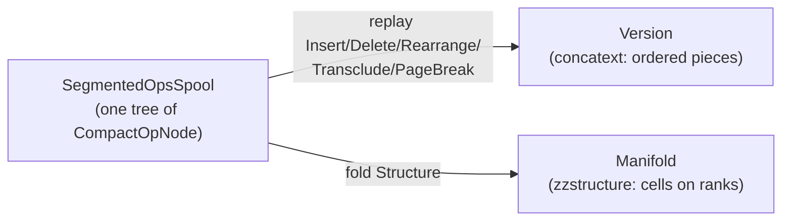

# The Unified Store/Slice: Cells as Operations, and OSMIC's Sixth Hyperop

A design specification for generalizing [`xudu::Store`](apps/common/xanadu/store.hpp) so that it can
take over the role of a Zigzag Slice, by implementing the one hyperop OSMIC names and this codebase
has never had: **MAKE/CHANGE STRUCTURE MAP**.

Nothing here is wired into the build yet. This document records the model, the rulings that produced
it, and the price of each ruling, so that the reasoning survives the implementation. Where a number
appears it is either measured (§12) or derived from arithmetic shown in place.

______________________________________________________________________

## 1. A Page Is a Cell. A Cell Is Never a Page

The obvious framing — *a Slice is a xanadoc, and its cells are pages* — is the one thing this
codebase has already proved impossible, and the proof is a method that exists for unrelated reasons.

[`Version::joinFollowing()`](apps/common/xanadu/version.cpp) merges the piece at an index with the
one after it whenever they name consecutive addresses in the same scroll. `splitAt()` cuts a piece
in two. **A `Version` destroys piece identity on purpose**, and its own comment says why: coalescing
is "what keeps a document that has been typed into for an hour down to a handful of pieces."

A zzstructure cell is the exact opposite. `d.clone` exists
([`zzcore.hpp`](apps/common/xanadu/zigzag/zzcore.hpp), `findCloneMaster`) precisely so that two
cells holding identical content remain two cells. A thing that must not merge with its neighbour
cannot be a piece, and a page is not even that — `Version::forcedBreaks()` returns
`std::vector<std::uint32_t>`, offsets rather than objects. A page has no content, no address, no
identity and no links. A cell has all four.

Inverted, the identification becomes true and cheap:

> **A page is a cell** — one whose payload happens to be a contiguous run of concatext. That
> direction costs nothing and gives pages an identity, a name in hypertime, links, and membership in
> other dimensions.

So the convergence is not "make pieces into cells". It is: find where Xanadu already keeps
*identities*, and put the cells there. It already has such a place. The operations spool is an
address space of events, each permanently and uniquely named
([`microversion.hpp`](apps/common/xanadu/microversion.hpp)), never merged, never reclaimed, and
published verbatim by `Store::exportBinaryOps`. That is an identity space of exactly the right
shape, and it has been sitting unused for this purpose.

______________________________________________________________________

## 2. OSMIC's Sixth Hyperop

The header comment of [`ops.hpp`](apps/common/xanadu/ops.hpp) lists OSMIC's hyperops as INSERT,
REARRANGE, DELETE, TRANSCLUDE, MAKE/CHANGE LINK, and MAKE/CHANGE STRUCTURE MAP. `OpKind` implements
five of them, plus `PageBreak` as a documented extension. The sixth was never built.

Note the shape of the five that were. INSERT, REARRANGE and DELETE all name a position in a document
(`Op::at`, `Op::length`, `Op::to`, all concatext offsets). TRANSCLUDE names a position in another
document. MAKE/CHANGE LINK names content addresses. Five of six are edits expressed *through* a
coordinate system. The sixth is an edit *of* the coordinate system:

> **MAKE/CHANGE STRUCTURE MAP is the hyperop that creates or alters a mapping under which the other
> five hyperops' coordinates are meaningful.** INSERT/DELETE/REARRANGE are intrinsic — they mutate a
> sequence within a fixed frame. TRANSCLUDE and LINK are relational — they connect frames. STRUCTURE
> MAP is extrinsic: it establishes what a frame *is*.

In the Udanax Green vocabulary a document *is* a map from virtual document space onto invariant
stream addresses; "structure map" is the literal name of that object, not a metaphor. `Version` in
this codebase is one: `runs` maps concatext offset to primedia address.

Two corollaries follow, and they are what makes the Zigzag accommodation shareable back to Xanadu
rather than a concession to it:

- **`OpKind::PageBreak` is a degenerate instance of the sixth hyperop**, not an extension beyond the
  six. A break partitions a concatext into an ordered sequence of subsequences — a one-dimensional
  structure map with a fixed name and no content of its own. `ops.hpp` is honest about what it built
  and wrong about what it named it.
- The reason `ops.hpp` gives for a break being concatext-relative rather than content-addressed is
  **correct and generalizes**: a structure map is defined *over* a coordinate frame, so it is
  document-relative by type rather than by convention.

______________________________________________________________________

## 3. The Model: Two Replay Products of One Spool

> A **cell** is an operation in the ops spool. Its **identity** is that operation's name in
> hypertime. Its **content** is a `PrimediaSpan` that operation carries. Its **positions** are
> `OpKind::Structure` operations naming it. A **slice** is a `Manifold` — a *second replay product*
> of the same ops spool that `Version` is the first replay product of.



Both walk the same `ancestralPath`. Neither knows about the other. That is the whole convergence.

The consequence worth stating loudly: **every `Insert` op in every xanadoc ever written is already a
cell.** The convergence does not add a concept, it notices one. OSMIC has no word for it because in
one dimension it never needed one — in a linear document a piece's ordinal *is* its identity, so
position and identity are the same fact. Zigzag does not add content ontology; it adds **arity**.
When a piece must belong to $N$ sequences at once, position and identity come apart, and the residue
is the cell.

______________________________________________________________________

## 4. Rulings

Each ruling states its price. Where a tension is genuinely unresolved it is in §11 instead.

### R1. `OpKind::Structure` is added. `OpKind::PageBreak` stays.

The sixth hyperop is implemented, and it is deliberately **not** used to re-express page breaks.

`ops.hpp` denies breaks the travel-with-quotation property on purpose; a cell boundary has the
opposite requirement, since `d.clone` exists so a cell's identity survives appearing in a second
place. Re-expressing `PageBreak` as a `d.doc` structure link would grant breaks travel semantics,
break `Version::spansFor()`'s marker exclusion, and — the decisive part — move page position out of
`Version::runs`, where `splitAt`/`insert`/`remove`/`rearrange` rebase it for free. Buying that back
means a hand-written position-transform subsystem this codebase does not have and does not need.

**Price.** `PageBreak` survives as a seventh op kind forever, and `breakMarkerScroll` keeps its ten
filter sites ([`version.cpp`](apps/common/xanadu/version.cpp) `:106,151,176,249`,
[`store.cpp`](apps/common/xanadu/store.cpp) `:259`,
[`link_layout.cpp`](apps/common/xanadu/link_layout.cpp) `:113`,
[`transcopyright_logic.cpp`](apps/common/xanadu/transcopyright_logic.cpp) `:123`,
[`session.cpp`](apps/xudu/session.cpp) `:1264,1407,2103`).

**The tag space, and why it is not a constraint.** `binary_ops.cpp`'s `OpBinaryKind` occupies 0..6
(`BinInsert` through `BinPageBreak`, with TRANSCLUDE split into internal and external forms), and
`FLAG_KIND_MASK = 0x07` sits with `FLAG_SEQUENTIAL = 0x08` directly above it. `BinStructure = 7`
fills the mask exactly.

An earlier draft treated that as a wall and concluded that `Structure` must therefore be a *family*
discriminated by `flags`, never by further `OpKind` values. **R11 retires that reasoning.** Widening
the tag to four bits costs an `OpsSpoolVersion::CompactBinaryV3` and nothing else, and a version
bump is cheap in a format nothing has published yet.

The `flags`-discriminated family survives, but now on its own merits rather than under duress: the
Structure verbs share every field and differ only in which ones they read, so they would be a
strictly worse encoding as sibling `OpKind`s that no `switch` outside the manifold fold ever wants
to tell apart. What changes is that this is a design choice defended in §5.2, not a forced move —
and an eighth *hyperop*, should OSMIC ever be read to imply one, now has somewhere to go.

### R2. A dimension is a cell, and it travels in `linkId`

`at` stays a concatext offset and is zero for `Structure` ops: it is load-bearing across
`Store::replay` *and* across the wire, where `FLAG_AT_EQUALS_START` special-cases it in the encoder.

The dimension's own `CellRef` goes in `linkId`. This is required rather than decorative.
[`vortex-hyperstructural-runtime.md`](vortex-hyperstructural-runtime.md) already spells dimensions
as `cell_id`s, and if the set of dimensions were a closed enum then the metasystem principle in
[`system-xanadocs-customization-and-metasystem.md`](system-xanadocs-customization-and-metasystem.md)
would be violated — a user could not mint a dimension from inside the system. `DimOrdinal`
([`compact_zzcell.hpp`](apps/common/xanadu/zigzag/compact_zzcell.hpp)) is demoted in its own doc
comment to a local cache of twelve well-known dimension cells, exactly as `vocabularyScroll` is a
cache of eleven compiled-in words.

**Price.** `compact_op.hpp`'s silent `linkId = static_cast<std::uint32_t>(op.link)` truncation
(against `Op::link` being `std::uint64_t`) becomes load-bearing and must be fixed in the same
commit.

### R3. `LinkType::Dimension` is demoted to transport only

The decisive reason is not performance: **a `Link` has no name in hypertime.** A link is not
produced by a `MicroversionId`, is not on `ancestralPath`, and is assigned a fresh id by `adopt()`
on arrival, so there is no state you can scrub to at which a given link did or did not exist, and no
branch you can fork from the moment it changed. A manifold modelled as `Link`s is unversionable, and
therefore unpublishable *as history* whatever bytes it is stored in.

An earlier draft rested this on a weaker fact — that `Store::save` writes `linkTable` to a separate
plaintext file while `applyOpsSegment` replays `putOp` and never touches it, so links do not travel
in a seal. **R11 dissolves that half of the argument**: the file layout is fixable, and under the
new policy it will in fact be fixed. What survives is the hypertime argument above, which no file
format can repair, because it is about what a link *is* rather than where it is written.

That `Store::linksTouching()` is an unindexed full `std::map` scan is a real secondary cost, but it
is a curable implementation defect and is not the argument either.

`LinkType::Dimension` survives so `zzStructureToLinkPackage` keeps compiling, with a doc comment
stating that it is an export envelope and never the model.

### R4. Cell identity is two-level: local `CellRef`, global `GlobalOpRef`

A local spool index is **not** swarm-stable. `Store::opRecords()` sorts by `MicroversionId` before
emitting, and `applyOpsSegment` re-`putOp`s in that sorted order into a fresh `Store`, so a branch
off an early state sorts into the middle of a chain it was appended after and lands at a different
local index. `store.hpp`'s own comment on `opRecords()` already notes that the order "is not the
order that would compress best — a branch sorts into the middle of the chain it forks from."

```cpp
// apps/common/xanadu/zigzag/manifold.hpp
using CellRef = std::uint32_t;   ///< local ops-spool index; 0 == no cell
inline constexpr CellRef noCell = 0;
```

```cpp
// apps/common/xanadu/publication.hpp -- beside GlobalSpan
struct GlobalOpRef {
  std::string    scroll;   ///< publisher's scroll key, as GlobalSpan::scroll
  MicroversionId produces; ///< the state this op produced, verbatim
  bool operator==(const GlobalOpRef &) const = default;
};
```

`GlobalOpRef` localises through the identical `Store::externals`/`scrollKey` path `localise()`
already models, reusing `writeMicroversionId`/`readMicroversionId` on the wire.

**Price.** Two-level indirection on every cross-document cell reference. `MicroversionId` is 24
bytes plus a heap allocation, so a `GlobalOpRef` cannot live in a link slot — it lives only in
packages and in `Manifold::externalCells`.

### R5. `noCell == 0`

Op index 0 is state zero, the null document, and is definitionally not a cell — so `0 == absent` is
correct in op-index space. It is also already hardcoded at roughly fifteen sites across
`unified_transclusion_engine.cpp`, `zzcore.cpp` and `zz_xudu_projector.cpp` (and, until R13 deletes
it, `Preflet::target_cell_id`). Adopting Vortex's `kNoLink = -1` would require making `CellID`
signed plus a dozen call-site changes for no benefit.

Vortex's Origin Cell instead gets a real cell, minted as op index 1 at slice genesis — the same cell
zzstructure calls *home*, and the one R12 hangs the `d.dims` rank off. Genesis mints exactly two
cells: `home` at index 1 and the `d.dims` dimension at index 2. Everything else in the slice,
including every other dimension, is built from those with ordinary verbs.

Op index 0 stays what it already is — state zero, the null document — and gains no cell, which is
what makes `noCell == 0` sound rather than merely convenient.

**Price.** One design-doc edit to
[`vortex-hyperstructural-runtime.md`](vortex-hyperstructural-runtime.md): its `kNoLink` and "cell 0
is an ordinary addressable target" paragraphs are amended, and its well-known dimension constants
(`d_grab = 1`, `d_entangle = 999`) become genesis-minted `CellRef`s resolved through a name table
rather than literals.

### R6. A scalar cell carries **both** a real span and canonical bits

This is the ruling that answers the non-text payload problem without giving anything up.

> **Every persistent cell has a real `PrimediaSpan` in a real scroll. A scalar cell's span holds its
> shortest-round-trip rendering; the same op additionally carries the canonical IEEE-754 or boolean
> bits in `CompactOpNode::value`, with a type tag in `flags`.**

- The span is ordinary spooled permascroll text, so a scalar cell **is** a link endpoint, **is**
  formattable via `LinkType::Format` unchanged, **is** transcludable, diffable, publishable and
  transcopyright-bearing. `Link::left`/`right` stay `std::vector<PrimediaSpan>` and
  `formatAttributeOf()` is untouched.
- The bits are the typed value. VQL comparison, arithmetic and `d.entangle` never parse text and
  never round-trip through a formatter. `PrimediaSpan::intersect()` never sees a bit pattern, so two
  adjacent doubles can never be mistaken for an overlapping transclusion.
- The rendering is pinned to `std::to_chars(first, last, value)` with **no precision argument** —
  shortest round-trip, which the standard mandates to be exact. That is a mathematical function of
  the value rather than a formatting choice. `bool` renders `true`/`false`.
- Canonicalisation applies to the **bits only**, and only for value equality: all NaN →
  `0x7ff8000000000000`, `-0.0` → `+0.0`, signalling NaN rejected at the API boundary. It is
  explicitly *not* an address canonicalisation.

**A "scroll of all doubles" — one canonical address per value, so that two cells holding 3.14 are
automatically transclusions — is rejected outright.** It is superficially attractive because it
costs zero permascroll bytes and because `vocabularyScroll`
([`format.hpp`](apps/common/xanadu/format.hpp)) is a real precedent for content-free addresses. But
[`user_permascroll.hpp`](apps/common/xanadu/user_permascroll.hpp) already documents the removal of
`findExistingSpan` on exactly this reasoning:

> sharing a coordinate is not an optimisation, it is a claim. Two documents at the same primedia
> address *are* transcluded — that is what `Version::occurrencesOf` reports and what the gold beams
> draw — so deduplicating on a text match asserted a quotation that never happened, and under
> transcopyright would have paid royalties for it.

Two people typing `3.14` have not quoted each other. Granting numeric coincidence a shared address
would classify it as `DiffKind::Universal` in `Store::diffVersions()` and light up Identity Gold in
the xudu UI. The idea is also arithmetically unsound: $2^{53} - 2$ bit patterns are NaN and none
compares equal to anything including itself, and $\pm 0.0$ is two patterns for one value, so "same
value implies same address" is false regardless of canonicalisation (§12).

**Price.** A persistent scalar costs permascroll bytes: worst case 24 for a `double`, typically far
fewer — `0.1` is three, a third is eighteen. (An earlier draft named `4.9406564584124654e-324` as
the 24-byte case. **That is wrong, and step 15 has the test:** it is `printf`'s `%.17g` of
`denorm_min` rather than its shortest round-trip rendering, which is `5e-324` because nothing else
is near enough to need more digits. The bound is real and is reached by any value needing all 17
significant digits with a three-digit exponent and a sign, such as `-1.7976931348623157e+308`. The
example being a formatting artefact is precisely what this ruling says the rendering is not.) Ten
thousand scalar cells at 17 B/cell is 170 KB — three of the 64 KiB Merkle pieces. The permascroll
now also contains bytes a program wrote rather than bytes a person typed, which is a genuine
widening of its own definition, accepted deliberately as the price of a scalar being a first-class
Xanadu object. Arena cells (R8) carry bits only and spool nothing, so the write-amplification
concern lands on the persistence boundary where it belongs rather than on the encoding.

### R7. A cell's micro-history is an intrusive chain in `sourceOpIndex`

`CompactOpNode::parentIndex` is the prior *document* state and nothing else — `Store::putOp`
enforces `op.parent == produces.parent()`, and `ancestralPath` follows only `parentIndex`. There is
therefore no subtree hanging off a cell's birth op, and a per-cell hypertime branch would be
invisible to a manifold rebuild because a branch is not an ancestor of the head.

Instead, every op that changes a cell's content or one of its links stores in `sourceOpIndex` the
index of the previous op touching that same cell. A cell's micro-history is then an
$O(\text{edits})$ linked-list walk with no extra index, on the main chain, fully inside
`ancestralPath` and fully scrubbable in hypertime. `Manifold::CellSlot::lastOp` caches the head of
that chain; it is derived and rebuildable, so `store.hpp`'s "nothing stores versions" survives
intact.

**Price.** `sourceOpIndex` is consumed for `Structure`-family ops and cannot also mean "transclude
source version" there. A `Structure` op is never a `Transclude`, so this is safe — but it must be
documented.

An earlier draft added "and `CompactOpNode::toOp()` must not map it to `Op::source` for `Structure`
kinds". **Step 14 does the opposite, and the reason is stronger than the caution was.** The chain
turns out to be how a `SetLink` names its *subject* at all — every other 32-bit field is spoken for
— so it is not incidental provenance but the operation's most load-bearing reference, and
suppressing it in the by-name representation would make `getOp()` and `opRecords()` lossy.
`Op::source` is documented as carrying both meanings instead. The confusion the draft feared cannot
occur: every reader of `sourceOpIndex` in the tree already guards on `kind == OpKind::Transclude`.

### R8. Two regimes, and the boundary is the **type**, not the cell, the op, or the keyword

Neither of the tempting boundaries works. *Authorship* is untestable from data and would need a
permanent unrevisable intent flag in the wire format. *Root-set reachability* fails VQL's own §6.2
example, where the regex NFA cache is woven off the origin cell and is therefore in the root set —
and `d.cursors` is likewise **in** the Root Set per
[`vortex-hyperstructural-runtime.md`](vortex-hyperstructural-runtime.md), the opposite of what a
reachability split would need.

The ruling is that there are two concrete C++ types:

```cpp
class Manifold;      // ops-backed. Every mutation appends a CompactOpNode.
class ArenaManifold; // dense vectors only. No ops. Dies with its owner.
```

VQL evaluation runs in an `ArenaManifold` scoped to the cursor. Weaving into persistence requires an
explicit `Manifold&`. Promotion is one call, is bounded, and refuses above a budget:

```cpp
struct PromotionBudget { std::uint32_t maxOps = 65536; };

/// Returns nullopt and mutates nothing if the reachable subgraph exceeds the budget.
std::optional<std::vector<CellRef>>
promote(Manifold &into, const ArenaManifold &from, CellRef root,
        PromotionBudget budget = {});
```

**The cursor is the case that shows the boundary is drawn correctly.** `d.cursors` being in the Root
Set looked like a counterexample; it is not, once *identity* and *state* are separated:

- **A cursor cell's identity persists.** It is a real cell with a real `CellRef`, and it is rooted,
  which is exactly what the Root Set membership asserts.
- **Its position does not.** Moving a cursor is a *relink*, not an update. It rewrites which cell
  the cursor's `d.cursors` link names, and a relink of an ephemeral link records no op. The spool
  does not accumulate one `Structure` node per arrow keypress, which is the `PageBreak`-flood
  failure mode (§6.1) reappearing in a second guise, and is refused for the same reason.
- **Vortex-generated cursors keep no resumable state at all.** A generator's internal position is
  meaningful only relative to the manifold it was walking. Persisting it and restoring it later
  would resume a traversal against a structure that may have been rewritten underneath it — a cursor
  pointing confidently at a cell that has since been relinked, deleted, or cloned. There is no
  correct answer to "where was I" across an edit, so the ruling is not to pretend there is one: **a
  resumed Vortex cursor re-derives its position or does not exist.**

The general rule, of which all three are instances:

> **Only a user-generated update persists. Navigation never does.** An op records that a person
> changed the structure. Where anything — a person, a query, a renderer — happens to be *looking* is
> not a change to the structure and does not earn a name in hypertime.

This is what makes the two-type split in R8 mechanical rather than a matter of taste at each call
site: a cursor's cell lives in the `Manifold`, its position and its generator state live in the
`ArenaManifold` scoped to the cursor, and the type system refuses the mistake.

**Price, stated as a loss.** A Vortex program's intermediate execution is **not** reproducible from
the spool. Hypertime scrubs through a query's adopted outputs and through the query op itself, not
through the computation. Reachability GC ([`vql-query-language.md`](vql-query-language.md) §5) is
scoped to `ArenaManifold` only; on the persistent side `link(c, d, dir, -2)` records a Delete and
reclaims nothing, because DELETE is REARRANGE TO LIMBO.

The second loss is smaller but user-visible: **reopening a document does not restore where you
were.** Caret position, scroll offset and open cursors come back at their defaults. That is a
deliberate trade against the alternative — a spool in which the majority of ops record eye movement
rather than authorship — and if it is ever wanted back, the place for it is a per-workstation
session file outside the docuverse, which is a different artefact from a document's history and
should never be confused with one.

### R9. `Manifold` is an explicitly materialised view with a stated rebuild policy

It is not a pretend-pure replay product. Folding `Structure` over `ancestralPath` is
$O(\text{history})$ — 60,000 ops for a 10k-cell, 5-dimension slice — and `store.hpp` guarantees that
nothing caches. The policy is therefore explicit:

- Full fold once, on load, from `ancestralPath`.
- Incremental application on every subsequent `Structure` append, the `syncIncremental` shape
  `UnifiedTransclusionEngine` already has.
- A test hook `bool verifyAgainstFullRebuild(const Store &) const` asserting that the incremental
  state equals a cold fold.

That hook is the honesty mechanism, and it is what stops the view drifting the way
`UnifiedTransclusionEngine::cells_` can today.

### R10. Sealed segments become genuinely immutable

`SegmentedOpsSpool::append()` writes `parent->firstChildIndex` and `sibNode->nextSiblingIndex` into
**already-stored** nodes, while `adoptSegmentNodes()` maps sealed page-aligned segments `PROT_READ`
(`virtual_memory_arena.cpp`, `prot = writable ? (PROT_READ | PROT_WRITE) : PROT_READ`). Appending a
child of a node inside a sealed segment writes to a read-only mapping. See §8.

Fix: `firstChildIndex` and `nextSiblingIndex` leave `CompactOpNode` and become a side array in
`SegmentedOpsSpool`, rebuilt from `parentIndex` on adopt and on load.

```cpp
struct TreeLinks { std::uint32_t firstChild{0}; std::uint32_t nextSibling{0}; };
std::vector<TreeLinks> tree;   // parallel to the node array, index-aligned
```

An earlier draft parked the two vacated 32-bit slots as `reserved0`/`reserved1`, written zero and
ignored on read, so that files already on disk would still load byte-compatibly and no version bump
would be needed — and presented that as a virtue. **R11 rejects it.** The slots are *reclaimed*: the
eight bytes become a single 8-aligned `std::uint64_t value` at offset 56 (§5.2), which is what gives
a scalar cell a natural home and hands `sourceAt`/`sourceLength` back to transclusion.

`sizeof(CompactOpNode) == 64` and `alignas(64)` are preserved, and their `static_assert`s hold. That
invariant is not negotiable and is not what the version bump is spending.

**Price.** Eight bytes per op for the side array — net zero resident, since they were already eight
bytes per op inside the node — and an $O(n)$ rebuild pass per adopt. In exchange, "an op node is
immutable" becomes true, which is what publication semantics already assumed.

### R11. Bump the format version. Do not carry compatibility.

Nothing built on this codebase is in production, no third party reads its files, and every store on
disk can be regenerated from its inputs. Under those conditions a compatibility shim is not caution,
it is a permanent tax paid to protect data nobody has.

> **Every on-disk format in this tree is free to change shape, and the rule when it does is: bump
> the version, write the new shape, and delete the old reader.** Preserving a field only so that an
> old file still parses is forbidden. Preserving a structural *invariant* —
> `sizeof(CompactOpNode) == 64` and its cache-line alignment, 64 KiB Merkle piece alignment,
> append-only-ness — is required.

The distinction is the whole ruling: layout is soft, invariants are hard. A version bump buys a
better layout; it never buys the right to unalign a node or make a spool rewritable.

Three consequences, taken now:

- **`OpsSpoolVersion::CompactBinaryV3`.** Widens the kind tag from three bits to four, moves
  `FLAG_SEQUENTIAL`, and re-lays the node as §5.2 specifies. The V1 and V2 readers are **deleted**,
  not kept — `binaryOpsMagicV1`'s "read-only: nothing writes this any more, but files already on
  disk still open under it" is exactly the tax this ruling refuses. The `CompactBinaryV2` comment
  citing `OpKind::PageBreak` as "the kind of change that did not need a version bump, for contrast"
  is rewritten: under R11 it would have taken one.
- **`scrolls.spool` and the link table stop being plaintext, and stop being two files.** They become
  sections of one versioned binary container beside `ops.nodes`. There is no reason a scroll
  registry and a link table are separate artefacts other than that they were written at different
  times; both are per-store side tables replayed at load.
- **Debuggability is a tool's job, not a format's.** The one thing plaintext was buying — being able
  to read a store with `less` — is bought back by `tools/xudu-dump`, which renders any section of
  any store as text. A format is not obliged to be human-readable; a toolchain is obliged to be able
  to show it. `ops.nodes` has always been binary and has never been the hard one to debug.

A fourth followed later, in migration step 13, on the same reasoning applied to the last two
plaintext files: **`current.yaml` and `versions.yaml` become sections of that same container.** They
were described as "still YAML on purpose", but no purpose was ever recorded for it — the phrase was
written down long after the files were, and the consequence directly above argues the other way.
They are per-store side tables replayed at load, exactly like the scroll registry and the link
table, and being three artefacts instead of one bought only three ways for a save to be half
written.

**Price.** Stores written before the bump do not open. That is acceptable *today* and will stop
being acceptable the first time someone outside this repository has a document they care about, so
the ruling carries its own expiry: **R11 is void at first external publication**, and the commit
that ships a public build must amend this section rather than inherit it silently. Until then, the
dump tool must land in the same commit as the container change — a binary format with no reader is
how "we will write the tool later" becomes "we cannot debug the loader".

**And a correction, learnt the hard way in migration step 1.** "Stores written before the bump do
not open" was optimistic. `ops.nodes` was a bare run of nodes with no header at all, so there was no
version to bump and nothing to refuse a stale file with — R14 is the answer, and it exists because
of what follows. What actually happened is worse than not opening: the file **opened and meant
something else**. Moving the tree edges shifted every field past `parentIndex`, and the sample store
under `tests/samples/xudu/core_hypertext/xanadoc_a` went on loading — its first operation reading as
a `Rearrange` of zero bytes, with the 1,075-byte length it was really carrying landing in the newly
added `value` field. Fifteen tests stopped asserting on document text and started asserting on the
empty string, and not one of them said why.

Two things follow. First, **`ops.nodes` needs a header before anything else in this note touches its
layout again** — R14 specifies one, and it moves to the front of the format work along with
`tools/xudu-dump`, because until a store can say what shape it is, R11's "bump the version" has
nothing to bump. Second, a format change is not done when the code compiles: every checked-in
fixture written in the old shape is part of the format's surface area.
`tools/create-sample-xanadocs.sh` regenerates them, and step 1's commit had to.

### R12. No privileged dimensions. Links are per-cell runs, keyed by `CellRef`

R2 makes a dimension a cell so that a user can mint one. A fixed inline array of well-known
dimensions puts the privilege straight back at the storage layer, one level down where it is harder
to see: a user-minted dimension could never be fast, however hot it actually is. An earlier draft of
§5.3 did exactly this, with `hotDims = 8`.

The array is removed. A cell's links are a contiguous run of `(dim, pos, neg)` triples, twelve bytes
each, in one arena shared by the whole manifold, addressed by an offset and count in the cell's
slot:

```cpp
struct DimLink { DimRef dim; CellRef pos; CellRef neg; }; // 12 bytes
static_assert(sizeof(DimLink) == 12);
```

Every dimension is then reached the same way and costs the same, whether it is `d.1` or something
VQL minted forty milliseconds ago. `DimOrdinal` survives only as R2 already demoted it: a lookup
table of twelve well-known names, never a storage layout.

Three things fall out, and the third is the one that makes this pay:

- **`d.dims` is the rank of dimension cells, hanging off the home cell.** Walking posward from
  `home` on `d.dims` enumerates every dimension in the slice. This is ordinary zzstructure, not a
  registry bolted to the side, and it means "what dimensions exist here" is a traversal a user can
  perform with the same keys they use for everything else.
- **`StructureVerb::MakeDim` disappears.** A dimension is a cell whose content is its name and which
  appears on the `d.dims` rank, so minting one is `MakeCell` plus `SetLink` and needs no verb of its
  own. Genesis mints two cells by fiat — `home` and `d.dims` — because linking the first dimension
  onto the `d.dims` rank requires `d.dims` to already be nameable. That bootstrap is the same shape
  as `vocabularyScroll`'s compiled-in words, and its price is two cells that cannot be deleted.
- **`d.meta-dims` is the run, read sideways.** For a cell $c$, walking `d.meta-dims` enumerates the
  dimensions $c$ actually participates in, as clone cells on `d.clone` of the real dimension cells,
  so `cloneMaster()` recovers the dimension itself and one dimension needs one identity however many
  cells link on it. It is **generated at runtime and stored in no op**: it is the CSR run expressed
  in the manifold's own vocabulary, which is why it costs nothing to maintain and why VQL can
  traverse it with no new primitive. The inline array answered this query by scanning twelve fixed
  slots and capping the answer at twelve; the run answers it exactly and without a cap.

Derived cells like the `d.meta-dims` clones have no op, so they cannot have an op-index `CellRef`.
The top bit of `CellRef` marks them:

```cpp
inline constexpr CellRef ephemeralBit = 0x8000'0000U;  ///< derived: no op backs this cell
[[nodiscard]] constexpr bool isEphemeral(CellRef r) { return (r & ephemeralBit) != 0; }
```

This does double duty. It is also the byte-level enforcement of R8: `Manifold::applyStructure`
rejects a `SetLink` whose target is ephemeral, so "you cannot persist a link into a derived cell" is
an invariant the encoding checks rather than a convention the caller is trusted to follow. R8 said
the boundary is the type; this makes it also a bit.

**Price, and it is a real one.** A hop costs 4.96 ns sequential and 21.02 ns scattered against 1.84
and 7.94 for the inline array — $2.7\times$, measured (§12.5). Two dependent loads (slot, then run)
where the array needed one. At the traversal sizes this application performs — a radius-3 BFS
visiting about sixty cells, so roughly 300 hops per frame — that is 6.3 µs against 2.4 µs, both
under 0.08% of an 8.33 ms frame, and the same argument `compact_zzcell.hpp`'s own comment already
makes about its size. The falsifiable threshold: the run design saturates a frame at about 396,000
hops, the array at about 1,049,000. **If a traversal is ever specified that visits more than ~100k
cells per frame, revisit this ruling with that workload in hand.** Note also that the run is four
bytes per cell *smaller* at five dimensions (108 B/cell against 112), because the array wastes three
of its eight slots — the trade is latency, not memory.

### R13. `Preflet` is deleted

A `Preflet` is a magnet URI, a content hash, a version string, a target cell id, and free-form
metadata pairs, resolved by walking a `d.preflet` chain of role-tagged cells
([`zzcore.cpp`](apps/common/xanadu/zigzag/zzcore.cpp), `resolvePreflet`). It is what a cell needed
in order to refer to something in another slice, back when slices could not refer to each other any
other way.

Once a slice is a `Store` and cross-slice reference is an ordinary Xanadu link, every field is
subsumed by something that already exists and does the job better:

| `Preflet` field       | subsumed by                                                                          |
| --------------------- | ------------------------------------------------------------------------------------ |
| `resource_identifier` | `PrimediaSpan::scroll` plus the scroll registry — transport is not a cell's business |
| `hash`                | BitTorrent v2 per-piece Merkle verification, already reported as `ResolutionStatus`  |
| `version`             | `GlobalOpRef::produces` (R4) — an actual point in hypertime, not a string            |
| `target_cell_id`      | the link's right endpoint. This field *is* a link, spelled out longhand              |
| `metadata`            | cells on a dimension, which is what a zzstructure is for                             |

The `resource_identifier` row is the important one: it is a layering violation, and the reason to be
glad it is going. Every preflet cell carries its own transport locator, so a magnet URI is
duplicated into the document graph once per referring cell and cannot be corrected in one place when
a swarm moves. A `ScrollId` is an identity; how to fetch it is the registry's problem.

Deleted with it: `struct Preflet`, `optional<Preflet>` on both cell types, `resolvePreflet`,
`resolveAllPreflets`, `isPrefletChainNode`, the `preflet_*` role strings, the `d.preflet` dimension,
and the YAML emitter branch in `zzstructure_loader.cpp`. That is 136 bytes off `CompactZZCell`
(§12.1) and a resolution pass off the load path.

**Price.** Sample slice YAML using `preflet:` blocks stops loading. Under R11 that is the expected
cost of a format change rather than a regression, and the fixture files in `assets/zigzag/` are
regenerated in the same commit. Anything genuinely needing an out-of-band locator gains a scroll
registry entry, which is where the rest of the system already looks for one.

### R14. `ops.nodes` gains a header, and it is one Merkle piece long

R11 said a format change means bumping the version. Migration step 1 found the hole in that: a
segment file is a bare run of nodes with no header, so there is no version to bump and nothing to
refuse a stale file with. The old fixtures did not fail to load — they loaded and meant something
else, quietly, for fifteen tests.

> **Every ops segment file opens with a header. A loader that does not find one, or finds one it
> does not understand, fails loudly and reads nothing.**

**The signature is twelve bytes, and every one of them has a job:**

```cpp
inline constexpr std::array<std::uint8_t, 12> opsNodesSignature{
    0x89, 'X', 'U', 'D', 'U', 'O', 'P', 'S', 0x0d, 0x0a, 0x1a, 0x0a};
```

This is PNG's signature trick, and it is worth copying rather than inventing something shorter.
`0x89` has its high bit set, so a transfer that strips to seven bits destroys it. `XUDUOPS` is what
`file` and `less` show a human. `\r\n` is destroyed by any transport that translates CRLF to LF, and
the trailing `\n` by one translating the other way. `\x1a` is DOS end-of-file, so `TYPE` on Windows
stops rather than spraying the terminal with node bytes. Twelve bytes is $2^{96}$ against accidental
collision, which is the "long enough to guarantee it isn't misinterpreted" the ruling wants — but
the structure is what catches the corruptions that actually happen, and those are not random.

The specific file this exists to reject is guaranteed to be rejected: a pre-header `ops.nodes` opens
with the root operation's `parentIndex`, which is zero, so its first four bytes are `00 00 00 00`
and cannot be mistaken for `\x89XUD`.

**After the signature, the fields that make a misread impossible rather than merely unlikely:**

```cpp
struct OpsSegmentHeader {
  std::uint8_t  signature[12];
  std::uint32_t formatVersion;   ///< bumped per R11; the loader rejects what it does not know
  std::uint32_t headerBytes;     ///< 65536; see below
  std::uint32_t nodeSize;        ///< sizeof(CompactOpNode). The step-1 failure, caught
  std::uint32_t flags;
  std::uint64_t nodeCount;
  std::uint32_t firstOpIndex;    ///< the spool index the first node held when sealed
  std::uint32_t reservedZero;    ///< written zero, read and required to be zero
  std::uint8_t  merkleRoot[32];  ///< over the node pieces, not over the header
};
```

`nodeSize` earns its four bytes on its own: it is exactly the fact whose silent change caused this
ruling, and checking it turns "the file means something else now" into "this file says its nodes are
64 bytes and mine are 72." `firstOpIndex` records something the loader currently re-derives, and
`merkleRoot` is what lets a segment fetched from a swarm be checked before it is mapped.

**The header is 65,536 bytes, and the size is forced rather than chosen.** `adoptSegmentNodes()`
maps a sealed segment with `mapFileFixed(..., fd, fileOffset, ...)`, and `mmap` requires a
page-aligned file offset. Today that offset is 0 and the question does not arise; with a header, the
nodes begin at `headerBytes`, so **`headerBytes` must be a multiple of the page size of every
machine that will ever open the file** — 4 KiB on x86-64, 16 KiB on Apple silicon, 64 KiB on some
POWER and ARM configurations. A 4 KiB header would silently lose zero-copy mapping on a 16 KiB-page
machine and fall back to the `read()` path, which is correct but no longer zero-copy, and nothing
would say so.

64 KiB is the smallest size that is a multiple of all of them, and it is not an arbitrary choice
here: it is already this tree's unit, the BitTorrent v2 Merkle piece size that the permascroll's
segments are aligned to and that gives $65536 / 64 = 1024$ operations per piece. So the header is
piece 0 and the nodes are pieces 1..N, node boundaries still land on piece boundaries, and a peer
that fetches the first piece of a segment learns the format before fetching anything else.

**Price.** Two costs, one real and one only apparently so.

The real one: 64 KiB per segment file, including a freshly opened active segment holding zero
operations. On any filesystem with sparse files that is 64 KiB of address space and close to nothing
on disk, but `ls` will report it and it is a floor rather than an overhead that amortises.

The apparent one: four call sites gain an offset. `openActiveSegment()` writes the header when it
creates a file and validates it when it adopts one; `addSealedSegment()` checks the signature and
then validates `(size - headerBytes) % nodeSize == 0` instead of `size % nodeSize`; `flush()` seeks
to `headerBytes + activeFlushedOps * nodeSize`; `adoptSegmentNodes()` passes `headerBytes` as the
map's file offset and as the `lseek` base. None of these is subtle, and all four are wrong in the
same direction if one is missed — the round-trip test in migration step 9 catches it.

**This lands before, not after, the format changes it protects.** It is the thing that makes R11's
"bump the version" mean anything for this file, so it belongs with `tools/xudu-dump` at the front of
the format work rather than at the end of it.

______________________________________________________________________

## 5. The Encoding

### 5.1 `OpKind`

```cpp
// apps/common/xanadu/ops.hpp
enum class OpKind : std::uint8_t {
  Insert, Delete, Rearrange, Transclude, Link, PageBreak,
  /**
   * OSMIC's sixth hyperop: MAKE/CHANGE STRUCTURE MAP. Establishes the
   * coordinate frame the other five operate inside. A page break is the
   * degenerate one-dimensional case and deliberately is NOT this -- see
   * OpKind::PageBreak for why a break must not travel with a quotation,
   * where a cell boundary must.
   *
   * Discriminated further by CompactOpNode::flags rather than by sibling
   * OpKind values: the verbs share every field and differ only in which
   * ones they read, so nothing outside the manifold fold wants to tell
   * them apart. BinStructure = 7 fills the old 3-bit FLAG_KIND_MASK, which
   * CompactBinaryV3 widens to 4 bits -- see R11. The tag space is no
   * longer the reason for this shape.
   */
  Structure,
};
```

`Store::replay()` gains a case that changes no text, so every existing `Version`, test and app is
bit-identical after the commit that introduces it:

```cpp
case OpKind::Structure: {
  // Changes no text. A slice's structure is a second replay product -- see
  // Manifold. Recorded as an op so that structural editing is a point in
  // hypertime like any other edit, exactly as OpKind::Link is.
  break;
}
```

### 5.2 `CompactOpNode` — still exactly 64 bytes

R10 vacates `firstChildIndex` and `nextSiblingIndex` to a side array; R11 says to spend the eight
bytes rather than reserve them. They become one 8-aligned `value` slot at offset 56. **The layout
below has landed** (migration step 1), together with the side array; `value` is written zero until
R6's scalars give it a meaning, and the `flags` bits below it are still unclaimed until step 11.

```cpp
struct alignas(64) CompactOpNode {
  // Tree topology & metadata (8 bytes)
  std::uint32_t parentIndex{0};   ///< prior document state (hypertime parent)
  OpKind        kind{OpKind::Insert};
  std::uint8_t  flags{0};         ///< see the Structure-family bits below
  std::uint16_t branchOrdinal{0};

  // Position & geometry (24 bytes)
  std::uint32_t at{0};            ///< Insert/Delete/Rearrange/PageBreak pos; 0 for Structure
  std::uint32_t length{0};
  std::uint32_t to{0};            ///< Rearrange dest      | Structure: target CellRef
  std::uint32_t sourceAt{0};      ///< Transclude source offset, all kinds
  std::uint32_t sourceLength{0};  ///< Transclude source length, all kinds
  std::uint32_t sourceOpIndex{0}; ///< Transclude src ver  | Structure: prev op on this cell

  // Content span, link reference & typed value (32 bytes)
  ScrollId      scrollId{localScroll};
  std::uint32_t linkId{0};        ///< Link id             | Structure: dimension CellRef
  std::uint64_t spanStart{0};
  std::uint64_t spanLength{0};
  std::uint64_t value{0};         ///< Structure: canonical scalar bits (R6). 0 otherwise.
};
static_assert(sizeof(CompactOpNode) == 64);
static_assert(alignof(CompactOpNode) == 64);
```

The gain is not the eight bytes, which were already there. It is that `sourceAt`/`sourceLength` keep
their transclusion meaning for *every* kind, so a `Structure` op can also name a source — a cell
whose content is transcluded from another document is now expressible in one op instead of needing
the scalar and the provenance to fight over the same two fields.

`flags` is currently declared but never read anywhere in the tree, so the Structure family takes it:

```cpp
// bits 0-2: StructureVerb
inline constexpr std::uint8_t structureVerbMask = 0x07;
enum class StructureVerb : std::uint8_t {
  MakeCell = 0, ///< mint a cell; span = its content; `to`/`linkId` unused
  SetLink  = 1, ///< (this cell, dim = linkId, dir) -> `to`; `to == noCell` clears
  SetValue = 2, ///< retarget this cell's content span and/or typed value
  // No MakeDim: a dimension is a cell on the d.dims rank, so minting one is
  // MakeCell + SetLink and needs no verb of its own. See R12.
};
// bit 3: link direction for SetLink
inline constexpr std::uint8_t structureNegward = 0x08;
// bits 4-6: ValueKind, describing `value`
inline constexpr std::uint8_t valueKindMask  = 0x70;
inline constexpr std::uint8_t valueKindShift = 4;
enum class ValueKind : std::uint8_t { None = 0, Double = 1, Bool = 2, Int64 = 3 };
// bit 7: reserved
```

A `MakeCell` op for the scalar `42.0` is `kind = Structure`, `flags = MakeCell | (Double << 4)`,
`span = {localScroll, off, 2}` naming the two permascroll bytes `42`, and
`value = bit_cast<std::uint64_t>(42.0)`. **One 64-byte op, zero heap, two permascroll bytes, and a
first-class Xanadu address.** A cell with five dimensions costs one `MakeCell` plus five `SetLink` =
six ops = 384 bytes of the memory-mapped arena.

### 5.3 `Manifold`

**This landed in migration step 14**, and the sketch below is the plan rather than the result: three
signatures differ (`textOf` answers `std::string`, `cloneMaster` takes the `d.clone` dimension,
`dimensions()` is not `noexcept` because a rank walk has to be cached somewhere for a `span` to
point at), there is no spare-capacity field in the run arena, and `byRef` holds every operation in a
cell's chain rather than only birth ops — which is what makes a `SetLink`'s subject nameable at all.
The step records each reason.

```cpp
// apps/common/xanadu/zigzag/manifold.hpp
namespace zigzag {

/// A cell's links along one dimension. No dimension is privileged: `dim` is
/// an ordinary CellRef, so a dimension VQL minted this frame costs exactly
/// what d.1 costs. See R12 for why the fixed hot array was removed.
struct DimLink {
  DimRef  dim;      ///< the dimension cell
  CellRef pos{0};   ///< posward neighbour, noCell if none
  CellRef neg{0};   ///< negward neighbour, noCell if none
};
static_assert(sizeof(DimLink) == 12);

struct CellSlot {                 // 48 bytes
  xanadu::PrimediaSpan span{};    // 24
  std::uint32_t birthOp{0};       //  4  ops-spool index == CellRef
  std::uint32_t lastOp{0};        //  4  head of this cell's micro-history chain
  std::uint32_t linkOffset{0};    //  4  first DimLink of this cell's run
  std::uint16_t linkCount{0};     //  2  length of the run; this cell's d.meta-dims
  std::uint8_t  valueKind{0};     //  1
  std::uint8_t  flags{0};         //  1
  std::uint64_t valueBits{0};     //  8
};
static_assert(sizeof(CellSlot) == 48);

class Manifold {
public:
  // -- read path: no allocation, no locks, no Store access --------------------
  [[nodiscard]] CellRef linked(CellRef from, DimRef dim, bool negward) const noexcept;
  [[nodiscard]] const CellSlot *slot(CellRef) const noexcept;
  [[nodiscard]] std::string_view textOf(CellRef, const xanadu::SpanReader &) const;
  [[nodiscard]] std::optional<double> asDouble(CellRef) const noexcept;
  /// Follows d.clone negward to the group master, then reads the master's slot.
  [[nodiscard]] CellRef cloneMaster(CellRef) const noexcept;
  /// The dimensions this cell links on -- d.meta-dims, read directly off the
  /// run. Exact and uncapped; the fixed array could only ever report its
  /// first eight. Entries are clones (R12); cloneMaster() recovers the
  /// dimension cell itself.
  [[nodiscard]] std::span<const DimLink> dimensionsOf(CellRef) const noexcept;
  /// Every dimension in the slice: the d.dims rank walked posward from home.
  [[nodiscard]] std::span<const DimRef> dimensions() const noexcept;

  // -- fold path: driven only by Store ---------------------------------------
  /// Rejects a SetLink whose target isEphemeral(): R8's boundary, enforced
  /// as an invariant rather than trusted to the caller.
  void applyStructure(std::uint32_t opIndex, const xanadu::CompactOpNode &) noexcept;

  // -- honesty ---------------------------------------------------------------
  [[nodiscard]] bool verifyAgainstFullRebuild(const xanadu::Store &) const;

private:
  std::vector<CellSlot> slots;                      // dense, indexed by dense id
  std::vector<DimLink>  links;                      // CSR arena; runs are contiguous
  std::unordered_map<CellRef, std::uint32_t> byRef; // ops index -> dense id
  std::vector<ColdCell> coldCells;                  // transcopyright, holes
};

} // namespace zigzag
```

A cell's run is grown in place while it is the arena's tail and relocated to the end of `links`
otherwise, so the arena grows monotonically and `compact()` reclaims the dead runs. Fragmentation is
bounded by total link edits, not by cell count, and a full fold from `ancestralPath` always produces
a tight arena. (The plan said "while it has spare capacity", which would need a capacity field
`CellSlot` has no room for — see step 14 for why spending four bytes on one would have cost R12 its
memory argument.)

### 5.4 `Store` additions

```cpp
// apps/common/xanadu/store.hpp

/// The structure-map replay product, as rebuild() is the concatext one.
/// Folds only OpKind::Structure over opsSpool.ancestralPath(). O(history);
/// call once on load and drive incrementally thereafter -- see Manifold.
[[nodiscard]] zigzag::Manifold rebuildManifold(const MicroversionId &) const;

MicroversionId makeCell(const MicroversionId &parent, const PrimediaSpan &content);
MicroversionId makeCell(const MicroversionId &parent, std::string_view text);
MicroversionId makeCell(const MicroversionId &parent, double value); // to_chars + bits
MicroversionId makeCell(const MicroversionId &parent, bool value);
MicroversionId setLink(const MicroversionId &parent, CellRef from, CellRef dim,
                       bool negward, CellRef to); // to == noCell clears
MicroversionId setValue(const MicroversionId &parent, CellRef cell,
                        const PrimediaSpan &content, ValueKind, std::uint64_t bits);

/// Sugar over makeCell(name) + setLink(dims, ..., newCell): a dimension is a
/// cell on the d.dims rank and is minted by the same two verbs as anything
/// else. There is no MakeDim op -- see R12.
MicroversionId makeDimension(const MicroversionId &parent, std::string_view name);

/// The two cells genesis mints by fiat, because linking the first dimension
/// onto the d.dims rank needs d.dims to already be nameable.
[[nodiscard]] CellRef homeCell() const noexcept;   // op index 1
[[nodiscard]] DimRef  dimsDimension() const noexcept; // op index 2

/// Landed in migration step 7, but as free functions in publication.hpp
/// beside globalise()/localise() rather than as members here, and localising
/// answers std::optional -- an operation this store's history does not hold
/// has no index to be given. See the step for why.
[[nodiscard]] GlobalOpRef opRefOf(const Store &, CellRef, const Scroll &sealedAs);
[[nodiscard]] std::optional<CellRef> localiseOpRef(const Store &,
                                                   const GlobalOpRef &,
                                                   const Scroll &sealedAs);

/// Ops remaining before the arena reservation is exhausted. Store::apply
/// throws xanadu::SpoolExhausted (not std::bad_alloc) once this reaches zero.
/// Landed in migration step 5, on SegmentedOpsSpool as well as here.
[[nodiscard]] std::uint32_t opCapacityRemaining() const noexcept;
```

`rebuildManifold()` is a **second walk** over `ancestralPath`, deliberately not a widened
`replay()`: `store.cpp` documents `replay(node, Version &)` as the single replay path, and widening
it would touch `rebuild()`, `rebuildFromIndex()` and `advance()` — the per-keystroke fast path.

**Landed in step 14, with four differences.** `sliceGenesis()` is what mints the two cells (the
sketch above named the accessors and not the verb, and there has to be one). `makeDimension()`
answers `MintedDimension{version, dim}`, because the state it returns is the link and not the cell.
`setLink()`/`setValue()`/`makeDimension()` take an optional `const Manifold *` — the operation has
to name the previous operation on the cell, a manifold already holds it as `CellSlot::lastOp`, and
without one the store walks the ancestral path to find it, which turns building a large slice
quadratic. And the scalar `makeCell` overloads are step 15's, under a different name for the
overload-resolution reason that step records.

______________________________________________________________________

## 6. The Three Hurdles

### 6.1 The PageBreak flood — dissolved

A cell rank is never a `Version`. `Structure` ops fold into `Manifold`; `Store::replay()` treats
them as a text no-op. A 10,000-cell slice is 10,000 `MakeCell` plus roughly 10,000 `SetLink` ops and
**zero `PageBreak` ops**, because there is no concatext being partitioned.

The tempting consolation that "there was never a flood, since a xanadoc already has one op per
keystroke" is **false and must not be relied on**. `UncommittedOpLog::compact()` merges contiguous
sequential inserts into one `CompactedOp` before anything reaches the spool, and `Version::insert()`
coalesces again on replay. A linearly-typed 10k-word xanadoc is a handful of ops; a 10k-cell slice
really is ~20k ops, and coalescing is exactly what must not happen to it.

Two further reasons the naive "cell = page + PageBreak" reading is not merely noisy but wrong:

- `Version::insertBreak()` calls `joinFollowing()` on both sides, and two markers join (same
  `breakMarkerScroll`, both zero-length) — codified as `twoBreaksAtOnePointReadAsOne`. **An empty
  cell contributes zero concatext bytes, so its two bounding breaks would merge and the cell would
  silently vanish.** VQL's bare `%` allocates exactly such cells as its normal mode.
- Interleaving breaks with inserts severs `joins()` coalescing permanently, so `runs` holds two
  pieces per cell forever instead of a handful in total.

### 6.2 Tiny cells — inverted, and the win is locality rather than bytes

Measured (§12), 10,000 cells $\times$ 5 dimensions:

| representation                        | resident | allocations | ns/hop (sequential) |
| ------------------------------------- | -------- | ----------- | ------------------- |
| `unordered_map<CellID, zigzag::Cell>` | 8.32 MB  | 70,001      | 279.08              |
| `vector<CompactZZCell>`               | 9.60 MB  | 1           | 2.58                |
| ops (10k `MakeCell` + 50k `SetLink`)  | 3.84 MB  | 1           | 2.28                |

The ops form is 2.17$\times$ lighter than the map *while carrying six times as many objects*, with
zero heap allocations per cell. That last clause was true of the ops arena and false of the spool
that indexes it: `SegmentedOpsSpool::indexLookup` holds one `MicroversionId` per operation, and
until migration step 6 every one of those was a `std::vector` with a heap block behind it. The row
is now true as written. But the decisive number is the 122$\times$ rank-hop gap: `zigzag::Cell`
embeds a per-cell `unordered_map<DimID, LinkPairs>`, so a 10,000-cell slice is 10,000 separate tiny
hash tables and every hop pays a cold bucket array behind a cold node behind a cold `Cell`. Warm
decomposition puts only about 31 ns of that 279 ns in actual lookup work; the rest is cache
behaviour that neither dense form pays at all.

**The hurdle is therefore an argument for the convergence rather than against it.** Two honest
caveats, and neither rescues the map.

The 2.28 ns figure is what the *ops* cost to walk when they happen to be laid out one link per cell
per dimension in order. Real navigation does not read ops at all: a retargeted link appends a new op
and leaves the old one in place, so the latest `SetLink` for a given `(cell, dim, dir)` is not at a
computable offset. That is precisely why R9 rules `Manifold` an explicit materialised view, and the
number that governs navigation is `Manifold`'s, not the spool's.

And `Manifold`'s number is **4.96 ns**, not 2.28 — R12 declines the fixed inline array, and a CSR
run costs one extra dependent load (§12.5). The gap against the map is therefore $56\times$ rather
than $122\times$. Both restatements make the hurdle smaller than it looked; neither changes the
verdict, because the failure in the map form is per-cell hash tables, and no variant of the dense
forms has any.

### 6.3 Non-text payloads — R6, and it is cheap

`PrimediaSpan{scroll, 0, 4, "application/octet-stream"}` was never the alternative. The real cost of
a first-class scalar cell is one 64-byte op that was being paid anyway, plus 1–24 permascroll bytes
(typically 17 or fewer), plus zero new reserved scrolls, zero new span semantics and zero heap. Ten
thousand scalar cells is about 170 KB of primedia — three Merkle pieces.

In exchange the scalar is a link endpoint, is formattable with `LinkType::Format` unchanged,
transcludes, diffs, publishes and carries transcopyright, while VQL never touches its rendering
because the typed bits are in the op.

______________________________________________________________________

## 7. What Xanadu Gets Back

- **Structure that survives publication.** `Link`s do not travel in seals (R3), so xudu today has no
  way to express document structure that a peer can receive. `Structure` ops travel in
  `exportBinaryOps` like every other op. Sections, footnotes, marginalia, outline hierarchy and
  alternative reading orders each become a rank on a dimension cell — versioned, scrubbable in
  hypertime, and adoptable.
- **Transclusion queries proportional to the number of answers.** `Store::diffVersions()` builds
  `unordered_map<GlobalAddr, std::vector<std::size_t>>` with **one hash insert per character per
  version**; that is what the Identity Gold / Amber / Mint classification the whole xudu UI rests on
  currently costs, and `Version::occurrencesOf()` is a linear scan of pieces. With `d.transclude`
  maintained as a stored rank at write time (`DimOrdinal::Transclude` already exists), "who else
  quotes this passage" becomes a rank walk. This is the largest performance win available in the
  tree, and it is a pure gift from Zigzag to Xanadu.
- **Structural parallel-document display.** `d.version` and `d.ops_dag`, both already declared in
  `DimOrdinal`, make hypertime navigable: a rank across branches gives Nelson's flagship
  side-by-side parallel view with **no diff machinery at all**, because the cells shown are
  literally the same cells related on `d.clone`. Today a branch is reachable only by knowing its
  `MicroversionId` or by calling `Store::children()`.
- **Overlapping formatting becomes structural.** As a dimension, italic-ness is rank membership.
  Bold beginning inside an italic span and ending outside it — the case embedded markup structurally
  cannot express, and the reason Nelson attacks it — is free, because dimensions are orthogonal by
  construction. `system-xanadocs-customization-and-metasystem.md` §6.2 already demands strictly zero
  markdown; this is what makes that demand cheap rather than merely principled.

______________________________________________________________________

## 8. Defects on the Critical Path

These were present-tense bugs found while grounding the model. Each is worth fixing on its own
merits, and each is also load-bearing for the convergence. **All five are fixed** (migration steps
1–4, and the fifth in step 12, which is where `linkId` stopped meaning only a link).

1. **Latent SIGSEGV on appending into a sealed segment.** `SegmentedOpsSpool::append()` mutates
   `parent->firstChildIndex` and `sibNode->nextSiblingIndex` in already-stored nodes, while
   `adoptSegmentNodes()` maps page-aligned sealed segments `PROT_READ`. Latent today only because
   `addSealedSegment`/`sealActive` have no production callers and every test seals four or five
   nodes. The convergence detonates it: $65536 / 64 = 1024$ ops per Merkle piece, a multiple of the
   page size in nodes, so sealed segments will be page-aligned by construction, and "seal a slice,
   then edit it" is the normal path. Fixed by R10.
1. **`publish()` throws on any document containing a page break.** `Version::pieces()` hands out
   break markers unfiltered, so `globalise()` reaches `globalKeyOf()`, which asks
   `Store::scroll(UINT32_MAX)`, gets `nullptr`, and throws. `apps/xudu/session.cpp` inserts breaks
   on PDF import. No test covers it.
1. **Three quadratics in `buildCellFromOp()`**
   ([`unified_transclusion_engine.cpp`](apps/zigzag/core/unified_transclusion_engine.cpp)): an
   uncached full `store_.rebuild(sourceVer)` per Transclude op, a full linear scan of
   `spanToMasterCell_` on every non-exact span, and a `d.transclude` tail walk per cell. Measured at
   242 ms for 10k ops and 1.00 s for 20k — exactly $4\times$ per doubling.
1. **A clone of a non-string cell reads the wrong value.** `getEffectiveCellText()` falls back to
   the clone's own text when `master->text()` is empty, and `Cell::text()` returns `{}` for the
   `double`, `bool` and `std::vector<std::uint8_t>` alternatives of `CellData`. The non-text payload
   hurdle is already biting inside the existing clone implementation.
1. ~~**`CompactOpNode::fromOp()` truncates `Op::link`** from `std::uint64_t` to `std::uint32_t`.~~
   Fixed in step 12 by refusing an id that does not fit rather than by widening the field, which R2
   has spoken for.

______________________________________________________________________

## 9. Migration

Each step is one commit. After each, `make -j$(nproc)` builds all three programs and
`make -j$(nproc) test` passes.

Steps 1–16 have landed. What each actually cost, where it differed from the plan, and what it
measured is recorded inline below; the rest are unchanged.

**Four things the landed steps have in common, worth knowing before starting the next one.**

*The format steps kept finding fields that were being dropped.* Step 11's container found four — a
link's `tier` and `curator`, a segment's `kind` and `holeRecord` — and nearly introduced a fifth by
reusing an encoding that had no key for a MIME type. A conversion is the moment to check what the
old shape carried, because a faithful port of a lossy format is a lossy format.

*Deleting a reader is not the same as refusing a file.* R11 says delete the old reader; R14 says
refuse loudly. Both together mean: after deleting, something must still say no. Step 11's plaintext
tables and step 8's headerless segments would each otherwise have loaded as *empty*, which reads as
lost content rather than as a failed open.

*A format known in two places drifts.* `Store::save()` wrote `ops.nodes` while the spool read it;
the segment codec existed twice and the copies had already diverged. Both were found by needing a
third writer and looking at the other two first.

*And the cheapest check on all of it is `xudu-dump --section=ops`, diffed.* It renders what an
operation means rather than how it is stored, so a step that preserves meaning shows an empty diff —
which is how step 12 demonstrated "no behaviour change" rather than asserting it, and how step 13
demonstrated that moving every byte of primedia out of the store changed no operation: `ops.nodes`
came back byte-identical across every regenerated fixture.

1. ~~**Sealed-segment immutability** (R10).~~ **Done.** `firstChildIndex`/`nextSiblingIndex` left
   `CompactOpNode` for `SegmentedOpsSpool::tree`, and the eight bytes became `value` at offset 56 in
   the same commit rather than being parked as `reserved0`/`reserved1` and reclaimed later by step 9
   — one 8-byte hole, one layout change. The new test seals a whole page of nodes and appends
   underneath; it exits 139 (SIGSEGV) against the previous implementation. It also asserts through
   `/proc/self/maps` that the range really came back `r--`, without which it would pass vacuously
   wherever the mapping quietly fell back to a copy — which is close to how this went unnoticed:
   every pre-existing segment test seals four or five nodes and so never lands on a page boundary.
   `alignas(64)` rounds a 56-byte struct back up to 64 on its own, so `sizeof == 64` cannot catch a
   field going missing; an `offsetof(CompactOpNode, value) == 56` assertion holds that line instead.

1. ~~**`publish()` with a page break.**~~ **Done.** A break travels under the reserved scroll name
   `breakMarkerKey` (`"break:"`, which cannot collide: `scrollKey()` only ever produces `"btpk:"` or
   `"file:"`), as a zero-length piece contributing nothing to the manifest's scroll table — there is
   nothing behind it to fetch, and `scrollFor()` would have handed back a null `Scroll` to
   dereference. `adopt()` re-records it with `insertBreak()` at the concatext offset it was
   published at. Transclusion still carries no breaks, so
   `PageBreakTest.TranscludedPassageExcludesBreaks` holds unchanged.

1. ~~**The three quadratics.**~~ **Done**, but *not* by the prescribed
   `lower_bound`-plus-predecessor check, which is **wrong**: it misses an older, longer span hidden
   behind a nearer neighbour — `{start 0, len 100}` is invisible behind `{start 5, len 1}` when the
   query is `{start 50, len 10}`. Tracking the longest master span per scroll gives an exact bound
   on the overlap window instead (nothing starting at or before `start - longest` can reach
   `start`), so the answer is unchanged rather than approximated. The rank tail is memoised per
   start cell rather than by rank head, which needs no head bookkeeping: a remembered tail is still
   on the rank, so walking on from it lands in the same place. The `Version` LRU is keyed by source
   **op index** rather than `MicroversionId` — a `std::uint32_t`, so no hashing of a variable-length
   id is needed — bounded at 32 entries because a `Version` holds a piece table for a whole
   document. Measured, on a store of half inserts and half overlapping transclusions: 8.93 → 2.67 ms
   at 2,500 ops, 28.64 → 4.11 at 5,000, 203.22 → 8.81 at 10,000, 774.66 → **16.87** at 20,000. Per
   operation that is 3.57 µs climbing to 38.73, against 1.07 falling to 0.84 — flat, which is the
   actual claim; the 45.9× at 20k widens with size because the shape changed rather than the
   constant. The regression test asserts the shape, not a time: per-op cost at 8,000 operations must
   stay under three times the cost at 2,000. Linear scores about 0.8×, the quadratic version scores
   4.6×.

1. ~~**`getEffectiveCellText()` resolves `CellData` by alternative.**~~ **Done.** It returns
   `std::string` rather than `std::string_view`, because a scalar cell's text does not exist
   anywhere to point at; no caller pays for it, since all six copied the view into a string
   immediately. A new `cellDataAsText()` renders a double through `std::to_chars` — R6's
   canonicalisation choice, so the two agree — a bool as `"true"`/`"false"`, and a blob as nothing.
   The fallback to the cell's own content now happens only when the `d.clone` rank names a master
   the space does not hold. A master holding an *empty string* now reads as empty rather than
   reaching for the clone's text, which was the same bug seen from the other side. This is V2's
   groundwork: it is what makes `d.clone` able to stand in for `d.entangle`.

1. ~~**Spool capacity.**~~ **Done.** `defaultOpsReservation` is 8 GiB of reserved address space on
   64-bit and 512 MiB where a pointer is 32 bits, and it moved into the header, because a ceiling
   worth reporting is a ceiling callers can read. `append()` asks `opCapacityRemaining()` *before*
   committing anything, so `SpoolExhausted` is thrown with the spool exactly as it was, and
   `std::bad_alloc` keeps a meaning of its own — one is a fact about the document, which can be
   sealed or split, and the other is the machine declining to back pages there was room for, which
   nothing done to this document will change. Three things the plan did not say. There is **no
   separate soft limit**, and the step is better without one: "throws below the soft limit" wanted
   an early warning, `opCapacityRemaining()` already is one, and a second threshold would only be a
   number to tune — the counter is the warning and the throw is the wall. The **reservation can
   fail**, on a process under an `RLIMIT_AS` or one whose address space is already carved up, and
   refusing to open a document over that is worse than opening it with the ceiling it used to have,
   so `reserveArena()` steps the request down by halves to a 512 MiB floor and records *what it
   actually got* — every ceiling reported afterwards is the real one rather than the one that was
   asked for. And the ceiling **has to be reachable in a test**, so `SegmentedOpsSpool` gained a
   constructor taking the reservation size: the test fills 64 KiB, which is 1,023 operations, and
   appends one more. Measured on Linux, four default spools — 32 GiB of address space between them —
   move resident memory by under 8 MiB, which is the second test and is what stops "reserve" quietly
   becoming "commit" later. `SegmentedPrimediaSpool` was **left alone**, its 512 MiB and its bare
   `std::bad_alloc` standing: it has the same shape and wants the same treatment, but 512 MB of
   primedia is a different question from 134 million operations — bytes a person typed rather than
   edits they made — and answering it here would have been scope this step did not measure.

1. ~~**Small-buffer `MicroversionId`**~~ **Done.** The first two segments live inside the object and
   a longer name spills to an exactly-sized heap block. Two is where the boundary belongs because of
   what a name *means*: a state on a chain is one segment, a branch off it is two, and only a branch
   off a branch reaches for the heap. Measured over 10,000 names, counting `malloc_usable_size` from
   an instrumented `operator new`: a one-segment chain cost 20,000 allocations and 480,000 heap
   bytes and now costs **none**, and two-segment names likewise. Three-segment names still allocate,
   but fall from 20,000 allocations and 640,000 bytes to 10,000 and 240,000 — a spilled name is
   allocated once at the length it ends up rather than copied and then grown, which is what lets it
   carry no capacity field and stay 24 bytes. `sizeof` is unchanged: the inline buffer is 16 bytes
   and the count 4, where the `std::vector` was 24 on its own, so `indexLookup` costs the same 24
   bytes per operation it always did and simply stops pointing anywhere. The prices, both paid in
   the same commit as the tests that cover them. `segments()` returns `std::span<const Segment>`
   rather than `const std::vector<Segment> &` — four call sites, every one of which only iterated,
   indexed, or took `.back()`. And the union means the compiler will no longer write the destructor,
   copy or move, nor `operator==`, so all four are hand-written and the new tests aim straight at
   them: every length either side of the boundary copied, moved, assigned across the spill in both
   directions, and self-assigned by copy and by move, run under ASAN and UBSAN with leak detection
   as well as in the ordinary suite. Every pre-existing test passed unmodified, which is what the
   step asked for.

1. ~~**`GlobalOpRef` plus `Store::opRefOf`/`localiseOpRef`** (R4).~~ **Done**, and mirroring
   `globalise`/`localise` turned out to mean three things the plan had not said. **They are free
   functions in `publication.hpp` beside `globalise`/`localise`, not `Store` members**, which §5.4
   drew them as: the things being mirrored are free functions there, and making these members would
   have made `store.hpp` include `publication.hpp` — dragging swarm, provenance and mutable-link
   vocabulary into the header every translation unit in the tree already includes, to express that a
   document knows how it was published. It does not, which is exactly why `globalKeyOf()` is *told*
   the scroll rather than asking; `opRefOf(store, opIndex, sealedAs)` is told for the same reason.
   **`localiseOpRef` is narrower than `localise`, and deliberately.** R4 said it "localises through
   the identical `Store::externals`/`scrollKey` path"; the `scrollKey` half holds and the
   `externals` half does not. `localise()` may record a scroll it has never heard of, because a
   scroll is a name plus a plan for fetching bytes and addressing content nobody has yet is
   reasonable. An operation cannot be conjured that way, and `historyFromSeal()` is explicit that a
   publisher's operations become *a store of their own* rather than being folded into the reader's —
   so this answers about the history a store already holds, takes a `const Store &`, needs no scroll
   map, and returns nothing rather than inventing an index. It also takes `sealedAs`, which R4 did
   not specify and which is load-bearing: every history numbers its first state `1`, so without the
   scroll every document's `1` matches every other document's. **And the `writeMicroversionId`
   clause is aimed at the wrong codec, so no codec was written.** A `GlobalOpRef` lives in packages,
   every package in this tree is bencode, and bencode already carries a microversion as its written
   name — `Publication::version` is `str()` out and `parse()` back. Reusing the binary-ops varint
   codec would put a second spelling of a microversion into a format that already has one. Nothing
   carries a `GlobalOpRef` until step 12, and when something does, that is the convention it should
   follow. The test is the ruling itself rather than the accessors: a five-operation history whose
   branch is recorded fourth and sorts second, sealed and read back, so the local index provably
   moves — the test asserts that it moved before asserting anything else — while `opRefOf` produces
   the same ref on both sides and `localiseOpRef` hands each store back its own different index.

1. ~~**`OpsSegmentHeader`** (R14).~~ **Done.** The signature, the fields after it, and a 64 KiB
   header on every ops segment file; both required tests exist and both fixture scripts were rerun,
   so all seventeen checked-in stores now open with `\x89XUDUOPS`. The four call sites gained their
   offset as described. Four things the plan had not accounted for, and the first is the one that
   mattered.

   **There were two writers, not one.** `Store::save()` wrote `ops.nodes` with an `ofstream` of its
   own while `SegmentedOpsSpool` read it, so the shape of a segment file was *agreed between two
   pieces of code rather than known by one* — which is the arrangement that let step 1's layout
   change go unnoticed in the first place. A header only fixes that if there is one writer to put a
   header in, so `writeSegmentFile()` was added and `Store::save()` now calls it. This was not in
   R14 and is the larger half of what the step actually bought.

   **The header struct needed its offsets pinned, not just its size.** R14's field order puts a
   `std::uint64_t` at offset 28, which no compiler will do — it inserts four bytes of padding and
   the struct silently becomes 80 bytes with a hole in it. Reordered so every field is naturally
   aligned and there is no padding anywhere, with an `offsetof` assertion on each: this is a file
   layout, and a compiler quietly moving a field is the same class of change the header exists to
   catch. Step 1's lesson, applied to the thing built because of step 1.

   **Refusal is two different answers, and conflating them would have been wrong.** A file that is
   not an operations segment — bad signature, unknown version, wrong `nodeSize`, cut short, or
   claiming more operations than it holds — throws `OpsSegmentUnreadable`, because R14 asks for loud
   and a `false` return is not loud. A file that is a perfectly good segment but does not belong
   where it was offered — `firstOpIndex` says it starts at operation 41 and this spool is at 1, or
   its nodes name parents that are missing — still returns `false`, because that is a fact about the
   order things were loaded in rather than about the file. `firstOpIndex` earns its four bytes by
   making the first of those checkable at all.

   **And a system xanadoc cannot be allowed to refuse to open.** Every existing
   `~/.config/xudu/system/*` store is pre-header, so the first run after this commit could not
   start: seventeen orchestration tests failed on `xudu` exiting 1 before drawing anything. But a
   system xanadoc is scaffolding the program writes for itself, and `Session::systemStoreIndex()`
   already knows how to make one from nothing — so "unreadable" means the same thing there as "not
   there", and it now moves the old one aside (never over it: those hold whatever the user changed
   through the UI) and writes a default. **A document the user named is untouched by this and still
   fails loudly**, which is what R11 asks for, because nobody can regenerate that one. The line is
   between a file this program authored for itself and a file it did not.

   Two details worth keeping. `nodeCount` is maintained by `flush()` *after* the nodes are written,
   so a crash between the two leaves a header that undercounts whole nodes rather than one that
   promises nodes that are not there; the reader recovers the first and refuses the second, which is
   the way round that keeps the operations. And the 64 KiB is genuinely a hole — a freshly saved
   four-operation store measures 65,792 bytes and occupies 8 KiB on disk.

1. ~~**`tools/xudu-dump`** (R11).~~ **Done.** Renders the header, `ops.nodes`, the scroll registry,
   the link table and the version metadata as text, and is in `all` rather than an optional target:
   it is reached for exactly when a store will not open, and a debugging tool that stopped building
   three commits ago is one that is not there when it is finally needed.

   Since step 13 it takes `--permascroll=<dir>` as well, because the store it is pointed at no
   longer holds the content its operations name. Without one every other field still renders and
   only `text=` goes missing, which is the right default for a tool whose job is to show what it
   can: the permascroll is a separate artefact, and may well not be to hand when the store is the
   thing that is broken.

   **It does not go through `Store::load()`, and that is the design rather than an oversight.** The
   case it exists for is a store the loader refuses, so a dump that needed the loader to work first
   could not be pointed at one. It reads the bytes, reuses the layout *types* — `OpsSegmentHeader`,
   `CompactOpNode`, `MicroversionId`, which are the description of the bytes rather than the
   machinery for reading them — reimplements the six-line name derivation rather than borrowing the
   loader's, reports what it cannot make sense of, and never throws. The test that matters is the
   second one: a store whose `ops.nodes` has been put back the way it was before headers existed
   still dumps its permascroll, its links and its versions, says *why* the operations are
   unreadable, and exits 1.

   **The diff procedure steps 10 and 11 are to use.** `--section=ops` renders what each operation
   *means*, including the text its span names, so a change that preserves meaning produces
   byte-identical output and `diff` shows nothing; `--section=header` is where a version bump is
   supposed to show. Rendering the span's text is what makes this catch the step-1 failure mode
   specifically — a shifted field puts garbage in `text=` on the line it happened.

   **It links two objects and no libraries**, which is deliberate rather than lucky: wanting only
   the types that describe the bytes means it needs neither the loader nor libtorrent, OpenSSL, lmdb
   or libmagic behind it. 850 KB against 26 MB, six shared libraries against twenty-three. A tool
   for looking at a broken store should not need the whole stack to be healthy before it will build.

   **One bug worth recording, because it is a trap and not a typo.** The excerpt helper was called
   `quoted()`, and an unqualified `quoted(someStdString)` finds **`std::quoted`** by argument-
   dependent lookup and *prefers* it — binding a `const std::string &` beats converting to
   `std::string_view`. So the call sites passing a `std::string_view` got the local one and the call
   sites passing a `std::string` silently got a stream manipulator that escapes quotes, passes
   newlines through raw and honours no length limit. The output looked almost right, which is the
   worst way for it to be wrong. Renamed to `excerpt()`.

1. ~~**`OpsSpoolVersion::CompactBinaryV3`** (R11).~~ **Done.** The kind field in the operation tag
   byte is four bits wide and every flag above it moved up one place. The `reserved0`/`reserved1`
   clause was already discharged by step 1, which spent those eight bytes on `value` rather than
   parking them.

   **What the widening actually buys, since three bits would have fitted `BinStructure = 7`
   perfectly well.** Eight kinds, seven spoken for: the sixth hyperop would have filled the field
   exactly and left nothing for whatever comes after it. Widening now costs one version bump, and
   leaving it would have cost one anyway, later, with a kind already wedged into the last slot. The
   price is that the tag byte is now entirely spoken for — four bits of kind, four flags — so a
   further *flag* needs another version or a second byte. Recorded rather than regretted: the three
   flags that exist are read by Insert and Delete only, and it is kinds this format has run out of,
   never flags. A `static_assert` says so, by requiring the five constants to cover `0xFF`.

   **The V1 and V2 readers are deleted, and `readBinaryOpsSpoolImpl` went with them.** It took the
   decoder as a `std::function` because two versions differed in exactly one call; with one version
   left, the indirection had no purpose and the parameter came out of the per-record decode path.
   `detectOpsSpoolVersion()` now refuses a version 1 or 2 spool **by number** — "binary ops spool is
   version 2 and this build reads version 3" — which is the same shape of diagnostic R14 asked for
   from the segment header, and the test asserts on both numbers rather than merely on the throw.

   **The seal's outer magic deliberately did not move.** A publication seal is `\x7fXSO\x01`, a
   scroll table, and then one of these spools, so bumping the outer byte as well would have made an
   older seal fail the `starts_with` check and be reported as "these are not a seal's operations" —
   which is worse than the truth, because it *is* one. Leaving it lets the inner version speak, and
   the inner version is the thing that changed.

   The round trip is where step 9's tool earns its keep: a store is saved, dumped, written back out
   through the wire format as the only copy of its operations, reloaded through the version 3
   decoder, saved and dumped again — and the two `--section=ops` dumps compare **byte-identical**. A
   second test covers the branch case, where they deliberately are not: records are emitted in
   microversion order, so a branch sorts into the middle of the chain it forks from and returns at a
   different spool index. Every name and every span survives, and the index does not, which is R4's
   argument for `GlobalOpRef` seen from the other side.

1. ~~**One binary store container** (R11).~~ **Done.** `store.tables`: a twelve-byte `\x89XUDUTBL`
   signature, a format version, and a bencode body holding the scroll registry, the local segment
   table and the links. Both plaintext parsers are gone, and so is the `origins.spool` reader, which
   existed only to open stores written before there was a scroll table at all — the same tax R11
   refuses for a format version, refused for a file name.

   **Bencode rather than the raw structs `ops.nodes` uses, and deliberately.** The operations file
   is a run of structs copied out of memory because it is large, hot and never leaves the machine.
   These tables are small and read once, so they are a byte stream with no word order, which costs
   nothing at this size and removes a question about who wrote the file.

   **The conversion found four fields the plaintext table had been dropping**, and this is the
   larger half of what the step was worth. A `Link`'s `tier` and `curator` were never written, so a
   link adopted from a third-party package came back every time as the reader's own author-tier link
   with no curator. A `ScrollSegment`'s `kind` and `holeRecord` were never written either, so a
   store that adopted a document with withheld or transcopyright-locked ranges came back with those
   ranges looking like ordinary content — the manifest carries them, `adopt()` stores them, and
   `save()` dropped them. All four travel now, and the round-trip test asserts on each by name.

   **A fifth was nearly introduced.** The segment encoding had been written twice — in
   `publication.cpp` and in `link_package.cpp` — and the copies had already drifted, the first
   carrying `kind` and `hole` and the second silently dropping both. Needing a third copy is what
   made anyone look. They are now one `scroll_codec.hpp`, which fixes the link-package side as a
   side effect. But that shared encoding has no key for a MIME type, because a publication's
   segments do not need one and a registry's have nowhere else to get it: reusing it wholesale
   dropped every `mimeType` in the store, and a test caught it. The registry adds that key *around*
   the shared encoding rather than inside it, so a store's needs do not change the bytes a
   publication is signed over.

   **Deleting a reader must not turn a refusal into a silence.** A store with a plaintext scroll
   table and no container would otherwise have loaded its operations perfectly and come back with no
   scrolls at all — every span into quoted content resolving to nothing, the document looking like
   it had lost its quotations rather than like it had not opened. `load()` refuses such a directory
   by name, and `save()` removes the superseded files once the container is written, the way it
   already removed the pre-node-array `ops.spool` once `ops.nodes` existed. (Step 13 stopped
   *reading* that one at all: silently upgrading it on the next save was itself a shim, and R11 does
   not make an exception for the convenient ones. It is refused by name now, like the rest.)

   Two smaller things. `saveOsmicText()` writes the container too rather than the old plaintext:
   what that export is *for* is the operations in canonical OSMIC text, and writing side tables no
   loader reads would have produced a directory that opens with no scrolls. And `xudu-dump` renders
   the tables in the same shape it rendered the plaintext, which is what makes the conversion a diff
   rather than a claim; it costs the tool `Scroll` and `InfoHash`, and so libcrypto and libmagic,
   taking it from 850 KB and six shared libraries to 2.9 MB and fifteen — still far short of the 26
   MB and twenty-three the whole core would cost.

1. ~~**`OpKind::Structure` plus `BinStructure = 7`** (R1, R2).~~ **Done**, and with no behaviour
   change: nothing emits one, `replay()` treats it as a text no-op, and `xudu-dump --section=ops` on
   every checked-in fixture is byte-identical to before. The flag vocabulary is in `ops.hpp` --
   `StructureVerb`, `structureNegward`, `ValueKind`, and the four `constexpr` accessors that read
   them out of a byte -- and both `binary_ops.cpp` switches, `opKindName`, the OSMIC text table and
   the hypertime graph's letter all gained their case.

   **`Op` gained `flags` and `value`.** `CompactOpNode` has had both since step 1, but `Op` is what
   the wire format and `getOp()` speak, so a Structure op could not have round-tripped through the
   spool without them. Carrying the node's fields and not the operation's would have been a format
   that could store a verb it could not read back.

   **The `Op::link` truncation is fixed by refusing rather than by widening.** R2 makes the node's
   32-bit link field load-bearing -- a Structure op keeps the dimension's `CellRef` there, and a
   `CellRef` is an ops-spool index -- and the node has no room to grow. So `fromOp()` throws on a
   link id that does not fit instead of `static_cast`-ing it into a different link. Unreachable in
   practice, since ids count up from one, and the point is that it is now unreachable *loudly*.

   **And a bug the widening exposed, which had been there all along.** The OSMIC text reader tested
   for a malformed line *after* trying to read the optional scroll column. A failed extraction
   leaves the stream in a failure state that every later read inherits, so a line without that
   column threw "malformed operation" -- and the fallback sitting right beside it, assigning
   `localScroll`, had never once run. Adding two more optional columns would have made three
   unreachable fallbacks. The required columns are now checked first and each optional one clears
   the failure state it leaves behind, with a test for an eleven-column line.

1. ~~**A store stops carrying primedia** (R11).~~ **Done.** `Store::save()` no longer writes
   `primedia.spool`, `load()` no longer reads one, and `current.yaml`/`versions.yaml` are gone into
   `store.tables` as two more sections at format version 2. A store directory is now `ops.nodes`,
   `store.tables`, and — only with `--export-osmic` — `ops.export`.

   **The premise turned out to be half true, which is why this needed doing rather than
   documenting.** "One permascroll per user" was already the in-memory model: every `Store` in a
   session shares one `UserPermascroll`. But `save()` still serialised the whole of it into every
   document's directory, and `load()` read it back with a "the file is a prefix of what we have, so
   append the tail" rule that only worked because every store rewrote the whole scroll every time.
   Two open documents meant two copies of everything the author had ever typed.

   **And the permascroll's own persistence did not exist.** `UserPermascroll::Config::storageDir`
   was dead: `SegmentedPrimediaSpool::append()` writes into anonymous arena pages,
   `openActiveSegment()` opened an fd without reading the file or setting `totalBytes`, and
   `flush()` `msync`ed anonymous memory — which writes nowhere — then `fsync`ed a file no byte had
   ever reached. `active.primedia` was created empty and stayed empty. So `primedia.spool` really
   was the only durable copy of every byte anyone had typed, including in `xudu` itself, which built
   its permascroll with the default `Config`. The spool now restores on open and writes its
   unflushed tail on `flush()`, append-only; and the constructor binds the active segment
   unconditionally rather than only when the file already exists — that guard meant a *first*
   session had nowhere to write, and the author's first document reopened empty.

   **The price is that a store directory is no longer portable.** Its local spans are addresses in a
   permascroll it does not contain, so copying one to another machine copies an edit decision list
   pointing at content that machine does not have. That is correct rather than regrettable — sharing
   a document is `publish()`, which seals the spans it needs into a scroll — but it is a real change
   in what a directory means, and it lands on the fixtures: `tests/samples/xudu/` grew a shared
   `permascroll/` that `SampleXanadocsTest` opens and hands to every `Store`, and the generator
   scripts bind it with `--permascroll` instead of writing and re-reading `000.scroll` around every
   invocation. `make` exports `XDG_DATA_HOME` and `XDG_CONFIG_HOME` into `build/xdg/` for the same
   reason: a suite that types into the real permascroll of whoever ran it leaves it there.

   **Refusing, not silently opening.** A directory holding `primedia.spool`, `ops.spool`,
   `current.yaml` or `versions.yaml` is refused by name. The first is the one that matters: opening
   such a store against the caller's permascroll would resolve every local span at an offset into
   the wrong scroll and render a document that is not the document — worse than failing, because it
   looks like it worked. The message says where the bytes are, since that file *is* the permascroll
   those addresses were written against. `Session::systemStoreIndex()` now catches
   `StoreTablesUnreadable` alongside `OpsSegmentUnreadable`, or every system xanadoc written by an
   older build would have become a reason the program will not start.

   **`ops.spool` is retired as a name, not only as a format.** It meant the binary operations spool
   when the spool was a file; since `ops.nodes` it names the in-memory `SegmentedOpsSpool`, so one
   name meant two things. The export is `ops.export` and holds either encoding, because
   `readOpsSpool()` tells them apart by magic. The three store-presence probes in `session.cpp` and
   `main.cpp` key off `ops.nodes`/`store.tables` instead.

   **On the YAML.** `current.yaml` and `versions.yaml` were described as "still YAML on purpose",
   but no purpose was ever recorded for it — the phrase entered `CLAUDE.md` in the docs-catchup
   commit that noticed them, and §3.5 of
   [`system-xanadocs-customization-and-metasystem.md`](system-xanadocs-customization-and-metasystem.md)
   documents their *shape* without arguing for the encoding anywhere. R11's third consequence argues
   the other way, and they are side tables like the scrolls and the links: replayed at load,
   meaningless without the operations they name. `xudu-dump --section=versions` renders them, and
   the tool gained `--permascroll` so that `--section=ops` can still show the text a span names.

1. ~~**`Manifold` plus `rebuildManifold()` plus the `makeCell`/`setLink`/`setValue` API** (R7, R9,
   R12), with `verifyAgainstFullRebuild()` and its test. CSR link runs, `d.dims` and the two genesis
   cells, `ephemeralBit` and the `applyStructure` rejection of ephemeral link targets.~~ **Done.**
   `apps/common/xanadu/zigzag/manifold.{hpp,cpp}`, `Store::rebuildManifold()` beside `rebuild()`,
   and twenty-two tests in `tests/xudu/manifold_test.cpp`. Nothing consumes it yet, as planned: no
   app, overlay or engine changed in this step.

   **The subject of a `SetLink` is not in a field, and that was the design working rather than a gap
   in it.** Every 32-bit slot in `CompactOpNode` is spoken for — `at` is pinned to zero across the
   family so `FLAG_AT_EQUALS_START` stays meaningful, `to` is the target, `linkId` is the dimension
   — which reads like nowhere left to say *whose* link this is. R7 already answered it:
   `sourceOpIndex` is the previous operation on this same cell, so a chain's far end is the
   `MakeCell` whose index *is* the `CellRef`. The fold therefore keeps `byRef` mapping **every**
   operation in a chain to its cell rather than only birth ops, which is what §5.3's "ops index ->
   dense id" was already describing, and a `SetLink` that chains to nothing is refused for having no
   subject. One consequence worth stating: `Op::source` now carries a chain link for `Structure`
   kinds, so `CompactOpNode::toOp()` maps `sourceOpIndex` there for every kind rather than
   suppressing it for this one as R7's price paragraph proposed. Suppressing it would have made
   `getOp()` and `opRecords()` lose the chain — a lossy round-trip through the by-name
   representation, to avoid a confusion no consumer can have, since every reader of `sourceOpIndex`
   in the tree already guards on `kind == Transclude`.

   **A link is one edge, so the fold maintains both ends.** `setLink(c, d, pos, t)` also writes
   `t`'s negward side, clears whatever `c` was holding, and displaces whatever was on `t`'s negward
   side — the invariant being that `linked(a, d, dir) == b` exactly when `linked(b, d, !dir) == a`.
   `zzcore.cpp`'s `deriveBacklinks()` gets this for free by seeing a whole file at once; an
   operation arrives alone, so here it is maintained rather than derived. Three tests cover the
   displacement cases, which are the ones that leave a half-link under any implementation treating
   the two directions as independent facts.

   **No spare-capacity field, and R12's memory number is why.** §5.3 has a cell's run "rewritten in
   place while it has spare capacity", but `CellSlot` is 48 bytes by assertion with no room for a
   capacity, and spending four bytes on one would have made the run design cost exactly what the
   fixed array it replaced cost — 112 bytes per cell against 112 — retiring the four-bytes-smaller
   half of R12's trade. So a run grows in place when it is the arena's tail and relocates to the end
   otherwise, leaving dead runs that `compact()` reclaims when the arena passes twice what is live.
   A cold fold ends with a compaction, so R12's 108 bytes per cell is what a freshly loaded manifold
   costs rather than a best case. Total copying is bounded by Σ(dimensions per cell)² rather than
   amortised O(1) per append, which at the handful of dimensions a cell has is not a distinction
   that shows up.

   **Three signatures came back different, each for a reason the compiler or the type system
   insisted on.** `textOf()` answers `std::string` and not `string_view`, because
   `SpanReader::read()` returns by value — content can come from a torrent rather than from memory
   this process has mapped. `cloneMaster()` takes the `d.clone` dimension rather than assuming one,
   since R2 makes a dimension a cell and there is no compiled-in ordinal left to reach for;
   `dimensionNamed()` is how a caller finds it, by walking the `d.dims` rank and reading names. And
   `makeDimension()` answers a `MintedDimension{version, dim}` rather than a bare `MicroversionId`,
   because minting a dimension is two operations and the last is the link onto the rank — so
   `cellRefOf()` of the returned state answers the *link*, not the cell. That trap cost three
   failing tests before it was a struct.

   **The scalar overloads are step 15's, and deliberately not overloads.**
   `makeCell(parent, double)` and `makeCell(parent, bool)` are not here — R6's canonicalisation is
   the next step — and when they land they want different names, because `makeCell(v, "d.1")`
   against a `bool` overload resolves to the *bool*: `const char *` to `bool` is a standard
   conversion and beats `string_view`'s user-defined one. `makeCell(parent, std::string_view)` and a
   separately named scalar minter is the shape that cannot be got wrong at a call site.

   **What `verifyAgainstFullRebuild()` measures itself against.** A manifold records the highest
   operation index it has folded, and verification re-folds the store from that index and compares
   what the two *mean* — cells by birth op, links sorted by dimension, run entries holding nothing
   on either side ignored — rather than how they are laid out, since dense ids and arena offsets are
   exactly what a materialised view is allowed to differ in. There is a test that it returns false,
   too: fold an operation while skipping the one before it and the hook says so, which is the only
   way to know the honesty mechanism is not vacuous.

   **`homeCell()` is where genesis landed, not the literal index 1.** `sliceGenesis()` mints `home`,
   then `d.dims`, then the one link putting `d.dims` on its own rank — three operations, two cells,
   and in a store that was a slice from its first operation they are indices 1 and 2 as R5 and R12
   describe. But pinning the accessors to the literals would make them wrong for a xanadoc that
   gains a structure map after its text, which is what step 17 needs, so the two refs are noticed in
   `putOp()` as the first two `MakeCell`s arrive and re-derived by a scan in `load()` — a segment
   file is adopted as mapped nodes and never goes through `putOp()`.

   **`xudu-dump` learnt to decode `flags`,** since this is the step that gave the byte a meaning:
   `--section=ops` renders `[setLink posward dim=2 -> 4 cell@1]` beside the raw `flags=0x1`, and
   `[makeCell] text="home"` for a cell. The rule this tool works under is that it shows what an
   operation *means* rather than how it is stored, and `flags=0x1` is not a meaning. Its new test
   dumps a real saved slice, which is also the end-to-end check that a cell's content resolves
   through the permascroll the store does not contain.

   **Publishing a `Structure` operation still does not mean anything, and this step did not change
   that.** `binary_ops.cpp` writes `flags`, `to`, `linkId`, the span and `value`, all of which
   except the span are local spool indices — and R4 is explicit that a local index is not
   swarm-stable. The chain is not written at all. So a sealed slice arrives as cells with links into
   the reader's own unrelated operation indices. Fixing it is `GlobalOpRef` work (R4 landed the type
   in step 7) and belongs with whatever first publishes a slice; until then the wire format for this
   family should be read as reserved rather than as working.

1. ~~**Scalars** (R6). Canonicalisation at the API boundary; signalling NaN rejected. Property test:
   `asDouble(makeCell(v))` equals `canonicalise(v)`, and `textOf(cell)` parses back to the same
   double.~~ **Done.** `apps/common/xanadu/scalar.{hpp,cpp}` holds the canonicalisation and the
   rendering; `Store::makeScalarCell()`/`setScalar()` mint and restate; `Manifold::asDouble()`,
   `asBool()`, `asInt64()` and `valueKindOf()` read the bits. Ten tests in
   `tests/xudu/scalar_test.cpp`, over a list of doubles chosen one failure mode at a time rather
   than sampled.

   **The verbs are `makeScalarCell`/`setScalar`, not overloads of `makeCell`/`setValue`.** Two
   resolution traps made that a correctness matter rather than a naming preference.
   `makeCell(v, "d.1")` against a `bool` overload picks the **bool** — `const char *` to `bool` is a
   standard conversion and beats `string_view`'s user-defined one — so the sugar for minting a
   dimension would silently have minted `true`. And an integer literal is ambiguous between the
   `bool` and `std::int64_t` overloads, which is left as it is: whether `42` is a number or a flag
   is the author's statement, and a compile error asking for `42.0` or `std::int64_t{42}` is the
   right way to ask.

   **Canonicalisation is three lines and all three matter.** Every NaN collapses to
   `0x7ff8000000000000`; `-0.0` becomes `+0.0`, caught as `0.0 == value` rather than by naming the
   sign bit, since that is exactly the one value with two patterns; a signalling NaN is refused at
   the API with nothing recorded, because it is a request that every later reader raise an exception
   and quieting it would discard that intent rather than honour it. `std::int64_t` goes through
   `bit_cast` rather than a conversion, so a negative integer comes back negative instead of as the
   huge unsigned number with the same bits.

   **The bit/byte split is what the tests are actually about.** A NaN cell renders `nan`, reads back
   as a NaN, and compares *unequal to itself* through `asDouble()` — which is the arithmetic R6
   cites for why "same value implies same address" was never sound. Two cells holding `3.14` have
   equal values, identical renderings, and **different permascroll addresses**, asserted directly:
   sharing one would assert a quotation that never happened and light up Identity Gold for two
   people who both typed the same number. And `asDouble()` on an `Int64` cell answers nothing rather
   than converting, because a cell holding the integer 1 and a cell holding `true` mean different
   things.

   **What a rendering actually costs, corrected.** R6's own worst-case example was a `printf`
   artefact and the ruling now says so; the 24-byte bound survives. Searched over four million
   random bit patterns, the longest shortest-round-trip rendering is 24 bytes
   (`-5.2739967172806315e-235`), which is what the 32-byte buffer is sized against.

1. ~~**`Resolver` verified-piece cache**, keyed by info hash and piece index. Blocking for the frame
   budget: `readSegment` verifies whole 64 KiB pieces and the resolved-text cache was removed and
   never replaced, so `stageVisibleCells` re-verifies per visible cell per frame.~~ **Done.**
   `VerifiedPieceCache` in `resolver.hpp`, consulted and filled by `readSegment()`, with eight tests
   in `tests/xudu/resolver.cpp`.

   **Measured: 4–5x on the shape of a frame.** Sixty short reads scattered over a 1 MiB torrent at
   this tree's 64 KiB piece size — the radius-3 BFS `stageVisibleCells` performs — land in eight
   distinct pieces. Uncached that is 4.6–5.5 ms of SHA-1, which is most of an 8.33 ms frame on its
   own; cached it is 0.9–1.4 ms, and what remains is reading each piece once rather than hashing it
   sixty times. The test asserts the mechanism — each distinct piece verified exactly once, every
   other read a hit — and prints the timing rather than asserting a ratio, because a timing
   assertion that fails on a loaded CI machine teaches nobody anything.

   **The key is sound where the one it replaced could not be.** `(info hash, piece index)` names the
   bytes: a piece hash is a cryptographic commitment, so any bytes that verify against it *are* the
   bytes the reference meant. The `cache.put(span, out)` this replaces was keyed by `PrimediaSpan`,
   whose `ScrollId` is a slot index in one `Store`'s externals table — so document A's scroll 1 and
   document B's scroll 1 collided in a process-wide LMDB that outlived them both. That key could
   only be replaced, never repaired.

   **The price is exactly the one the old comment refused to take by accident, and it is now a
   test.** `alteredContentIsNotReturned` asserts that a reference whose local copy changed stops
   resolving, and a cache that outlives the tampering answers from before it —
   `aHeldPieceOutlivesTamperingUntilTheCacheIsCleared` says so out loud rather than leaving it to be
   discovered. Two things bound it: the cache is **in memory and per-`Resolver`** rather than
   persistent, so the window is one open document and reopening re-verifies everything; and only
   *verified* pieces are ever stored, so a piece the reader has not already looked at is still
   checked, which is `tamperingWithAPieceNotYetReadIsStillCaught`. A failure is deliberately not
   cached either: a piece that does not verify today is one whose download has not finished or whose
   copy is damaged, and both get repaired without anything here being told.

   **Two details worth knowing before touching it.** The cache is bounded by *bytes* — 4 MiB, which
   is 64 pieces at 64 KiB — rather than by piece count, because piece length varies per torrent and
   it is the memory that needs bounding; a piece larger than the whole budget is not stored at all,
   rather than stored and evicted before the call that stored it returns. And it is held through a
   `shared_ptr` so that `Resolver` stays copyable with a mutex inside. Sharing is right anyway: two
   `Resolver`s cannot disagree about what a content address means.

1. **Make `UserPermascroll::read`/`readView` genuinely lock-free.** They are documented as "fast
   lock-free zero-copy" but take `std::lock_guard` on `appendMutex_`; the underlying arena's
   `base()` never moves and `readView` clamps to `totalBytes`, so the lock serialises the render
   thread against the append path for nothing.

1. **Delete `Preflet`** (R13). `struct Preflet`, both `optional<Preflet>` members, `resolvePreflet`,
   `resolveAllPreflets`, `isPrefletChainNode`, the `preflet_*` roles, `d.preflet`, and the YAML
   emitter branch. Regenerate the `assets/zigzag/` fixtures that use `preflet:` blocks. Independent
   of everything above and landable at any point after the container change.

1. **Port `UnifiedTransclusionEngine` onto `Manifold`.** `syncIncremental`/`buildCellFromOp` already
   make exactly one `CompactZZCell` per `CompactOpNode` and already set `spoolOpIndex = opIndex`, so
   this is mostly deletion. `CompactZZCell` dissolves into `CellSlot` plus a CSR link run plus
   `ColdCell` — the `standardDimensions` array and the `dynamicDimensions` vector both go, which is
   where 192 of its 960 bytes were — and `ephemeralText` is deleted outright, since it duplicates
   the primedia that `span` already addresses, as its own comment complains. Add the traversal
   benchmark R12's price depends on, so the $2.7\times$ claim is a test rather than an assertion.

1. **`sliceToStore()` / `storeToSlice()` against `Manifold`**, replacing `projectXuduToZigzag`'s
   paragraph-splitting heuristic (it pairs paragraph $k$ with `pieces()[k]`, and piece index and
   paragraph index have no relationship) and `zzStructureToLinkPackage`'s synthetic scroll.
   `ZzStructureDocument` and `zigzag::Cell` survive, demoted in their doc comments to the YAML DTO.

1. **`ArenaManifold` plus `promote()`** (R8). Only after step 14, and only once there is a VQL
   interpreter to drive it.

______________________________________________________________________

## 10. Non-Goals

1. **Not retiring `OpKind::PageBreak` or `breakMarkerScroll`** (R1). Deleting ten `if` statements
   would buy a hand-written position-rebasing subsystem this codebase does not have.
1. **Not implementing "the scroll of all doubles"** (R6) — rejected on the codebase's own recorded
   reasoning, and arithmetically false across the $2^{53} - 2$ NaN patterns and the two signed
   zeros.
1. **Not putting scalar bits into `PrimediaSpan`.** `intersect()` is pure range arithmetic, so `1.0`
   at `0x3FF0...0` and its successor at `0x3FF0...1` would overlap by seven bytes and draw a gold
   transclusion beam between unrelated cells. `PrimediaSpan` learns nothing about numbers.
1. **Not making `Link`'s ends a variant of span-or-cell.** R6 makes it unnecessary; the butterfly
   stays the butterfly.
1. **Not deleting `zigzag::Cell` / `ZzStructureDocument` / `zzstructure_loader`.** They remain the
   authored-YAML DTO. That `zzstructure_loader` rejects duplicate authored cell ids is the
   codebase's own oldest evidence that cell identity was never derived from content.
1. **Not making Vortex execution reproducible from the spool** (R8). Stated there as a loss.
1. **Not doing reachability GC on the persistent side.** `link(c, d, dir, -2)` records a Delete and
   reclaims nothing. [`vql-query-language.md`](vql-query-language.md) §5 gets scoped to
   `ArenaManifold`.
1. **Not merging `Manifold` into `Version` or widening `Store::replay()`** (§5.4).
1. **Not preserving backwards compatibility with any existing on-disk store** (R11). Stores written
   before `CompactBinaryV3` do not open, and no shim will be written to make them. What *is*
   preserved is every structural invariant: `sizeof(CompactOpNode) == 64`, its cache-line alignment,
   64 KiB Merkle piece alignment, and append-only-ness.
1. **Not keeping a fixed set of fast dimensions** (R12), even though it measures $2.7\times$ faster
   per hop. A privileged eight contradicts R2 one layer down, and the absolute cost at this
   application's traversal sizes is under 0.08% of a frame either way.
1. **Not touching `src/render/`, the glyph cache, or any backend.** The convergence is entirely
   below the staging boundary; `./tools/compare-backends.sh` output must be byte-identical after
   every step.

______________________________________________________________________

## 11. Unresolved

**U1. Random access along a non-`d.doc` rank.** A Green enfilade answers "give me the $n$-th thing"
in $O(\log n)$; a zzstructure rank answers only successor and predecessor, so "jump to the 5000th
cell on `d.2`" — which is what a scrollbar over a rank is — costs a walk proportional to the rank
length. Every measurement in §12 is of *adjacency walks*. This is the one place a structure map
genuinely regresses against the enfilade.

> **Experiment.** Instrument every rank-position query `apps/zigzag` issues over a real 120 Hz
> session against `assets/zigzag/`'s sample documents, and record the distribution of the distance
> between the requested index and the cursor index. If every query is a bounded walk from a cursor,
> the flat-array-on-`d.doc`-only concession holds. If any query is not, every rank needs an
> order-statistic index — which is the enfilade, rebuilt, and a real cost the convergence must own.

**U2. The op rate of a real Vortex program.** Neither
[`vortex-hyperstructural-runtime.md`](vortex-hyperstructural-runtime.md) nor
[`vql-query-language.md`](vql-query-language.md) states one, so the arena size, the promotion budget
(`maxOps = 65536` above is a placeholder), the flush policy and the swarm announce rate are all
unfalsifiable. A `weave` that appends 1,024 ops crosses one 64 KiB Merkle piece boundary, so a
million-iteration loop would mint 977 new leaves and 977 announcements, and nobody can currently say
whether that is acceptable.

> **Experiment.** Implement the VQL interpreter against `ArenaManifold` and measure ops per second
> and promoted ops per query for `vql-query-language.md` §6.2's regex-compile example and §4.4's
> `+d.results` weave.

______________________________________________________________________

## 12. Measurements

`clang++ -std=c++23 -O2 -Iinclude -Iapps`, clang 22.1.8, x86-64, libstdc++, AMD Ryzen Threadripper
1950X (L1d 32 KiB/core, L2 512 KiB/core, L3 8 MiB/CCX). The probe includes the **real repo
headers**, not reproductions. Heap figures come from an instrumented global `operator new`
(including the `align_val_t` overloads, needed because `CompactOpNode` is `alignas(64)`) counting
`malloc_usable_size`, not from `sizeof` guesses.

### 12.1 Sizes

| type                                                     | sizeof | alignof |
| -------------------------------------------------------- | ------ | ------- |
| `xanadu::PrimediaSpan`                                   | 24     | 8       |
| `xanadu::CompactOpNode`                                  | 64     | 64      |
| `xanadu::Op`                                             | 112    | 8       |
| `xanadu::Link`                                           | 128    | 8       |
| `xanadu::MicroversionId`                                 | 24     | 8       |
| `zigzag::LinkPairs`                                      | 16     | 8       |
| `zigzag::Cell`                                           | 336    | 8       |
| `zigzag::CompactZZCell`                                  | 960    | 8       |
| `zigzag::Preflet`                                        | 128    | 8       |
| `CellData` = `variant<string, double, bool, vector<u8>>` | 40     | 8       |
| `unordered_map<string, LinkPairs>`                       | 56     | 8       |
| `array<LinkPairs, StandardDimensionCount>` (12 dims)     | 192    | 8       |

`CompactZZCell` is 960 exactly — its header comment's "around 960" is literal. 192 of that is the
inline standard-dimension array, 136 the `optional<Preflet>`, and 64 the two `std::string`s.

Three of those four rows are things the rulings delete outright, which is where most of the 960
goes:

| line item                                 | bytes           | removed by                                                           |
| ----------------------------------------- | --------------- | -------------------------------------------------------------------- |
| `array<LinkPairs, 12>`                    | 192             | R12 — CSR runs, 12 B per dimension the cell actually uses            |
| `optional<Preflet>`                       | 136             | R13 — subsumed by scroll ids, Merkle status, `GlobalOpRef` and links |
| `ephemeralText` (`std::string`)           | 32              | §9 step 15 — a copy of the primedia `span` already addresses         |
| `type` (`std::string`)                    | 32              | folded into `CellSlot::flags` plus the MIME type on the span         |
| `vector<DynamicDimensionLink>`            | 24              | R12 — the standard/dynamic split stops existing                      |
| **remaining, as `CellSlot` plus its run** | **48 + 12/dim** | —                                                                    |

The `LinkPairs` row is worth reading twice. It is 16 bytes for one dimension's two neighbours
because a `CellID` is 64-bit; `DimLink` is 12 bytes for a dimension *and* its two neighbours,
because a `CellRef` is an op index and 32 bits is 2.1 billion ops. The dimension name — a
`std::string`, 32 bytes and a probable allocation in `DynamicDimensionLink` — becomes 4 bytes of
`CellRef` under R2. Most of what the old layout spent was spent on identifying dimensions by text.

### 12.2 One tiny cell: content `42.0`, links on three dimensions

| representation                             | sizeof | allocs | heap (usable) | deep total |
| ------------------------------------------ | ------ | ------ | ------------- | ---------- |
| `zigzag::Cell`                             | 336    | 4      | 320           | 656        |
| `CompactZZCell`, three *standard* dims     | 960    | 0      | 0             | 960        |
| `CompactZZCell`, three *dynamic* dims      | 960    | 3      | 360           | 1320       |
| 4 `CompactOpNode` (1 cell op + 3 link ops) | 256    | 0      | 0             | 256        |

The four allocations in `zigzag::Cell` are entirely its per-cell `unordered_map`: one bucket array
plus three nodes. The `double` itself costs zero, since the variant is inline.

### 12.3 Rank walk, 10,000 hops

| representation                                               | sequential | random |
| ------------------------------------------------------------ | ---------- | ------ |
| `unordered_map<CellID, Cell>` into `unordered_map<DimID, …>` | 279.08     | 273.49 |
| — outer map lookup only                                      | —          | 6.40   |
| — dimension map lookup only, one hot cell                    | —          | 24.91  |
| `vector<CompactZZCell>` (960 B stride)                       | 2.58       | 17.66  |
| `vector<CompactOpNode>` (64 B stride)                        | 2.28       | 14.39  |
| — same, iterated in spool order (prefetchable)               | 0.75       | —      |

All figures ns/hop, 200 repetitions. The 0.75 ns row is what a hardware prefetcher does when the
rank *is* the op order — a property the other two representations cannot have by construction, and
one that follows directly from a cell's identity being its spool position.

### 12.4 IEEE-754 canonicalisation

Round-trip through `bit_cast<std::uint64_t>` and back: **zero failures** over 13 hand-picked values
and 20,000,000 random bit patterns, including subnormals and NaN payloads.

| class                        | bit patterns               | note                                        |
| ---------------------------- | -------------------------- | ------------------------------------------- |
| total                        | 18,446,744,073,709,551,616 | —                                           |
| NaN (exp 2047, mantissa ≠ 0) | 9,007,199,254,740,990      | $2^{53}-2$; none compares equal to anything |
| signed zero                  | 2                          | two patterns, one value                     |
| subnormals                   | 9,007,199,254,740,990      | all distinct values; not a problem          |

This is what kills the shared-address idea independently of the transcopyright argument in R6: about
0.049% of the address space is NaN and none of it compares equal to anything including itself, while
$\pm 0.0$ is the mirror failure — two addresses for one value.

### 12.5 Does a fixed hot-dimension array earn its bytes? (R12)

Four link-storage designs, 10,000 cells linking on 5 dimensions each. **Every walk is a dependent
chase** — the next hop needs this hop's result — so the two columns differ only in locality, never
in how much instruction-level parallelism the loop exposes. The first column walks a rank whose
order is id order; the second walks a rank that is a random single cycle over all 10,000 cells.

| design                                        | rank == id | rank random | B/cell  | dimension cap |
| --------------------------------------------- | ---------- | ----------- | ------- | ------------- |
| (A) inline array, 8 fixed dimensions          | **1.84**   | **7.94**    | 112     | 8, then spill |
| (E) CSR run of `(dim, pos, neg)`, 12 B each   | 4.96       | 21.02       | **108** | **none**      |
| (D) open-addressed `(cell, dim)` table        | 16.95      | 17.73       | 467     | none          |
| (B) `std::unordered_map<(cell,dim), CellRef>` | 16.55      | 57.57       | —       | none          |

ns/hop, 200 repetitions. B/cell includes the 48-byte `CellSlot`.

Reading this honestly: **the inline array is genuinely faster — $2.7\times$ — and R12 removes it
anyway.** Three things decide it.

- It is faster *only for eight privileged dimensions*. A ninth, user-minted one spills to the flat
  table at 17.65 ns, worse than the CSR run's uniform 21.02 is by less than the gap between "fast"
  and "arbitrarily slow" suggests, and it makes performance a function of whether the dimension was
  in an enum somebody wrote in 2026. That contradicts R2 exactly one layer below where R2 looks.
- It is not smaller. 112 B/cell against 108, because the array carries eight slots whether or not
  the cell uses them and this workload uses five.
- The absolute numbers are noise at the scale this application traverses. A radius-3 BFS visits
  about sixty cells, so roughly 300 hops per frame: 2.4 µs for (A), 6.3 µs for (E), against an 8.33
  ms budget. (E) saturates a frame at ≈396,000 hops and (A) at ≈1,049,000, so **the ruling is
  falsified by any traversal specified to visit more than ~100k cells per frame** and by nothing
  smaller.

The flat-table designs lose on both axes and are recorded only because they are what "just use a map
keyed on `(cell, dim)`" means in practice: (D) costs 467 B/cell because a hash table stores a 64-bit
key beside every 32-bit value and then keeps the load factor under 50%.

Enumerating one cell's dimensions — the `d.meta-dims` query — is 3.68 ns/cell scanning the fixed
array against 3.52 ns/cell reading the run. The run is marginally faster, exact, and uncapped, where
the array's answer silently truncates at eight. A flat table cannot answer it at all without a
separate reverse index.

Source: `probe4.cpp`, same machine and compiler as above.

### 12.6 Caveats

- §12.3's ops-form rank-walk figure assumes dimensional links laid out grouped per cell, which is a
  layout choice `Manifold` makes and the append-ordered spool does not (§6.2).
- `OpKind::Structure` does not exist, so the probe's dimensional-link ops are `OpKind::Link` nodes
  with the field usage §5.2 proposes. A byte-exact stand-in, but not repo code.
- §12.5's designs are all hypothetical — `Manifold` does not exist either, so unlike §12.1–12.3
  these are not measurements of repo types. They are measurements of the four layouts as specified
  here, which is the most that can be said before step 15 of §9 lands the real benchmark.
- Every §12.5 cell links on exactly five dimensions. A real slice's distribution is skewed, and a
  CSR run's scan cost is linear in one cell's degree, so a manifold with a few very high-degree
  cells will not read like this table. That distribution is unknown and is the second thing step
  15's benchmark should record.
- No `Store`/`SegmentedOpsSpool` machinery was exercised anywhere in §12. These are data-layout
  numbers, not end-to-end.

______________________________________________________________________

## 13. Does This Layout Serve Vortex and VQL?

[Vortex](vortex-hyperstructural-runtime.md) and [VQL](vql-query-language.md) are the only specified
consumers of a cell layout that this note does not itself design. Neither is built, so neither can
be broken — but both are written against a `Cell` with a mutable payload, an `unordered_map` of
links and an `int64_t` id, and this note replaces all three. If the replacement cannot carry them,
that is worth knowing before the migration reaches step 12 and not after.

The finding is that **it carries them, and two of the mismatches turn out to be places where the two
designs were describing the same thing twice.** Five need a decision, recorded below as V1–V5; the
rest resolve in the convergence's favour without argument and are tabulated between V4 and V5.

**All five are accepted, prices included.** V1–V4 were reviewed and the price judged worth paying in
each case; V5 replaces an earlier draft that left `d.cache`'s lifetime open.

### V1. Cell 0 cannot be both the origin and the absence of a cell

Vortex §1 is explicit that `0` is the origin/home cell, "an ordinary, addressable target, not a
sentinel", and reserves `kNoLink = -1` for absence. R5 is equally explicit that `noCell == 0`. Both
cannot hold.

R5 wins, because its reason is stronger than Vortex's. A `CellRef` **is** an ops-spool index, and
index 0 is the state-zero slot that `SegmentedOpsSpool` has always reserved — there is no operation
there to be a cell. Vortex's reason for the opposite convention was only that it wanted a
one-argument sentinel and `-1` was free in a signed id space.

So: **the origin is `home`, and `home` is not zero.** VQL's `##` already spells the origin as a
token rather than a number (`AnchorNode ::= "##" | ...`), so nothing in the surface language moves;
what moves is that `LiteralCellId` may no longer be written as `0`, and Vortex's "a dimension can
legitimately link straight at Cell 0" becomes "at `home`".

**Price.** `link`'s `target == -1` (allocate) and `-2` (isolate) were also negative sentinels in a
signed space, and `CellRef` is unsigned. They become a verb rather than a magic value — which the
ops encoding had already concluded independently, since `StructureVerb` (§5.2) distinguishes
`MakeCell` from `SetLink` in the flags byte rather than by a sentinel in `to`. The single-primitive
invariant survives: it says `link` is one primitive with a branch on `target`, not that the branch
must be encoded as an integer.

### V2. `d.entangle` and `d.clone` are the same mechanism

Vortex gives each `Cell` a `std::shared_ptr<CellValue> entangled_payload` and defines entanglement
as sharing that pointer, so a `set()` on one member is seen by all. VQL §4.6 builds `><` on top of
it, and §4.7 builds existing-target fan-out on top of that.

A shared mutable box is exactly what xanalogical addressing exists to avoid. Two cells showing the
same content should do so because they **address the same span**, not because they hold the same
pointer — the first is checkable by anyone who can read an address, the second is a fact about one
process's heap. And R13 deleted `Preflet` for a narrower version of the same offence: a field
carrying information the topology already held.

Zigzag already has the mechanism. A clone reads its master's content along `d.clone`
(`findCloneMaster`), and as of migration step 4 it does so for every `CellData` alternative rather
than only for strings. That is entanglement: mutate the master and every member reads the new value,
because they never held a value of their own to begin with.

VQL §4.6 has a headcell already and does not know it. "Payload authority follows argument order" and
"the leftmost operand's value is what the whole group ends up sharing" describe a rank with a
distinguished head — which is what `d.clone` is. So `d.entangle` is specified as a `d.clone`-shaped
rank whose head is the leftmost operand of the `EntangleTail` that created it.

**What this buys.** `entangled_payload` leaves `Cell` entirely; `handle_unentangle_cleanup`'s
copy-back-and-maybe-reshare dance disappears with it. `set()` on any member records one op against
the head, so the group's history is one chain rather than N, and every prior value stays addressable
— which a shared `shared_ptr` destroys by construction.

**Price.** Entanglement stops being symmetric. Breaking the head out of its own group is not the
same operation as breaking a member out, where under a shared pointer it was. `getCloneRank` already
has the shape needed to say which is which.

### V3. The CSR arena works for Vortex, but its compaction trigger does not

§5.3's runs already relocate to the end of `links` when a cell outgrows its capacity, so arbitrary
link mutation is supported and not merely appends — VQL's `link`/`break`/`%` all fit. What does not
fit is the sentence after it: "the arena grows monotonically until a compaction pass at load."

A replay has a bounded number of link edits, because the ops spool is finite and compaction happens
when it is folded. **A Vortex process has no load, and no bound.** A loop that relinks one cell a
million times leaves a million dead `DimLink` entries behind with eight live, and nothing ever comes
along to notice.

The fix is already in the design and merely unattached: VQL §5's reachability GC walks every
reachable cell on its sweep. That walk is a compaction pass with the marking already done — rebuild
`links` tight from the surviving `linkOffset`/`linkCount` runs in the same traversal.
`ArenaManifold` therefore keeps CSR rather than needing the flat `(cell, dim)` table §12.5 measured,
which is the better outcome by both of §12.5's axes: 4.96 ns/hop against 21.02, and 108 B/cell
against 467.

This also gives `promote()` (R8) a definition it did not have: **promoting an `ArenaManifold` into
`Manifold` is a CSR compaction that happens to write ops as it goes.** The two passes are the same
pass with a different sink.

### V4. `set(cell, value, offset, length)` is not a primitive on a persistent cell

Vortex §2's `set` patches a string in place, and VQL §4.2 exposes that as "Mutation Patching". A
persistent cell's content is a `PrimediaSpan` into an append-only permascroll; there is nothing to
patch.

In the ephemeral regime this is unchanged — an `ArenaManifold` cell owns its bytes and can rewrite
them. In the persistent regime, `set(cell, v)` appends `v` to the permascroll and records a
`SetValue` op naming the new span, chained through `sourceOpIndex` (R7). The old value remains
addressable, which is the entire point.

The offset/length form is the one that does not survive as a primitive. Splicing `length` bytes at
`offset` inside a cell's own concatext is an `Insert` and a `Delete` against that cell — two
operations over the cell's text, not one operation on a buffer. VQL can keep the surface syntax;
what it cannot keep is the claim that it compiles to a single `set`.

**Price.** A patch of a persistent cell costs more than a patch of an arena cell, and visibly so.
That is the correct price signal: it is the difference between editing a document and editing a
scratch value, and a language that hides it would be lying about which one you are doing.

### The rest, which need no decision

| Vortex/VQL as written                                                      | under this layout                                                                                                                                                                                                                                                             |
| -------------------------------------------------------------------------- | ----------------------------------------------------------------------------------------------------------------------------------------------------------------------------------------------------------------------------------------------------------------------------- |
| `cell_id = int64_t`                                                        | `CellRef` is `std::uint32_t` with bit 31 reserved for ephemeral (R12), so $2^{31}$ persistent cells — 137 GB of ops spool at 64 bytes each. Not a limit anything reaches first.                                                                                               |
| `constexpr cell_id d_grab = 1; d_entangle = 999; d_cursors = 1001;`        | A dimension is a cell (R2), so its id is minted, not chosen. The genesis sequence mints the system dimensions off `home` in a fixed order, so they are deterministic without being magic numbers.                                                                             |
| `std::unordered_map<cell_id, LinkSlot> links` per cell                     | one CSR run; §12.5 measured the per-cell-hash-table form at 467 B/cell against 108, and the map cannot answer "which dimensions does this cell link on" without a second index.                                                                                               |
| Eager eviction when a cell's total live links reach zero                   | `CellSlot::linkCount` **is** that sum, maintained. R12's `d.meta-dims` hands Vortex's GC its predicate for free rather than needing the $\sum_{\text{dim}}$ scan §1 writes out.                                                                                               |
| Root Set = "Origin Cell (0), `d.cursors`, global system dimension anchors" | `home`, the `d.cursors` rank, and the `d.dims` rank off `home` (R12) — the three-part Root Set was already this shape, R12 just names the third part. V5 adds a fourth, `d.pinning-cursors`.                                                                                  |
| `CellValue = std::variant<std::string, double, bool>`                      | `valueKind` + `valueBits` + `span` (R6). Zigzag's fourth alternative, an inline `std::vector<std::uint8_t>`, does not come along: a blob is primedia and a span addresses it, which is why step 17 deletes `ephemeralText` and why `cellDataAsText` answers empty for a blob. |
| "Zero-Allocation Lazy Rank-Streaming"                                      | survives literally: a rank walk is `linkOffset`-relative indexing into `links`, 4.96 ns/hop (§12.5), no allocation on the path.                                                                                                                                               |
| `entangle_generator` allocating fan-out partners (VQL §4.7)                | unaffected. `DimLink` still holds exactly one `pos` and one `neg` per (cell, dimension), which is the constraint the generator exists to work around. It keeps working for the same reason it was needed.                                                                     |
| `linkCount` is `std::uint16_t`                                             | caps one cell at 65,535 dimensions where Vortex's map had no cap. Recorded rather than defended: nothing in either specification wants a cell on 65,536 dimensions, but the limit is real and a `static_assert` will not catch it.                                            |

### V5. `d.cache` is a pinned island, not a rank off the origin

VQL §1's star-pivot memoisation hangs off the origin along `+d.cache`, and the origin is in the Root
Set — so nothing ever collects it, and a memoisation table that is unreachable-by-design from the
collector is a leak with good manners. Hanging it off the query cursor instead would fix the leak
and destroy the cache: a compiled regex that dies with the query that compiled it has memoised
nothing.

What a cache actually wants is a third lifetime, longer than a query and shorter than the process.
It gets one by being **deliberately detached**:

- The entries are **ephemeral cells** — `ephemeralBit` set, no operation behind them. That is what
  makes "does not survive a restart" a property of the encoding rather than a convention:
  `applyStructure` already refuses a `SetLink` whose target `isEphemeral()` (R8), so the island
  cannot be written into the spool even by mistake.
- They hang off a **head cell** along `d.cache`, in rank order.
- Nothing links the head to the origin. The island is reachable from exactly one place: a
  **dedicated cursor cell** attached to the head, sitting on the `d.pinning-cursors` rank off
  `home`, whose only job is to be in the Root Set and hold the island up.

The pin is what makes this work, and it is also what makes it revocable. Because the cursor is the
*only* path in, dropping the whole cache is one `break` — sever the pin and the entire island
becomes unreachable in a single act, collected wholesale on the next sweep. There is no walk, no
per-entry bookkeeping, and no way for half a cache to survive.

Bounding it falls out of the rank. Entries are ordered along `d.cache`, so eviction is a `break` at
the tail, and the evicted entry — along with whatever subgraph only it referenced — becomes garbage
by the same rule. A cache that has grown too large is trimmed, not traversed.

**One pin per cache, not one pin for all caching.** Regex compilation and macro expansion get
separate islands with separate cursors, so "drop the regex cache" stays a single break rather than a
search through a shared table.

**Pins live on `d.pinning-cursors`, a fourth Root Set rank off `home`.** They are *not* on
`d.cursors`, and that is the whole of the answer to the hazard an earlier draft left open: `^` (VQL
§2, "streams all active Spin-Head execution cursor threads") walks `d.cursors`, so `for $w in ^`
cannot iterate a cache pin as though it were an idle worker. The scheduler runs `d.cursors`;
`d.pinning-cursors` holds memory up. Nothing distinguishes the two kinds of cell — only the rank
they sit on, which is what R12's "no privileged dimensions" buys: the topology carries the meaning,
so a fourth Root Set rank costs one more entry on `d.dims` and no new concept.

**A pin is named the way every other cursor is named**: by a cell on its own `d.name` rank, not by
its own content. That is the existing convention — VQL §6.1 finds a worker with
`$worker/d.name[. = "HTTP_WORKER"]` — and a pinning cursor is a cursor, so it follows it. Both
operations are then an ordinary path expression rather than a search:

```
##/d.pinning-cursors[./d.name[. = "regex_compile"]]/d.cache                       # the entries
##/d.pinning-cursors[./d.name[. = "regex_compile"]]/break(d.cache, +1)            # flush it
##/d.pinning-cursors[./d.name[. = "regex_compile"]]/break(d.pinning-cursors, +1)  # retire it
```

Naming through a rank rather than through the cell's payload leaves the pin's own content free to
say something else about itself, and lets one pin answer to more than one name, `d.name` being a
rank like any other.

The last two lines are worth keeping distinct, and naming is what makes both reachable. Breaking the
pin's `d.cache` link drops the island and keeps the pin: that is *flush*, and the cache refills
without being re-created. Breaking the pin out of `d.pinning-cursors` makes the pin itself
unreachable, and it takes the island with it: that is *retire*. One mechanism, two lifetimes, no
extra machinery for either.

No new VQL token is needed. `^NAME` exists because `d.cursors` is scanned constantly, and it expands
to this same predicate; a pin lookup is that predicate against a different rank. Giving it a sigil
would privilege it for no gain.

**The cursor shape is not ceremonial either.** A cursor cell already carries `d.name` for identity
and `d.vars`/`d.values` for scope (Vortex §4) — and the scope is exactly where a cache's own
configuration belongs, capacity and eviction policy and counters, reachable as
`$pin/d.vars[. = "capacity"]/d.values/.`. A pin that later needed to refill itself in the background
would already be the right kind of cell; it would only need linking onto `d.cursors` as well.

**Price.** The Root Set grows from three parts to four, so the collector's trace walks one more
rank. That is the whole of it.

______________________________________________________________________

## 14. Documents to Amend

| document                                                                                             | change                                                                                                                                                                            |
| ---------------------------------------------------------------------------------------------------- | --------------------------------------------------------------------------------------------------------------------------------------------------------------------------------- |
| [`osmic-microversioning-and-dag.md`](osmic-microversioning-and-dag.md)                               | **done** — the sixth hyperop, the current node, and R14's segment header                                                                                                          |
| [`zigzag-multidimensional-space-and-projection.md`](zigzag-multidimensional-space-and-projection.md) | **partly** — its banner records cell = op and where step 12 left the boundary; the body still describes the model in use, and is rewritten when `Manifold` replaces it in step 13 |
| [`vortex-hyperstructural-runtime.md`](vortex-hyperstructural-runtime.md)                             | **done** — §5 records V1–V4, the table under them, and pinning (§5.6)                                                                                                             |
| [`vql-query-language.md`](vql-query-language.md)                                                     | **done** — §7 records the same, from the language side, including V5                                                                                                              |
| [`zzstructure.hpp`](apps/common/xanadu/zigzag/zzstructure.hpp) doc comments                          | `Preflet` deleted (R13); `d.dims` and `d.meta-dims` named                                                                                                                         |
| [`binary_ops.hpp`](apps/common/xanadu/binary_ops.hpp)'s `CompactBinaryV2` comment                    | **done** — the enumerator and its comment are deleted with the reader (step 10)                                                                                                   |
| [`CLAUDE.md`](CLAUDE.md)'s `compact_zzcell.hpp` bullet                                               | the 960-byte figure and the hot/cold split it promises (R12, R13, §12.1)                                                                                                          |
| [`rich-media-layout-boxes.md`](rich-media-layout-boxes.md)                                           | **done** — `scrolls.spool` is a section of `store.tables` (step 11)                                                                                                               |

An amendment note for whoever writes those: **R11 carries an expiry.** Every "bump the version and
delete the old reader" instruction above is conditional on nothing outside this repository holding a
document it cares about. The first public build must revisit R11 before inheriting it.
