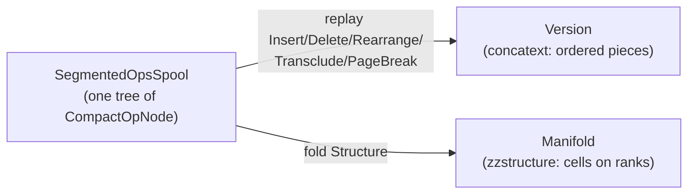

# The Unified Store/Slice: Cells as Operations, and OSMIC's Sixth Hyperop

A design specification for generalizing [`xudu::Store`](apps/common/xanadu/store.hpp) so that it can
take over the role of a Zigzag Slice, by implementing the one hyperop OSMIC names and this codebase
has never had: **MAKE/CHANGE STRUCTURE MAP**.

Nothing here is wired into the build yet. This document records the model, the rulings that produced
it, and the price of each ruling, so that the reasoning survives the implementation. Where a number
appears it is either measured (§12) or derived from arithmetic shown in place.

______________________________________________________________________

## 1. A Page Is a Cell. A Cell Is Never a Page

The obvious framing — *a Slice is a xanadoc, and its cells are pages* — is the one thing this
codebase has already proved impossible, and the proof is a method that exists for unrelated reasons.

[`Version::joinFollowing()`](apps/common/xanadu/version.cpp) merges the piece at an index with the
one after it whenever they name consecutive addresses in the same scroll. `splitAt()` cuts a piece
in two. **A `Version` destroys piece identity on purpose**, and its own comment says why: coalescing
is "what keeps a document that has been typed into for an hour down to a handful of pieces."

A zzstructure cell is the exact opposite. `d.clone` exists
([`zzcore.hpp`](apps/common/xanadu/zigzag/zzcore.hpp), `findCloneMaster`) precisely so that two
cells holding identical content remain two cells. A thing that must not merge with its neighbour
cannot be a piece, and a page is not even that — `Version::forcedBreaks()` returns
`std::vector<std::uint32_t>`, offsets rather than objects. A page has no content, no address, no
identity and no links. A cell has all four.

Inverted, the identification becomes true and cheap:

> **A page is a cell** — one whose payload happens to be a contiguous run of concatext. That
> direction costs nothing and gives pages an identity, a name in hypertime, links, and membership in
> other dimensions.

So the convergence is not "make pieces into cells". It is: find where Xanadu already keeps
*identities*, and put the cells there. It already has such a place. The operations spool is an
address space of events, each permanently and uniquely named
([`microversion.hpp`](apps/common/xanadu/microversion.hpp)), never merged, never reclaimed, and
published verbatim by `Store::exportBinaryOps`. That is an identity space of exactly the right
shape, and it has been sitting unused for this purpose.

______________________________________________________________________

## 2. OSMIC's Sixth Hyperop

The header comment of [`ops.hpp`](apps/common/xanadu/ops.hpp) lists OSMIC's hyperops as INSERT,
REARRANGE, DELETE, TRANSCLUDE, MAKE/CHANGE LINK, and MAKE/CHANGE STRUCTURE MAP. `OpKind` implements
five of them, plus `PageBreak` as a documented extension. The sixth was never built.

Note the shape of the five that were. INSERT, REARRANGE and DELETE all name a position in a document
(`Op::at`, `Op::length`, `Op::to`, all concatext offsets). TRANSCLUDE names a position in another
document. MAKE/CHANGE LINK names content addresses. Five of six are edits expressed *through* a
coordinate system. The sixth is an edit *of* the coordinate system:

> **MAKE/CHANGE STRUCTURE MAP is the hyperop that creates or alters a mapping under which the other
> five hyperops' coordinates are meaningful.** INSERT/DELETE/REARRANGE are intrinsic — they mutate a
> sequence within a fixed frame. TRANSCLUDE and LINK are relational — they connect frames. STRUCTURE
> MAP is extrinsic: it establishes what a frame *is*.

In the Udanax Green vocabulary a document *is* a map from virtual document space onto invariant
stream addresses; "structure map" is the literal name of that object, not a metaphor. `Version` in
this codebase is one: `runs` maps concatext offset to primedia address.

Two corollaries follow, and they are what makes the Zigzag accommodation shareable back to Xanadu
rather than a concession to it:

- **`OpKind::PageBreak` is a degenerate instance of the sixth hyperop**, not an extension beyond the
  six. A break partitions a concatext into an ordered sequence of subsequences — a one-dimensional
  structure map with a fixed name and no content of its own. `ops.hpp` is honest about what it built
  and wrong about what it named it.
- The reason `ops.hpp` gives for a break being concatext-relative rather than content-addressed is
  **correct and generalizes**: a structure map is defined *over* a coordinate frame, so it is
  document-relative by type rather than by convention.

______________________________________________________________________

## 3. The Model: Two Replay Products of One Spool

> A **cell** is an operation in the ops spool. Its **identity** is that operation's name in
> hypertime. Its **content** is a `PrimediaSpan` that operation carries. Its **positions** are
> `OpKind::Structure` operations naming it. A **slice** is a `Manifold` — a *second replay product*
> of the same ops spool that `Version` is the first replay product of.



Both walk the same `ancestralPath`. Neither knows about the other. That is the whole convergence.

The consequence worth stating loudly: **every `Insert` op in every xanadoc ever written is already a
cell.** The convergence does not add a concept, it notices one. OSMIC has no word for it because in
one dimension it never needed one — in a linear document a piece's ordinal *is* its identity, so
position and identity are the same fact. Zigzag does not add content ontology; it adds **arity**.
When a piece must belong to $N$ sequences at once, position and identity come apart, and the residue
is the cell.

______________________________________________________________________

## 4. Rulings

Each ruling states its price. Where a tension is genuinely unresolved it is in §11 instead.

### R1. `OpKind::Structure` is added. `OpKind::PageBreak` stays.

The sixth hyperop is implemented, and it is deliberately **not** used to re-express page breaks.

`ops.hpp` denies breaks the travel-with-quotation property on purpose; a cell boundary has the
opposite requirement, since `d.clone` exists so a cell's identity survives appearing in a second
place. Re-expressing `PageBreak` as a `d.doc` structure link would grant breaks travel semantics,
break `Version::spansFor()`'s marker exclusion, and — the decisive part — move page position out of
`Version::runs`, where `splitAt`/`insert`/`remove`/`rearrange` rebase it for free. Buying that back
means a hand-written position-transform subsystem this codebase does not have and does not need.

**Price.** `PageBreak` survives as a seventh op kind forever, and `breakMarkerScroll` keeps its ten
filter sites ([`version.cpp`](apps/common/xanadu/version.cpp) `:106,151,176,249`,
[`store.cpp`](apps/common/xanadu/store.cpp) `:259`,
[`link_layout.cpp`](apps/common/xanadu/link_layout.cpp) `:113`,
[`transcopyright_logic.cpp`](apps/common/xanadu/transcopyright_logic.cpp) `:123`,
[`session.cpp`](apps/xudu/session.cpp) `:1264,1407,2103`).

**A hard constraint that comes with it.** `binary_ops.cpp`'s `OpBinaryKind` already occupies 0..6
(`BinInsert` through `BinPageBreak`, with TRANSCLUDE split into internal and external forms), and
`FLAG_KIND_MASK = 0x07` sits with `FLAG_SEQUENTIAL = 0x08` directly above it. `BinStructure = 7`
therefore **exhausts the tag space**. Any eighth kind forces a mask widening, a tag-byte re-layout
and an `OpsSpoolVersion::CompactBinaryV3`. So `Structure` must be a *family* discriminated by
`CompactOpNode::flags`, never by further `OpKind` values, and that must be written into
`binary_ops.hpp` beside the `CompactBinaryV2` comment in the same commit.

### R2. A dimension is a cell, and it travels in `linkId`

`at` stays a concatext offset and is zero for `Structure` ops: it is load-bearing across
`Store::replay` *and* across the wire, where `FLAG_AT_EQUALS_START` special-cases it in the encoder.

The dimension's own `CellRef` goes in `linkId`. This is required rather than decorative.
[`vortex-hyperstructural-runtime.md`](vortex-hyperstructural-runtime.md) already spells dimensions
as `cell_id`s, and if the set of dimensions were a closed enum then the metasystem principle in
[`system-xanadocs-customization-and-metasystem.md`](system-xanadocs-customization-and-metasystem.md)
would be violated — a user could not mint a dimension from inside the system. `DimOrdinal`
([`compact_zzcell.hpp`](apps/common/xanadu/zigzag/compact_zzcell.hpp)) is demoted in its own doc
comment to a local cache of twelve well-known dimension cells, exactly as `vocabularyScroll` is a
cache of eleven compiled-in words.

**Price.** `compact_op.hpp`'s silent `linkId = static_cast<std::uint32_t>(op.link)` truncation
(against `Op::link` being `std::uint64_t`) becomes load-bearing and must be fixed in the same
commit.

### R3. `LinkType::Dimension` is demoted to transport only

The decisive reason is not performance: **a `Link` does not travel in a seal.** `Store::save` writes
`linkTable` to a separate plaintext file; `applyOpsSegment` replays `putOp` and never touches
`linkTable`; links cross the swarm only through `LinkPackage`/`adopt()`, which assigns fresh ids. A
manifold modelled as `Link`s is unpublishable as history.

That `Store::linksTouching()` is an unindexed full `std::map` scan is a real secondary cost, but it
is a curable implementation defect and is not the argument.

`LinkType::Dimension` survives so `zzStructureToLinkPackage` keeps compiling, with a doc comment
stating that it is an export envelope and never the model.

### R4. Cell identity is two-level: local `CellRef`, global `GlobalOpRef`

A local spool index is **not** swarm-stable. `Store::opRecords()` sorts by `MicroversionId` before
emitting, and `applyOpsSegment` re-`putOp`s in that sorted order into a fresh `Store`, so a branch
off an early state sorts into the middle of a chain it was appended after and lands at a different
local index. `store.hpp`'s own comment on `opRecords()` already notes that the order "is not the
order that would compress best — a branch sorts into the middle of the chain it forks from."

```cpp
// apps/common/xanadu/zigzag/manifold.hpp
using CellRef = std::uint32_t;   ///< local ops-spool index; 0 == no cell
inline constexpr CellRef noCell = 0;
```

```cpp
// apps/common/xanadu/publication.hpp -- beside GlobalSpan
struct GlobalOpRef {
  std::string    scroll;   ///< publisher's scroll key, as GlobalSpan::scroll
  MicroversionId produces; ///< the state this op produced, verbatim
  bool operator==(const GlobalOpRef &) const = default;
};
```

`GlobalOpRef` localises through the identical `Store::externals`/`scrollKey` path `localise()`
already models, reusing `writeMicroversionId`/`readMicroversionId` on the wire.

**Price.** Two-level indirection on every cross-document cell reference. `MicroversionId` is 24
bytes plus a heap allocation, so a `GlobalOpRef` cannot live in a link slot — it lives only in
packages and in `Manifold::externalCells`.

### R5. `noCell == 0`

Op index 0 is state zero, the null document, and is definitionally not a cell — so `0 == absent` is
correct in op-index space. It is also already hardcoded at roughly fifteen sites across
`unified_transclusion_engine.cpp`, `zzcore.cpp`, `zz_xudu_projector.cpp`, and
`Preflet::target_cell_id`. Adopting Vortex's `kNoLink = -1` would require making `CellID` signed
plus a dozen call-site changes for no benefit.

Vortex's Origin Cell instead gets a real cell, minted as op index 1 at slice genesis.

**Price.** One design-doc edit to
[`vortex-hyperstructural-runtime.md`](vortex-hyperstructural-runtime.md): its `kNoLink` and "cell 0
is an ordinary addressable target" paragraphs are amended, and its well-known dimension constants
(`d_grab = 1`, `d_entangle = 999`) become genesis-minted `CellRef`s resolved through a name table
rather than literals.

### R6. A scalar cell carries **both** a real span and canonical bits

This is the ruling that answers the non-text payload problem without giving anything up.

> **Every persistent cell has a real `PrimediaSpan` in a real scroll. A scalar cell's span holds its
> shortest-round-trip rendering; the same op additionally carries the canonical IEEE-754 or boolean
> bits in `sourceAt`/`sourceLength`, with a type tag in `flags`.**

- The span is ordinary spooled permascroll text, so a scalar cell **is** a link endpoint, **is**
  formattable via `LinkType::Format` unchanged, **is** transcludable, diffable, publishable and
  transcopyright-bearing. `Link::left`/`right` stay `std::vector<PrimediaSpan>` and
  `formatAttributeOf()` is untouched.
- The bits are the typed value. VQL comparison, arithmetic and `d.entangle` never parse text and
  never round-trip through a formatter. `PrimediaSpan::intersect()` never sees a bit pattern, so two
  adjacent doubles can never be mistaken for an overlapping transclusion.
- The rendering is pinned to `std::to_chars(first, last, value)` with **no precision argument** —
  shortest round-trip, which the standard mandates to be exact. That is a mathematical function of
  the value rather than a formatting choice. `bool` renders `true`/`false`.
- Canonicalisation applies to the **bits only**, and only for value equality: all NaN →
  `0x7ff8000000000000`, `-0.0` → `+0.0`, signalling NaN rejected at the API boundary. It is
  explicitly *not* an address canonicalisation.

**A "scroll of all doubles" — one canonical address per value, so that two cells holding 3.14 are
automatically transclusions — is rejected outright.** It is superficially attractive because it
costs zero permascroll bytes and because `vocabularyScroll`
([`format.hpp`](apps/common/xanadu/format.hpp)) is a real precedent for content-free addresses. But
[`user_permascroll.hpp`](apps/common/xanadu/user_permascroll.hpp) already documents the removal of
`findExistingSpan` on exactly this reasoning:

> sharing a coordinate is not an optimisation, it is a claim. Two documents at the same primedia
> address *are* transcluded — that is what `Version::occurrencesOf` reports and what the gold beams
> draw — so deduplicating on a text match asserted a quotation that never happened, and under
> transcopyright would have paid royalties for it.

Two people typing `3.14` have not quoted each other. Granting numeric coincidence a shared address
would classify it as `DiffKind::Universal` in `Store::diffVersions()` and light up Identity Gold in
the xudu UI. The idea is also arithmetically unsound: $2^{53} - 2$ bit patterns are NaN and none
compares equal to anything including itself, and $\pm 0.0$ is two patterns for one value, so "same
value implies same address" is false regardless of canonicalisation (§12).

**Price.** A persistent scalar costs permascroll bytes: worst case 24 for a `double`
(`4.9406564584124654e-324`), typically 1–17. Ten thousand scalar cells at 17 B/cell is 170 KB —
three of the 64 KiB Merkle pieces. The permascroll now also contains bytes a program wrote rather
than bytes a person typed, which is a genuine widening of its own definition, accepted deliberately
as the price of a scalar being a first-class Xanadu object. Arena cells (R8) carry bits only and
spool nothing, so the write-amplification concern lands on the persistence boundary where it belongs
rather than on the encoding.

### R7. A cell's micro-history is an intrusive chain in `sourceOpIndex`

`CompactOpNode::parentIndex` is the prior *document* state and nothing else — `Store::putOp`
enforces `op.parent == produces.parent()`, and `ancestralPath` follows only `parentIndex`. There is
therefore no subtree hanging off a cell's birth op, and a per-cell hypertime branch would be
invisible to a manifold rebuild because a branch is not an ancestor of the head.

Instead, every op that changes a cell's content or one of its links stores in `sourceOpIndex` the
index of the previous op touching that same cell. A cell's micro-history is then an
$O(\text{edits})$ linked-list walk with no extra index, on the main chain, fully inside
`ancestralPath` and fully scrubbable in hypertime. `Manifold::CellSlot::lastOp` caches the head of
that chain; it is derived and rebuildable, so `store.hpp`'s "nothing stores versions" survives
intact.

**Price.** `sourceOpIndex` is consumed for `Structure`-family ops and cannot also mean "transclude
source version" there. A `Structure` op is never a `Transclude`, so this is safe — but it must be
documented, and `CompactOpNode::toOp()` must not map it to `Op::source` for `Structure` kinds.

### R8. Two regimes, and the boundary is the **type**, not the cell, the op, or the keyword

Neither of the tempting boundaries works. *Authorship* is untestable from data and would need a
permanent unrevisable intent flag in the wire format. *Root-set reachability* fails VQL's own §6.2
example, where the regex NFA cache is woven off the origin cell and is therefore in the root set —
and `d.cursors` is likewise **in** the Root Set per
[`vortex-hyperstructural-runtime.md`](vortex-hyperstructural-runtime.md), the opposite of what a
reachability split would need.

The ruling is that there are two concrete C++ types:

```cpp
class Manifold;      // ops-backed. Every mutation appends a CompactOpNode.
class ArenaManifold; // dense vectors only. No ops. Dies with its owner.
```

VQL evaluation runs in an `ArenaManifold` scoped to the cursor. Weaving into persistence requires an
explicit `Manifold&`. Promotion is one call, is bounded, and refuses above a budget:

```cpp
struct PromotionBudget { std::uint32_t maxOps = 65536; };

/// Returns nullopt and mutates nothing if the reachable subgraph exceeds the budget.
std::optional<std::vector<CellRef>>
promote(Manifold &into, const ArenaManifold &from, CellRef root,
        PromotionBudget budget = {});
```

**Price, stated as a loss.** A Vortex program's intermediate execution is **not** reproducible from
the spool. Hypertime scrubs through a query's adopted outputs and through the query op itself, not
through the computation. Reachability GC ([`vql-query-language.md`](vql-query-language.md) §5) is
scoped to `ArenaManifold` only; on the persistent side `link(c, d, dir, -2)` records a Delete and
reclaims nothing, because DELETE is REARRANGE TO LIMBO.

### R9. `Manifold` is an explicitly materialised view with a stated rebuild policy

It is not a pretend-pure replay product. Folding `Structure` over `ancestralPath` is
$O(\text{history})$ — 60,000 ops for a 10k-cell, 5-dimension slice — and `store.hpp` guarantees that
nothing caches. The policy is therefore explicit:

- Full fold once, on load, from `ancestralPath`.
- Incremental application on every subsequent `Structure` append, the `syncIncremental` shape
  `UnifiedTransclusionEngine` already has.
- A test hook `bool verifyAgainstFullRebuild(const Store &) const` asserting that the incremental
  state equals a cold fold.

That hook is the honesty mechanism, and it is what stops the view drifting the way
`UnifiedTransclusionEngine::cells_` can today.

### R10. Sealed segments become genuinely immutable

`SegmentedOpsSpool::append()` writes `parent->firstChildIndex` and `sibNode->nextSiblingIndex` into
**already-stored** nodes, while `adoptSegmentNodes()` maps sealed page-aligned segments `PROT_READ`
(`virtual_memory_arena.cpp`, `prot = writable ? (PROT_READ | PROT_WRITE) : PROT_READ`). Appending a
child of a node inside a sealed segment writes to a read-only mapping. See §8.

Fix: `firstChildIndex` and `nextSiblingIndex` leave `CompactOpNode` and become a side array in
`SegmentedOpsSpool`, rebuilt from `parentIndex` on adopt and on load.

```cpp
struct TreeLinks { std::uint32_t firstChild{0}; std::uint32_t nextSibling{0}; };
std::vector<TreeLinks> tree;   // parallel to the node array, index-aligned
```

The two 32-bit slots in the node become `reserved0`/`reserved1`, written zero and ignored on read,
so existing files on disk still load byte-compatibly and **no format version bump is required**.
`sizeof(CompactOpNode) == 64` is preserved and its `static_assert` holds.

**Price.** Eight bytes per op for the side array — net zero resident, since they were already eight
bytes per op inside the node — and an $O(n)$ rebuild pass per adopt. In exchange, "an op node is
immutable" becomes true, which is what publication semantics already assumed.

______________________________________________________________________

## 5. The Encoding

### 5.1 `OpKind`

```cpp
// apps/common/xanadu/ops.hpp
enum class OpKind : std::uint8_t {
  Insert, Delete, Rearrange, Transclude, Link, PageBreak,
  /**
   * OSMIC's sixth hyperop: MAKE/CHANGE STRUCTURE MAP. Establishes the
   * coordinate frame the other five operate inside. A page break is the
   * degenerate one-dimensional case and deliberately is NOT this -- see
   * OpKind::PageBreak for why a break must not travel with a quotation,
   * where a cell boundary must.
   *
   * Discriminated further by CompactOpNode::flags, never by new OpKind
   * values: BinStructure = 7 exhausts FLAG_KIND_MASK = 0x07 in
   * binary_ops.cpp, and 0x08 is already FLAG_SEQUENTIAL.
   */
  Structure,
};
```

`Store::replay()` gains a case that changes no text, so every existing `Version`, test and app is
bit-identical after the commit that introduces it:

```cpp
case OpKind::Structure: {
  // Changes no text. A slice's structure is a second replay product -- see
  // Manifold. Recorded as an op so that structural editing is a point in
  // hypertime like any other edit, exactly as OpKind::Link is.
  break;
}
```

### 5.2 `CompactOpNode` — still exactly 64 bytes

```cpp
struct alignas(64) CompactOpNode {
  // Tree topology & metadata (16 bytes)
  std::uint32_t parentIndex{0};   ///< prior document state (hypertime parent)
  std::uint32_t reserved0{0};     ///< was firstChildIndex; see SegmentedOpsSpool::tree
  std::uint32_t reserved1{0};     ///< was nextSiblingIndex; ditto
  OpKind        kind{OpKind::Insert};
  std::uint8_t  flags{0};         ///< see the Structure-family bits below
  std::uint16_t branchOrdinal{0};

  // Position & geometry (24 bytes)
  std::uint32_t at{0};            ///< Insert/Delete/Rearrange/PageBreak pos; 0 for Structure
  std::uint32_t length{0};
  std::uint32_t to{0};            ///< Rearrange dest      | Structure: target CellRef
  std::uint32_t sourceAt{0};      ///< Transclude src off  | Structure: value bits [31:0]
  std::uint32_t sourceLength{0};  ///< Transclude src len  | Structure: value bits [63:32]
  std::uint32_t sourceOpIndex{0}; ///< Transclude src ver  | Structure: prev op on this cell

  // Content span & link reference (24 bytes)
  ScrollId      scrollId{localScroll};
  std::uint32_t linkId{0};        ///< Link id             | Structure: dimension CellRef
  std::uint64_t spanStart{0};
  std::uint64_t spanLength{0};
};
static_assert(sizeof(CompactOpNode) == 64);
```

`flags` is currently declared but never read anywhere in the tree, so the Structure family takes it:

```cpp
// bits 0-2: StructureVerb
inline constexpr std::uint8_t structureVerbMask = 0x07;
enum class StructureVerb : std::uint8_t {
  MakeCell = 0, ///< mint a cell; span = its content; `to`/`linkId` unused
  SetLink  = 1, ///< (this cell, dim = linkId, dir) -> `to`; `to == noCell` clears
  SetValue = 2, ///< retarget this cell's content span and/or typed value
  MakeDim  = 3, ///< mint a dimension cell; span = its name in the permascroll
};
// bit 3: link direction for SetLink
inline constexpr std::uint8_t structureNegward = 0x08;
// bits 4-6: ValueKind, when a typed value accompanies the span
inline constexpr std::uint8_t valueKindMask  = 0x70;
inline constexpr std::uint8_t valueKindShift = 4;
enum class ValueKind : std::uint8_t { None = 0, Double = 1, Bool = 2, Int64 = 3 };
// bit 7: reserved
```

A `MakeCell` op for the scalar `42.0` is `kind = Structure`, `flags = MakeCell | (Double << 4)`,
`span = {localScroll, off, 2}` naming the two permascroll bytes `42`, and `sourceAt`/`sourceLength`
= `bit_cast<std::uint64_t>(42.0)`. **One 64-byte op, zero heap, two permascroll bytes, and a
first-class Xanadu address.** A cell with five dimensions costs one `MakeCell` plus five `SetLink` =
six ops = 384 bytes of the memory-mapped arena.

### 5.3 `Manifold`

```cpp
// apps/common/xanadu/zigzag/manifold.hpp
namespace zigzag {

/// The eight dimensions whose links live in the one-cache-line hot array.
/// Every other dimension -- including any the user mints -- resolves through
/// `cold`. Chosen so that a BFS hop touches exactly one 64-byte line.
inline constexpr std::size_t hotDims = 8; // D1 D2 D3 Doc Clone Transclude OpsTime OpsDag

struct CellSlot {                   // 48 bytes
  xanadu::PrimediaSpan span{};      // 24
  std::uint32_t birthOp{0};         //  4  ops-spool index == CellRef
  std::uint32_t lastOp{0};          //  4  head of this cell's micro-history chain
  std::uint32_t coldIndex{0};       //  4  side-table row, 0 == none
  std::uint8_t  valueKind{0};       //  1
  std::uint8_t  flags{0};           //  1
  std::uint16_t dynamicDimCount{0}; //  2
  std::uint64_t valueBits{0};       //  8
};
static_assert(sizeof(CellSlot) == 48);

using HotLinks = std::array<CellRef, 2 * hotDims>; // 64 bytes, one cache line
static_assert(sizeof(HotLinks) == 64);

class Manifold {
public:
  // -- read path: no allocation, no locks, no Store access --------------------
  [[nodiscard]] CellRef linked(CellRef from, DimRef dim, bool negward) const noexcept;
  [[nodiscard]] const CellSlot *slot(CellRef) const noexcept;
  [[nodiscard]] std::string_view textOf(CellRef, const xanadu::SpanReader &) const;
  [[nodiscard]] std::optional<double> asDouble(CellRef) const noexcept;
  /// Follows d.clone negward to the group master, then reads the master's slot.
  [[nodiscard]] CellRef cloneMaster(CellRef) const noexcept;

  // -- fold path: driven only by Store ---------------------------------------
  void applyStructure(std::uint32_t opIndex, const xanadu::CompactOpNode &) noexcept;

  // -- honesty ---------------------------------------------------------------
  [[nodiscard]] bool verifyAgainstFullRebuild(const xanadu::Store &) const;

private:
  std::vector<CellSlot> slots;                       // dense, indexed by dense id
  std::vector<HotLinks> hot;                         // parallel, 64 B stride
  std::unordered_map<std::uint64_t, LinkPairs> cold; // (denseId << 32) | dimDenseId
  std::unordered_map<CellRef, std::uint32_t> byRef;  // ops index -> dense id
  std::vector<ColdCell> coldCells;                   // Preflet, transcopyright, holes
};

} // namespace zigzag
```

### 5.4 `Store` additions

```cpp
// apps/common/xanadu/store.hpp

/// The structure-map replay product, as rebuild() is the concatext one.
/// Folds only OpKind::Structure over opsSpool.ancestralPath(). O(history);
/// call once on load and drive incrementally thereafter -- see Manifold.
[[nodiscard]] zigzag::Manifold rebuildManifold(const MicroversionId &) const;

MicroversionId makeCell(const MicroversionId &parent, const PrimediaSpan &content);
MicroversionId makeCell(const MicroversionId &parent, double value); // to_chars + bits
MicroversionId makeCell(const MicroversionId &parent, bool value);
MicroversionId makeDimension(const MicroversionId &parent, std::string_view name);
MicroversionId setLink(const MicroversionId &parent, CellRef from, CellRef dim,
                       bool negward, CellRef to); // to == noCell clears
MicroversionId setValue(const MicroversionId &parent, CellRef cell,
                        const PrimediaSpan &content, ValueKind, std::uint64_t bits);

[[nodiscard]] GlobalOpRef opRefOf(CellRef, const Scroll &sealedAs) const;
[[nodiscard]] CellRef localiseOpRef(const GlobalOpRef &);

/// Ops remaining before the arena reservation is exhausted. Store::apply
/// throws xanadu::SpoolExhausted (not std::bad_alloc) below the soft limit.
[[nodiscard]] std::uint32_t opCapacityRemaining() const noexcept;
```

`rebuildManifold()` is a **second walk** over `ancestralPath`, deliberately not a widened
`replay()`: `store.cpp` documents `replay(node, Version &)` as the single replay path, and widening
it would touch `rebuild()`, `rebuildFromIndex()` and `advance()` — the per-keystroke fast path.

______________________________________________________________________

## 6. The Three Hurdles

### 6.1 The PageBreak flood — dissolved

A cell rank is never a `Version`. `Structure` ops fold into `Manifold`; `Store::replay()` treats
them as a text no-op. A 10,000-cell slice is 10,000 `MakeCell` plus roughly 10,000 `SetLink` ops and
**zero `PageBreak` ops**, because there is no concatext being partitioned.

The tempting consolation that "there was never a flood, since a xanadoc already has one op per
keystroke" is **false and must not be relied on**. `UncommittedOpLog::compact()` merges contiguous
sequential inserts into one `CompactedOp` before anything reaches the spool, and `Version::insert()`
coalesces again on replay. A linearly-typed 10k-word xanadoc is a handful of ops; a 10k-cell slice
really is ~20k ops, and coalescing is exactly what must not happen to it.

Two further reasons the naive "cell = page + PageBreak" reading is not merely noisy but wrong:

- `Version::insertBreak()` calls `joinFollowing()` on both sides, and two markers join (same
  `breakMarkerScroll`, both zero-length) — codified as `twoBreaksAtOnePointReadAsOne`. **An empty
  cell contributes zero concatext bytes, so its two bounding breaks would merge and the cell would
  silently vanish.** VQL's bare `%` allocates exactly such cells as its normal mode.
- Interleaving breaks with inserts severs `joins()` coalescing permanently, so `runs` holds two
  pieces per cell forever instead of a handful in total.

### 6.2 Tiny cells — inverted, and the win is locality rather than bytes

Measured (§12), 10,000 cells $\times$ 5 dimensions:

| representation                        | resident | allocations | ns/hop (sequential) |
| ------------------------------------- | -------- | ----------- | ------------------- |
| `unordered_map<CellID, zigzag::Cell>` | 8.32 MB  | 70,001      | 279.08              |
| `vector<CompactZZCell>`               | 9.60 MB  | 1           | 2.58                |
| ops (10k `MakeCell` + 50k `SetLink`)  | 3.84 MB  | 1           | 2.28                |

The ops form is 2.17$\times$ lighter than the map *while carrying six times as many objects*, with
zero heap allocations per cell. But the decisive number is the 122$\times$ rank-hop gap:
`zigzag::Cell` embeds a per-cell `unordered_map<DimID, LinkPairs>`, so a 10,000-cell slice is 10,000
separate tiny hash tables and every hop pays a cold bucket array behind a cold node behind a cold
`Cell`. Warm decomposition puts only about 31 ns of that 279 ns in actual lookup work; the rest is
cache behaviour that neither dense form pays at all.

**The hurdle is therefore an argument for the convergence rather than against it.** One honest
caveat: the 2.28 ns figure requires the dense `Manifold` array, not the append-ordered spool — a
retargeted link appends a new op and leaves the old one in place, so the latest `SetLink` for a
given `(cell, dim, dir)` is not at a computable offset. That is precisely why R9 rules `Manifold` an
explicit materialised view. Navigation never touches ops.

### 6.3 Non-text payloads — R6, and it is cheap

`PrimediaSpan{scroll, 0, 4, "application/octet-stream"}` was never the alternative. The real cost of
a first-class scalar cell is one 64-byte op that was being paid anyway, plus 1–24 permascroll bytes
(typically 17 or fewer), plus zero new reserved scrolls, zero new span semantics and zero heap. Ten
thousand scalar cells is about 170 KB of primedia — three Merkle pieces.

In exchange the scalar is a link endpoint, is formattable with `LinkType::Format` unchanged,
transcludes, diffs, publishes and carries transcopyright, while VQL never touches its rendering
because the typed bits are in the op.

______________________________________________________________________

## 7. What Xanadu Gets Back

- **Structure that survives publication.** `Link`s do not travel in seals (R3), so xudu today has no
  way to express document structure that a peer can receive. `Structure` ops travel in
  `exportBinaryOps` like every other op. Sections, footnotes, marginalia, outline hierarchy and
  alternative reading orders each become a rank on a dimension cell — versioned, scrubbable in
  hypertime, and adoptable.
- **Transclusion queries proportional to the number of answers.** `Store::diffVersions()` builds
  `unordered_map<GlobalAddr, std::vector<std::size_t>>` with **one hash insert per character per
  version**; that is what the Identity Gold / Amber / Mint classification the whole xudu UI rests on
  currently costs, and `Version::occurrencesOf()` is a linear scan of pieces. With `d.transclude`
  maintained as a stored rank at write time (`DimOrdinal::Transclude` already exists), "who else
  quotes this passage" becomes a rank walk. This is the largest performance win available in the
  tree, and it is a pure gift from Zigzag to Xanadu.
- **Structural parallel-document display.** `d.version` and `d.ops_dag`, both already declared in
  `DimOrdinal`, make hypertime navigable: a rank across branches gives Nelson's flagship
  side-by-side parallel view with **no diff machinery at all**, because the cells shown are
  literally the same cells related on `d.clone`. Today a branch is reachable only by knowing its
  `MicroversionId` or by calling `Store::children()`.
- **Overlapping formatting becomes structural.** As a dimension, italic-ness is rank membership.
  Bold beginning inside an italic span and ending outside it — the case embedded markup structurally
  cannot express, and the reason Nelson attacks it — is free, because dimensions are orthogonal by
  construction. `system-xanadocs-customization-and-metasystem.md` §6.2 already demands strictly zero
  markdown; this is what makes that demand cheap rather than merely principled.

______________________________________________________________________

## 8. Defects on the Critical Path

These are present-tense bugs found while grounding the model. Each is worth fixing on its own
merits, and each is also load-bearing for the convergence.

1. **Latent SIGSEGV on appending into a sealed segment.** `SegmentedOpsSpool::append()` mutates
   `parent->firstChildIndex` and `sibNode->nextSiblingIndex` in already-stored nodes, while
   `adoptSegmentNodes()` maps page-aligned sealed segments `PROT_READ`. Latent today only because
   `addSealedSegment`/`sealActive` have no production callers and every test seals four or five
   nodes. The convergence detonates it: $65536 / 64 = 1024$ ops per Merkle piece, a multiple of the
   page size in nodes, so sealed segments will be page-aligned by construction, and "seal a slice,
   then edit it" is the normal path. Fixed by R10.
1. **`publish()` throws on any document containing a page break.** `Version::pieces()` hands out
   break markers unfiltered, so `globalise()` reaches `globalKeyOf()`, which asks
   `Store::scroll(UINT32_MAX)`, gets `nullptr`, and throws. `apps/xudu/session.cpp` inserts breaks
   on PDF import. No test covers it.
1. **Three quadratics in `buildCellFromOp()`**
   ([`unified_transclusion_engine.cpp`](apps/zigzag/core/unified_transclusion_engine.cpp)): an
   uncached full `store_.rebuild(sourceVer)` per Transclude op, a full linear scan of
   `spanToMasterCell_` on every non-exact span, and a `d.transclude` tail walk per cell. Measured at
   242 ms for 10k ops and 1.00 s for 20k — exactly $4\times$ per doubling.
1. **A clone of a non-string cell reads the wrong value.** `getEffectiveCellText()` falls back to
   the clone's own text when `master->text()` is empty, and `Cell::text()` returns `{}` for the
   `double`, `bool` and `std::vector<std::uint8_t>` alternatives of `CellData`. The non-text payload
   hurdle is already biting inside the existing clone implementation.
1. **`CompactOpNode::fromOp()` truncates `Op::link`** from `std::uint64_t` to `std::uint32_t`.

______________________________________________________________________

## 9. Migration

Each step is one commit. After each, `make -j$(nproc)` builds all three programs and
`make -j$(nproc) test` passes.

1. **Sealed-segment immutability** (R10). New test: seal a 64-node segment at a page-aligned start
   offset, then append a child of a node inside it. Currently SIGSEGVs; must pass.
1. **`publish()` with a page break.** Give `breakMarkerScroll` a reserved `GlobalSpan` scroll name
   in `globalKeyOf()` and a matching case in `adopt()`, so breaks survive the round trip.
1. **The three quadratics.** `spanToMasterCell_` is already ordered by `SpanLess`, so the scan
   becomes a `lower_bound` plus a predecessor check; the tail walk gets a `rankTail_` map; the
   uncached `rebuild()` gets a bounded LRU `Version` cache keyed by `MicroversionId`. Add the
   size-scaling regression test that `tests/zigzag/` does not currently have.
1. **`getEffectiveCellText()` resolves `CellData` by alternative** rather than through `text()`.
1. **Spool capacity.** Raise `defaultOpsReservation` to 8 GiB of *reserved address space* on 64-bit
   (`VirtualMemoryArena::reserve` reserves without committing), keep 512 MiB elsewhere, and add
   `opCapacityRemaining()` plus a typed `xanadu::SpoolExhausted` thrown before the arena's bare
   `std::bad_alloc`.
1. **Small-buffer `MicroversionId`** — inline storage for two segments or fewer. Removes 24 bytes
   and one malloc per op. Purely internal; every existing test must pass unmodified. This is a
   prerequisite for §6.2's size argument being true rather than asserted.
1. **`GlobalOpRef` plus `Store::opRefOf`/`localiseOpRef`** (R4), mirroring
   `GlobalSpan`/`globalise`/`localise` and reusing `writeMicroversionId`. Nothing new is stored.
1. **`OpKind::Structure` plus `BinStructure = 7`** (R1, R2): flag constants and accessors, the
   `replay()` no-op case, `opKindName`, both `binary_ops.cpp` switches, the OSMIC-text string table,
   and the `Op::link` truncation fix. Document tag-space exhaustion. **No behaviour change: nothing
   emits `Structure` yet.**
1. **`Manifold` plus `rebuildManifold()` plus the `makeCell`/`setLink`/`setValue` API** (R7, R9),
   with `verifyAgainstFullRebuild()` and its test. Nothing consumes it yet.
1. **Scalars** (R6). Canonicalisation at the API boundary; signalling NaN rejected. Property test:
   `asDouble(makeCell(v))` equals `canonicalise(v)`, and `textOf(cell)` parses back to the same
   double.
1. **`Resolver` verified-piece cache**, keyed by info hash and piece index. Blocking for the frame
   budget: `readSegment` verifies whole 64 KiB pieces and the resolved-text cache was removed and
   never replaced, so `stageVisibleCells` re-verifies per visible cell per frame.
1. **Make `UserPermascroll::read`/`readView` genuinely lock-free.** They are documented as "fast
   lock-free zero-copy" but take `std::lock_guard` on `appendMutex_`; the underlying arena's
   `base()` never moves and `readView` clamps to `totalBytes`, so the lock serialises the render
   thread against the append path for nothing.
1. **Port `UnifiedTransclusionEngine` onto `Manifold`.** `syncIncremental`/`buildCellFromOp` already
   make exactly one `CompactZZCell` per `CompactOpNode` and already set `spoolOpIndex = opIndex`, so
   this is mostly deletion. `CompactZZCell` dissolves into `CellSlot` plus `HotLinks` plus
   `ColdCell`, and `ephemeralText` is deleted outright — it duplicates the primedia that `span`
   already addresses, as its own comment complains.
1. **`sliceToStore()` / `storeToSlice()` against `Manifold`**, replacing `projectXuduToZigzag`'s
   paragraph-splitting heuristic (it pairs paragraph $k$ with `pieces()[k]`, and piece index and
   paragraph index have no relationship) and `zzStructureToLinkPackage`'s synthetic scroll.
   `ZzStructureDocument` and `zigzag::Cell` survive, demoted in their doc comments to the YAML DTO.
1. **`ArenaManifold` plus `promote()`** (R8). Only after step 14, and only once there is a VQL
   interpreter to drive it.

______________________________________________________________________

## 10. Non-Goals

1. **Not retiring `OpKind::PageBreak` or `breakMarkerScroll`** (R1). Deleting ten `if` statements
   would buy a hand-written position-rebasing subsystem this codebase does not have.
1. **Not implementing "the scroll of all doubles"** (R6) — rejected on the codebase's own recorded
   reasoning, and arithmetically false across the $2^{53} - 2$ NaN patterns and the two signed
   zeros.
1. **Not putting scalar bits into `PrimediaSpan`.** `intersect()` is pure range arithmetic, so `1.0`
   at `0x3FF0...0` and its successor at `0x3FF0...1` would overlap by seven bytes and draw a gold
   transclusion beam between unrelated cells. `PrimediaSpan` learns nothing about numbers.
1. **Not making `Link`'s ends a variant of span-or-cell.** R6 makes it unnecessary; the butterfly
   stays the butterfly.
1. **Not deleting `zigzag::Cell` / `ZzStructureDocument` / `zzstructure_loader`.** They remain the
   authored-YAML DTO. That `zzstructure_loader` rejects duplicate authored cell ids is the
   codebase's own oldest evidence that cell identity was never derived from content.
1. **Not making Vortex execution reproducible from the spool** (R8). Stated there as a loss.
1. **Not doing reachability GC on the persistent side.** `link(c, d, dir, -2)` records a Delete and
   reclaims nothing. [`vql-query-language.md`](vql-query-language.md) §5 gets scoped to
   `ArenaManifold`.
1. **Not merging `Manifold` into `Version` or widening `Store::replay()`** (§5.4).
1. **Not changing `CompactOpNode`'s on-disk field layout.** R10 zeroes two words rather than
   removing them, precisely so that no format version bump is needed and `sizeof == 64` holds.
1. **Not touching `src/render/`, the glyph cache, or any backend.** The convergence is entirely
   below the staging boundary; `./tools/compare-backends.sh` output must be byte-identical after
   every step.

______________________________________________________________________

## 11. Unresolved

**U1. Random access along a non-`d.doc` rank.** A Green enfilade answers "give me the $n$-th thing"
in $O(\log n)$; a zzstructure rank answers only successor and predecessor, so "jump to the 5000th
cell on `d.2`" — which is what a scrollbar over a rank is — costs a walk proportional to the rank
length. Every measurement in §12 is of *adjacency walks*. This is the one place a structure map
genuinely regresses against the enfilade.

> **Experiment.** Instrument every rank-position query `apps/zigzag` issues over a real 120 Hz
> session against `assets/zigzag/`'s sample documents, and record the distribution of the distance
> between the requested index and the cursor index. If every query is a bounded walk from a cursor,
> the flat-array-on-`d.doc`-only concession holds. If any query is not, every rank needs an
> order-statistic index — which is the enfilade, rebuilt, and a real cost the convergence must own.

**U2. The op rate of a real Vortex program.** Neither
[`vortex-hyperstructural-runtime.md`](vortex-hyperstructural-runtime.md) nor
[`vql-query-language.md`](vql-query-language.md) states one, so the arena size, the promotion budget
(`maxOps = 65536` above is a placeholder), the flush policy and the swarm announce rate are all
unfalsifiable. A `weave` that appends 1,024 ops crosses one 64 KiB Merkle piece boundary, so a
million-iteration loop would mint 977 new leaves and 977 announcements, and nobody can currently say
whether that is acceptable.

> **Experiment.** Implement the VQL interpreter against `ArenaManifold` and measure ops per second
> and promoted ops per query for `vql-query-language.md` §6.2's regex-compile example and §4.4's
> `+d.results` weave.

______________________________________________________________________

## 12. Measurements

`clang++ -std=c++23 -O2 -Iinclude -Iapps`, clang 22.1.8, x86-64, libstdc++, AMD Ryzen Threadripper
1950X (L1d 32 KiB/core, L2 512 KiB/core, L3 8 MiB/CCX). The probe includes the **real repo
headers**, not reproductions. Heap figures come from an instrumented global `operator new`
(including the `align_val_t` overloads, needed because `CompactOpNode` is `alignas(64)`) counting
`malloc_usable_size`, not from `sizeof` guesses.

### 12.1 Sizes

| type                                                     | sizeof | alignof |
| -------------------------------------------------------- | ------ | ------- |
| `xanadu::PrimediaSpan`                                   | 24     | 8       |
| `xanadu::CompactOpNode`                                  | 64     | 64      |
| `xanadu::Op`                                             | 112    | 8       |
| `xanadu::Link`                                           | 128    | 8       |
| `xanadu::MicroversionId`                                 | 24     | 8       |
| `zigzag::LinkPairs`                                      | 16     | 8       |
| `zigzag::Cell`                                           | 336    | 8       |
| `zigzag::CompactZZCell`                                  | 960    | 8       |
| `zigzag::Preflet`                                        | 128    | 8       |
| `CellData` = `variant<string, double, bool, vector<u8>>` | 40     | 8       |
| `unordered_map<string, LinkPairs>`                       | 56     | 8       |
| `array<LinkPairs, StandardDimensionCount>` (12 dims)     | 192    | 8       |

`CompactZZCell` is 960 exactly — its header comment's "around 960" is literal. 192 of that is the
inline standard-dimension array, 136 the `optional<Preflet>`, and 64 the two `std::string`s.

### 12.2 One tiny cell: content `42.0`, links on three dimensions

| representation                             | sizeof | allocs | heap (usable) | deep total |
| ------------------------------------------ | ------ | ------ | ------------- | ---------- |
| `zigzag::Cell`                             | 336    | 4      | 320           | 656        |
| `CompactZZCell`, three *standard* dims     | 960    | 0      | 0             | 960        |
| `CompactZZCell`, three *dynamic* dims      | 960    | 3      | 360           | 1320       |
| 4 `CompactOpNode` (1 cell op + 3 link ops) | 256    | 0      | 0             | 256        |

The four allocations in `zigzag::Cell` are entirely its per-cell `unordered_map`: one bucket array
plus three nodes. The `double` itself costs zero, since the variant is inline.

### 12.3 Rank walk, 10,000 hops

| representation                                               | sequential | random |
| ------------------------------------------------------------ | ---------- | ------ |
| `unordered_map<CellID, Cell>` into `unordered_map<DimID, …>` | 279.08     | 273.49 |
| — outer map lookup only                                      | —          | 6.40   |
| — dimension map lookup only, one hot cell                    | —          | 24.91  |
| `vector<CompactZZCell>` (960 B stride)                       | 2.58       | 17.66  |
| `vector<CompactOpNode>` (64 B stride)                        | 2.28       | 14.39  |
| — same, iterated in spool order (prefetchable)               | 0.75       | —      |

All figures ns/hop, 200 repetitions. The 0.75 ns row is what a hardware prefetcher does when the
rank *is* the op order — a property the other two representations cannot have by construction, and
one that follows directly from a cell's identity being its spool position.

### 12.4 IEEE-754 canonicalisation

Round-trip through `bit_cast<std::uint64_t>` and back: **zero failures** over 13 hand-picked values
and 20,000,000 random bit patterns, including subnormals and NaN payloads.

| class                        | bit patterns               | note                                        |
| ---------------------------- | -------------------------- | ------------------------------------------- |
| total                        | 18,446,744,073,709,551,616 | —                                           |
| NaN (exp 2047, mantissa ≠ 0) | 9,007,199,254,740,990      | $2^{53}-2$; none compares equal to anything |
| signed zero                  | 2                          | two patterns, one value                     |
| subnormals                   | 9,007,199,254,740,990      | all distinct values; not a problem          |

This is what kills the shared-address idea independently of the transcopyright argument in R6: about
0.049% of the address space is NaN and none of it compares equal to anything including itself, while
$\pm 0.0$ is the mirror failure — two addresses for one value.

### 12.5 Caveats

- The ops-form rank-walk figure assumes dimensional links laid out grouped per cell, which is a
  layout choice `Manifold` makes and the append-ordered spool does not (§6.2).
- `OpKind::Structure` does not exist, so the probe's dimensional-link ops are `OpKind::Link` nodes
  with the field usage §5.2 proposes. A byte-exact stand-in, but not repo code.
- No `Store`/`SegmentedOpsSpool` machinery was exercised. These are data-layout numbers, not
  end-to-end.

______________________________________________________________________

## 13. Documents to Amend

| document                                                                                             | change                                                                            |
| ---------------------------------------------------------------------------------------------------- | --------------------------------------------------------------------------------- |
| [`osmic-microversioning-and-dag.md`](osmic-microversioning-and-dag.md)                               | the sixth hyperop, and `PageBreak` as its degenerate one-dimensional case         |
| [`zigzag-multidimensional-space-and-projection.md`](zigzag-multidimensional-space-and-projection.md) | cell = op; `Manifold` as the second replay product; `CompactZZCell` as a cache    |
| [`vortex-hyperstructural-runtime.md`](vortex-hyperstructural-runtime.md)                             | `kNoLink` becomes `noCell == 0` (R5); dimensions as genesis-minted cells; op rate |
| [`vql-query-language.md`](vql-query-language.md)                                                     | §5's reachability GC scoped to `ArenaManifold` (R8)                               |
