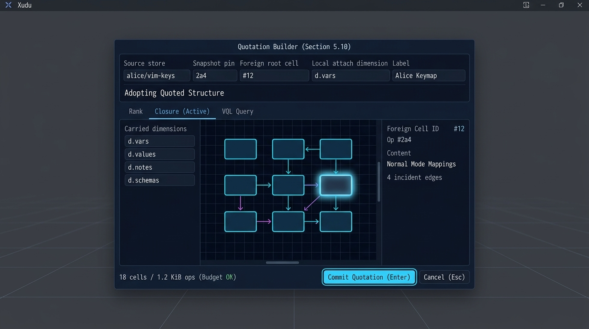
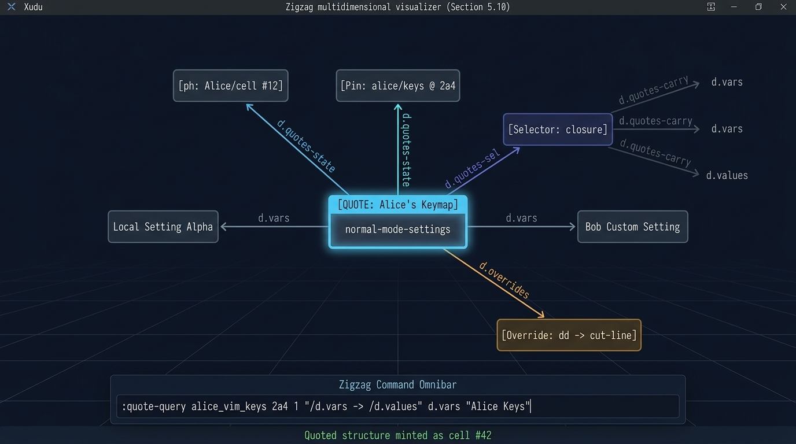

# 5.10 — Quoted structure: adopting somebody else's shape

Implementation plan for §5.10 of [`structure-hyperop-vision.md`](../structure-hyperop-vision.md).
**Status:** proposed; occurrence-scoped traversal and async resolver contracts are gates. Two
earlier substantial corrections remain — §5.10's "traversal falls through at fold time" cannot be
built as written (§1), and a quotation must name a **selector** rather than a rank, or the mechanism
cannot express anything larger than a list (§2). **Depends on:** [§5.5](5.05-extern-refs.md) for
persistent boundary references, [§5.6](5.06-compact-binary-v4.md) for their stable wire form, and
[§5.7](5.07-arena-federation.md) for identity-preserving spaces and quote-local occurrence cells.
**Can prototype against already-open stores without §5.5's production fetch/cache phase**, but
production wiring depends on it — see §9. **Provides:** vocabulary adoption to §5.11 and §4.1 preset
sharing, which has been promised since the system-xanadocs note and has never had a mechanism.

`spliceCellSpan` transcludes content into a cell. Nothing in the tree transcludes a *shape*: Bob
cannot adopt Alice's keymap, or her schema, or her Vortex library, except by copying it and losing
the fact that it was hers.

## 1. The first correction: "falls through at fold time" is the one thing this cannot do

§5.10 says traversal of a quoted rank "falls through at fold time." The phrase was flagged as
uncertain when the section was written, and reading the fold confirms the doubt. It is not a wording
problem: the fold is the wrong place, by three independent arguments, any one of which is
sufficient.

- **The fold cannot do I/O, and resolution is I/O.** `Manifold::applyStructure()` is `noexcept`
  (`manifold.cpp:186`), takes one node at a time, and [§5.5 §5](5.05-extern-refs.md) already rules
  that resolving a placeholder means finding a scroll, possibly fetching it over BitTorrent, loading
  a store and *folding a manifold on it*. Putting that behind a `noexcept` per-node call is not a
  refactor, it is a category error.
- **A foreign cell has no local `CellRef`, and cannot be given one.** `CellRef` is an index into
  *this* store's ops spool (R4). The only refs a manifold can hold that are not ops indices are
  `ephemeralBit` ones — and `applyStructure` **refuses** an ephemeral target by design
  (`manifold.cpp:258-261`), because that refusal is R8 and R12 expressed as a bit. A fold that
  minted foreign cells would have to either collide with its own index space or defeat the check
  that exists to stop exactly this.
- **It would stop a manifold being a replay product of one spool.** §3 of the convergence is that a
  `Version` and a `Manifold` are two replay products of the same operations. A fold that reaches
  outside makes the manifold a product of the spool *plus whatever happens to be on disk or on the
  network this minute*, so the same store folds to two different manifolds on two machines and
  `verifyAgainstFullRebuild()` — the honesty mechanism R9 put there in place of a promise — stops
  being able to tell drift from absence.

**Ruling: fall-through is a materialisation into §5.7's federated `ArenaManifold`, performed by a
resolver above the fold, and never a property of the persistent `Manifold`.** The persistent side
records the quotation and nothing else. The reading side folds the base manifold as it does today,
attaches the foreign manifold as a space, mints lightweight occurrence cells for the selected cells,
links only the selected induced edges, and splices that view into the local rank. No foreign content
span is copied; each occurrence resolves to its canonical source-space identity and delegates
content reads to that space.

The vision anticipated the objection and answered it correctly for the wrong mechanism: "a first
draft called this ArenaManifold's copy-on-write overlay made durable, which sounded like a crossing
of R8. It is not." That is still right, and this plan sharpens it. **What is durable is the
quotation; what is ephemeral is the view of what was quoted.** Adopting a shape is authorship and
earns operations. Rendering the adopted cells is navigation and earns none — R8, on the seam it was
drawn for.

**Refused alternatives, so they are not reinvented:**

- **Fall-through in `Manifold::linked()`.** The read path is documented allocation-free, lock-free
  and `Store`-free, and every walker in the tree would need the special case.
- **Copying the foreign cells at adopt time.** That is `importManifold`'s *reproducing* half, which
  [§5.9 §2](5.09-anthology-ranks.md) distinguishes from quoting; it loses both the attribution and
  the update path. Kept as an explicit affordance rather than a default — see §5's note on
  `promote()`.
- **A `QuoteRank` verb in `CompactOpNode`.** Nothing needs one: a quotation is a cell and some
  links, exactly as §5.5 found for the extern reference itself.

## 2. The second correction: a quotation names a **selector**, not a rank

§5.10 is titled "quoted ranks" and its mechanism is "a `SetLink` to the placeholder for the foreign
rank's head." A rank is the wrong unit, and the draft of this plan inherited the mistake and then
made a second one on top of it.

**A rank is too small.** A keymap is not a rank. `system://keymap`'s geometry is ten dimensions
(system-xanadocs §6.2): a setting is a cell on `d.vars` with its value on `d.values`, its
description on `d.notes`, its schema on `d.schemas`, alternatives on `d.alternates`, defaults on
`d.default`, and group membership through `d.groups`/`d.subgroups`/`d.clone`. Quoting rank by rank
would take one quotation per dimension *per rank head*, and the ranks hang off different cells, so
it is not a fixed count — it is one quotation per setting per dimension. Something the size of a
Vortex standard-library module (`d.stdlib`, `d.clause`, `d.spin`, `d.contract`, …) is not
expressible at all that way. If a quotation cannot carry a keymap in one operation-sized act, the
mechanism does not deliver §4.1 and there is no point building it.

**And "the whole closure" is too big.** The draft of this plan answered the size problem by
importing, from each rank member, "the subgraph reachable along any dimension." **That is a defect,
and it is the one worth catching here:** in a connected slice, everything is reachable from
everything. A member's `d.vars` neighbour is the next setting, whose neighbour is the next, whose
group cell leads to `home`, from which the entire store is reachable. Unbounded closure means
*import Alice's whole store* — which is `importManifold`, which is §5.9's reproducing half wearing a
quotation's clothes. Two readers with two budgets would also see two different documents, so it is
not even deterministic.

**Ruling: a quotation names a selector, and a selector answers a deterministic set of foreign cells
given the foreign document and the pinned state. The materialiser exposes that set through
federation proxies and permits the induced subgraph on it.** Induced, not closure: an edge is
visible when *both* of its ends are in the answer, so the boundary is exactly where the selector put
it and nothing leaks past it. Unbounded reachability is refused, by this ruling, as copying rather
than quoting.

Four selector kinds, all reducing to "answers a set":

| selector  | what it names                                              | good for                                                |
| --------- | ---------------------------------------------------------- | ------------------------------------------------------- |
| `cell`    | one foreign cell                                           | a single quoted definition; degenerate, and §5.5 alone  |
| `rank`    | a start cell, dimension and direction, with ring-stop rule | a list or a ZigZag ring on one dimension                |
| `closure` | a root, plus a **declared carry set** of dimension cells   | a keymap, a schema island — anything with a shape       |
| `query`   | a VQL query string, evaluated against the foreign store    | arbitrary structure; Vortex libraries; the general case |

`closure` is what makes a keymap **one** quotation: root = Alice's `home`, carry set =
`{d.vars, d.values, d.notes, d.schemas, d.alternates, d.default, d.groups, d.subgroups, d.clone}`.
The walk is a BFS that steps only along carried dimensions, so it is bounded by the declaration
rather than by a budget, and two readers of the same quotation see the same cells. The carry set is
itself a rank of dimension placeholders off the quotation head, so it is authored, readable and
pinned like everything else.

**`query` is the answer to "what about something as complicated as Vortex", and it costs less code
than the alternative.** Every app already links VQL: `COMMON_XANADU_SRCS` is all of
`apps/common/xanadu`, so `vql/` and `vortex/` are in the same library `Session` already uses.
`VQLEngine::execute(std::string_view) -> std::vector<zigzag::CellRef>` (`vql/vql_engine.hpp:32`) is
exactly a selector, and `VQLEngine` takes an `ArenaManifold &` — so the foreign manifold is folded
once, an arena is opened *over it as base*, the query runs, and the answers come back as the foreign
store's own refs with **nothing copied**. That is a smaller and better-tested mechanism than a
hand-rolled closure walker, and AGENTS.md's rule that new C++ must justify why it is not Vortex
points the same way: a graph selection is a query, and we have a query language over exactly this
graph.

Three prices, and they should be recorded rather than discovered:

- **A query is a recipe, not an address.** Everything else in this system names addresses;
  `GlobalDocumentState` pins the *data*, but the *meaning* of a query selector also depends on the
  VQL engine evaluating it, so an editor upgrade could change what a reader sees. Nothing persistent
  is corrupted — the materialisation is ephemeral in every selector kind — but "a document is what
  its own EDL says" is weakened to "…plus how this build reads one query." **Mitigation, and it is
  the tree's existing answer to exactly this shape of problem: the quotation records the VQL
  language version, evaluator/stdlib revision and an explicit result-order policy; a query whose
  semantics this build does not know is refused loudly and by number**, as R11 and R14 require of
  every other format in the tree. A quotation that silently evaluated under different semantics is
  the `nodeSize` incident again, in a query engine.
- **Answer order must be specified**, because the answer is spliced onto an ordered rank.
  `execute()` returning a `std::vector` does not specify semantic ordering. The query selector must
  either record an explicit order expression or canonicalize by stable global cell identity; never
  use incidental iteration order. For `rank` and `closure`, specify the exact walk/BFS tie-break and
  dimension ordering in the selector codec.
- **Evaluation is per resolve**, so it is cached by
  `(scroll, pinned version, selector, evaluator revision, order policy)`; the cell's birth operation
  alone is not a cache key for its state.

## 3. What a quotation is, as operations

Dimension cells, minted like any other (R2, R12): `d.quotes` (what is quoted), `d.quotes-state` (the
separate `GlobalDocumentState` pin), `d.quotes-sel` (the selector), `d.quotes-carry` (a `closure`
selector's carry set), `d.overrides` and `d.shadows` (§4).

```text
local rank ──d.vars──> [ Q "Alice's vim keys" ] ──d.vars──> [ Bob's own setting ]
                         ├─d.quotes──────> [ ph: Alice/cell birth ]
                         ├─d.quotes-state> [ Alice/document @ 2a4 ]
                         └─d.quotes-sel──> [ "closure" ] ─d.quotes-carry─> [ ph: d.vars ]
                                                                  ───────> [ ph: d.values ]
                                                                  ───────> [ ... ]
```

The old "two operations to quote" and the earlier table of exact counts both omit the snapshot pin,
selector cell and/or registry filing. The irreducible shape has `Q`, a selector cell, a state
descriptor cell, a root placeholder, and links from `Q` to each plus the local-rank link. A new
placeholder also needs a `d.scroll-refs` filing link; an interned placeholder does not. A `rank`
adds a dimension placeholder and selector link; a `closure` adds its carried-dimension rank. Count
actual emitted operations in tests for new and reused placeholders rather than promising one
constant for all stores. Every placeholder into one foreign store shares one scroll cell and its
`d.scroll-refs` membership rank — [§5.5 §2](5.05-extern-refs.md)'s compaction claim.

**Ruling: a `rank` selector records a direction explicitly.** ZigZag ranks can be rings, with no
distinguished "other end" to name. The selector codec records `POS` or `NEG`, a start cell, and a
cycle rule (visit the start once, stop before revisiting it). Reversing direction never relies on
renaming a supposed endpoint or on overloading the `d.quotes` link's direction bit.

**The foreign scroll is registered at quote time, not at resolve time.** A quoted cell's content
spans address Alice's scroll, so reading them needs that scroll in *this* store's registry. Doing it
in `makeExternRef` — an authored act, which is already recording "I address content over there" —
means the resolver never writes anything, which is what [§5.5](5.05-extern-refs.md) promises
(`localiseOpRef` "records nothing, by explicit design" and takes a `const Store &`). Deferring it to
resolution would make navigation mutate a document, and R8 forbids that for a reason that is not
about performance.

## 4. Overrides

**Four operations, not two**, and they key on the foreign cell's global name exactly as §5.10 says —
which is the decision worth keeping, because keying by ordinal would break the moment Alice inserted
a member, and would drag U1 in for no gain.

| #   | operation                              | what it is                                      |
| --- | -------------------------------------- | ----------------------------------------------- |
| 1   | `makeExternRef(target)`                | placeholder for the foreign cell being shadowed |
| 2   | `makeCell(content)`                    | the override cell `O`, with Bob's own content   |
| 3   | `setLink(O, d.shadows, POS, P_target)` | what `O` stands in for                          |
| 4   | `setLink(tail, d.overrides, POS, O)`   | `O` joins this quotation's override rank        |

Two dimensions rather than one, because a cell has one link pair per dimension: `d.shadows` is the
pointer, `d.overrides` is the rank. Merging them would make an override's second link overwrite its
first.

Three rulings this section takes, none of which §5.10 makes:

- **Overrides are scoped to a quotation**, hanging off `Q` on `d.overrides`. Two quotations of one
  foreign store can then disagree, and the resolver's job is a bounded rank walk rather than a
  store-wide scan for `d.shadows` links.
- **An override may name any foreign cell in the answer set, not only a rank member.** The key is a
  `GlobalOpRef`, so this costs nothing extra and is what makes the motivating case work: Bob
  overriding one keybinding overrides the *value* cell hanging off Alice's setting-name cell, and
  everything else falls through untouched. It also composes transitively for free — if Alice's
  keymap itself quotes Carol's, a cell of Carol's is keyed by Carol's name however deep it arrives.
- **Substitution is total for the cell it replaces.** The override's content and the override's own
  links are what the reader sees; the shadowed cell's other outbound links are not inherited. The
  alternative is a per-cell merge of two authors' structure, which is §5.12's overlay problem and
  should be solved once, there, rather than half-solved here. The induced edges among quoted cells
  are the one exception, and they are supplied by the materialiser (§5) rather than inherited.

**Open, and deliberately not decided here: suppressing a member.** Adopting a keymap and deleting
one binding has no encoding above, and the obvious one — a `d.suppress` rank beside `d.overrides` —
is cheap but changes what a quotation *is*: a quotation with holes is no longer a faithful account
of what Alice published. Recommendation: leave it out of the first cut, and if it is wanted, rule it
explicitly, because an override that empties a cell (content of zero length) is still a visible cell
and is the honest form of the same wish. Note that a `query` selector can express the same wish
*honestly*, by selecting everything except that cell — which is a statement about what was adopted
rather than a hole punched in what was.

**Also open: inserting a local member *inside* a quoted run.** Recommendation: refuse, and let the
user wrap instead — a quotation head is an ordinary cell on an ordinary rank, so local cells before
and after it are free ([§5.9](5.09-anthology-ranks.md)'s mixed rank), while a local cell *between*
two of Alice's members is a statement about a position in somebody else's rank, which is the ordinal
addressing U1 is open about and §5.10 explicitly kept out.

## 5. The resolver: materialisation, step by step

Given a base `Manifold` folded from this store and a way to obtain foreign stores (§9), produce an
`ArenaManifold` over that base in which every quotation is resolved.

```cpp
// A foreign store and the scroll its operations were sealed under -- both
// needed, because localiseOpRef() refuses a ref naming another document and
// every history numbers its first state "1".
struct ForeignDocument {
  const xanadu::Store *store{nullptr};
  const xanadu::Scroll *sealedAs{nullptr};
};

/// A non-blocking request to the §5.5 resolver. Completion is delivered outside
/// the UI/render path and may be cancelled when the view epoch changes.
struct ForeignRequest {
  GlobalDocumentState state;
  CancellationToken cancellation;
};
enum class FetchState : std::uint8_t {
  Ready, NotFetched, Absent, Unintelligible
};
using ForeignSource = AsyncForeignSource<ForeignRequest, FetchState, ForeignDocument>;

/// What the quotation asks for, read off Q. The four kinds of §2.
struct Selector {
  enum class Kind : std::uint8_t { Cell, Rank, Closure, Query };
  Kind kind{Kind::Cell};
  zigzag::CellRef root{zigzag::noCell};      ///< foreign, after localiseOpRef
  zigzag::DimRef rankDim{zigzag::noCell};    ///< Rank only
  zigzag::DimVector rankDirection{zigzag::POS}; ///< Rank only
  std::vector<zigzag::DimRef> carry;         ///< Closure only
  std::string query;                         ///< Query only
  std::uint32_t queryLanguageVersion{0};     ///< Query only; refused if unknown
};

struct QuotationBudget {
  std::uint32_t maxCells{0};      ///< required from system settings, per quotation
  std::uint32_t maxDepth{0};      ///< required from system settings
  std::uint64_t maxOpBytes{0};    ///< set by policy before fetching the complete pinned path
  std::uint64_t maxDescriptorBytes{0};
  std::uint64_t maxSessionBytes{0};
  std::uint64_t maxMaterializedProxies{0};
  std::chrono::milliseconds deadline{0};
};

enum class QuotationState : std::uint8_t {
  Resolved,      ///< the cells are in the arena
  NotFetched,    ///< the scroll is known, the bytes are not here yet
  Absent,        ///< permanent absence is verifiable; no seeders is insufficient
  TooLarge,      ///< the answer exceeded the budget
  Unintelligible ///< a selector this build cannot evaluate; see §2's third price
};

struct ResolvedQuotation {
  zigzag::CellRef head{zigzag::noCell};   ///< Q, in the base
  QuotationState state{QuotationState::NotFetched};
  std::uint32_t cellCount{0};
};

/// Schedule every quotation reachable in @p base; apply completed results only
/// if their view epoch still matches. Never waits on the UI/render thread.
void requestQuotations(zigzag::ArenaManifold &into,
                       const zigzag::Manifold &base,
                       ForeignSource &source, QuotationBudget budget);
```

These are contract sketches, not final library signatures. Defaults and limits belong in the
appropriate system settings, not naked application constants; a zero budget field is invalid until
the policy loader fills it. A test-only in-memory adapter can complete immediately, but production
`NotFetched` must include pending, timeout and offline states; lack of seeders is not proof of
permanent `Absent`. Cancel or discard late results after the local view epoch changes. Enforce
op-path byte, operation count, descriptor byte, time, total session and proxy budgets **before**
selector evaluation where possible: `maxCells`/`maxDepth` alone do not bound the mandatory foreign
fetch and fold.

Per quotation, in this order:

1. **Read the quotation** off `Q`: the root placeholder on `d.quotes`, a separate
   `GlobalDocumentState` snapshot descriptor, the selector cell on `d.quotes-sel`, and whatever that
   selector kind needs. Each placeholder is an `ExternOpRef{ScrollId, produces}`; require `produces`
   to be the selected cell's birth operation, convert it to a `GlobalOpRef`, validate ancestry
   against the snapshot pin, and ask the source for that state.
1. **Fold the foreign store at the snapshot's `version`.** Not at its latest state or the root
   cell's birth: the separate pin is the state the quoting author saw. This needs the foreign
   *operations* and none of its content — see §6, which is what keeps "load the foreign store" from
   meaning "download the document." The fold is cached here, keyed by `(scroll, version)`: the
   expensive half, and the half that survives the local document being edited.
1. **`localiseOpRef`** every placeholder against that store, giving the selector's root, its rank
   dimension or its carry set in the foreign store's own refs.
1. **Evaluate the selector into an answer set.** `Cell` is the root alone. `Rank` is `walkRank` in
   the recorded direction, stopping before revisiting the start on a ring. `Closure` is a BFS from
   the root stepping only along carried dimensions. `Query` opens an `ArenaManifold` **over the
   foreign manifold as base** and hands it to `VQLEngine` — no copy, and the answers come back as
   the foreign store's own refs. Bounded by the budget in every case, and refused with
   `Unintelligible` when the query language version is not one this build knows.
1. **Attach the selected view.** Deduplicate the foreign store as a §5.7 space, but allocate a
   distinct `QuoteViewId` and one light occurrence cell for each selected foreign identity. Link
   only induced edges among those cells **for that view**. Consult the override map by
   `GlobalOpRef`; the splice and local edges substitute a view-local override for that occurrence.
   Never union two selectors' edges on the shared canonical proxy.
1. **Keep spans in their owning space.** No span is translated into local `ScrollId`s. The attached
   space owns its store, `sealedAs` scroll and content source; `ArenaManifold::contentOf()`
   preserves the foreign span and `textOf()` delegates to that space's reader. Missing content
   therefore remains unresolved rather than being guessed at, and navigation still writes nothing.
1. **Splice, keeping the tail and rank invariants.** Read the local successor before changing
   anything. Build distinct presentation occurrences for every appearance of a selected foreign run,
   including repeated quotation of the same rank; link `Q → entry → … → last → successor` through
   those occurrences. Do not attach two quotation heads to the same canonical proxy's single
   negative slot: the second would evict the first. Canonical `GlobalOpRef` identity remains
   available from each occurrence for provenance and override lookup.
1. **Recurse**, depth- and cycle-bounded on `(scroll, version, selector)`. A docuverse has cycles in
   it by construction — Alice quoting Bob's structure while Bob quotes hers is normal, not
   corruption — so the guard is a visited set rather than an error.

Three properties that fall out and are worth stating:

- **Materialisation adds; it never hides.** `Q` keeps its `d.quotes` and `d.quotes-sel` links, so
  "where did this come from, and by what rule" is answerable from the resolved view. A quotation
  that erased its own provenance would be a copy with extra steps, and transcopyright has no way to
  price it.
- **An unresolved quotation is still visible.** §5.10 says "with the foreign store absent the quote
  is a visibly empty rank"; what actually happens is better and should be recorded as the intent:
  `Q` is an ordinary local cell with a label, so the rank shows a citation that did not resolve
  rather than a gap. A broken citation must look like a citation. The states above attach to `Q`,
  one per quotation, which is a smaller UI problem than §5.9's per-member one.
- **Forking a preset is `promote()`, and it is not this.** A user who wants Alice's keymap to become
  *theirs* promotes the materialised subgraph into their store, which mints real cells whose content
  spans still address Alice's scroll — structurally theirs, textually still a quotation. That is a
  genuinely useful third option between quoting and copying, it needs no new code, and it should be
  spelled `fork` in any UI so that it is never confused with adopting.

## 6. What must actually be fetched: shape is cheap, content is not

[§5.5 §5](5.05-extern-refs.md) says resolution means loading the foreign store and folding a
manifold on it, which reads as "download Alice's whole document to render one quoted rank." That is
half true, and the half that is false is the expensive half.

**Three artefacts, and only the operation path must be complete.**

| artefact                                 | needed                                     | size                              |
| ---------------------------------------- | ------------------------------------------ | --------------------------------- |
| operations (`ops.nodes`, `store.tables`) | **yes, in full to the pinned state**       | 64 B each, 1,024 per 64 KiB piece |
| reference metadata                       | scroll keys and operation-name descriptors | a few short spans                 |
| quoted document content                  | **no, until a selected cell is rendered**  | an author's whole writing life    |

**The fold reads addresses, never bytes.** `rebuildManifoldFromIndex()` walks the ancestral path and
hands each node to `applyStructure` (`store.cpp:268-279`), which copies `PrimediaSpan`s into
`CellSlot`s and never dereferences one. Content arrives only through `SpanReader::read()`, called by
`textOf()` at render time, per cell. So folding a foreign manifold gives you the **whole shape** —
every cell, every dimension, every link, and every scalar value — with the permascroll untouched.

So the answer to "do we have to download the entire store" is: **you download the operation path to
the pinned state and the small descriptors needed to resolve its references, but none of the quoted
document content.** The operations must be complete because a fold is a replay and a replay missing
its prefix is a different document — there is no folding a suffix. Branches off the pinned path and
everything after it are not needed, and 20,000 cells is about 1.3 MB of operations where the
permascroll they address may be gigabytes. A `system://keymap` is a few hundred operations: one
Merkle piece.

**And the second tier is already built.** `Scroll::segments` "may have gaps: a stretch nobody has
sealed yet is simply not here, and reads as missing rather than as something else"
(`scroll.hpp:263`), and `SwarmContentSource` does deadline-bounded per-piece reads where "a read
that times out reports what it has — which the resolver treats as *not available* rather than as a
short answer. So a document quoting content nobody is seeding renders with the quotation blank
instead of hanging" (`swarm.hpp:89-96`). Fetching bytes for the cells on screen and no others is
what that machinery is for; this section adds no requirement to it.

**Where the selector lands in that, and it is the practical reason to prefer `closure`.** A selector
is evaluated against the folded shape, so which predicates it uses decides whether it needs content
at all:

- **Structural predicates** — dimensions, connectivity, rank position — need no bytes.
- **Scalar comparisons** need no bytes either, and this is R6 earning its keep a second time:
  canonical bits ride in the operation and land in `CellSlot::valueBits`, so `asDouble`/`asBool`/
  `asInt64` answer without the permascroll. R6 says as much in its own words — "VQL comparison,
  arithmetic and `d.clone` resolution never parse text."
- **Text predicates** (`[d.name = "NAME"]`, a regex) **do** need bytes, and for every *candidate*
  cell rather than only the answer. That is the honest cost of the `query` selector, and it should
  be stated where someone estimating a fetch will see it.

Which yields a guideline rather than a ruling: **`closure` resolves with zero permascroll traffic.**
A whole-keymap adoption has no predicate at all — root plus a carry set — so its resolution is one
op-history fetch and a fold, and bytes are pulled only for the bindings actually displayed. `query`
is for when you genuinely need to *select*, and a query that selects on structure and scalars keeps
the same property.

**One consequence for the states in §5.** `QuotationState` is about the *shape*: `Resolved` means
the cells are in the arena, not that their text is here. Content availability stays per cell and
keeps the behaviour the permascroll already has, so a correctly resolved quotation may legitimately
render cells in the right places with blank text while pieces arrive. **That is not an error state
and must not be drawn as one** — it is the same distinction §5.5 draws between "not here yet" and
"corrupt", one layer down.

## 7. Pinning versus tracking, and a promise this does not keep

[§5.9 §3](5.09-anthology-ranks.md) ruled that an anthology pins a state and never tracks a moving
one, because tracking lets somebody else's edit change your document. `ExternOpRef` names the
selected cell's birth; a separate `GlobalDocumentState` pins the quotation's snapshot. A `query`
selector does not weaken this for the *data*: the query is evaluated against the pinned state, never
against the foreign store's latest.

That collides head-on with
[system-xanadocs §4.1](../system-xanadocs-customization-and-metasystem.md), which has promised since
it was written that "if Alice publishes an improvement to `vim-keys`, Bob's `xudu` automatically
receives the update via BitTorrent swarm." **This section does not deliver that, and should not.**
An upstream author silently changing a reader's keybindings — or their settings schema, or the
validation their config is checked against — is not a feature arriving; it is remote code execution
with better manners. Pinning is the more defensible answer for configuration specifically, more so
than for prose.

What is delivered instead is the same thing §5.9 offers: **updating is an authorial act and a cheap
one.** "Alice's keymap has moved" is a resolver observation, and adopting the move authors a new
snapshot pin (and changes the root placeholder only if the cell changes), with a history and diff;
the old quotation remains in the R7 chain ([§5.1](5.01-cell-history.md)), so "what was I running
last week" is answerable, which the current keymap cannot answer at all.

If tracking is wanted later it is the **new reference mode with its own ruling** §5.9 reserved, and
[§5.3](5.03-editions-rank.md) is what would make it expressible: a reference of the shape
`{ScrollId, edition-name}` resolved through the foreign store's `d.editions` rank at read time.
Recorded here so nobody smuggles it in as a resolver option. §4.1 of the system-xanadocs note should
be corrected to say pin-and-adopt either way, since it currently describes a mechanism the tree has
never had.

## 8. The consumer-side cost, which is the other real work

Recording a quotation is small. Making anything *read* one is not, and this is where §5.10's payoff
lives, so the cost belongs in the plan rather than in a later surprise.

Every system-store consumer reads a `Manifold`. `SystemStoreModel::fromStore()` folds and delegates
to `fromManifold(const zigzag::Manifold &, CellRef home, const SpanReader *)`
(`system_docs.cpp:1612-1624`), and `KeymapConfig`, `SettingsConfig`, `LayoutConfig`, `UIConfig` and
`PouchConfig` all go through it. A resolved overlay is an `ArenaManifold`, so unless that seam
widens, a quoted keymap reads as the unresolved one — the quotation head and nothing behind it.

Three concrete gaps, all in `ArenaManifold`:

- **No `dimensions()` and no `dimensionNamed()`.** `fromManifold` opens by resolving eight
  dimensions by name (`system_docs.cpp:1663-1670`), and the arena has neither method. Both are
  `d.dims` rank walks and need a home cell, which the arena knows only through `base_->home()`.
- **`textOf` has a different signature** — `textOf(ref, const SpanReader *)` against `Manifold`'s
  `textOf(ref, const SpanReader &)` — so a template over both needs one of them adjusted, and the
  arena's version additionally reads `scratchScroll` spans from its own buffer, which a quoted cell
  will never carry but a cell in the same arena might.
- **`contains()` and `cells()` differ in meaning**: the arena's `cells()` is its *own* slots, not
  the base's, so a consumer written against `Manifold::cells()` sees only what was materialised.
  Every consumer this section cares about navigates from `home` rather than scanning `cells()`, but
  that is luck rather than design and should be asserted.

The work is: add `dimensions()`/`dimensionNamed()` to `ArenaManifold`, reconcile `textOf`, and turn
`fromManifold` into a template over `ManifoldT` — which is what `walkRank` (`manifold.hpp:119-157`)
already is, and is why the rank walks themselves need no change at all.

One caching consequence: an `ArenaManifold`'s base "must not be mutated while it is being read
through", so editing the local store invalidates the overlay. Re-resolution after every local
keystroke would re-fold Alice's store and re-run her selector, which is why step 2 of §5 caches by
`(scroll, version)` and step 4 by `(scroll, version, selector, evaluator revision, order policy)`,
leaving only federation attachment, occurrence-cell materialization and the splice to redo. The
small synthetic fold and repeated bare-occurrence baselines in
[`measurement-baseline.md`](measurement-baseline.md) are a starting point; no full quotation
materializer or settings-store reattachment path has been timed.

## 9. Phasing

The materializer can be tested with an immediate in-memory `ForeignSource` adapter, so core graph
tests need no network. Production phases 4–5 require §5.5's asynchronous resolver, cache and fetch
policy. An immediate adapter must not make blocking lookup acceptable on the UI path.

1. **The persistent model.** The five dimensions, a separate snapshot descriptor,
   `Store::quote(...)` taking a `Selector`, and `Store::overrideQuotedCell(...)`, over §5.5's
   `makeExternRef`. Records a quotation, resolves nothing. Small, and testable against a store that
   never loads a second document.
1. **Occurrence-scoped materialization** (§5) for `cell`, `rank` and `closure` against an in-memory
   source, using §5.7's lightweight occurrence cells. Pre-mint the selected set and link only its
   induced edges before writing the splice. No VQL yet.
1. **The `query` selector.** `VQLEngine` over an arena based on the foreign manifold, plus the
   language-version refusal. Separable from phase 2 by construction, since both end in an answer
   set, and worth landing separately so that a query-engine bug cannot be mistaken for a
   materialiser bug.
1. **The consumer seam** (§8): `ArenaManifold::dimensionNamed()`, the `textOf` reconciliation, and
   `SystemStoreModel::fromManifold` templated. This is what makes §4.1 preset sharing real rather
   than merely expressible.
1. **Production wiring**: `Session` requesting quotations asynchronously at epoch changes, rejecting
   stale completions, enforcing preselection/session budgets, showing fetch states and the "upstream
   has moved" notice from §7. This phase requires §5.5 phase 4's cache.

[§5.11](../structure-hyperop-vision.md) rides phase 2 with no code of its own: a published
vocabulary is a `rank` selector over a store's `d.dims`.

## 10. User interface and visual interaction

Adopting a foreign shape is an authorial decision that commits new operations into the local store
(`Store::quote()`), registering an external scroll, minting descriptor cells, and splicing quotation
head `Q` into a local rank. The user interface provides visual and interactive affordances in both
`xudu` and `zigzag` to inspect, configure, preview, and override quoted structure before and after
committing.

### 10.1 The interactive quotation builder (`xudu`)

The modal quotation builder (`apps/xudu/quotation_builder_overlay.hpp`, `.cpp`) implements
`gleditor::FrameContributor`, `gleditor::ModalInput`, `gleditor::PickObserver`, and
`gleditor::a11y::Source`. It is summoned via hotkeys (`Ctrl+Shift+Q` or `F9`, defined in
`system://keymap`), the radial marking menu (`op:quote`, "Quote Structure"), or the command omnibar
(`:quote-builder`).



*The Quotation Builder modal dialog in `xudu`: configuring foreign source and pinned snapshot,
selecting closure dimensions, and navigating candidate foreign cells in the live 2D preview canvas
before committing.*

The interface is structured into three coordinated panes:

1. **Source configuration header:**

   - **Foreign store path / swarm key:** The source store or BitTorrent info hash to adopt from.
   - **Snapshot pin:** The immutable microversion ID (`GlobalDocumentState::version`) defining the
     exact historical state being quoted.
   - **Foreign root cell:** The entry `CellRef` in the foreign document.
   - **Local attach dimension & label:** The local dimensional rank (`d.vars`, `d.1`, etc.) where
     `Q` will be spliced, and the human-readable authorial label for citation.

1. **Selector mode tabs:**

   - **Rank:** One-dimensional walk along a foreign dimension (`rankDim`), step count limit, and
     explicit direction toggle (`POS` / `NEG`) with cycle-stop detection on rings.
   - **Closure:** Root cell plus a declared carry set (`{d.vars, d.values, d.notes, ...}`). Enforces
     a structural boundary so the traversal extracts the complete island without leaking across
     uncarried store links.
   - **VQL Query:** Freeform query expression evaluated directly against the foreign manifold fold
     via `VQLEngine`, with real-time syntax validation.

1. **Navigable 2D preview canvas & candidate inspector:**

   - **Preselection fold:** Rebuilds the foreign structural fold in memory reading zero primedia
     content bytes (§6) and computes the induced subgraph.
   - **Visual lattice:** Candidate cells render on a 2D coordinate grid with sky blue
     (`glm::vec3{0.22F, 0.74F, 0.97F}`, `#38bdf8`) border highlights and directional link arrows.
   - **Interactive navigation:** Supports panning, zooming, and mouse picking. Clicking a candidate
     cell focuses it and displays its properties in the right inspector sidebar (foreign Cell ID,
     birth Op ID, content/scalar summary, and incident degrees).
   - **Budget meter & footer:** Live calculation of operation count and byte size against
     `QuotationBudget`. `Enter` commits the quotation to the local store; `Esc` dismisses the
     overlay with zero mutations.

### 10.2 Multidimensional visualization and inspection (`zigzag`)

Once committed or loaded, quoted structure is integrated directly into the `zigzag` visualizer
(`apps/zigzag/zigzag_visualizer.hpp`, `.cpp`):



*Quotation inspection in the `zigzag` visualizer: quotation head cell Q with
`[QUOTE: Alice's Keymap]` badge, distinctive dimension axis links (`d.quotes`, `d.quotes-state`,
`d.quotes-sel`, `d.overrides`), local rank splicing along `d.vars`, and command omnibar feedback.*

1. **Quotation head badge and role:**

   - `inspectCell(CellRef)` queries `xanadu::readQuotation(store, cell)` to detect quotation heads.
   - Cells with `is_quote = true` display a prominent `[QUOTE: <label>]` badge in their header quad,
     citing both authorial label and target scroll key.

1. **Visual styling and color coding:**

   - Quoted cells and active focus frames render in sky blue (`#38bdf8`).
   - Quotation-specific dimensions carry designated colors and dash patterns:
     - `d.quotes` (sky blue, `#38bdf8`): links `Q` to the foreign root placeholder.
     - `d.quotes-state` (cyan, `#06b6d4`): links `Q` to the pinned `GlobalDocumentState` descriptor.
     - `d.quotes-sel` (indigo, `#6366f1`): links `Q` to the selector descriptor cell.
     - `d.quotes-carry` (purple, `#a855f7`): links selector to carried dimension descriptors.
     - `d.overrides` (amber, `#f59e0b`): links `Q` to the rank of local override cells.
     - `d.shadows` (orange, `#f97316`): links an override cell to its shadowed foreign placeholder.

1. **Omnibar commands:**

   - For rapid headless and keyboard-driven workflows, the command omnibar supports:
     - `:quote <scrollKey> [version] [rootOp] [localDim] [label]`
     - `:quote-query <scrollKey> [version] [rootOp] "<query>" [localDim] [label]`
   - Both commands register foreign scrolls into the local registry if needed, invoke
     `Store::quote()`, advance the current version, update the active topology, and focus `Q`.

1. **In-place local overrides:**

   - Selecting any foreign cell occurrence within the quoted view provides an authoring affordance
     to create a local override cell (`Store::overrideQuotedCell()`). The override cell attaches to
     `d.overrides` and points `d.shadows POS` to the shadowed cell, substituting local values while
     preserving foreign shape and attribution.

## 11. Tests

- **`aQuotedKeymapIsOneQuotation`** — the §2 feasibility claim, as an assertion: a `closure`
  selector with the nine system dimensions carried brings a whole `system://keymap` geometry across
  in one quotation, settings, values, schemas and groups intact.
- **`aForeignShapeFoldsWithoutDocumentContent`** — §6's claim, as an assertion: make descriptor
  metadata readable but document content unavailable, fold the foreign store, and assert every cell,
  link, dimension and scalar value is present while content reads remain unresolved. Fetching a
  document's operations is not fetching its content, and this is what says so.
- **`aClosureSelectorResolvesWithoutReadingDocumentContent`** — the same property one level up: a
  whole-keymap `closure` quotation materialises with a reader that accepts only descriptor spans and
  throws on foreign document content. The guideline in §6 stops being a guideline the moment
  resolution reads selected-cell text.
- **`aQuotationKeepsTheRestOfTheLocalRank`** — the splice-order regression from §5 step 7: a local
  member after the quotation head is still reachable after materialisation. Fails on the obvious
  implementation.
- **`twoQuotationsOfTheSameRankKeepBothOccurrences`** — both local quotation heads retain their own
  selected run and tail; neither competes for the canonical foreign cell's single predecessor.
- **`overlappingQuotationSelectorsDoNotLeakEdges`** — shared foreign cells do not union permitted
  edges across two selector views.
- **`aRankSelectorCanWalkEitherWayAroundARing`** — direction and cycle-stop are explicit; no
  imaginary endpoint is required.
- **`anExplicitQuotationScopeDoesNotLeakPastTheSelector`** — the §2 defect, as a regression: quote a
  three-setting closure out of a fifty-setting store and assert only the selected proxies and
  induced edges are traversable. A missing federation edge filter fails by exposing the store.
- **`aQuerySelectorAnswersWhatVqlAnswers`** — the same quotation expressed as a VQL query; assert
  the exposed proxy set equals the `closure` selector's, so the two selectors are two spellings
  rather than two semantics.
- **`aQueryFromAnUnknownLanguageVersionIsRefusedByNumber`** — §2's third price: the quotation
  resolves to `Unintelligible`, names the version it found, and exposes no proxies or edges. R11's
  rule, applied to a selector.
- **`anOverrideShadowsByGlobalNameNotByPosition`** — override one cell, then insert a new member at
  the front of the *foreign* rank and re-quote at the later state; assert the override still shadows
  the same cell. The reason the key is a `GlobalOpRef`.
- **`anOverrideMayShadowACellOffTheRank`** — override a value cell hanging off a setting on another
  dimension; assert the setting's name still falls through and only the value is Bob's. The keymap
  case.
- **`anUnresolvedQuotationIsAVisibleCitation`** — no foreign document available: assert `Q` is
  visited on the rank with its label intact, `refusedOps() == 0`, and one `unresolvedExternals()`
  per placeholder. §5.5's distinction, exercised through this path.
- **`aQuotationPinsItsState`** — advance the foreign store past the quoted state; assert the
  materialised cells are the pinned ones, for a query selector as well as a closure one.
  [§5.9 §3](5.09-anthology-ranks.md)'s ruling, inherited.
- **`aCellBirthDoesNotPinItsLaterSnapshot`** — cite the same `MakeCell` under two pinned states with
  different content and assert distinct resolved presentations.
- **`aLateFetchCannotReplaceANewerView`** — cancel an epoch, complete its async fetch late, and
  assert the current view is unchanged; a timeout remains `NotFetched`, not `Absent`.
- **`preselectionBudgetsBoundTheForeignFold`** — reject an oversized pinned operation path and
  descriptor set before a small selector can hide their cost.
- **`aQuotationOfAQuotationResolves`**, and **`aQuotationCycleTerminates`** where two stores quote
  each other. The docuverse is cyclic; the resolver must be bounded, not surprised.
- **`materialisationWritesNothing`** — the R8 guard: assert the local store's `opCount()` and its
  scroll registry are unchanged across a resolve, and that the base `Manifold` is `equivalentTo()`
  the one folded before it. Navigation earns no name in hypertime, and this is the assertion that
  keeps it that way.
- **`aQuotedKeymapReadsThroughSystemStoreModel`** — phase 4's end-to-end: Bob quotes Alice's keymap,
  overrides one binding, and `KeymapConfig` off the resolved overlay carries Alice's bindings with
  Bob's one change. This is §4.1, finally.

## 12. Risk

**The persistent half is additive and cheap**: no node change, no new verb, no format change beyond
§5.5's, no fold change, and `walkRank` untouched. Six dimension cells are six ordinary cells.

**The materialiser is where the bugs are**, and the three worth naming are all silent. Materializing
an unselected edge on an occurrence lets traversal escape through an uncarried dimension and exposes
the whole foreign store. The splice order (§5 step 7) drops the local rank's tail with no error. And
applying an override after edges have been materialized can leave both the foreign occurrence and
its local substitute in the view, which reads as a duplicate rather than as a failure. Each has a
test above; write them before the resolver, not after.

**The `query` selector's risk is not the code, it is the semantics.** VQL evaluation is already
built and already runs over an arena; what is new is a document whose rendering depends on a
language version. The version field and its loud refusal are the whole mitigation, and they must
land *with* the selector rather than after it, because a quotation written without a recorded
version cannot be refused later. Settle whether `execute()`'s result order is specified before
relying on it for a spliced rank.

**The consumer seam (§8) is the largest piece of work** and is the one that could be underestimated
from the vision's "thin by design" framing of its neighbours. Widening `fromManifold` to a template
is mechanical; giving `ArenaManifold` a `d.dims` walk is not quite, because the arena's home cell
comes from its base and a standalone arena has none.

```sh
make -j$(nproc) test TEST_FILTER='*Quot*:*Extern*:*Manifold*:*SystemDocs*:*VQL*'
make -j$(nproc) test && make format-check && make lint
```
