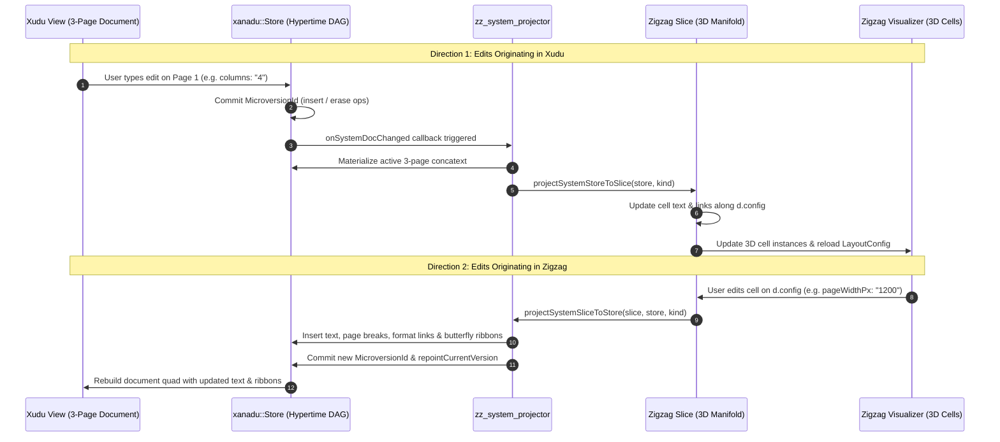

# System Xanadocs for Universal Customization & Metasystem State

## 1. Executive Summary & The Nelsonian Metasystem Principle

In classical computing environments, a rigid boundary separates "documents" (user data) from
"configuration" (application preferences, keybindings, window coordinates, themes). Settings are
relegated to ad-hoc text files (`.yaml`, `.json`, `.toml`), hidden dotfiles (`~/.config/`), or
proprietary system registries. These configuration silos suffer from the exact pathologies Theodor
Holm Nelson diagnosed in conventional computing:

- **No Hypertime History**: A typo or accidental override destroys previous settings. Reverting
  requires manual backups or deleting corrupted files.
- **No Character-Level Provenance**: Settings lack cryptographic authorship, timestamps, or commit
  ancestry.
- **No Universal Intertwingularity / Transclusion**: Sharing a keybinding profile or theme between
  machines or teammates requires out-of-band file copying rather than native transclusion.
- **Artificial Duality**: The artificial split between "data" and "code/preferences" is eliminated
  in Xanadu.

```
       +-------------------------------------------------------------------------+
       |                         User Permascroll (BEP 46)                       |
       +-------------------------------------------------------------------------+
             |                         |                         |
             v                         v                         v
     +---------------+         +---------------+         +---------------+
     |  User Xanadoc |         |  User Xanadoc |         | System Xanadoc|
     |   (Essay A)   |         |   (Notes B)   |         |  (system://)  |
     +---------------+         +---------------+         +---------------+
             |                         |                         |
       [Content Spans]           [Content Spans]         [Metasystem Spans]
             |                         |                         |
             |                         |                         +--> Keymap
             |                         |                         +--> Settings & Fonts
             |                         |                         +--> Notification Origin
             +-------------------------+-------------------------+--> Pouches / Drop Zones
```

In `gleditor` and `xudu`, **anything customizable is a System Xanadoc**. A **System Xanadoc** is an
append-only, content-addressed, microversioned document (`Store`) whose concatext and links encode
metasystem state. Changing a keybinding, resizing UI text, repositioning notification toasts, or
docking a drawer is not an ephemeral mutation of a struct in memory: it is an OSMIC operation
(`OpKind::Insert` / `OpKind::Erase` / `OpKind::Transclude`) producing a new microversion in
hypertime.

______________________________________________________________________

## 2. The Core System Xanadocs & Schemas

`xudu` organizes metasystem state into five canonical System Xanadocs:

```
+-------------------+-------------------------------------------------------------------+
| System Xanadoc    | Functional Purpose & Metasystem State Managed                     |
+-------------------+-------------------------------------------------------------------+
| system://keymap   | Command scancodes, modifier masks, action names, and help text.   |
| system://settings | UI font families, text sizes, document typography, color themes.  |
| system://layout   | Spatial 3D coordinates, notification spawn anchors, drawer docks. |
| system://ui       | Visibility toggles for HUD chips, beams, hypertime DAG, and tabs. |
| system://pouches  | Partitioned drop zones, user labels, colors, and ghost spanables. |
+-------------------+-------------------------------------------------------------------+
```

### 2.1 `system://keymap` (Command & Keyboard Actions)

Traditional keymap tables are statically compiled or read from static JSON. In `xudu`, the keymap is
a live xanadoc.

#### Canonical Format

The concatext is human-readable, standard OSMIC declarative text:

```yaml
# Xudu Sovereign Keymap Specification
quit: Ctrl+Q # save and close
new-doc: Ctrl+N # create new sovereign document bound to permascroll
open-doc: Ctrl+O # spatial document open palette
save: Ctrl+S # save or preserve document
close: Ctrl+W # close active document
forward: Ctrl+Shift+N # step forward in hypertime history
scrub-forward: Ctrl+] # scrub forward along primary timeline
scrub-back: Ctrl+[ # scrub backward along primary timeline
transclude: Ctrl+T # transclude active selection
xanalink: Ctrl+L # mark anchor for xanalink
cancel-link: Ctrl+Shift+L # cancel pending xanalink
beams: Ctrl+K # toggle visual link ribbons and transclusion prisms
sworph: Ctrl+Shift+K # toggle sworphing document transport
publish: Ctrl+Shift+S # seal and publish active version
history: Ctrl+P # dump hypertime history
map: Ctrl+M # toggle hypertime DAG visualizer
radial-menu: Space # trigger 3D marking menu on selection
pouch-drawer: Ctrl+D # toggle spatial pouch drawer
```

#### Dynamic Hot-Reload

- `gleditor::CommandTable` is initialized from `system://keymap`.
- When an edit is made (either through a settings UI form or by editing the `system://keymap`
  document directly), `CommandTable::rebind()` parses the text and updates the event dispatch lookup
  table in $< 1\,\mu\text{s}$.
- Because the bindings are in a Xanadoc, a user who accidentally overrides an essential key can
  simply scrub backward (`Ctrl+[` or historical travel) to restore the previous keymap!

______________________________________________________________________

### 2.2 `system://settings` (Typography, Sizes & Color Themes)

Controls the typographic hierarchy and visual aesthetics across the entire rendering pipeline.

#### Canonical Format

```yaml
# Xudu Typographic & Theme Settings
ui.font.family: Sans
ui.font.size: 11
ui.font.tab_bar: Sans 10
ui.font.map: Sans 11
ui.font.radial_menu: Sans 12
doc.default_font: Sans 12
doc.line_height_multiplier: 1.25
render.theme: obsidian
theme.background: 0x14171DFF
theme.page_background: 0x1E222BFF
theme.text_normal: 0xE6EDF3FF
theme.transclusion_gold: 0xF59E0BFF
theme.link_cyan: 0x06B6D4FF
```

#### Render Thread Synchronization

- When `ui.font.size` or `ui.font.family` changes, `FontManager` resolves new `FontFace` instances
  and updates `DocumentSwitcher`, `FloatingToolbar3D`, `ToastOverlay`, and `HypertimeMap`.
- Text reflow is handled smoothly through `TextLayout` height-budgeted slicing without dropping
  frames.

______________________________________________________________________

### 2.3 `system://layout` (Spatial Geometry & Notification Coordinates)

Defines the physical layout of 3D document cosmos, floating overlays, and notification toasts.

#### Canonical Format

```yaml
# Spatial Coordinates & Toast Overlay Parameters
notifications.anchor: top-right # [top-right, top-left, bottom-right, bottom-left, top-center]
notifications.offset_x: 24.0
notifications.offset_y: 48.0
notifications.max_visible: 5
notifications.lifetime_seconds: 6.0
notifications.fade_duration_seconds: 0.25

document_row.spacing_x: 70.0
document_row.depth_step_z: -45.0
document_row.background_depth_z: -80.0

pouch_drawer.dock: right # [left, right]
pouch_drawer.width: 340.0
pouch_drawer.depth_z: 12.0
```

#### Dynamic Toast Positioning

In `ToastOverlay::draw()`, instead of hardcoded `marginX = 12.0F` and `marginY = 12.0F`, the overlay
queries the active `LayoutConfig` derived from `system://layout`:

- **`top-right`**: $X = \text{screenWidth} - \text{width} - \text{offset}_X$,
  $Y = \text{screenHeight} - \text{offset}_Y - \text{stackHeight}$.
- **`bottom-right`**: $X = \text{screenWidth} - \text{width} - \text{offset}_X$,
  $Y = \text{offset}_Y$.
- **`top-left`**: $X = \text{offset}_X$,
  $Y = \text{screenHeight} - \text{offset}_Y - \text{stackHeight}$.
- **`bottom-left`**: $X = \text{offset}_X$, $Y = \text{offset}_Y$.

______________________________________________________________________

### 2.4 `system://ui` (Viewport Topology & Overlay Flags)

Maintains the user's active interface state and overlay visibility.

#### Canonical Format

```yaml
# Viewport Overlays & State
overlays.switcher_visible: true
overlays.map_visible: false
overlays.beams_visible: true
overlays.sworph_enabled: false
overlays.pouch_drawer_visible: false
overlays.radial_menu_enabled: true
```

______________________________________________________________________

### 2.5 `system://pouches` (Drop Zones & Transclusion Clasps)

As detailed in `design/xudu-pouch-drawer-and-clasp-bench.md`, backs the Pouch Drawer's drop zones:

- Drop zone labels (e.g. `"To Link"`, `"Notes for Later"`, `"Scratch"`).
- User-selected background tints for visual grouping.
- Ghost spanables transcluded into each zone with full Nelsonian character-level provenance.

______________________________________________________________________

## 3. Hypertime Mechanics for Metasystem State

### 3.1 The OSMIC Advantage for Configuration

| Capability            | Classical Config Files (`.json`/`.yaml`) | System Xanadocs (`system://`)                        |
| :-------------------- | :--------------------------------------- | :--------------------------------------------------- |
| **History & Undo**    | None (overwritten in place)              | Full OSMIC DAG (every microversion preserved)        |
| **Branching**         | Manual Git branch of dotfiles            | Native hypertime branching (try experimental keymap) |
| **Recovery**          | Delete file and hope for defaults        | Step backward in hypertime (`session.scrubBackward`) |
| **Multi-Device Sync** | Third-party cloud sync / conflict files  | BitTorrent v2 Merkle piece stability via BEP 46      |
| **Collaboration**     | Complex merge conflicts                  | Zero-copy span transclusions and format links        |
| **Provenance**        | File modification timestamp              | OpenPGP signature + author fingerprint               |

### 3.2 Hypertime Scrubbing of Settings

Because a System Xanadoc is an instance of `xudu::Store`:

```cpp
// Scrub the keymap back 3 revisions to undo an erroneous binding:
auto &keymapStore = session.systemStore(SystemDocKind::Keymap);
auto history = keymapStore.allVersions();
if (history.size() >= 4) {
  auto targetVersion = history[history.size() - 4];
  session.repointSystemDoc(SystemDocKind::Keymap, targetVersion);
}
```

### 3.3 Author-Selectable Current Versions & Head Repointing

In classical version control (like Git), "HEAD" is a single pointer, while branches are named refs.
In classical Xudu, `Store::latest()` fell back to the chronological tip with the greatest
MicroversionId. However, an author often maintains **multiple parallel states considered current**
(e.g. English Edition and French Edition, or Draft vs. Published Edition).

To reflect authentic Xanadulogical reality:

1. **Author-Selectable Set of Current Versions (`currentVersions`)**:

   - Every `xudu::Store` maintains an explicit, author-designated set of microversions considered
     active or current:

     $$
     \text{currentVersions} = \{v_1, v_2, \dots, v_k\} \subseteq \text{allVersions}
     $$

   - When a xanadoc is opened without specifying an exact microversion, all members of
     `currentVersions` are opened side-by-side as parallel active views.

   - Persisted in the `current` section of the store's side-table container, `store.tables`, beside
     the scroll registry and the link table. It was a `current.yaml` of its own until migration step
     13 of [`store-slice-convergence.md`](store-slice-convergence.md); the shape below is what that
     section encodes, not a file that still exists:

     ```yaml
     # Current active versions designated by the author
     current:
       - "1.4"
       - "1.2.1"
     ```

1. **System Xanadocs Constraint ($N = 1$ Active Head)**:

   - For all System Xanadocs (`system://keymap`, `system://settings`, `system://layout`,
     `system://ui`), the set of current versions is strictly constrained to **exactly one version**:

     $$
     |\text{currentVersions}| = 1
     $$

   - This single current version represents the **active live configuration** evaluated by the
     engine.

1. **Arbitrary Hypertime Repointing**:

   - The author can repoint a System Xanadoc's current version to **any past or alternate
     microversion in its history** at will:

     ```cpp
     store.repointCurrentVersion(targetMicroversion);
     ```

   - **Non-Destructive Time Travel**: Repointing changes the active head pointer without erasing
     downstream operations. If an author scrubs their keybindings back to state `1.1` to test a
     legacy profile, operations `1.2`, `1.3`, and branches `1.1.1` remain fully preserved in the
     operations spool. The author can repoint forward or branch into a new configuration at any
     time.

   - **Live Subsystem Notification**: When `repointCurrentVersion` is called on a system store, it
     triggers the registered `onCurrentVersionChanged` observer, instantly recompiling keybindings,
     recalculating toast layout vectors, or updating UI font descriptions without restarting the
     process.

### 3.4 First-Class Introspection: Opening & Editing System Xanadocs Live

While System Xanadocs operate headlessly behind the scenes by default to power the UI, they are
**fully openable, inspectable, and editable as standard xanadocs**. In Nelsonian architecture, there
are no black boxes.

1. **Zero Special-Cased Dialogs**:

   - Instead of sequestering configuration behind rigid graphical preference panes, an author can
     open any system xanadoc (e.g. `system://keymap`, `system://settings`, `system://layout`)
     directly into the document row via `Ctrl+O` or command line.
   - The document renders as a normal 3D quad at $Z = 0$, titled with its canonical URI (e.g.
     `⚙ system://keymap`).

1. **Interactive Live Typing & Hot Reload**:

   - The user can click anywhere in the system document and edit its text using standard caret
     movements, deletions, typing, and transclusions.
   - Every keystroke appends to the author's `UserPermascroll` and records an operation in the
     system store.
   - Because it is a System Xanadoc, the current version automatically advances with each edit
     ($|currentVersions| = 1$), and the engine hot-reloads the updated concatext immediately:
     - Changing `quit: Ctrl+Q` to `quit: Ctrl+X` in `system://keymap` dynamically updates
       `CommandTable` live while typing.
     - Tweaking `ui.font.size: 11` to `14` in `system://settings` instantly updates font faces
       across the interface.
     - Moving `notifications.offset_x` in `system://layout` shifts toast placement in real time.

1. **Hypertime Scrubbing as Live Config Time Travel**:

   - When viewing an open System Xanadoc, pressing `Ctrl+[` (`scrub-back`) or dragging the hypertime
     scrubber steps the document through past configurations.
   - Because the system xanadoc's active head is linked to its current view, stepping backward
     immediately repoints the active configuration to that historical state.
   - Stepping forward (`Ctrl+]`) returns to newer configurations without data loss.

### 3.5 Version Annotations Mapping: Aliases, Descriptions & Semantic Tags

Raw numerical microversion identifiers (e.g. `1`, `1.4`, `1.2.1`) are precise for content addressing
and DAG reconstruction, but human cognition requires semantic tags, descriptions, and aliases. All
xanadocs support an explicit version mapping, kept in the `versions` section of `store.tables`. It
was a `versions.yaml` until migration step 13; the YAML below describes the fields that section
carries rather than a file on disk, and `xudu-dump --section=versions` is what renders them:

```yaml
# Xudu Microversion Annotations & Aliases
version: "1.0"
alias: "genesis"
description: "Initial author seeding from permascroll"
tag: "milestone"

version: "1.4"
alias: "release-1.0"
description: "Final published edition with complete quotations"
tag: "release"

version: "1.3.1"
alias: "vim-keys"
description: "Vim modal editing profile transcluded from community scroll"
tag: "keymap-preset"
```

1. **Human-Readable Alias Resolution**:
   - Calling `store.resolveAlias("release-1.0")` returns `MicroversionId{"1.4"}` in $O(1)$.
   - Commands, CLI arguments (e.g. `--at vim-keys`), and UI open palettes can reference versions by
     alias instead of raw microversion numbers.
1. **Context-Rich Spatial Open Palette (`Ctrl+O`)**:
   - The palette displays discovered stores with their active alias and description:
     `"Xudu Keymap [vim-keys] - Vim modal navigation profile (12 versions, 1.8 KB)"`
     `"Project Alpha [release-1.0] - Official publication edition (42 versions, 15.6 KB)"`
1. **Tab Bar & Document Titles**:
   - When an open version carries an alias, `DocumentSwitcher` renders the human-readable alias
     (e.g. `Doc 1: release-1.0` or `⚙ system://keymap [vim-keys]`).
1. **Hypertime Map Nodes**:
   - Nodes in `HypertimeMap` and the Stage 3 branching DAG display their alias chips directly on the
     visualization canvas, and hover tooltips render the full description string.

______________________________________________________________________

## 4. Swarm Distribution & Transclusion of Presets

### 4.1 Sharing Keymaps & Presets as First-Class Scrolls

A user or community member can publish a specialized keymap or UI theme as a standard sealed
xanadoc:

- Example: Alice publishes `vim_bindings.xanadoc` (salt: `vim-keys`).

- Bob wants Vim bindings in `xudu`. In Bob's `system://keymap`, rather than copying and pasting
  text, Bob **transcludes** the keymap from Alice's scroll:

  ```math
  \text{transclude}(\text{dest}=\text{Bob's } system://keymap, \text{src}=\text{Alice's } vim\text{-keys})
  ```

- If Alice publishes an improvement to `vim-keys`, Bob's `xudu` automatically receives the update
  via BitTorrent swarm!

- If Bob wants to override a single key (e.g. keep `Ctrl+Q` for quit instead of `:q`), Bob inserts
  an override op into his local `system://keymap` branch. The transcluded base remains intact while
  Bob's local customization sits cleanly atop it.

______________________________________________________________________

## 5. C++23 Architecture & Class Structure

### 5.1 `SystemDocKind` & `SystemDocRegistry`

In `apps/xudu/session.hpp`:

```cpp
namespace xudu {

enum class SystemDocKind : std::uint8_t {
  Keymap,
  Settings,
  Layout,
  UI,
  Pouches,
  Count
};

constexpr std::string_view systemDocUri(SystemDocKind kind) {
  switch (kind) {
  case SystemDocKind::Keymap:   return "system://keymap";
  case SystemDocKind::Settings: return "system://settings";
  case SystemDocKind::Layout:   return "system://layout";
  case SystemDocKind::UI:       return "system://ui";
  case SystemDocKind::Pouches:  return "system://pouches";
  default:                      return "system://unknown";
  }
}

} // namespace xudu
```

### 5.2 Storage & Memory Model

- System Xanadocs reside on disk in `$XDG_DATA_HOME/xudu/system/<name>.xanadoc/` (e.g.
  `~/.local/share/xudu/system/keymap.xanadoc/`).
- If no system store exists on disk, `Session` automatically initializes one using the author's
  `UserPermascroll` and writes default canonical primedia and initial ops.
- System stores are loaded into `Session::stores` with `isSystem = true` so they do not appear in
  the normal document row unless explicitly inspected in a "Settings View".
- Access to active settings is cached in lightweight memory structures (`ParsedKeymap`,
  `LayoutConfig`, `ThemeConfig`) updated on every system store epoch change.

### 5.3 `Store` Current Versions & Version Annotations API

In `apps/xudu/core/store.hpp`:

```cpp
struct VersionAnnotation {
  std::string alias;
  std::string description;
  std::string tag;
  std::string timestamp;
};

class Store : public SpanReader {
public:
  // -- Current Versions (Author-Designated Heads) --------------------------
  [[nodiscard]] const std::vector<MicroversionId> &currentVersions() const;
  [[nodiscard]] MicroversionId primaryCurrentVersion() const;
  void setCurrentVersions(std::vector<MicroversionId> versions);
  void repointCurrentVersion(const MicroversionId &version);
  void addCurrentVersion(const MicroversionId &version);
  void removeCurrentVersion(const MicroversionId &version);

  // -- Version Annotations & Aliases --------------------------------------
  void setVersionAnnotation(const MicroversionId &id, VersionAnnotation annotation);
  [[nodiscard]] std::optional<VersionAnnotation> versionAnnotation(const MicroversionId &id) const;
  [[nodiscard]] std::optional<MicroversionId> resolveAlias(std::string_view alias) const;
  [[nodiscard]] std::string displayName(const MicroversionId &id) const;
  [[nodiscard]] const std::map<MicroversionId, VersionAnnotation> &allVersionAnnotations() const;

private:
  std::vector<MicroversionId> currentVersions_;
  std::map<MicroversionId, VersionAnnotation> versionAnnotations_;
  std::map<std::string, MicroversionId> aliasIndex_;
};
```

- When `store.save(directory)` executes, it writes both as sections of `store.tables`, in the same
  call that writes the scrolls and the links — so a store cannot be half-written with its operations
  saved and its heads lost.
- When `store.load(directory)` executes, it reads them back from that container. If empty or
  unwritten, it falls back to `{latest()}` and empty annotations. A directory still holding a
  `current.yaml` or `versions.yaml` is refused by name rather than read.
- For system stores, `repointCurrentVersion` validates that $|currentVersions| = 1$ and notifies
  `Session` of the active configuration change.
- A system xanadoc this build cannot read is moved aside and regenerated rather than refused —
  `Session::systemStoreIndex()` catches every typed refusal a store shape can raise, because the
  program writes these for itself and would otherwise refuse to start over its own scaffolding. A
  document the *user* named is never treated that way.

### 5.4 120 FPS Performance Envelope ($8.33\,\text{ms}$)

- Reading active layout offsets or keybindings during a frame is an $O(1)$ memory lookup.
- Metasystem ops are only parsed when a system store is edited, costing $< 50\,\mu\text{s}$.
- Zero allocations occur on the render thread during frame submission.

______________________________________________________________________

## 6. The Xudu ⟷ Zigzag Bridge Architecture

### 6.1 Philosophical Motivation: Multidimensional Configuration vs. 1D Flat Streams

In conventional software architectures, configuration is serialized into 1D flat text streams
(`.yaml`, `.json`, `.toml`). This design suffers from an artificial dimensional compression:

- **Collapsed Dimensions**: Runtime parameters, schema definitions, validation bounds, hardware
  calibration notes, and category groupings are forced into a single linear text buffer.
- **Syntactic Clutter**: Documentation and metadata are squeezed into comment tokens (`#`) or
  external schemas (`$schema` URLs) that are stripped at runtime and invisible to the data model.
- **Fragile Serialization**: Automated tools that rewrite configuration files routinely strip user
  comments, destroy manual formatting, or lose version history.

Project Xanadu resolves this through **Zigzag multidimensional information spaces**. A system
configuration item is not merely a key and a value: it is a multidimensional cell situated at the
intersection of orthogonal informational axes:

- **`d.config` (Configuration Rank)**: The active runtime parameter sequence evaluated by the
  engine.
- **`d.schema` (Schema Rank)**: The formal specification, unit definitions, valid ranges, and
  purpose.
- **`d.notes` (Notes Rank)**: The author's hardware calibration logs, tuning notes, and display
  rationales.
- **`d.group` (Category Rank)**: Hierarchical subsystem grouping (e.g. `layout`, `settings`).
- **`d.value` (Value Rank)**: Discrete selectable states or candidate presets.

```
                         ▲ +d.schema (Field Definition & Units)
                         │
                         │
-d.config (Prev Setting) ──[Setting Cell]── +d.config (Next Setting)
                         │
                         │
                         ▼ -d.notes (Author Calibration & Display Notes)
```

In `gleditor`, **the Zigzag multidimensional slice is the canonical spatial ground truth, while the
3-page sovereign System Xanadoc is its linearized, editable document projection.**

______________________________________________________________________

### 6.2 The 3-Page System Xanadoc Invariant (Zero Markdown Governance)

When a multidimensional slice is projected into Xudu's document model (`xudu::Store`), it must
strictly adhere to **Nelsonian System Document Governance**:

1. **Strict 3-Page Layout ($N = 3$)**: The concatext is partitioned into exactly three distinct
   pages separated by two forced `PageBreak` operations:

   - **Page 1: Active Configuration**: Pure declarative key-value text lines (e.g., `columns: "2"`,
     `pageWidthPx: "800"`). Strictly zero markdown headers, zero intro comments. This is the concise
     runtime payload parsed by configuration loaders.
   - **Page 2: Schema and Purpose**: Complete specification of parameter behavior, valid bounds, and
     system semantics.
   - **Page 3: Notes & Calibration**: User annotations, display calibration records, and
     screen-specific tuning logs.

1. **Strictly Zero Markdown Syntax**: Nelsonian architecture strictly rejects embedding markup
   tokens (`#`, `##`, `**bold**`, `*italic*`) into the concatext. Text in permascroll storage is
   clean, raw primedia.

   - **Format Links**: Section headers ("Schema and Purpose" on Page 2, "Notes" on Page 3) are
     styled exclusively through **authentic Xanadulogical Format Links**
     (`xanadu::LinkType::Format`, `xanadu::ProminenceTier::Author`, owner `"system"`).
   - **Target Vocabulary Spans**: The format links target standard vocabulary spans in the system
     vocabulary store:
     - `xanadu::FormatAttribute::Bold`: Renders header text with bold font weighting.
     - `xanadu::FormatAttribute::AlignCentre`: Centered horizontal alignment on the rendered page
       quad.

1. **Cross-Page Butterfly Comment Ribbons**: To preserve character-level intertwingularity, active
   setting spans on Page 1 are connected to their corresponding schema descriptions on Page 2 and
   user notes on Page 3 via `xanadu::LinkType::Comment` xanalinks (`ProminenceTier::Author`, owner
   `"system"`):

   ```math
   \text{Link}_{\text{schema}}: \text{Page 1 Setting Span} \longleftrightarrow \text{Page 2 Schema Span}
   ```

   ```math
   \text{Link}_{\text{notes}}: \text{Page 1 Setting Span} \longleftrightarrow \text{Page 3 Notes Span}
   ```

   In Xudu's 3D document row, these links render as sweeping optical link ribbons ("butterfly
   wings") connecting the parallel page quads.

```
       +-----------------------+     +-----------------------+     +-----------------------+
       |   Page 1: Config      |     |   Page 2: Schema      |     |   Page 3: Notes       |
       +-----------------------+     +-----------------------+     +-----------------------+
       | columns: "2"    [S1]--+-----+--> Schema: columns    |     |                       |
       |                       |  |  +-----------------------+     |                       |
       | pageWidthPx: 800 [S2]-+--+--------------------------------+--> Notes: Calibration |
       +-----------------------+  |                                +-----------------------+
                   |              | (Butterfly Comment Ribbons)                |
                   +--------------+--------------------------------------------+
```

______________________________________________________________________

### 6.3 Dimensional Rank Demuxing (`d.config`, `d.schema`, `d.notes`)

The bridge demuxes between the multidimensional cell graph and the 3-page linear document:

```
                      +-----------------------------+
                      |   ZzStructureDocument       |
                      |   (Canonical Zigzag Slice)  |
                      +-----------------------------+
                                     |
           +-------------------------+-------------------------+
           |                         |                         |
           v                         v                         v
     d.config Rank             d.schema Rank             d.notes Rank
           |                         |                         |
           v                         v                         v
  extractSliceConfigText    extractSliceSchemaText    extractSliceNotesText
           |                         |                         |
           v                         v                         v
     Page 1 Concatext          Page 2 Concatext          Page 3 Concatext
           |                         |                         |
           +-------------------------+-------------------------+
                                     |
                                     v
                       +---------------------------+
                       |    xudu::Store (3-Page)   |
                       |  + Format Links (Headers) |
                       |  + Butterfly Links        |
                       +---------------------------+
```

1. **`extractSliceConfigText(slice)`**:

   - Walks the `d.config` rank from the root cell (`config_group` or cell with no incoming negative
     links).
   - Extracts all cells with `type == "setting"` or containing key-value pairs (`:`).
   - Produces clean, newline-delimited configuration text for Page 1.

1. **`extractSliceSchemaText(slice)`**:

   - Traverses the `d.schema` rank, beginning with the `schema_doc` header cell ("Schema and
     Purpose").
   - Gathers all linked `schema_field` cells specifying individual parameter definitions.
   - Formats the content for Page 2 with clean paragraph separation.

1. **`extractSliceNotesText(slice)`**:

   - Traverses the `d.notes` rank, starting at `user_notes` ("Notes").
   - Follows note cells documenting calibration history and user rationales.
   - Formats the content for Page 3.

______________________________________________________________________

### 6.4 Bidirectional Projection Mechanics

The bridge provides two inverse mapping transformations in `zigzag::`
([`apps/common/xanadu/zigzag/zz_system_projector.hpp`](apps/common/xanadu/zigzag/zz_system_projector.hpp)):

```cpp
namespace zigzag {

/// Forward Projection: Zigzag Slice -> Sovereign 3-Page Store
xanadu::MicroversionId
projectSystemSliceToStore(const ZzStructureDocument &slice,
                          xanadu::Store &store,
                          xanadu::SystemDocKind kind);

/// Reverse Projection: Sovereign 3-Page Store -> Zigzag Slice
[[nodiscard]] ZzStructureDocument
projectSystemStoreToSlice(const xanadu::Store &store,
                          xanadu::SystemDocKind kind);

} // namespace zigzag
```

#### 6.4.1 Forward Projection (`projectSystemSliceToStore`)

1. Extracts Page 1, Page 2, and Page 3 text from the respective slice ranks (falling back to
   canonical defaults if empty).

1. Performs atomic edit operations on `Store`:

   - `store.insert(cur, 0, p1)`
   - `store.insertBreak(cur, p1Size)` (Page 1 $\to$ Page 2 boundary)
   - `store.insert(cur, p1Size, p2)`
   - `store.insertBreak(cur, p12Size)` (Page 2 $\to$ Page 3 boundary)
   - `store.insert(cur, p12Size, p3)`

1. Rebuilds the document snapshot (`store.rebuild(cur)`) to resolve exact primedia character spans.

1. Synthesizes `LinkType::Format` links:

   - "Schema and Purpose" header: bound to `FormatAttribute::Bold` and
     `FormatAttribute::AlignCentre`.
   - "Notes" header: bound to `FormatAttribute::Bold` and `FormatAttribute::AlignCentre`.

1. Synthesizes `LinkType::Comment` butterfly ribbons linking Page 1 config spans to Page 2 schema
   spans and Page 3 notes spans.

1. Commits the microversion, records version annotations (`alias = "default"`, `tag = "system"`),
   and advances the single active head pointer:

   ```cpp
   store.repointCurrentVersion(cur);
   ```

#### 6.4.2 Reverse Projection (`projectSystemStoreToSlice`)

1. Retrieves the active current version from `Store::currentVersions()` and materializes the
   document concatext.
1. Demuxes the concatext into Page 1 (`xanadu::extractConfigSection`), Page 2, and Page 3 by
   locating forced page break offsets and section boundaries.
1. Initializes a new `ZzStructureDocument` with standard metadata:
   - Sets focus cell to root (`focus = 1`).
   - Configures default 3D camera projection: $X = \text{d.config}$, $Y = \text{d.schema}$,
     $Z = \text{d.notes}$.
   - Defines dimension color styling (Config: `#4f9de0`, Schema: `#f5a623`, Notes: `#9b51e0`).
1. Builds the orthogonal cell graph:
   - Creates root `config_group` cell (`id = 1`).
   - Parses Page 1 line by line, generating sequential `setting` cells chained along `+d.config`.
   - Emits `schema_doc` cell (`id = 100`) linked from root along `+d.schema`.
   - Emits `user_notes` cell (`id = 200`) linked from root along `+d.notes`.

______________________________________________________________________

### 6.5 Live Bidirectional Edit Propagation (Active Lens Dynamics)

A critical architectural invariant is that **the Xanadoc projection is NOT read-only**. It is an
active, fully editable bidirectional lens. Edits originating in either Xudu's 3-page document view
or Zigzag's 3D hyper-grid propagate across the bridge without divergence or data loss.



#### Direction 1: Xanadoc Edit $\longrightarrow$ Zigzag Slice

1. **Author Typing in Xudu**: The user opens `system://layout` in Xudu and edits line 1, changing
   `columns: "2"` to `columns: "4"`, or appends a note to Page 3 (`"Notes: Tuned on 4K display"`).
1. **Microversion Commit**: The edit commits new insert/erase operations to the local
   `UserPermascroll` and records a new `MicroversionId` in `Store`.
1. **Subsystem Notification**: `Session::setSystemDocChangedCallback` triggers
   `projectSystemStoreToSlice(store, kind)`.
1. **Slice Update**: The bridge demuxes the pages and updates the `setting` cells on `d.config` and
   `user_notes` on `d.notes` in place, preserving manifold link consistency.
1. **Runtime Hot Reload**: Subsystems ingest the updated slice via `LayoutConfig::fromSlice(slice)`,
   updating window column layout in $< 1\,\text{ms}$.

#### Direction 2: Zigzag Slice Edit $\longrightarrow$ Xanadoc Store

1. **Cell Editing in Zigzag**: The user navigates the 3D cell space in `apps/zigzag`, selects a cell
   on `d.config`, and edits its value (e.g. `pageWidthPx: "1200"`).
1. **Projection to Store**: The visualizer invokes `projectSystemSliceToStore(slice, store, kind)`.
1. **Full Governance Enforcement**: The projector serializes the updated ranks into the 3-page
   layout, generates format links for headers, recreates butterfly comment ribbons, and commits a
   new `MicroversionId`.
1. **Active Head Advance**: `store.repointCurrentVersion(newVer)` notifies Xudu.
1. **Visualizer Synchronization**: Xudu's document quad reflows immediately to display the updated
   text, bold headers, and optical link ribbons.

#### Roundtrip Convergence & Mathematical Stability

The roundtrip transformation is idempotent and convergent:

$$
\text{Store}_{t+1} = \text{projectSliceToStore}(\text{projectStoreToSlice}(\text{Store}_t))
$$

Because rank demuxing isolates Page 1 (configuration) from Page 2 (schema) and Page 3 (notes),
editing an active parameter never alters schema text, and adding a user note never disturbs runtime
configuration keys.

______________________________________________________________________

### 6.6 Dual-Stack Configuration Loaders & Verification

To ensure zero downtime during the transition from legacy YAML files to sovereign Zigzag slices, all
configuration structures in `apps/common/xanadu/system_docs.hpp` implement dual-stack constructors:

```cpp
namespace xanadu {

struct LayoutConfig {
  std::uint32_t columns{2};
  float pageWidthPx{800.0F};
  float pageHeightPx{1000.0F};
  ToastAnchor toastAnchor{ToastAnchor::TopRight};
  float toastOffsetX{24.0F};
  float toastOffsetY{48.0F};
  PouchDock pouchDock{PouchDock::Right};
  float documentSpacingX{70.0F};
  bool transclusionPrisms{true};
  bool xanalinkRibbons{true};

  /// Legacy loader: parses flat YAML text stream
  [[nodiscard]] static LayoutConfig fromYaml(std::string_view yamlText);

  /// Modern loader: parses multidimensional Zigzag slice
  [[nodiscard]] static LayoutConfig fromSlice(const zigzag::ZzStructureDocument &slice);
};

// SettingsConfig, KeymapConfig, and UIConfig implement identical dual-stack methods
} // namespace xanadu
```

`LayoutConfig::fromSlice(slice)` extracts the `d.config` rank directly from the slice and parses
key-value pairs. As validated in unit tests, both loaders produce identical runtime configuration
structs:

```math
\text{LayoutConfig::fromSlice}(\text{slice}) \equiv \text{LayoutConfig::fromYaml}(\text{defaultYaml})
```

______________________________________________________________________

### 6.7 Implementation & Test Reference Map

| Component                     | Source Path                                                                                              | Key Responsibilities                                                                             |
| :---------------------------- | :------------------------------------------------------------------------------------------------------- | :----------------------------------------------------------------------------------------------- |
| **System Projector Header**   | [`apps/common/xanadu/zigzag/zz_system_projector.hpp`](apps/common/xanadu/zigzag/zz_system_projector.hpp) | Dimensional constants (`kDimConfig`, `kDimSchema`, `kDimNotes`), projection declarations         |
| **System Projector Impl**     | [`apps/common/xanadu/zigzag/zz_system_projector.cpp`](apps/common/xanadu/zigzag/zz_system_projector.cpp) | Rank extraction, 3-page EDL construction, format link binding, butterfly comment synthesis       |
| **Dual-Stack Config Loaders** | [`apps/common/xanadu/system_docs.hpp/.cpp`](apps/common/xanadu/system_docs.hpp)                          | `LayoutConfig`, `SettingsConfig`, `KeymapConfig`, `UIConfig` dual `fromYaml`/`fromSlice` loaders |
| **Canonical Layout Slice**    | [`assets/zigzag/system_layout_slice.yaml`](assets/zigzag/system_layout_slice.yaml)                       | Canonical 3D Zigzag slice specification for `system://layout`                                    |
| **Comprehensive Tests**       | [`tests/zigzag/test_system_projector.cpp`](tests/zigzag/test_system_projector.cpp)                       | Manifold validation, zero-markdown verification, format links, bidirectional edit propagation    |

______________________________________________________________________

## 7. Integration Roadmap & Stage Alignment

The System Xanadoc paradigm seamlessly weaves through all stages of the system overhaul:

1. **Stage 1: DRY Consolidation & Spatial Foundation** *(Completed)*:
   - Consolidated YAML parsing helpers (`apps/common/yaml_helpers.hpp`).
   - Spatial quadratic Bezier evaluation template (`gleditor::spatial::evaluateQuadraticBezier`).
   - Unified hex color parsing in `gleditor::color`.
1. **Stage 2: Buffer Abstraction & Layer Promotion** *(Completed)*:
   - Introduced persistent mapped streaming buffer interface (`render::IStreamBuffer`).
   - Promoted Zigzag core structures and manifolds to `apps/common/xanadu/zigzag/`.
   - Decoupled `UnifiedTransclusionEngine` from backend-specific OpenGL buffers.
1. **Stage 3: Multidimensional System Slices & Bidirectional Bridge** *(Completed)*:
   - Created `zz_system_projector.hpp/.cpp` for bidirectional projection between 3-page stores and
     Zigzag slices.
   - Authored canonical `assets/zigzag/system_layout_slice.yaml`.
   - Added dual-stack loaders (`fromSlice` and `fromYaml`) across `LayoutConfig`, `SettingsConfig`,
     `KeymapConfig`, `UIConfig`.
   - Verified bidirectional live edit propagation in `test_system_projector.cpp`.
1. **Stage 4: Pouch Drawer & Clasp Bench**:
   - Directly backed by `system://pouches` and multidimensional drop-zone slices.
1. **Stage 5-7: Transclusion, Break Controls & Swarm Telescope**:
   - Transcluding community keymap and theme scrolls across the DHT swarm.
