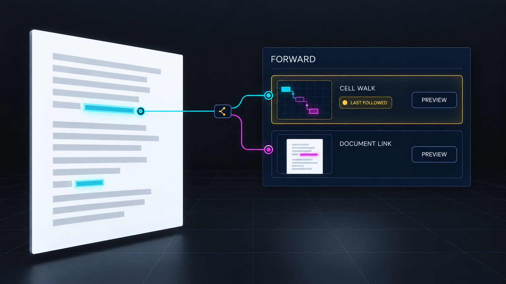
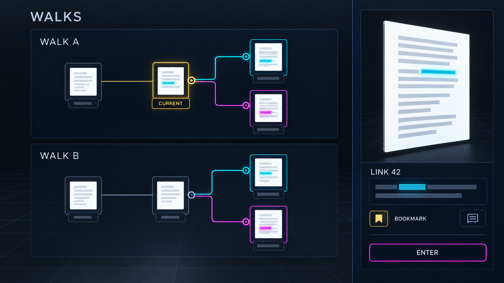
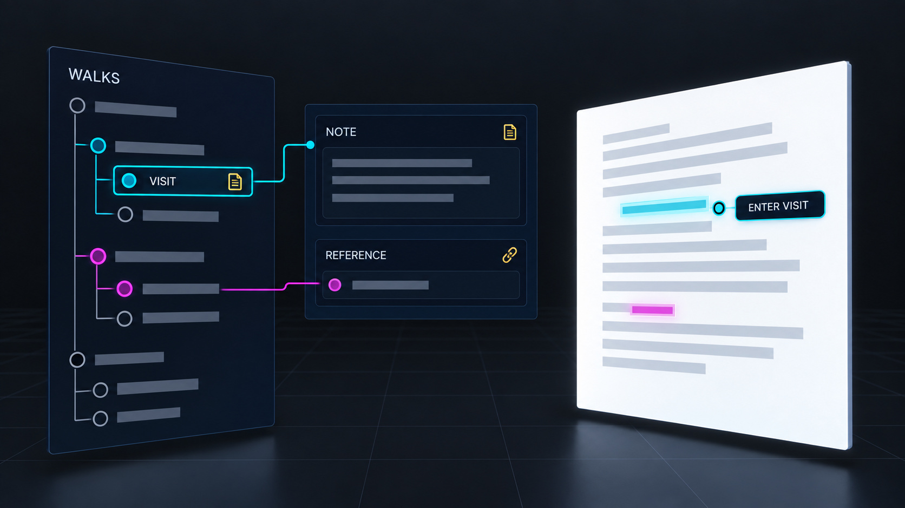

# Prototype: Activity Walks and Branch Previews

**Status:** Proposed persistent reader activity interface.\
**Depends on:** [navigation vision](../../xuzz-unified-link-traversal-vision.md) and a reader-owned
`system://activity` Store.

## Interaction mock-ups

*Forward at a fork: both futures remain selectable; the last followed route is only a hint.*

*Explore Walks: visits form persistent branching routes, with a preview beside the selected node.*

*Annotate: add context to a saved visit without creating another navigation step.*

## Reader walkthrough

1. A reader enters a cell through a link, walks one rank, then returns with **Activity Back** to the
   earlier visit. **Activity Forward** now offers the cell route with its destination, link type,
   saved side/member, and a short preview. Restoring that visit does not add a second visit.
1. From the earlier visit, the reader enters a different document endpoint. Forward now offers both
   futures. The last followed child is highlighted as a hint; neither sibling disappears. A compact
   branch preview answers “where would this take me?” without moving focus.
1. **Walks** opens the wider tree: roots for independent walks, forks, named walks, bookmarks,
   references, and notes. The reader previews an old visit, reads its saved link context, and
   annotates it. **Enter saved visit** restores its focus and companion view. After restart, the
   same branches and annotations are still present, including a visit whose target is temporarily
   unavailable. That visit remains explorable and annotatable even before its content resolves.

## Technical explanation

The reader-owned activity Store appends Structure operations for stable visit cells, walk roots,
parent/ordered-child topology, references, and annotations. One visit records a durable target
(store authority, document or cell identity, `MicroversionId`, exact range), arrival action, source
visit, selected link authority and ID when relevant, side/member/occurrence cursors, and useful view
context. A second arrival at the same content has a distinct visit ID because its path differs. Use
first-child/sibling ranks or explicit branch cells for fanout; a ZigZag Structure link has one
neighbor per direction. Notes' text lives in the reader's permascroll, while the activity Store
carries addresses. Activity Back/Forward and restoring a saved visit select existing visit IDs; only
a new completed semantic transition adds a child. Hover, scroll, camera frames, and pending or
failed entry add none. A checkpoint may update view context without pretending it was another step.

The activity Store's operation DAG records changes to the record, including a note attached to an
old visit. The visit tree records routes.
[`Chronofilade`](../../../apps/common/xanadu/enfilade/chronofilade.hpp) indexes operation parents
and document EDL replay, so its LCA is not the LCA of two visits. Derive a rebuildable walk index
from the Manifold for roots, children, target-span lookups, and visit-parent ancestor jumps/LCA. Its
binary lifting may borrow Chronofilade's technique while following visit parents. Keep activity
`MicroversionId`s and stable visit IDs distinct. The index is disposable; the Store is
authoritative. An unreadable activity Store is preserved and reported, never replaced with defaults
via [`Session::systemStoreIndex()`](../../../apps/xudu/session.cpp).

The branch preview is a projection of the target visit plus a bounded destination snippet. It
reveals the target identity and unavailable state without silently opening another version or moving
the caret. `system://keymap` binds Activity Back, Activity Forward, Walks, Preview visit, Enter
saved visit, Reference, and Annotate separately from xudu's document-version Back/Forward.
Accessibility exposes roots, parent/child/fork labels, last-followed hint, notes, and Enter actions
as a tree/list; no route depends on 3D geometry.

## Prototype proof

Create two children from one visit, annotate one after following the other, and verify the note does
not create a navigation child. Save, reload, traverse Back and both Forward choices, and restore
each exact link context. A failed or unavailable target remains in Walks and adds no new visit.
Verify target-span lookup can find both visits to repeated content while their paths stay distinct.
Compare pointer, keymap, and accessible tree selection; test that operation-history LCA and
visit-history LCA are never conflated.
