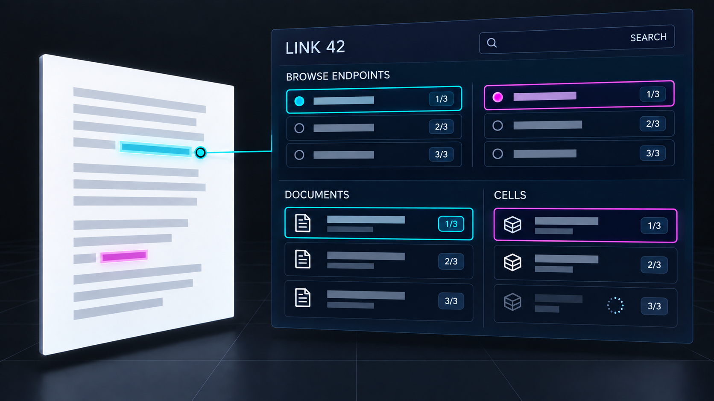
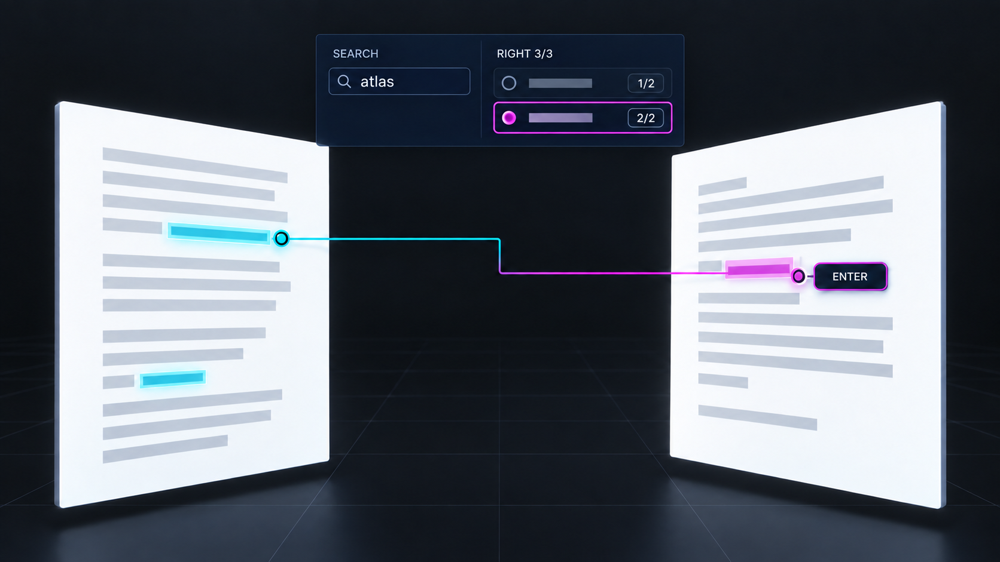

# Prototype: Endpoint Search and Grouping

**Status:** Proposed large-endset navigation surface.\
**Depends on:** [selected link context](link-context.md) and its exact occurrence query.

## Interaction mock-ups

*Browse: group large endsets by manifestation while keeping stored member positions visible.*

*Filter: the reader previews occurrence 2 of 2, then may Enter that exact range.*

## Reader walkthrough

1. A reader opens a link with dozens of left members and hundreds of right manifestations. The
   compact context keeps `Left i/N` and `Right j/M`, while **Browse endpoints** opens grouped rows
   by document/version and cell neighborhood. Stored member numbers remain visible inside groups.
1. The reader searches for a passage label, owner, document title, version, or cell name. The list
   narrows without reordering the underlying endset. A row still says which stored member and exact
   occurrence it represents. Clearing the search returns to the full stored order and the reader's
   prior left and right selections.
1. Selecting a row previews its span. If the same primedia appears twice in the chosen version, both
   occurrences are offered. **Enter endpoint** focuses only the explicitly chosen occurrence. An
   unavailable remote manifestation remains in the filtered list with its address and status.

## Technical explanation

Separate `LinkMember` from `Occurrence`. A member is
`(link authority, link ID, side, stored index, PrimediaSpan)`; an occurrence adds store authority,
version, document or cell identity, exact range, and resolution status. Search runs over display
metadata and previews, while exact target matching uses primedia addresses. A group is a
presentation projection: it never rewrites endset order, changes the current member, or collapses
two repeated occurrences into one target.

Build a cached occurrence index for the selected link and visible context, updating it when store
versions or cell neighborhoods change. The existing
[`Spanfilade`](../../../apps/common/xanadu/enfilade/spanfilade.hpp) supports sublinear overlap
queries across indexed open views; historical and remote candidates require separate incremental
resolution. Expose counts as known, loading, or unavailable rather than reporting an incomplete
count as final. Apply search and grouping to a bounded result window so large endsets do not force
left×right ribbon enumeration or synchronous page building. Preserve a stable row identity while
asynchronous results arrive; invalidate results from an older link revision or dismissed session.

The UI calls the shared Select member/occurrence and Enter commands. Search, group expansion, and
row preview append no activity visit. Pointer, keymap, and accessibility use the same stable member
number and occurrence label; grouping depth is expressed in headings as well as visually.

## Prototype proof

Generate a link with many discontinuous members, repeated quotations across versions, one cell
outside the visible radius, and one unavailable remote target. Search by title and version, switch
groups, clear the query, and verify original order and both side selections survive. Enter a
specific repeated occurrence and verify its exact range, one activity visit, and a cancellable
pending state for the distant target. Measure indexing and visible-row work as endset size grows.
