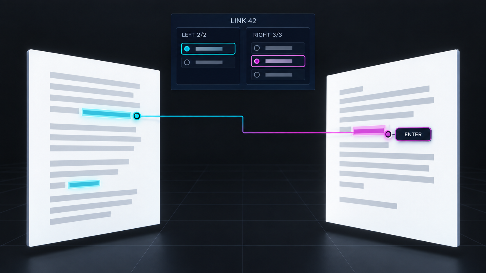
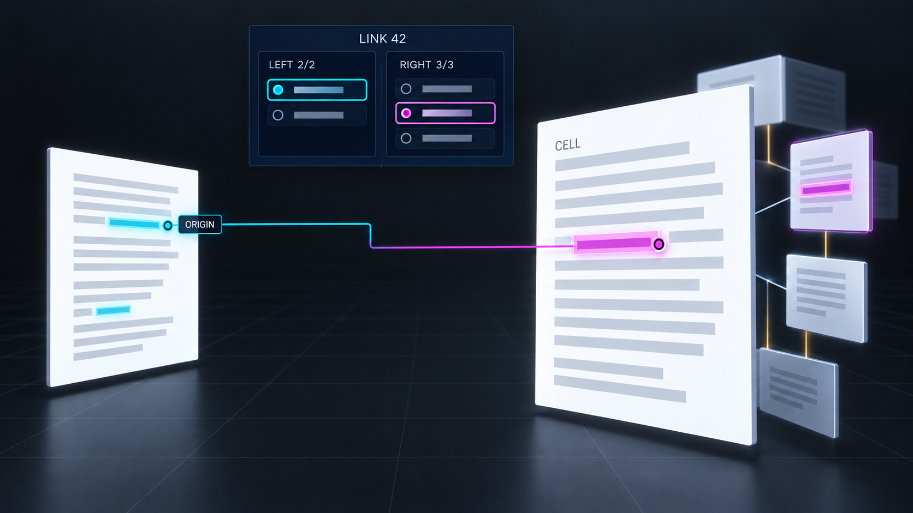

# Prototype: Selected Link Context

**Status:** Proposed foundation for the other Xuzz navigation prototypes.\
**Depends on:** [navigation workflow](../../ui_workflow_xuzz_navigation.md).

## Interaction mock-ups

*Select: link 42 stays whole, with two independent endset cursors and an explicit Enter target.*

*Enter: exact cell content takes focus; the source and both endsets remain available.*

## Reader walkthrough

1. A reader selects a marked passage, cell content range, margin bracket, or beam. A compact panel
   appears beside the current view: `Comment · link 42 · owner`, `Left 2/2`, `Right —/3`, and an
   origin marker. Selecting the beam body alone pins link 42 but asks the reader which member they
   meant. No caret or reading focus moves.
1. The reader steps from left member 2 to member 1. Its exact span is previewed, including every
   occurrence in a document version or cell. The right cursor remains unset. After choosing right
   member 3, the reader returns to the left side; right member 3 remains chosen.
1. **Cross** changes the active side and previews its chosen member. **Enter endpoint** focuses the
   chosen exact occurrence. A cell arrives with its rank neighborhood beside the source document;
   the link panel still shows both complete endsets and marks the origin. Reading farther along a
   rank leaves the link pinned, while the panel says the current cell is outside the linked range.
1. Activity Back restores the previous visit and its panel selections. Dismiss closes the panel
   without changing the current reading location. An unresolved endpoint stays listed with its
   reason and a cancellable retry action.

## Interaction contract

The panel contains one link identity with two ordered groups. Each group has an independent member
cursor and each member can have several exact occurrence choices. An unset target is visibly unset;
the UI may preselect a sole occurrence for preview but Enter is always explicit. A line between two
chosen occurrences is a reader comparison, not a declaration that the author paired those spans.
Pointer, keymap, and accessibility adapters expose Select link, Select member, Select occurrence,
Cross, Enter endpoint, Return to origin, and Dismiss with the same effects.

## Technical explanation

Represent a live navigation session as link authority and ID, observed link record, left/right
ordered `PrimediaSpan` lists, active side, independent member and occurrence cursors, origin visit,
and resolution generation. An occurrence requires durable store authority, document or cell
identity, `MicroversionId`, exact content range, and the matched member's primedia address. Resolve
it against the current store/view before entry. A late asynchronous result must carry the session
generation so it cannot redirect focus after the reader selects another link.

Build a pure occurrence query over [`Store::linkView()`](../../../apps/common/xanadu/store.hpp),
document `Version`s, and version-specific cell manifolds. The
[`Spanfilade`](../../../apps/common/xanadu/enfilade/spanfilade.hpp) can find overlaps in open views;
the query still needs exact member and occurrence identity, including repeated quotations. Current
[`placeLinks`](../../../apps/common/xanadu/link_layout.cpp) widens disjoint endsets to covering
extents and emits left×right strands, while [`LinkBeams::picked`](../../../apps/xudu/beams.cpp)
traverses a picked strand immediately. This prototype replaces those navigation decisions. It routes
exact cell and document focus through the existing
[`BridgeCoordinator`](../../../apps/xudu/bridge_coordinator.cpp) boundary, which currently passes
only the first cell content span.

The panel is live view state. A successful Enter appends one activity visit with its exact target
and panel state; previews and cursor changes append none. New actions live in `system://keymap` as
Vortex routines, with presentation preferences in a system xanadoc or slice. The xudu document
microversion Back/Forward actions keep separate names from Activity Back/Forward.

## Prototype proof

Exercise one 2×3 link whose left members are disjoint and whose right member appears twice in one
version and once in a cell. Check independent cursors, unset targets, exact highlighting, crossing
both ways, document-to-cell entry, origin restoration, and one visit per successful entry. Repeat
with an overlapping second link and a target outside the visible cell radius. Compare pointer,
keymap, and accessibility results by link ID, member, occurrence, and focus.
