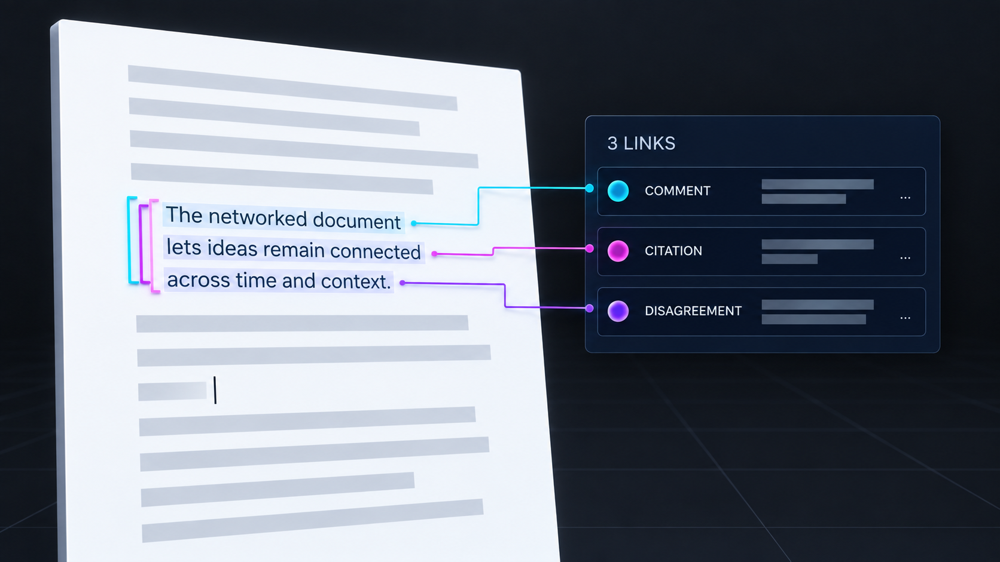
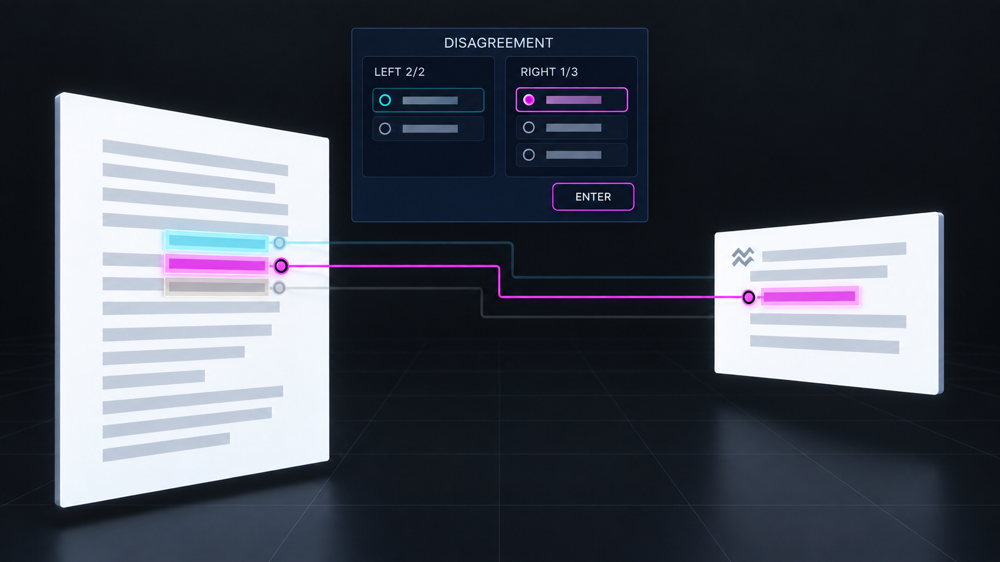

# Prototype: Overlap Preview

**Status:** Proposed disambiguation surface.\
**Depends on:** [selected link context](link-context.md).

## Interaction mock-ups

*Preview: a shared passage offers separate link identities without activating any of them.*

*Select: the chosen link is pinned; Enter remains a separate action.*

## Reader walkthrough

1. A reader hovers a passage touched by three links: a comment, a disagreement, and a citation. A
   small stack lists three separate link identities with type, owner or curator, and short left and
   right endset summaries. The passage stays readable and the caret does not move.
1. The reader previews the disagreement. Its exact authored span marks strengthen; the other two
   links remain identifiable in the stack. A repeated quotation of the same primedia is labeled with
   its document/version or cell occurrence, so the reader knows which visible manifestation was hit.
1. Selecting the disagreement pins the [link context](link-context.md). A hit on the middle of a
   beam with no exact near member pins only its link ID and asks for a member. The reader may then
   choose a target and Enter explicitly. Dismissing the preview alone changes no reading focus or
   activity visit.

## Technical explanation

The hit resolver maps a document or cell range to a set of candidate
`(link authority, link ID, side, member index, occurrence)` values. It uses primedia address overlap
and retains each stored `PrimediaSpan`; it cannot infer identity from equal rendered text.
Deduplicate candidates at the link level for the stack, then retain member and occurrence detail for
preview. Sort by explicit hit precision, visible reading or rank order, prominence tier, then stable
link ID; the sort is a presentation policy and must not silently choose a link. A beam body without
a definite endpoint contributes its link identity without inventing a side.

[`Store::linksTouching()`](../../../apps/common/xanadu/store.hpp) provides a functional filter for
links whose ends overlap one span. The existing [`LinkBeams`](../../../apps/xudu/beams.cpp) pick
path immediately traverses its chosen strand, and
[`placeLinks`](../../../apps/common/xanadu/link_layout.cpp) has already expanded many-to-many links
into strands. This prototype routes hits through the pure candidate resolver before link selection.
The shared command boundary ensures hover and preview cannot call focus or append activity.
Accessibility exposes one list item per link with stable ID, type, owner, endset counts, and a
Select action; repeated rendered strands do not become duplicate accessible links.

When metadata or an occurrence is unavailable, keep its link identity in the stack with a labeled
pending state. Cancel or a newer hit invalidates the prior result. No completed visit is recorded
until the reader later enters an exact endpoint.

## Prototype proof

Use two links sharing a partial span, a third link covering a disjoint member elsewhere, and a
quoted occurrence in a cell. Hover and beam picks must show each link once, show exact highlighted
ranges without filling gaps, and preserve the current focus. Keyboard and screen-reader selection
must pin the same link as a pointer selection. A delayed resolution result after dismissal must not
reopen the preview or move focus.
