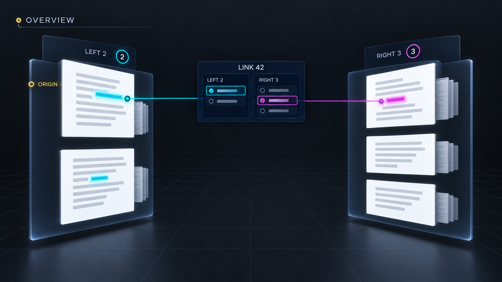
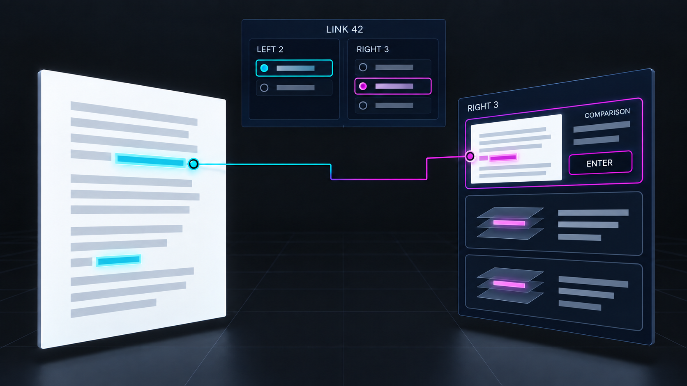

# Prototype: Whole-Link Overview

**Status:** Proposed spatial view of one selected link.\
**Depends on:** [selected link context](link-context.md) and exact endpoint occurrences.

## Interaction mock-ups

*Open Overview: two endsets become visible as groups and counts around one stable link.*

*Expand and compare: one reader-selected line appears without a full left×right web.*

## Reader walkthrough

1. A reader following a 2×3 link invokes **Overview** from its compact context. The camera pulls
   back enough to reveal two grouped endsets around the stable link identity. Visible documents and
   cell neighborhoods appear as clusters, with counts for members and occurrences beyond the view.
   The source and the reader's current comparison remain marked.
1. The reader expands a right-side cluster. Member 3 has one document occurrence and two cell
   occurrences; each is separately labeled. The left member stays chosen. The reader may pin a
   comparison line between one left and one right occurrence. That line represents the reader's
   current question, while the whole link still contains all five members.
1. Choosing a cluster or occurrence previews it without changing reading focus. **Enter** an exact
   occurrence brings its content forward and records one activity visit. Closing Overview without
   entry restores the former camera and link context; closing after entry keeps the new focus and
   compact context. A distant or unavailable cluster retains a count and status rather than
   vanishing.

## Technical explanation

The overview consumes one immutable selected-link snapshot plus an occurrence index keyed by side,
stored member, and exact occurrence. Layout groups by document/version and cell neighborhood, then
places a bounded number of visible representatives and count badges. One selected comparison can
draw a connection between two chosen occurrences. The renderer must not materialize the Cartesian
product of left×right occurrences: a link with L left and R right manifestations should stage work
proportional to visible representatives plus L+R summaries, not L×R strands. The selected link ID,
attribution, and both full endset counts stay in a fixed context as the scene moves.

Current [`placeLinks`](../../../apps/common/xanadu/link_layout.cpp) computes covering extents and
left×right strands; it is a rendering source to replace for this view, not the semantic source of
overview clusters. The [`BridgeCoordinator`](../../../apps/xudu/bridge_coordinator.cpp) already
co-places documents and ZigZag cells, but exact out-of-radius cell materialization and per-member
anchors need new requests. Animation can reuse scene transforms; camera fit and count thresholds
belong in system layout configuration, with a reduced-motion list/grid presentation using the same
group and occurrence identities.

The overview is a projection of the same link navigation session, so Select member, Preview, Cross,
and Enter have exactly the compact context's semantics. Closing the projection does not append
activity. Accessibility exposes the fixed link, two member groups, cluster headings and counts,
exact occurrence children, and the chosen comparison; depth and tethers are optional cues.

## Prototype proof

Use a 2×3 discontinuous link with repeated content in two documents and a distant cell. Confirm all
five members remain identifiable, the selected comparison changes without claiming an authored pair,
and no gap is marked as linked. Grow each endset and measure staged geometry and pick targets; the
result must not grow as L×R. Compare pointer, keymap, and accessible entry to the same exact
occurrence. Cancel a pending distant-cell request and verify focus stays at the source.
