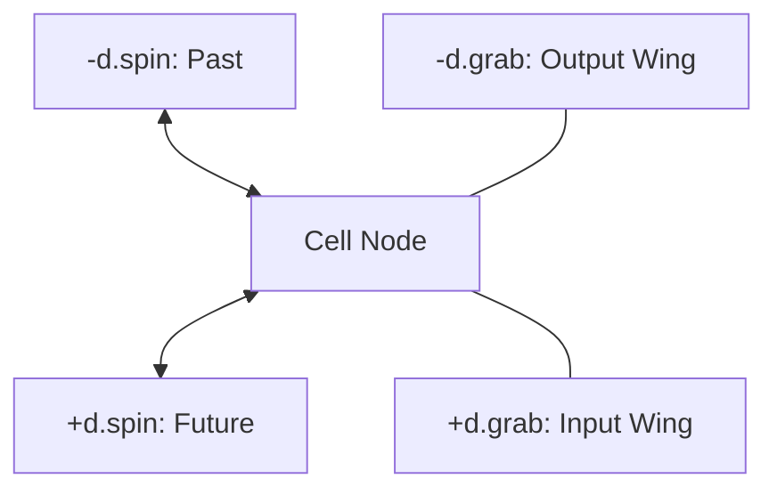
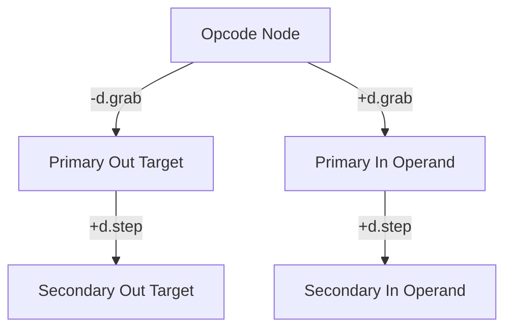
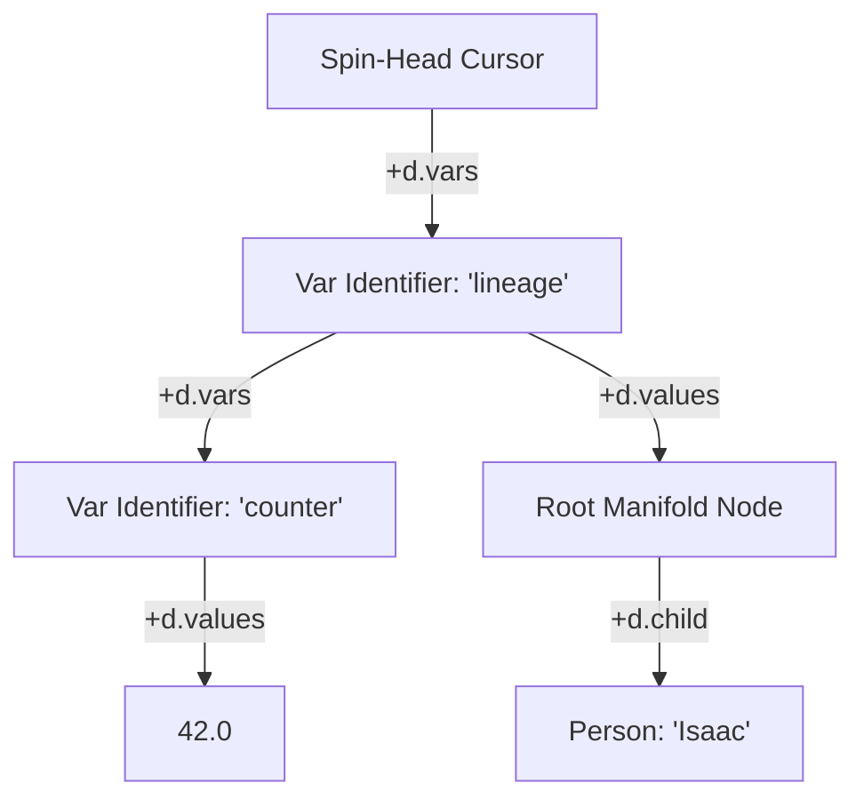

# Vortex Hyperstructural Runtime & zzstructure System Specification

**Document Version:** 5.0.0 — Xanalogical Revision **Target Environment:** Zero-Allocation
Multidimensional Graph Manifolds & Logic Engine

Vortex is a speculative language and runtime design: a programming model whose entire addressable
state is a Zigzag `zzstructure` manifold (the same `d.1`/`d.2`/`d.clone`-style cell-and-dimension
model documented in
[zigzag-multidimensional-space-and-projection.md](zigzag-multidimensional-space-and-projection.md)
and implemented by `apps/zigzag`'s `Cell`), rather than heaps, stack frames, and registers. Nothing
in this document is wired into the gleditor build; it specifies the language and reference engine
that a future `apps/vortex` (or an embedding inside `apps/zigzag`) would implement. It is recorded
here because it is a design consumer of the same manifold invariants `apps/zigzag` and `apps/xudu`
already enforce, and any future implementation should stay consistent with them.

This revision renames the payload accessors `get_cell_value`/`set_cell_value` to `get`/`set` — VQL
(the companion query language, see [vql-query-language.md](vql-query-language.md)) spells them that
way at every call site, and there is no reason for the two documents to disagree about the name of a
primitive they share. It also replaces every ASCII-art diagram with Mermaid, matching the rest of
`design/`.

______________________________________________________________________

## 1. Architectural Foundation & Design Invariants

The Vortex architecture eliminates traditional runtime constructs — linear memory heaps,
hardware-bound register sets, stack frames, and isolated variable lookup tables — in favor of a
unified spatial manifold based on **zzstructures**. Every entity, execution thread, variable
binding, lexical scope, instruction stream, and data structure exists as an interconnected node
within a single multidimensional coordinate matrix.

### The Two-Primitive Invariant

The entire engine core is strictly constrained to two structural primitives and two scalar payload
accessors:

1. **`get_link(cell, dim, direction)`**: Inspects and traverses adjacent cell coordinates along a
   specific dimension.
1. **`set_link(cell, dim, direction, target)`**: Directly establishes, mutates, or breaks
   dimensional connections:
   - **Allocation (`target == -1`)**: Instantiates a fresh cell and wires it directly to the source
     node along the given dimension and direction.
   - **Isolation (`target == 0`)**: Clears the designated directional pointer. When all dimensional
     links of a cell are set to 0, the cell is geometrically isolated.
   - **Identity Entanglement & Unentanglement (`dim == d_entangle`)**: Establishes or breaks an
     identity binding where multiple cells share a single underlying payload pointer pool.
1. **`get(cell, [offset], [length])`**: Dereferences the cell's payload
   (`std::variant<std::string, double, bool>`) with optional virtual slicing.
1. **`set(cell, value, [offset], [length])`**: Writes or in-place patches the variant payload,
   updating shared instances across `d.entangle` instantly.



### Topological Garbage Collection

Manual memory deallocation primitives (e.g., `free_cell`) are forbidden. Memory reclamation is
purely reachability-based:

- **Root Set**: Origin Cell (0), the active cursor scheduler rank (`d.cursors`), and global system
  dimension anchors.

- **Trace Cycle**: A mark-and-sweep or reference manifold crawl marks all cells reachable across any
  link.

- **Eager Eviction**: When `set_link` reduces a cell's total non-zero connections across all axes to
  zero:

  ```math
  \sum_{\text{dim}} \left( [\text{links}[\text{dim}].\text{pos} \ne 0] + [\text{links}[\text{dim}].\text{neg} \ne 0] \right) = 0
  ```

  the runtime immediately reclaims the cell without waiting for a full sweep cycle.

______________________________________________________________________

## 2. Core C++ Runtime Engine Reference Implementation

```cpp
#include <iostream>
#include <string>
#include <unordered_map>
#include <memory>
#include <variant>
#include <vector>
#include <algorithm>
#include <cstdint>
#include <cctype>

using cell_id = int64_t;

// Standard System Dimension Coordinates
constexpr cell_id d_grab    = 1;    // Parameter wings (-d.grab = outputs, +d.grab = inputs)
constexpr cell_id d_step    = 2;    // Parameter chaining / sequential rank stepping
constexpr cell_id d_spin    = 3;    // Process instruction stream
constexpr cell_id d_stack   = 4;    // Call frame stack
constexpr cell_id d_entangle = 999; // Quantum identity synchronization
constexpr cell_id d_cursors = 1001; // Process scheduler manifold
constexpr cell_id d_vars    = 1003; // Scope variable names
constexpr cell_id d_values  = 1004; // Variable values / ground terms

using CellValue = std::variant<std::string, double, bool>;

struct Cell {
    cell_id id;
    CellValue primitive_value = "";
    std::unordered_map<cell_id, std::pair<cell_id, cell_id>> links; // [dim] -> {pos, neg}
    std::shared_ptr<CellValue> entangled_payload = nullptr;
};

// Global Matrix Storage
static std::unordered_map<cell_id, std::unique_ptr<Cell>> matrix;
static cell_id next_cell_id = 1;

// Internal Allocation Primitive
static cell_id internal_alloc_cell() {
    cell_id id = next_cell_id++;
    auto c = std::make_unique<Cell>();
    c->id = id;
    matrix[id] = std::move(c);
    return id;
}

// Unentangle & Payload Recovery Helper
static void handle_unentangle_cleanup(cell_id c_id) {
    auto& c = matrix[c_id];
    if (!c || !c->entangled_payload) return;
    c->primitive_value = *(c->entangled_payload);
    if (c->links[d_entangle].first == 0 && c->links[d_entangle].second == 0) {
        c->entangled_payload = nullptr;
    } else {
        c->entangled_payload =
            std::make_shared<CellValue>(c->primitive_value);
    }
}

// Primitive 1: get_link
cell_id get_link(cell_id cell, cell_id dim, int direction) {
    auto it = matrix.find(cell);
    if (it == matrix.end() || !it->second) return 0;
    auto link_it = it->second->links.find(dim);
    if (link_it == it->second->links.end()) return 0;
    return (direction > 0) ? link_it->second.first :
link_it->second.second;
}

// Primitive 2: set_link
cell_id set_link(cell_id cell, cell_id dim, int direction, cell_id
target) {
    auto& c = matrix[cell];
    if (!c) return 0;

    cell_id actual_target = (target == -1) ? internal_alloc_cell() :
target;

    // Quantum Identity Synchronization along d.entangle
    if (dim == d_entangle) {
        cell_id old_target = (direction > 0) ? c->links[d_entangle].first
: c->links[d_entangle].second;

        // Break Entanglement
        if (actual_target == 0 && old_target != 0) {
            if (direction > 0) c->links[d_entangle].first = 0;
            else c->links[d_entangle].second = 0;

            auto& partner = matrix[old_target];
            if (partner) {
                if (direction > 0 && partner->links[d_entangle].second ==
cell) partner->links[d_entangle].second = 0;
                else if (direction < 0 && partner->links[d_entangle].first
== cell) partner->links[d_entangle].first = 0;
                handle_unentangle_cleanup(old_target);
            }
            handle_unentangle_cleanup(cell);
            return 0;
        }

        // Establish Entanglement
        if (actual_target != 0) {
            auto& t = matrix[actual_target];
            if (!t) return 0;
            if (direction > 0) { c->links[d_entangle].first =
actual_target; t->links[d_entangle].second = cell; }
            else { c->links[d_entangle].second = actual_target;
t->links[d_entangle].first = cell; }

            if (!c->entangled_payload && !t->entangled_payload) {
                c->entangled_payload =
std::make_shared<CellValue>(c->primitive_value);
                t->entangled_payload = c->entangled_payload;
            } else if (c->entangled_payload && !t->entangled_payload) {
                t->entangled_payload = c->entangled_payload;
            } else if (!c->entangled_payload && t->entangled_payload) {
                c->entangled_payload = t->entangled_payload;
            } else if (c->entangled_payload != t->entangled_payload) {
                *(t->entangled_payload) = *(c->entangled_payload);
                t->entangled_payload = c->entangled_payload;
            }
            return actual_target;
        }
    }

    // Standard Dimensional Topologies
    if (actual_target == 0) {
        if (direction > 0) c->links[dim].first = 0;
        else c->links[dim].second = 0;
    } else {
        auto& t = matrix[actual_target];
        if (direction > 0) {
            c->links[dim].first = actual_target;
            if (t) t->links[dim].second = cell;
        } else {
            c->links[dim].second = actual_target;
            if (t) t->links[dim].first = cell;
        }
    }
    return actual_target;
}

// Extended Truthiness Evaluation
bool evaluate_truthiness(const CellValue& val) {
    if (std::holds_alternative<bool>(val)) return std::get<bool>(val);
    if (std::holds_alternative<double>(val)) return
std::get<double>(val) != 0.0;

    std::string s = std::get<std::string>(val);
    std::transform(s.begin(), s.end(), s.begin(), [](unsigned char ch)
{ return std::tolower(ch); });
    if (s == "1" || s == "true" || s == "yes" || s == "on") return
true;
    if (s.empty() || s == "0" || s == "false" || s == "no" || s ==
"off") return false;
    return true;
}

// Payload Accessor: Slicing-Aware Dereference
CellValue get(cell_id c_id, int64_t offset = 0, int64_t
length = -1) {
    auto it = matrix.find(c_id);
    if (it == matrix.end() || !it->second) return false;

    const CellValue& val = it->second->entangled_payload ?
*(it->second->entangled_payload) : it->second->primitive_value;
    if (std::holds_alternative<bool>(val)) return std::get<bool>(val);
    if (std::holds_alternative<double>(val)) return
std::get<double>(val);

    const std::string& src = std::get<std::string>(val);
    if (offset < 0 || static_cast<size_t>(offset) >= src.size())
return std::string("");
    size_t start = static_cast<size_t>(offset);
    size_t count = (length < 0) ? std::string::npos :
static_cast<size_t>(length);
    return src.substr(start, count);
}

// Payload Accessor: In-Place Mutation & Substring Patching
void set(cell_id c_id, const CellValue& new_val, int64_t
offset = 0, int64_t length = -1) {
    auto it = matrix.find(c_id);
    if (it == matrix.end() || !it->second) return;

    CellValue& target = it->second->entangled_payload ?
*(it->second->entangled_payload) : it->second->primitive_value;

    if (std::holds_alternative<bool>(new_val) ||
std::holds_alternative<double>(new_val)) {
        target = new_val;
        return;
    }

    const std::string& input_str = std::get<std::string>(new_val);
    if (!std::holds_alternative<std::string>(target) ||
        (offset == 0 && (length < 0 || static_cast<size_t>(length) >=
std::get<std::string>(target).size()))) {
        target = input_str;
        return;
    }

    std::string& target_str = std::get<std::string>(target);
    size_t start = static_cast<size_t>(std::max<int64_t>(0, offset));
    if (start > target_str.size()) target_str.resize(start, ' ');

    size_t count = (length < 0) ? (target_str.size() - start) :
static_cast<size_t>(length);
    count = std::min(count, target_str.size() - start);
    target_str.replace(start, count, input_str);
}
```

______________________________________________________________________

## 3. The Dual-Wing Calling Convention & Spatial Parameter Binding

To eliminate hidden operand accumulators and register pollution, Vortex mandates a **Dual-Wing
Spatial Calling Topology**:



- **Outputs Wing (`-d.grab`)**: Output destination cells extend negward. If an operation yields
  multiple results (e.g., `#DIVMOD`), targets chain posward along `+d.step` from the primary out
  cell.
- **Inputs Wing (`+d.grab`)**: Positional parameters extend posward along `+d.grab` and chain
  sequentially posward along `+d.step`.
- **Snapshot-Before-Write Invariant**: The runtime snapshots all input payloads prior to writing to
  output cells, ensuring in-place operations (`#ADD out out out`) execute deterministically without
  memory aliasing corruption.

______________________________________________________________________

## 4. Cursor Associative Scopes: `d.vars` and `d.values`

Process cursors (Spin-Heads) maintain their own variable lookup environments directly on the spatial
matrix:



- **Identifier Axis (`d.vars`)**: A linear rank of cells posward from the cursor holding variable
  name strings.
- **Storage Axis (`d.values`)**: Orthogonal links from each name cell pointing to its actual bound
  value.
- **Complex Data Containment**: The cell anchored along `+d.values` is not restricted to scalars; it
  may be the entry root of an arbitrarily deep multidimensional zzstructure (such as a tree, cyclic
  graph, or compiler AST).
