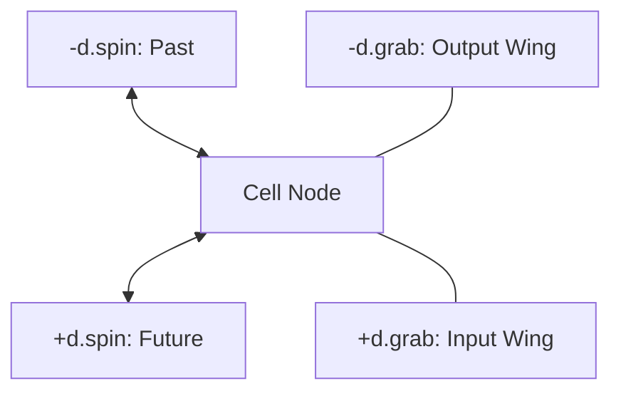
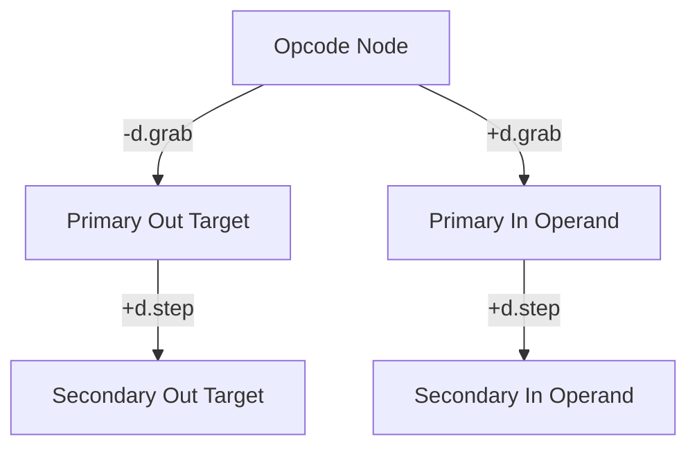
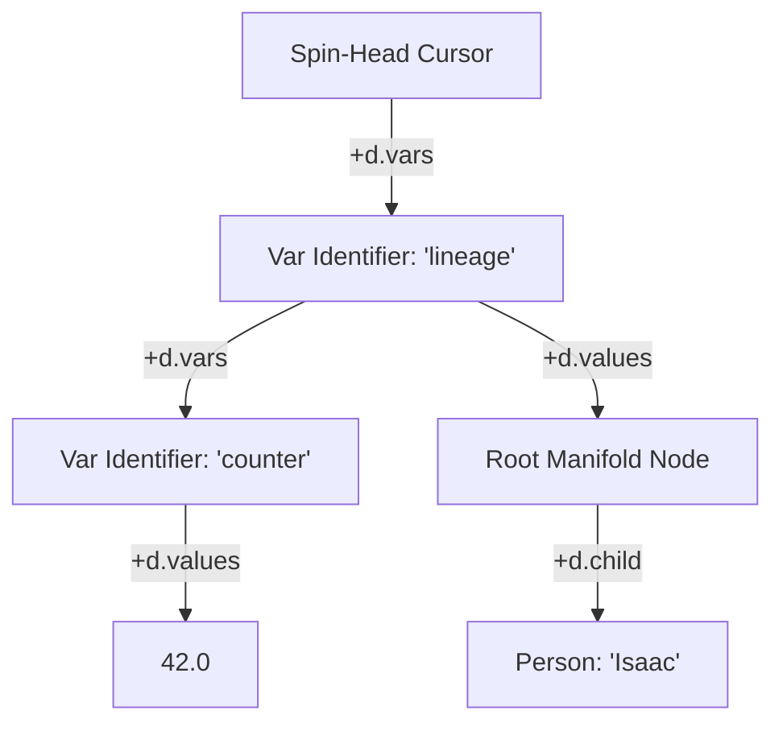

# Vortex Hyperstructural Runtime & zzstructure System Specification

**Document Version:** 5.0.0 — Xanalogical Revision **Target Environment:** Zero-Allocation
Multidimensional Graph Manifolds & Logic Engine

Vortex is a speculative language and runtime design: a programming model whose entire addressable
state is a Zigzag `zzstructure` manifold (the same `d.1`/`d.2`/`d.clone`-style cell-and-dimension
model documented in
[zigzag-multidimensional-space-and-projection.md](zigzag-multidimensional-space-and-projection.md)
and implemented by `apps/zigzag`'s `Cell`), rather than heaps, stack frames, and registers. Nothing
in this document is wired into the gleditor build; it specifies the language and reference engine
that a future `apps/vortex` (or an embedding inside `apps/zigzag`) would implement. It is recorded
here because it is a design consumer of the same manifold invariants `apps/zigzag` and `apps/xudu`
already enforce, and any future implementation should stay consistent with them.

This revision renames the payload accessors `get_cell_value`/`set_cell_value` to `get`/`set` — VQL
(the companion query language, see [vql-query-language.md](vql-query-language.md)) spells them that
way at every call site, and there is no reason for the two documents to disagree about the name of a
primitive they share. It also replaces every ASCII-art diagram with Mermaid, matching the rest of
`design/`.

> **§2's reference implementation is now out of date on purpose.** It is written against
> `apps/zigzag`'s `Cell` as it stood when this document was drafted.
> [`store-slice-convergence.md`](store-slice-convergence.md) replaces that cell's id type, its link
> storage, its payload and its entanglement mechanism. **§5 below records what changes and what
> survives**; read it before implementing anything from §2, which is kept as-is because it is still
> the clearest statement of the *semantics* even where it no longer describes the *encoding*.

______________________________________________________________________

## 1. Architectural Foundation & Design Invariants

The Vortex architecture eliminates traditional runtime constructs — linear memory heaps,
hardware-bound register sets, stack frames, and isolated variable lookup tables — in favor of a
unified spatial manifold based on **zzstructures**. Every entity, execution thread, variable
binding, lexical scope, instruction stream, and data structure exists as an interconnected node
within a single multidimensional coordinate matrix.

### The Single-Primitive Invariant

The entire engine core is strictly constrained to one structural primitive and two scalar payload
accessors. `get_link`/`set_link` are not two primitives that happen to share an argument list —
every combination of their arguments already had a compatible, unambiguous return shape, so they're
one overloaded primitive, `link`, distinguished by whether a `target` was passed at all:

1. **`link(cell, dim, direction, [target]) -> std::optional<cell_id>`**: Inspects, establishes,
   mutates, or breaks a dimensional connection, depending on `target`:
   - **Read (`target` omitted)**: Returns the cell currently linked in that direction, or
     `std::nullopt` if there isn't one. (Formerly `get_link`.)
   - **Allocation (`target == -1`)**: Instantiates a fresh cell, wires it directly to the source
     node along the given dimension and direction, and returns its id.
   - **Isolation (`target == -2`)**: Clears the designated directional pointer and returns the cell
     that had been linked there, or `std::nullopt` if there was nothing to clear. When all
     dimensional links of a cell are cleared, the cell is geometrically isolated. `-2` is used
     rather than `0` because `0` is Cell 0, the origin/home cell (the Root Set anchor described
     under "Topological Garbage Collection" below) — an ordinary, addressable target, not a
     sentinel. A dimension can legitimately link straight at Cell 0; only `-1` and `-2` are
     reserved.
   - **Literal target (any other `cell_id`, including `0`)**: Links directly to that cell and
     returns it.
   - **Identity Entanglement & Unentanglement (`dim == d_entangle`)**: Establishes or breaks an
     identity binding where multiple cells share a single underlying payload pointer pool, following
     the same read/allocate/isolate/literal-target branching as any other dimension.
1. **`get(cell, [offset], [length])`**: Dereferences the cell's payload
   (`std::variant<std::string, double, bool>`) with optional virtual slicing.
1. **`set(cell, value, [offset], [length])`**: Writes or in-place patches the variant payload,
   updating shared instances across `d.entangle` instantly.



### Topological Garbage Collection

Manual memory deallocation primitives (e.g., `free_cell`) are forbidden. Memory reclamation is
purely reachability-based:

- **Root Set**: Origin Cell (0), the active cursor scheduler rank (`d.cursors`), and global system
  dimension anchors.

- **Trace Cycle**: A mark-and-sweep or reference manifold crawl marks all cells reachable across any
  link.

- **Eager Eviction**: When `link` reduces a cell's total live connections across all axes to zero:

  ```math
  \sum_{\text{dim}} \left( [\text{links}[\text{dim}].\text{pos} \ne \text{nolink}] + [\text{links}[\text{dim}].\text{neg} \ne \text{nolink}] \right) = 0
  ```

  the runtime immediately reclaims the cell without waiting for a full sweep cycle. `nolink` is a
  reserved out-of-band marker distinct from every real `cell_id` (including `0`) — see §2's
  `kNoLink` — so a link genuinely pointing at Cell 0 still counts as a live connection here.

______________________________________________________________________

## 2. Core C++ Runtime Engine Reference Implementation

```cpp
#include <iostream>
#include <string>
#include <unordered_map>
#include <memory>
#include <functional>
#include <optional>
#include <variant>
#include <vector>
#include <algorithm>
#include <cstdint>
#include <cctype>

using cell_id = int64_t;

// Standard System Dimension Coordinates
constexpr cell_id d_grab    = 1;    // Parameter wings (-d.grab = outputs, +d.grab = inputs)
constexpr cell_id d_step    = 2;    // Parameter chaining / sequential rank stepping
constexpr cell_id d_spin    = 3;    // Process instruction stream
constexpr cell_id d_stack   = 4;    // Call frame stack
constexpr cell_id d_entangle = 999; // Quantum identity synchronization
constexpr cell_id d_cursors = 1001; // Process scheduler manifold
constexpr cell_id d_vars    = 1003; // Scope variable names
constexpr cell_id d_values  = 1004; // Variable values / ground terms

// Reserved out-of-band marker for "no link here", distinct from every real
// cell_id -- including 0, Cell 0's own address. Real cells are allocated
// starting at 1 (next_cell_id below); Cell 0 is pre-seeded as the origin, so
// -1 is safe as a sentinel no allocated cell will ever collide with.
constexpr cell_id kNoLink = -1;

struct LinkSlot {
    cell_id first  = kNoLink;
    cell_id second = kNoLink;
};

using CellValue = std::variant<std::string, double, bool>;

struct Cell {
    cell_id id;
    CellValue primitive_value = "";
    std::unordered_map<cell_id, LinkSlot> links; // [dim] -> {pos, neg}
    std::shared_ptr<CellValue> entangled_payload = nullptr;
};

// Global Matrix Storage
static std::unordered_map<cell_id, std::unique_ptr<Cell>> matrix;
static cell_id next_cell_id = 1;

// Internal Allocation Primitive
static cell_id internal_alloc_cell() {
    cell_id id = next_cell_id++;
    auto c = std::make_unique<Cell>();
    c->id = id;
    matrix[id] = std::move(c);
    return id;
}

// Unentangle & Payload Recovery Helper
static void handle_unentangle_cleanup(cell_id c_id) {
    auto& c = matrix[c_id];
    if (!c || !c->entangled_payload) return;
    c->primitive_value = *(c->entangled_payload);
    if (c->links[d_entangle].first == kNoLink &&
        c->links[d_entangle].second == kNoLink) {
        c->entangled_payload = nullptr;
    } else {
        c->entangled_payload =
            std::make_shared<CellValue>(c->primitive_value);
    }
}

// The Structural Primitive: link
// target omitted        -> read:      the linked cell, or nullopt if unlinked.
// target == -1           -> allocate:  the newly created cell.
// target == -2           -> isolate:   the cell that was linked there, or
//                                       nullopt if there was nothing to break.
// target == any other id -> literal:   that same target (0 included -- Cell 0
//                                       is an ordinary target, not a sentinel).
std::optional<cell_id> link(cell_id cell, cell_id dim, int direction,
                             std::optional<cell_id> target = std::nullopt) {
    auto it = matrix.find(cell);
    if (it == matrix.end() || !it->second) return std::nullopt;
    auto& c = it->second;

    // Read form (formerly get_link)
    if (!target.has_value()) {
        auto link_it = c->links.find(dim);
        if (link_it == c->links.end()) return std::nullopt;
        cell_id existing = (direction > 0) ? link_it->second.first :
link_it->second.second;
        return existing == kNoLink ? std::nullopt :
std::optional<cell_id>(existing);
    }

    const cell_id raw_target = *target;
    const cell_id actual_target = (raw_target == -1) ?
internal_alloc_cell() : raw_target;

    // Quantum Identity Synchronization along d.entangle
    if (dim == d_entangle) {
        cell_id old_target = (direction > 0) ? c->links[d_entangle].first
: c->links[d_entangle].second;

        // Break Entanglement
        if (raw_target == -2) {
            if (old_target == kNoLink) return std::nullopt;
            if (direction > 0) c->links[d_entangle].first = kNoLink;
            else c->links[d_entangle].second = kNoLink;

            auto& partner = matrix[old_target];
            if (partner) {
                if (direction > 0 && partner->links[d_entangle].second ==
cell) partner->links[d_entangle].second = kNoLink;
                else if (direction < 0 && partner->links[d_entangle].first
== cell) partner->links[d_entangle].first = kNoLink;
                handle_unentangle_cleanup(old_target);
            }
            handle_unentangle_cleanup(cell);
            return old_target;
        }

        // Establish Entanglement
        auto& t = matrix[actual_target];
        if (!t) return std::nullopt;
        if (direction > 0) { c->links[d_entangle].first =
actual_target; t->links[d_entangle].second = cell; }
        else { c->links[d_entangle].second = actual_target;
t->links[d_entangle].first = cell; }

        if (!c->entangled_payload && !t->entangled_payload) {
            c->entangled_payload =
std::make_shared<CellValue>(c->primitive_value);
            t->entangled_payload = c->entangled_payload;
        } else if (c->entangled_payload && !t->entangled_payload) {
            t->entangled_payload = c->entangled_payload;
        } else if (!c->entangled_payload && t->entangled_payload) {
            c->entangled_payload = t->entangled_payload;
        } else if (c->entangled_payload != t->entangled_payload) {
            *(t->entangled_payload) = *(c->entangled_payload);
            t->entangled_payload = c->entangled_payload;
        }
        return actual_target;
    }

    // Standard Dimensional Topologies
    if (raw_target == -2) {
        cell_id old_target = (direction > 0) ? c->links[dim].first :
c->links[dim].second;
        if (old_target == kNoLink) return std::nullopt;
        if (direction > 0) c->links[dim].first = kNoLink;
        else c->links[dim].second = kNoLink;
        return old_target;
    }

    auto& t = matrix[actual_target];
    if (direction > 0) {
        c->links[dim].first = actual_target;
        if (t) t->links[dim].second = cell;
    } else {
        c->links[dim].second = actual_target;
        if (t) t->links[dim].first = cell;
    }
    return actual_target;
}

// Extended Truthiness Evaluation
bool evaluate_truthiness(const CellValue& val) {
    if (std::holds_alternative<bool>(val)) return std::get<bool>(val);
    if (std::holds_alternative<double>(val)) return
std::get<double>(val) != 0.0;

    std::string s = std::get<std::string>(val);
    std::transform(s.begin(), s.end(), s.begin(), [](unsigned char ch)
{ return std::tolower(ch); });
    if (s == "1" || s == "true" || s == "yes" || s == "on") return
true;
    if (s.empty() || s == "0" || s == "false" || s == "no" || s ==
"off") return false;
    return true;
}

// Payload Accessor: Slicing-Aware Dereference
CellValue get(cell_id c_id, int64_t offset = 0, int64_t
length = -1) {
    auto it = matrix.find(c_id);
    if (it == matrix.end() || !it->second) return false;

    const CellValue& val = it->second->entangled_payload ?
*(it->second->entangled_payload) : it->second->primitive_value;
    if (std::holds_alternative<bool>(val)) return std::get<bool>(val);
    if (std::holds_alternative<double>(val)) return
std::get<double>(val);

    const std::string& src = std::get<std::string>(val);
    if (offset < 0 || static_cast<size_t>(offset) >= src.size())
return std::string("");
    size_t start = static_cast<size_t>(offset);
    size_t count = (length < 0) ? std::string::npos :
static_cast<size_t>(length);
    return src.substr(start, count);
}

// Payload Accessor: In-Place Mutation & Substring Patching
void set(cell_id c_id, const CellValue& new_val, int64_t
offset = 0, int64_t length = -1) {
    auto it = matrix.find(c_id);
    if (it == matrix.end() || !it->second) return;

    CellValue& target = it->second->entangled_payload ?
*(it->second->entangled_payload) : it->second->primitive_value;

    if (std::holds_alternative<bool>(new_val) ||
std::holds_alternative<double>(new_val)) {
        target = new_val;
        return;
    }

    const std::string& input_str = std::get<std::string>(new_val);
    if (!std::holds_alternative<std::string>(target) ||
        (offset == 0 && (length < 0 || static_cast<size_t>(length) >=
std::get<std::string>(target).size()))) {
        target = input_str;
        return;
    }

    std::string& target_str = std::get<std::string>(target);
    size_t start = static_cast<size_t>(std::max<int64_t>(0, offset));
    if (start > target_str.size()) target_str.resize(start, ' ');

    size_t count = (length < 0) ? (target_str.size() - start) :
static_cast<size_t>(length);
    count = std::min(count, target_str.size() - start);
    target_str.replace(start, count, input_str);
}

// Convenience Wrappers (named entry points onto link/set, not new primitives)
std::optional<cell_id> new_cell(cell_id cell, cell_id dim, int direction) {
    return link(cell, dim, direction, -1);
}
std::optional<cell_id> new_cell(cell_id cell, cell_id dim, int direction,
                                 const CellValue& value) {
    std::optional<cell_id> created = link(cell, dim, direction, -1);
    if (created) set(*created, value);
    return created;
}
std::optional<cell_id> break_link(cell_id cell, cell_id dim, int direction) {
    return link(cell, dim, direction, -2);
}

// A dim/dir slot holds exactly one partner (§1), so passing one existing
// cell as `target` to more than one `link` call silently overwrites its
// back-link each time. entangle_generator(source) sidesteps that: the first
// call returns source itself -- so a single caller behaves exactly as if it
// had used source directly, no special-casing needed -- and every call
// after that allocates a fresh cell and entangles it with source (source
// stays the `cell` argument so its value, not the blank new cell's, is
// authoritative -- §4.6 of vql-query-language.md), returning that fresh
// cell instead so every additional caller still gets its own structurally
// distinct but identity-linked partner. See VQL §4.7 for where this is used.
std::function<cell_id()> entangle_generator(cell_id source) {
    return [source, used = false]() mutable {
        if (!used) {
            used = true;
            return source;
        }
        cell_id fresh = internal_alloc_cell();
        link(source, d_entangle, +1, fresh);
        return fresh;
    };
}
```

`new_cell` and `break_link` are spelled that way — not `new`/`break` — because both are reserved
words in C++; VQL's own surface syntax (§4.5/§4.6 of [vql-query-language.md](vql-query-language.md))
is unconstrained by that and can spell the equivalent sugar `new(...)`/`break(...)` directly, and
both compile straight to a fixed-`target` call on `link` rather than to a separate primitive.

______________________________________________________________________

## 3. The Dual-Wing Calling Convention & Spatial Parameter Binding

To eliminate hidden operand accumulators and register pollution, Vortex mandates a **Dual-Wing
Spatial Calling Topology**:



- **Outputs Wing (`-d.grab`)**: Output destination cells extend negward. If an operation yields
  multiple results (e.g., `#DIVMOD`), targets chain posward along `+d.step` from the primary out
  cell.
- **Inputs Wing (`+d.grab`)**: Positional parameters extend posward along `+d.grab` and chain
  sequentially posward along `+d.step`.
- **Snapshot-Before-Write Invariant**: The runtime snapshots all input payloads prior to writing to
  output cells, ensuring in-place operations (`#ADD out out out`) execute deterministically without
  memory aliasing corruption.

______________________________________________________________________

## 4. Cursor Associative Scopes: `d.vars` and `d.values`

Process cursors (Spin-Heads) maintain their own variable lookup environments directly on the spatial
matrix:



- **Identifier Axis (`d.vars`)**: A linear rank of cells posward from the cursor holding variable
  name strings.
- **Storage Axis (`d.values`)**: Orthogonal links from each name cell pointing to its actual bound
  value.
- **Complex Data Containment**: The cell anchored along `+d.values` is not restricted to scalars; it
  may be the entry root of an arbitrarily deep multidimensional zzstructure (such as a tree, cyclic
  graph, or compiler AST).

______________________________________________________________________

## 5. Reconciliation with the Unified Store/Slice

§2's `Cell` was written against `apps/zigzag`'s `Cell` as it stood: an `int64_t` id, a
`std::unordered_map` of links, a `std::variant` payload and a `std::shared_ptr` for entanglement.
[`store-slice-convergence.md`](store-slice-convergence.md) replaces all four. That note's §13 works
through what survives; this section records the outcome for whoever implements Vortex, because the
reference engine above is now describing a cell that will not exist.

**The model survives; the encoding of it does not.** Four changes are load-bearing.

### 5.1 Cell 0 is not the origin, and `kNoLink` is not needed

`noCell == 0` (convergence R5). A `CellRef` **is** an index into the ops spool, and index 0 is the
state-zero slot — there is no operation there to be a cell, so zero cannot name one. The origin is a
genesis cell called `home`, at a real address; VQL's `##` resolves to it. The comment above
`kNoLink` in §2 — "0 is Cell 0's own address" — is the thing that stops being true, and with it the
whole reason `kNoLink` existed. Absence is `0`.

`target == -1` and `target == -2` also go. `CellRef` is unsigned, and the ops encoding had already
reached the same conclusion from the other direction: `StructureVerb` distinguishes `MakeCell` from
`SetLink` in a flags byte rather than by a sentinel in the target field. `link` stays one primitive
with a branch on what it was asked to do; the branch is a verb rather than a magic integer. The
single-primitive invariant is about there being one primitive, not about how its argument is
spelled.

### 5.2 `entangled_payload` is deleted; `d.entangle` is `d.clone`

A `std::shared_ptr<CellValue>` shared between cells is a fact about one process's heap. Two cells
showing the same content should do so because they address the same span — a claim anyone holding
the address can check.

Zigzag already has this: a clone reads its master's content along `d.clone`, and since the
convergence's migration step 4 it does so for every payload alternative rather than only for
strings. `d.entangle` is therefore specified as a `d.clone`-shaped rank, and VQL §4.6's "payload
authority follows argument order" is what names its head — the leftmost operand.

`handle_unentangle_cleanup`'s copy-back-and-maybe-reshare goes with the pointer. A `set()` on any
member records one operation against the head, so the group has one history rather than N, and every
prior value stays addressable — which a shared payload destroys by construction. The cost is that
entanglement stops being symmetric: breaking the head out of a group is not the same operation as
breaking a member out.

### 5.3 `set()`'s offset/length form is not a primitive on a persistent cell

§2's `set` patches a `std::string` in place. A persistent cell's content is a `PrimediaSpan` into an
append-only permascroll; there is nothing to patch. `set(cell, v)` appends `v` and records an
operation naming the new span, so the old value stays addressable.

The offset/length form splices inside a cell's own text, which is an insert and a delete against
that cell — two operations, not one call on a buffer. An `ArenaManifold` cell (convergence R8) owns
its bytes and keeps the in-place behaviour §2 describes; a persistent cell does not.

### 5.4 The links map becomes a compacting CSR run

`std::unordered_map<cell_id, LinkSlot>` per cell was measured at 467 bytes per cell against 108 for
a compressed-sparse-row run of `{dim, pos, neg}` triples, and it cannot answer "which dimensions
does this cell link on" at all without a second index — where the run answers it by being read
sideways.

CSR supports arbitrary link mutation, not merely appends: a run is rewritten in place while it has
spare capacity and relocated to the end of the arena when it outgrows one. What it does not support
unaided is a process that never ends. A replay has a bounded number of link edits; a Vortex program
has none, so a loop that relinks one cell a million times leaves a million dead entries behind.

**The compaction pass is already specified — it is the GC.** VQL §5's reachability sweep walks every
live cell; rebuilding the arena tight from the surviving runs in that same traversal costs nothing
extra, because the marking is the walk. This also gives `promote()` (convergence R8) its definition:
promoting an `ArenaManifold` into a `Manifold` is that same compaction, writing operations as it
goes.

### 5.5 What this buys the runtime, unasked

Two of §1's own requirements stop needing their own machinery:

- **Eager eviction** asks for $\sum_{\text{dim}}$ over a cell's link slots. A CSR cell carries
  `linkCount`, which *is* that sum, maintained. The predicate is a field read.
- **The Root Set** — "Origin Cell (0), the active cursor scheduler rank, and global system dimension
  anchors" — is exactly `home`, the `d.cursors` rank, and the `d.dims` rank hanging off `home`. The
  third part had no representation before; convergence R12 gives it one, because a dimension is a
  cell and the dimensions are a rank like any other.

And one thing gets harder: `constexpr cell_id d_grab = 1` and its neighbours cannot survive, because
a dimension is a minted cell rather than a chosen number. The genesis sequence mints the system
dimensions off `home` in a fixed order, so their addresses are deterministic without being magic
constants, and code reaches them through named accessors.
