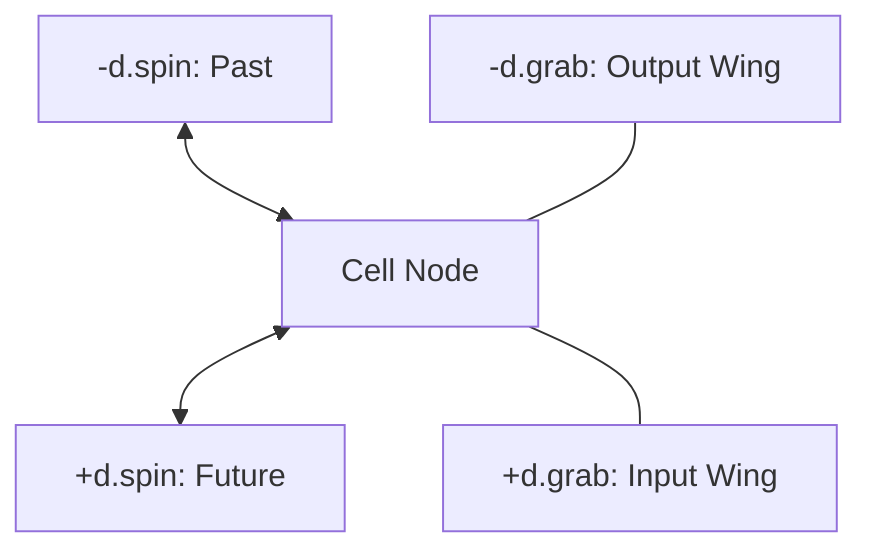
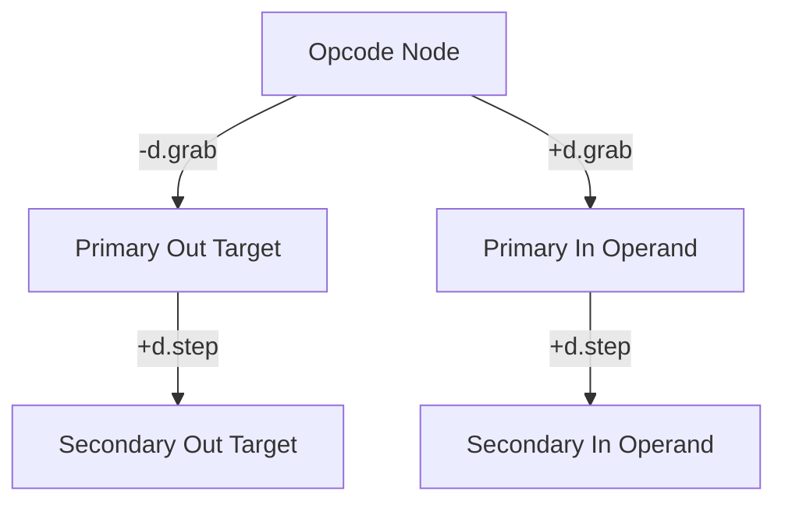
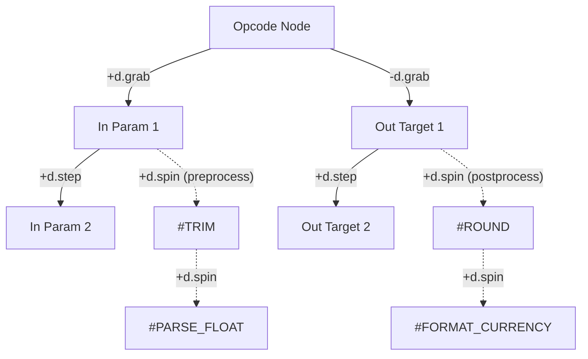
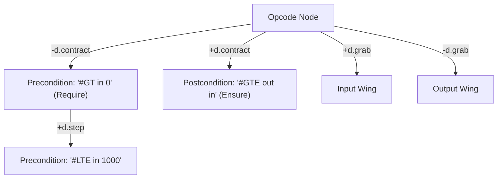
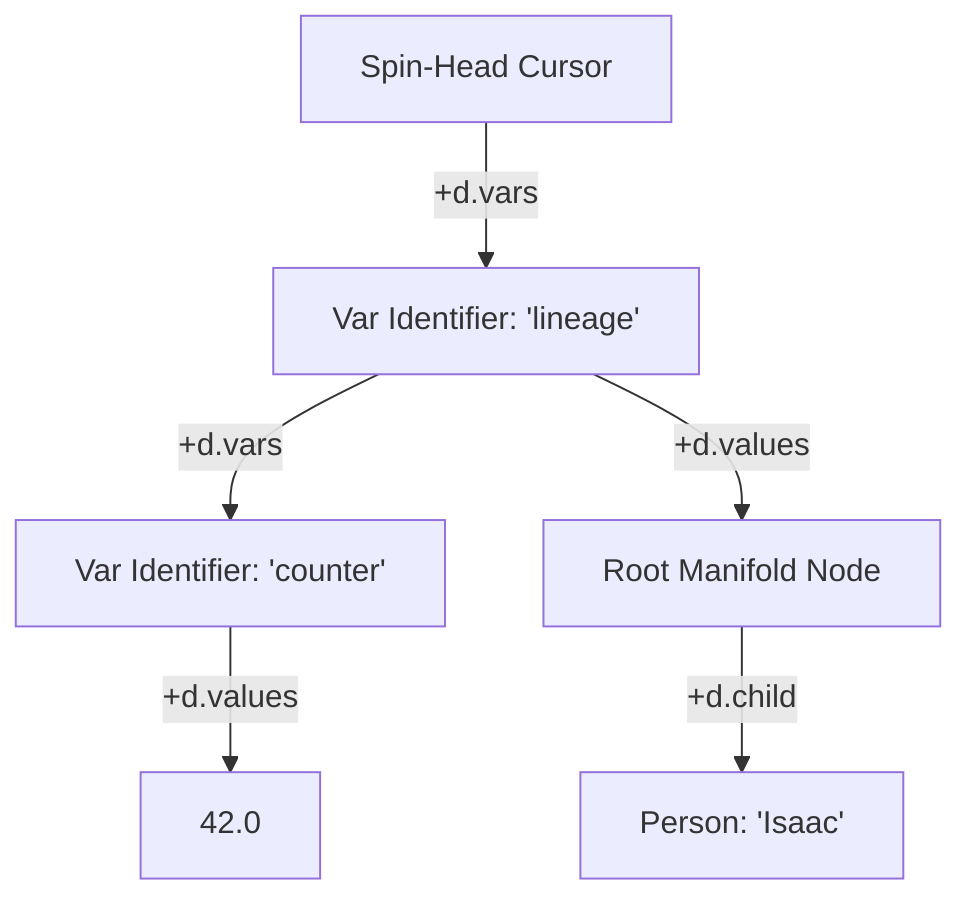
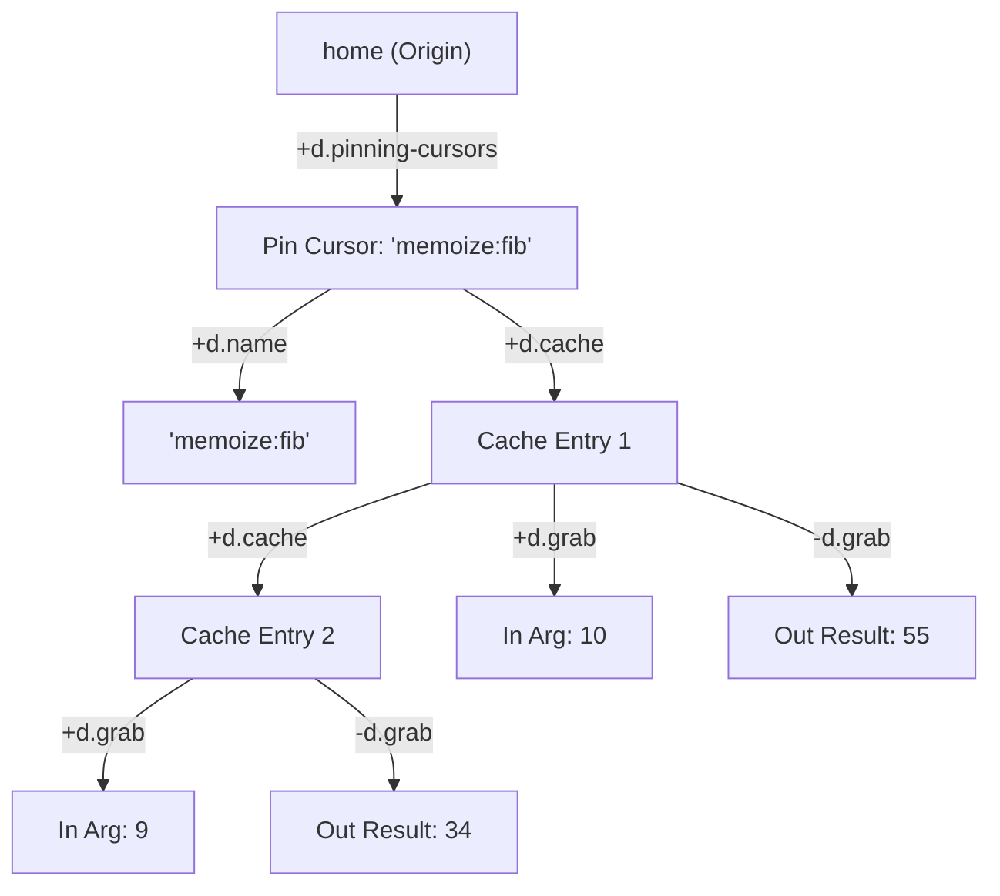
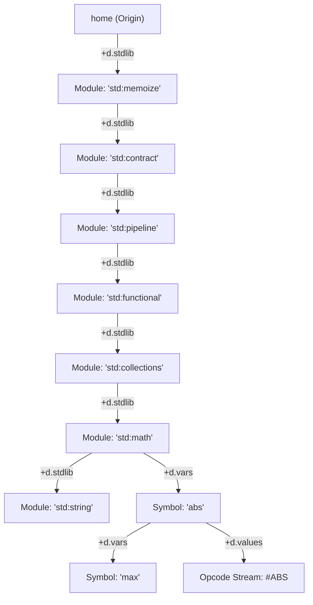
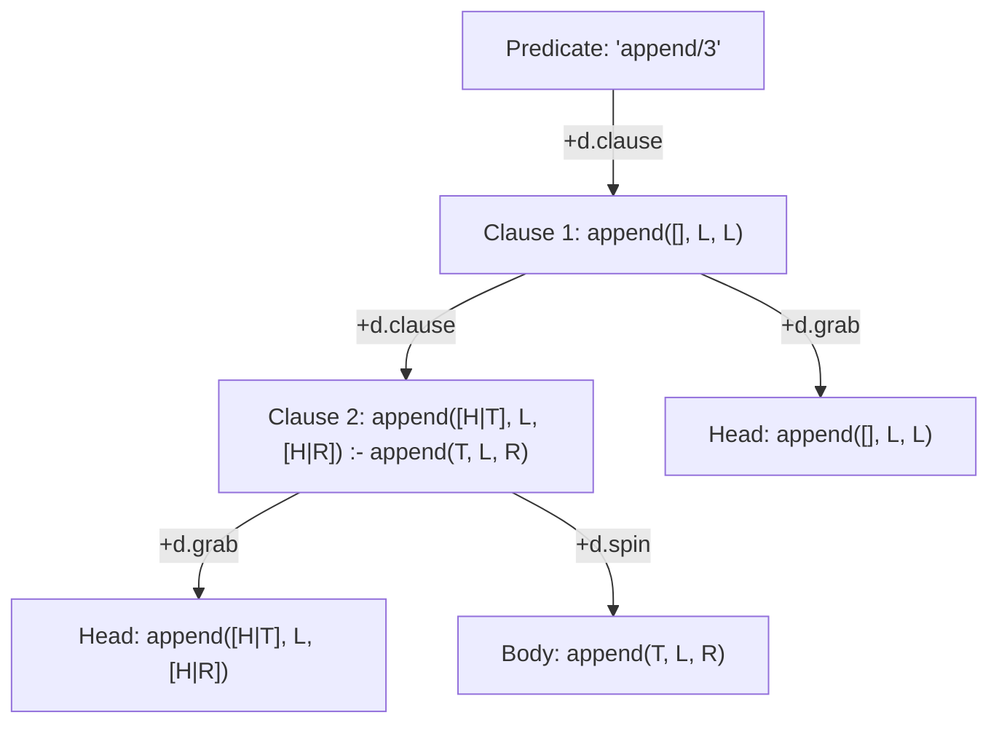

# Vortex Hyperstructural Runtime & zzstructure System Specification

**Document Version:** 12.0 — Vlog Vortex Extension & std:logic Module **Target Environment:**
Zero-Allocation Multidimensional Graph Manifolds & Logic Engine

Vortex is a speculative language and runtime design: a programming model whose entire addressable
state is a Zigzag `zzstructure` manifold (the same `d.1`/`d.2`/`d.clone`-style cell-and-dimension
model documented in
[zigzag-multidimensional-space-and-projection.md](zigzag-multidimensional-space-and-projection.md)
and implemented by `apps/zigzag`'s `Cell`), rather than heaps, stack frames, and registers. Nothing
in this document is wired into the gleditor build; it specifies the language and reference engine
that a future `apps/vortex` (or an embedding inside `apps/zigzag`) would implement. Two front ends
onto it are specified: [VQL](vql-query-language.md), an XQuery-shaped query language, and
[VPL](vpl-array-language.md), an APL whose axes are dimensions. It is recorded here because it is a
design consumer of the same manifold invariants `apps/zigzag` and `apps/xudu` already enforce, and
any future implementation should stay consistent with them.

[**Vlog**](vlog-logic-extension.md), the Vortex Logic Extension, is not a third front end. It is the
elaboration of *this* document's own deferred idea — the words "Logic Engine" in the
`Target Environment:` line above are its fossil — and it makes resolution a program over `link` and
`value`, where a variable binding is a `d.clone` link and a choice point is a microversion. It is an
extension rather than a language because it contributes a mechanism and no notation of its own: it
is written in VQL's paths, VPL's glyphs, or against the primitives directly. It is kept in a
separate document because it asks the C++ core for something (§8 there), which neither front end
does.

This revision renames the payload accessors `get_cell_value`/`set_cell_value` to `get`/`set` — VQL
(the companion query language, see [vql-query-language.md](vql-query-language.md)) spells them that
way at every call site, and there is no reason for the two documents to disagree about the name of a
primitive they share. It also replaces every ASCII-art diagram with Mermaid, matching the rest of
`design/`.

> **§2's reference implementation has been brought onto the built architecture.** It was written
> against `apps/zigzag`'s `Cell` as it stood when this document was drafted;
> [`store-slice-convergence.md`](store-slice-convergence.md) has since replaced that cell's id type,
> its link storage and its payload, and **deleted its entanglement mechanism outright**. §5 records
> what changed and what survived.
>
> **Identity sharing is not a payload mechanism any more.** Entanglement gave several cells one
> `std::shared_ptr<CellValue>`, so writing through any of them mutated a pool the others read. That
> model is gone and is not coming back: it has no name in hypertime, nothing to publish, no way to
> scrub to the state before a write, and aliasing that no version of the manifold could express.
> What replaces it is **`d.clone` rank traversal** — sharing by *structure* rather than by memory —
> which is described where the entanglement primitive used to be.

______________________________________________________________________

## Contents

- [1. Architectural Foundation & Design Invariants](#1-architectural-foundation--design-invariants)
  - [The Single-Primitive Invariant](#the-single-primitive-invariant)
  - [Topological Garbage Collection](#topological-garbage-collection)
- [2. Core C++ Runtime Engine Reference Implementation](#2-core-c-runtime-engine-reference-implementation)
- [3. The Dual-Wing Calling Convention & Spatial Parameter Binding](#3-the-dual-wing-calling-convention--spatial-parameter-binding)
  - [3.1 Dual-Wing Parameter Topology](#31-dual-wing-parameter-topology)
  - [3.2 Parameter Preprocessing & Postprocessing Pipelines along `d.spin`](#32-parameter-preprocessing--postprocessing-pipelines-along-dspin)
  - [3.3 Design by Contract along `d.contract`](#33-design-by-contract-along-dcontract)
- [4. Cursor Associative Scopes: `d.vars` and `d.values`](#4-cursor-associative-scopes-dvars-and-dvalues)
- [5. Reconciliation with the Unified Store/Slice](#5-reconciliation-with-the-unified-storeslice)
  - [5.1 There is no Cell 0: zero is absence, and the origin is minted](#51-there-is-no-cell-0-zero-is-absence-and-the-origin-is-minted)
  - [5.2 Entanglement is deleted. Identity sharing is a `d.clone` rank](#52-entanglement-is-deleted-identity-sharing-is-a-dclone-rank)
  - [5.3 `value()`'s write branch is one operation on a persistent cell](#53-values-write-branch-is-one-operation-on-a-persistent-cell)
  - [5.4 The links map becomes a compacting CSR run](#54-the-links-map-becomes-a-compacting-csr-run)
  - [5.5 What this buys the runtime, unasked](#55-what-this-buys-the-runtime-unasked)
  - [5.6 Pinning: a cursor is how a subgraph outlives the query that built it](#56-pinning-a-cursor-is-how-a-subgraph-outlives-the-query-that-built-it)
- [6. Vortex-Native Memoization Library: Pinned Islands along `d.cache`](#6-vortex-native-memoization-library-pinned-islands-along-dcache)
- [7. Vortex Standard Library Architecture (Written in Vortex)](#7-vortex-standard-library-architecture-written-in-vortex)
  - [7.1 Spatial Module Topology: `d.stdlib` and Symbol Resolution](#71-spatial-module-topology-dstdlib-and-symbol-resolution)
  - [7.2 Standard Library Modules](#72-standard-library-modules)
  - [7.3 Metacircular Execution & Compilation into the Manifold](#73-metacircular-execution--compilation-into-the-manifold)
- [8. Vlog Vortex Extension & `std:logic` Module](#8-vlog-vortex-extension--stdlogic-module)
  - [8.1 System Dimension: `d.clause`](#81-system-dimension-dclause)
  - [8.2 Logic VM Opcodes](#82-logic-vm-opcodes)
  - [8.3 `std:logic` Standard Library Module](#83-stdlogic-standard-library-module)
- [Appendix: Versioning and Change History](#appendix-versioning-and-change-history)

## 1. Architectural Foundation & Design Invariants

The Vortex architecture eliminates traditional runtime constructs — linear memory heaps,
hardware-bound register sets, stack frames, and isolated variable lookup tables — in favor of a
unified spatial manifold based on **zzstructures**. Every entity, execution thread, variable
binding, lexical scope, instruction stream, and data structure exists as an interconnected node
within a single multidimensional coordinate matrix.

### The Single-Primitive Invariant

The entire engine core is strictly constrained to one structural primitive and two scalar payload
accessors. `get_link`/`set_link` are not two primitives that happen to share an argument list —
every combination of their arguments already had a compatible, unambiguous return shape, so they're
one overloaded primitive, `link`, distinguished by whether a `target` was passed at all:

1. **`link(cell, dim, direction, [target]) -> std::optional<cell_id>`**: Inspects, establishes,
   mutates, or breaks a dimensional connection, depending on `target`:

   - **Read (`target` omitted)**: Returns the cell currently linked in that direction, or
     `std::nullopt` if there isn't one. (Formerly `get_link`.)
   - **Allocation (`target == -1`)**: Instantiates a fresh cell, wires it directly to the source
     node along the given dimension and direction, and returns its id.
   - **Isolation (`target == 0`)**: Clears the designated directional pointer and returns the cell
     that had been linked there, or `std::nullopt` if there was nothing to clear. When all
     dimensional links of a cell are cleared, the cell is geometrically isolated. **`0` is not a
     sentinel here; it is the absence of a cell.** Convergence R5 makes `noCell == 0` because
     operation index 0 is state zero, the null document, and there is no operation there to be a
     cell — so "link this at nothing" and "link this at cell zero" are the same instruction, and
     spelling it `0` says what it means. This is what the built `Store::setLink(..., noCell)`
     already does.
   - **Literal target (any other `cell_id`)**: Links directly to that cell and returns it.
   - **Clone ranks (`dim == d_clone`)**: no special case whatsoever. Joining a clone rank is linking
     and leaving one is unlinking, following exactly the same read/allocate/isolate/literal-target
     branching as every other dimension. Identity sharing is the *traversal*, not something `link`
     does on the side — see `get` below.

1. **`value(cell, [offset], [length], [replacement])`**: the content primitive, and — like `link` —
   **one primitive with a branch on what it was asked to do, every branch answering in the same
   currency: a `cell_id`.**

   - **Read the whole content (`value(cell)`)**: returns `cell` itself. The cell *is* its content's
     address; there is nothing to dereference at the manifold level.
   - **Read a slice (`value(cell, offset, length)`)**: returns an **ephemeral cell** whose content
     is that range of `cell`'s spans. A slice of a cell's content is a virtual copy of a range of
     addresses, which is precisely what a transclusion is — so reading part of a cell yields a cell
     that quotes it, rather than a string that has escaped the manifold.
   - **Write (`value(cell, offset, length, replacement)`)**: splices `replacement` over
     `[offset, offset + length)` of the clone rank's master and returns **`cell`**, so a path can
     carry on through a write — `$path/value("foo")/d.bar%`. A write lands on the **clone rank's
     master**, which is what every cell on that rank reads, so one write is instantly visible from
     all of them with nothing copied and nothing aliased.

   **Why one primitive rather than `get` and `set`.** `link` earns its single-primitive status
   because read, allocate, break and literal-target all answer one question — *which cell is on the
   other end?* — so all four return a `cell_id`. `get` and `set` looked like they could not be
   joined, because one returned content and the other returned nothing. Making the read answer with
   a *cell* dissolves that: both branches now answer *which cell holds the content you asked about*,
   and both compose in a path. Turning a cell into characters is `render` below, which is a
   projection into the host language rather than an operation on the manifold — the same boundary
   `materialize()` draws for a `Version`.

   **The ephemeral read has R8's boundary for free.** A slice cell carries `ephemeralBit`, and
   `Manifold::applyStructure()` refuses a link whose target is ephemeral — so a slice can be read
   and traversed from, but cannot be woven into persistent structure without being promoted. That is
   exactly the rule R8 wants, arriving without a special case.



### Topological Garbage Collection

Manual memory deallocation primitives (e.g., `free_cell`) are forbidden. Memory reclamation is
purely reachability-based:

- **Root Set**: Origin Cell (0), the active cursor scheduler rank (`d.cursors`), and global system
  dimension anchors. §5.5 and §5.6 give the last of these a concrete shape and add a fourth rank,
  `d.pinning-cursors`, for subgraphs deliberately held up rather than reached.

- **Trace Cycle**: A mark-and-sweep or reference manifold crawl marks all cells reachable across any
  link.

- **Eager Eviction**: When `link` reduces a cell's total live connections across all axes to zero:

  ```math
  \sum_{\text{dim}} \left( [\text{links}[\text{dim}].\text{pos} \ne \text{nolink}] + [\text{links}[\text{dim}].\text{neg} \ne \text{nolink}] \right) = 0
  ```

  the runtime immediately reclaims the cell without waiting for a full sweep cycle. `nolink` **is**
  `0`: no cell is ever allocated there, so absence needs no marker of its own.

______________________________________________________________________

## 2. Core C++ Runtime Engine Reference Implementation

```cpp
#include <iostream>
#include <string>
#include <unordered_map>
#include <memory>
#include <functional>
#include <optional>
#include <variant>
#include <vector>
#include <algorithm>
#include <cstdint>
#include <cctype>

using cell_id = int64_t;

// Standard System Dimension Coordinates
constexpr cell_id d_grab            = 1;    // Parameter wings (-d.grab = outputs, +d.grab = inputs)
constexpr cell_id d_step            = 2;    // Parameter chaining / sequential rank stepping
constexpr cell_id d_spin            = 3;    // Process instruction stream
constexpr cell_id d_stack           = 4;    // Call frame stack
constexpr cell_id d_contract        = 5;    // Design by Contract (-d.contract = require, +d.contract = ensure)
constexpr cell_id d_clone           = 999;  // Clone rank: shared identity by structure
constexpr cell_id d_cursors         = 1001; // Process scheduler manifold
constexpr cell_id d_cache           = 1002; // Memoization cache rank on pinned islands
constexpr cell_id d_vars            = 1003; // Scope variable names
constexpr cell_id d_values          = 1004; // Variable values / ground terms
constexpr cell_id d_pinning_cursors = 1005; // Pinned subgraph root set rank
constexpr cell_id d_name            = 1006; // Thread and pin naming rank
constexpr cell_id d_stdlib          = 1007; // Standard library module directory rank off home

// Absence is zero. No cell is allocated at 0 -- real cells start at 1, and the
// origin is a minted cell like any other (§5.1) -- so "nothing is linked here"
// needs no out-of-band marker at all. This is convergence R5's noCell.
constexpr cell_id kNoLink = 0;

struct LinkSlot {
    cell_id first  = kNoLink;
    cell_id second = kNoLink;
};

using CellValue = std::variant<std::string, double, bool>;

struct Cell {
    cell_id id;
    // Only the master of a d.clone rank carries content. A clone reads
    // through find_clone_master(), so there is no second copy to keep in
    // step and no shared pointer to alias.
    CellValue primitive_value = "";
    std::unordered_map<cell_id, LinkSlot> links; // [dim] -> {pos, neg}
};

// Global Matrix Storage
static std::unordered_map<cell_id, std::unique_ptr<Cell>> matrix;
static cell_id next_cell_id = 1;

// Internal Allocation Primitive
static cell_id internal_alloc_cell() {
    cell_id id = next_cell_id++;
    auto c = std::make_unique<Cell>();
    c->id = id;
    matrix[id] = std::move(c);
    return id;
}

// The head of a clone rank: walk negward on d.clone until nothing precedes.
//
// This is the whole of identity sharing. Every cell on the rank resolves to
// the same head, so the head's content *is* their content -- and linking a
// new cell negward of the head makes it the head, which changes what every
// cell on the rank reads in one operation, without touching any of them.
static cell_id find_clone_master(cell_id id) {
    std::unordered_set<cell_id> seen;           // a looped rank must terminate
    cell_id cursor = id;
    while (cursor != kNoLink && seen.insert(cursor).second) {
        auto& c = matrix[cursor];
        if (!c) break;
        const cell_id prev = c->links[d_clone].second;   // negward
        if (prev == kNoLink || !matrix.count(prev)) return cursor;
        cursor = prev;
    }
    return cursor == kNoLink ? id : cursor;
}

// The Structural Primitive: link
// target omitted        -> read:      the linked cell, or nullopt if unlinked.
// target == -1           -> allocate:  the newly created cell.
// target == 0            -> isolate:   the cell that was linked there, or
//                                       nullopt if there was nothing to break.
//                                       Zero is the absence of a cell (R5), not
//                                       a sentinel standing in for one.
// target == any other id -> literal:   that same target.
std::optional<cell_id> link(cell_id cell, cell_id dim, int direction,
                             std::optional<cell_id> target = std::nullopt) {
    auto it = matrix.find(cell);
    if (it == matrix.end() || !it->second) return std::nullopt;
    auto& c = it->second;

    // Read form (formerly get_link)
    if (!target.has_value()) {
        auto link_it = c->links.find(dim);
        if (link_it == c->links.end()) return std::nullopt;
        cell_id existing = (direction > 0) ? link_it->second.first :
link_it->second.second;
        return existing == kNoLink ? std::nullopt :
std::optional<cell_id>(existing);
    }

    const cell_id raw_target = *target;
    const cell_id actual_target = (raw_target == -1) ?
internal_alloc_cell() : raw_target;

    // d.clone is an ordinary rank. It gets no special case here at all, and
    // that is the point: identity sharing is the *traversal*, not a side
    // effect of linking. Joining a clone rank is linking; leaving one is
    // unlinking; and neither copies a payload, because a clone never had one
    // to copy -- get() resolves through find_clone_master() below.
    //
    // What stood here was Quantum Identity Synchronization: establishing a
    // link fused two std::shared_ptr<CellValue> pools so that a write through
    // any member mutated what every other member read, and breaking one had to
    // recover a private copy for each side. All of it is deleted. It could not
    // be versioned, published, or scrubbed to a point before a write, and two
    // cells sharing a pointer is not something a manifold folded from
    // operations can express.

    // Standard Dimensional Topologies
    if (raw_target == 0) {   // 0 is the absence of a cell, so this unlinks
        cell_id old_target = (direction > 0) ? c->links[dim].first :
c->links[dim].second;
        if (old_target == kNoLink) return std::nullopt;
        if (direction > 0) c->links[dim].first = kNoLink;
        else c->links[dim].second = kNoLink;
        return old_target;
    }

    auto& t = matrix[actual_target];
    if (direction > 0) {
        c->links[dim].first = actual_target;
        if (t) t->links[dim].second = cell;
    } else {
        c->links[dim].second = actual_target;
        if (t) t->links[dim].first = cell;
    }
    return actual_target;
}

// Extended Truthiness Evaluation
bool evaluate_truthiness(const CellValue& val) {
    if (std::holds_alternative<bool>(val)) return std::get<bool>(val);
    if (std::holds_alternative<double>(val)) return
std::get<double>(val) != 0.0;

    std::string s = std::get<std::string>(val);
    std::transform(s.begin(), s.end(), s.begin(), [](unsigned char ch)
{ return std::tolower(ch); });
    if (s == "1" || s == "true" || s == "yes" || s == "on") return
true;
    if (s.empty() || s == "0" || s == "false" || s == "no" || s ==
"off") return false;
    return true;
}

// Negative indices count from the end, which is the same reading VQL's index
// windows already use -- $path[1, -2] is every cell but the last. -1 is the
// last element, -2 the one before it, and the range is inclusive of the element
// a negative length names.
//
// This is a *coordinate*, not a sentinel, and the distinction is the one §5.1
// is making when it deletes link's remaining -1. That is an arbitrary
// out-of-band marker: -1 does not mean "allocate" under any reading, it is
// simply a number nobody else is using. -1 meaning "the last one" is
// systematic, composes with every other index, and is what a reader already
// expects here.
//
// Note that length == -1 comes out as "to the end" without being special-cased:
// stopping at the element one from the end, inclusive, *is* stopping at the end.
static std::pair<size_t, size_t> resolve_range(size_t size, int64_t offset,
                                               int64_t length) {
    const int64_t signed_size = static_cast<int64_t>(size);
    int64_t from = (offset < 0) ? signed_size + offset : offset;
    from = std::clamp<int64_t>(from, 0, signed_size);

    // A negative length names the last element included, so the exclusive end
    // is one past it.
    int64_t to = (length < 0) ? signed_size + length + 1 : from + length;
    to = std::clamp<int64_t>(to, from, signed_size);

    return {static_cast<size_t>(from), static_cast<size_t>(to - from)};
}

// The Content Primitive: value
//
// One primitive branching on what it was asked to do, and -- like link --
// every branch answering in the same currency, a cell_id. That is what lets a
// write sit in the middle of a path: $path/value("foo")/d.bar%.
//
//   value(c)                 -> c          the whole content; a cell is its address
//   value(c, off, len)       -> ephemeral  a slice, as a cell quoting that range
//   value(c, off, len, repl) -> c          splice repl over the range
std::optional<cell_id> value(cell_id c_id, int64_t offset = 0,
                             int64_t length = -1,
                             std::optional<CellValue> replacement =
                                 std::nullopt) {
    auto it = matrix.find(c_id);
    if (it == matrix.end() || !it->second) return std::nullopt;

    // Content lives on the clone rank's head and every member reads through
    // it, so a write through any member is what all of them then show.
    const cell_id master = find_clone_master(c_id);

    if (replacement) {
        CellValue& target = matrix[master]->primitive_value;
        if (!std::holds_alternative<std::string>(*replacement) ||
            !std::holds_alternative<std::string>(target)) {
            target = *replacement;              // scalars replace wholesale
        } else {
            // A splice. The text outside [offset, offset+length) keeps the
            // addresses it had, which is U3's whole argument; here that is a
            // substring patch, and on a persistent cell it is one Splice
            // operation -- see §5.3.
            std::string& dst = std::get<std::string>(target);
            const auto [at, n] = resolve_range(dst.size(), offset, length);
            dst.replace(at, n, std::get<std::string>(*replacement));
        }
        return c_id;   // the cell, so a path carries on through the write
    }

    if (offset == 0 && length < 0) return c_id;  // the whole content is the cell

    // A slice is a virtual copy of a range of the head's content, which is
    // what a transclusion is -- so it answers with a cell quoting that range
    // rather than with characters that have escaped the manifold. The cell is
    // ephemeral: no operation backs it, and Manifold::applyStructure() refuses
    // to link anything to it, so R8's boundary arrives with no special case.
    const CellValue& src = matrix[master]->primitive_value;
    if (!std::holds_alternative<std::string>(src)) return c_id;
    const std::string& text = std::get<std::string>(src);
    const auto [at, n] = resolve_range(text.size(), offset, length);

    const cell_id slice = internal_alloc_cell();   // ephemeral in a real arena
    matrix[slice]->primitive_value = text.substr(at, n);
    return slice;
}

// Projection, not a primitive. Turning a cell into characters the host
// language can hold is a boundary crossing -- the same one
// Version::materialize() makes for a document -- and nothing inside the
// manifold needs it. This is what `get` was, minus the pretence of being
// fundamental.
CellValue render(cell_id c_id) {
    auto it = matrix.find(c_id);
    if (it == matrix.end() || !it->second) return false;
    return matrix[find_clone_master(c_id)]->primitive_value;
}

// There is still no spelling for "append" in value() itself, and the reason is
// not squeamishness about negative numbers: negative indices name *elements*
// counting from the end, and appending names the gap *past* the last element,
// which is not an element. value(c, -1, 0, v) inserts before the last
// character, which is a real and different thing to want. append() below
// computes the offset instead.

// Convenience Wrappers (named entry points onto link/value, not new primitives)
std::optional<cell_id> new_cell(cell_id cell, cell_id dim, int direction) {
    return link(cell, dim, direction, -1);
}
std::optional<cell_id> new_cell(cell_id cell, cell_id dim, int direction,
                                 const CellValue& value) {
    std::optional<cell_id> created = link(cell, dim, direction, -1);
    if (created) set(*created, value);
    return created;
}
std::optional<cell_id> break_link(cell_id cell, cell_id dim, int direction) {
    return link(cell, dim, direction, 0);   // link it at nothing
}

// Content wrappers. Each is one call onto value(), named for what it does, and
// each returns the cell so a path carries on through it. Vortex has two
// primitives; these are vocabulary.
std::optional<cell_id> splice(cell_id cell, int64_t offset, int64_t length,
                              const CellValue& v) {
    return value(cell, offset, length, v);
}

std::optional<cell_id> insert(cell_id cell, int64_t offset,
                              const CellValue& v) {
    return value(cell, offset, 0, v);          // replace nothing, add v
}

std::optional<cell_id> append(cell_id cell, const CellValue& v) {
    // The offset is computed rather than signalled. This is the wrapper that
    // exists so value() needs no "past the end" sentinel.
    const CellValue current = render(cell);
    const int64_t end = std::holds_alternative<std::string>(current)
                            ? static_cast<int64_t>(
                                  std::get<std::string>(current).size())
                            : 0;
    return value(cell, end, 0, v);
}

std::optional<cell_id> erase(cell_id cell, int64_t offset, int64_t length) {
    return value(cell, offset, length, CellValue(std::string("")));
}

// get() is not value() under another name: value(cell) is the identity, since
// the whole content of a cell *is* the cell. get() is the projection -- it
// leaves the manifold and hands the host language characters.
CellValue get(cell_id cell, int64_t offset = 0, int64_t length = -1) {
    if (offset == 0 && length < 0) return render(cell);
    const auto slice = value(cell, offset, length);
    return slice ? render(*slice) : CellValue(false);
}

// A dim/dir slot holds exactly one partner (§1), so passing one existing
// cell as `target` to more than one `link` call silently overwrites its
// back-link each time. clone_generator(source) sidesteps that: every pull
// allocates a fresh cell *posward* of source on d.clone, so source remains
// the rank's head and stays authoritative (§4.6 of vql-query-language.md),
// and the fresh cell is returned as the structural partner.
//
// Every pull, including the first. An earlier version returned `source`
// itself the first time, so a single caller behaved exactly as if it had
// used source directly -- which was free while entanglement made all members
// interchangeable, and is not free now that a rank has a master. A link
// consumes a slot at both ends, so handing out the master makes the first
// caller consume the master's own dim/dir slot and displace whatever it held.
// The master is where content resolves through; it should not also be drafted
// as somebody else's link partner because it happened to be asked for first.
// See VQL §4.7, which records the alternative and why it is not taken.
std::function<cell_id()> clone_generator(cell_id source) {
    return [source]() {
        cell_id fresh = internal_alloc_cell();
        link(source, d_clone, +1, fresh);
        return fresh;
    };
}
```

`new_cell` and `break_link` are spelled that way — not `new`/`break` — because both are reserved
words in C++; VQL's own surface syntax (§4.5/§4.6 of [vql-query-language.md](vql-query-language.md))
is unconstrained by that and can spell the equivalent sugar `new(...)`/`break(...)` directly, and
both compile straight to a fixed-`target` call on `link` rather than to a separate primitive.

______________________________________________________________________

## 3. The Dual-Wing Calling Convention & Spatial Parameter Binding

To eliminate hidden operand accumulators and register pollution, Vortex mandates a **Dual-Wing
Spatial Calling Topology**. In this architecture, an opcode does not execute against an abstract
stack or register bank; its operands and destinations exist as structural nodes in the zzstructure
manifold.

### 3.1 Dual-Wing Parameter Topology



- **Outputs Wing (`-d.grab`)**: Output destination cells extend negward along `-d.grab`. If an
  operation yields multiple results (e.g., `#DIVMOD`), destinations chain posward along `+d.step`
  from the primary output cell.
- **Inputs Wing (`+d.grab`)**: Positional parameters extend posward along `+d.grab` and chain
  sequentially posward along `+d.step`.
- **Snapshot-Before-Write Invariant**: The runtime snapshots all input payloads prior to writing to
  output cells, ensuring in-place operations (`#ADD out out out`) execute deterministically without
  memory aliasing corruption.

### 3.2 Parameter Preprocessing & Postprocessing Pipelines along `d.spin`

Traditional register or stack machines require callers or callees to generate ad-hoc
prologue/epilogue code or allocate temporary locations to transform function arguments and return
values. In Vortex, every parameter cell is an addressable node within the spatial manifold, and
`d.spin` is the native instruction stream dimension. Consequently, **parameter cells can themselves
head execution pipelines posward along `+d.spin`**.



- **Input Preprocessing (`+d.grab` $\to$ `+d.spin`)**: When an opcode resolves its input operands
  along `+d.grab` and `+d.step`, the runtime checks each parameter cell $P$ for an attached
  instruction pipeline posward along `d.spin`:

  ```text
  link(P, d.spin, +1) != noCell
  ```

  If a posward link exists, the parameter cell acts as the entry point of a preprocessing
  subroutine. The VM executes the instructions along `+d.spin` originating at that cell. The
  pipeline transforms, normalizes, or validates the parameter in-place. Once the preprocessing
  pipeline halts, the final evaluated payload of $P$ is snapshotted as the input operand for the
  primary opcode.

- **Output Postprocessing (`-d.grab` $\to$ `+d.spin`)**: Analogously, each destination cell $O$
  along `-d.grab` and `+d.step` may head an output postprocessing pipeline posward along `d.spin`.
  After the main opcode executes and writes its raw result into $O$, the runtime checks:

  ```text
  link(O, d.spin, +1) != noCell
  ```

  If present, the postprocessing instruction stream along `+d.spin` is executed immediately on $O$.
  This provides native formatting, clamping, range checking, or structural fan-out without polluting
  the opcode's core arithmetic or relational logic.

- **Topological Symmetry**: Parameter preprocessing and postprocessing require no special ad-hoc
  bytecode modifiers or temporary frames; they reuse the universal `+d.spin` process dimension
  directly on the parameter nodes.

### 3.3 Design by Contract along `d.contract`

To enforce robust invariants and support contract-based design (as pioneered by Eiffel and Ada),
Vortex reserves the system dimension **`d.contract`** for formal preconditions and postconditions.
Contracts are first-class structural constraints attached directly to the opcode node.



- **Preconditions (`-d.contract`, Negward / "Require")**:

  - Preconditions are anchored negward along `-d.contract` from the opcode node.

  - Multiple precondition assertions chain posward along `+d.step`.

  - The runtime evaluates all precondition assertions **prior** to input snapshotting and opcode
    execution.

  - Each precondition clause is executed as a predicate expression. If any clause evaluates to
    non-truthy (`!evaluate_truthiness(val)`), execution immediately aborts with a contract
    violation:

    ```text
    ContractViolation::Precondition
    ```

  - When a precondition fails, opcode execution is bypassed, and output destination cells remain
    completely untouched, ensuring strict fault containment.

- **Postconditions (`+d.contract`, Posward / "Ensure")**:

  - Postconditions are anchored posward along `+d.contract` from the opcode node.

  - Multiple postcondition assertions chain posward along `+d.step`.

  - Evaluated **after** opcode body execution and output postprocessing pipelines have completed.

  - Postconditions have simultaneous spatial access to both the newly produced output values on
    `-d.grab` and the pre-execution input snapshots (`old` values, equivalent to Eiffel's `old` or
    Ada's `'Old`).

  - If any postcondition evaluates to non-truthy, execution halts with:

    ```text
    ContractViolation::Postcondition
    ```

- **Zero Overhead on Uncontracted Ops**: If an opcode node has no links on `d.contract`
  (`link(op, d.contract, dir) == noCell`), the contract verification step is an immediate $O(1)$
  pointer check that costs virtually nothing.

______________________________________________________________________

## 4. Cursor Associative Scopes: `d.vars` and `d.values`

Process cursors (Spin-Heads) maintain their own variable lookup environments directly on the spatial
matrix:



- **Identifier Axis (`d.vars`)**: A linear rank of cells posward from the cursor holding variable
  name strings.
- **Storage Axis (`d.values`)**: Orthogonal links from each name cell pointing to its actual bound
  value.
- **Complex Data Containment**: The cell anchored along `+d.values` is not restricted to scalars; it
  may be the entry root of an arbitrarily deep multidimensional zzstructure (such as a tree, cyclic
  graph, or compiler AST).

______________________________________________________________________

## 5. Reconciliation with the Unified Store/Slice

§2's `Cell` was written against `apps/zigzag`'s `Cell` as it stood: an `int64_t` id, a
`std::unordered_map` of links, a `std::variant` payload and a `std::shared_ptr` for entanglement.
[`store-slice-convergence.md`](store-slice-convergence.md) replaces all four. That note's §13 works
through what survives; this section records the outcome for whoever implements Vortex, because the
reference engine above is now describing a cell that will not exist.

**The model survives; the encoding of it does not.** Four changes are load-bearing.

### 5.1 There is no Cell 0: zero is absence, and the origin is minted

`noCell == 0` (convergence R5). A `CellRef` **is** an index into the ops spool, and index 0 is the
state-zero slot — there is no operation there to be a cell, so zero cannot name one. The origin is a
genesis cell called `home`, at a real address; VQL's `##` resolves to it. **§2 has been corrected
throughout: there is no Cell 0, nothing is pre-seeded at zero, and no dimension can link at it.**

`kNoLink` goes with that, and not by being renamed. Absence *is* `0`, so the marker has nothing to
mark — `constexpr cell_id kNoLink = 0` is kept only as a name for the reader, and a link comparison
against it is a comparison against zero.

**`target == -2` goes the same way and becomes `0`.** Isolation used to need a sentinel precisely
because zero was an addressable cell; now that it is the absence of one, "link this at nothing" and
"link this at cell zero" are the same instruction and `link(cell, dim, dir, 0)` says so. That is
exactly what the built `Store::setLink(..., noCell)` does, so the reference implementation and the
implementation agree rather than being two spellings of one idea.

`target == -1` is the one sentinel left, and it is still on the way out for the reason the ops
encoding already found from the other direction: `StructureVerb` distinguishes `MakeCell` from
`SetLink` in a flags byte rather than by a magic value in the target field. `link` stays one
primitive with a branch on what it was asked to do; the branch wants to be a verb rather than an
integer. The single-primitive invariant is about there being one primitive, not about how its
argument is spelled.

### 5.2 Entanglement is deleted. Identity sharing is a `d.clone` rank

A `std::shared_ptr<CellValue>` shared between cells is a fact about one process's heap. It has no
name in hypertime, nothing to publish, and no state to scrub back to — and two cells holding one
pointer is not something a manifold folded from operations can express at all. Two cells showing the
same content should do so because they **address the same span**, a claim anyone holding the address
can check.

Zigzag already had the mechanism: **a clone holds no content of its own and reads its master's.**
`Manifold::cloneMaster()` walks `d.clone` *negward* until nothing precedes, and that cell — the
head, the master — is where content lives. Every other cell on the rank is a view of it.

**The head's primacy is the whole design, and it is what makes one operation change many cells.**
Because every member resolves *through* the head rather than holding a copy:

- A `set()` on any member is one operation recorded against the head. The group has one history
  instead of N, and every prior value stays addressable — which a shared payload destroys by
  construction, since overwriting a pointee leaves nothing to scrub back to.
- **Linking a new cell negward of the current head makes it the new head, and every cell on the rank
  instantly reads the new content.** One link operation, no copying, no traversal of the members, no
  notification: the members were never holding the old value, they were resolving to whoever was
  negward-most. Entanglement needed a pointer pool and a fusion rule to approximate this; a rank
  gets it from the direction of a walk.
- Because that link is an ordinary `SetLink`, it is a point in hypertime like any other edit. Scrub
  behind it and the old head is the head again — so "what did this group say last Tuesday" is a
  question with an answer.

`handle_unentangle_cleanup`'s copy-back-and-maybe-reshare goes with the pointer, and so does the
fusion logic that had to decide which of two pools won. Leaving a rank is unlinking; the cell keeps
whatever content it has of its own, which for a clone is none.

The cost is that identity sharing stops being symmetric, and should: taking the head out of a group
is not the same operation as taking a member out, because the head is not a peer. VQL §4.6's
"payload authority follows argument order" is what names the head — the leftmost operand.

### 5.3 `value()`'s write branch is one operation on a persistent cell

§2's write patches a `std::string` in place. A persistent cell's content is a run of `PrimediaSpan`s
into an append-only permascroll; there is nothing to patch. `value(cell, 0, -1, v)` appends `v` and
records an operation naming the new span, so the old value stays addressable.

The offset/length form is **one** operation, not the two an earlier draft of this section predicted:
`StructureVerb::Splice` replaces a range of a cell's own content, keeping the addresses of the text
either side of the edit — which is what U3 in the convergence note is about, and what makes an edit
an edit rather than a replacement. An `ArenaManifold` cell (convergence R8) owns its bytes and keeps
the literal in-place behaviour §2 describes; a persistent cell records a splice and gets the same
result.

**And the read branch is where a persistent cell does better than §2's sketch.** A slice does not
have to copy characters into an ephemeral cell at all: a cell's content is already a run of spans,
so a slice is a *sub-run* of those same addresses. The ephemeral cell holds no bytes, only the spans
— which is why reading part of a cell is a transclusion rather than a copy, and why two readers of
the same slice hold the same addresses rather than two equal strings.

### 5.4 The links map becomes a compacting CSR run

`std::unordered_map<cell_id, LinkSlot>` per cell was measured at 467 bytes per cell against 108 for
a compressed-sparse-row run of `{dim, pos, neg}` triples, and it cannot answer "which dimensions
does this cell link on" at all without a second index — where the run answers it by being read
sideways.

CSR supports arbitrary link mutation, not merely appends: a run is rewritten in place while it has
spare capacity and relocated to the end of the arena when it outgrows one. What it does not support
unaided is a process that never ends. A replay has a bounded number of link edits; a Vortex program
has none, so a loop that relinks one cell a million times leaves a million dead entries behind.

**The compaction pass is already specified — it is the GC.** VQL §5's reachability sweep walks every
live cell; rebuilding the arena tight from the surviving runs in that same traversal costs nothing
extra, because the marking is the walk. This also gives `promote()` (convergence R8) its definition:
promoting an `ArenaManifold` into a `Manifold` is that same compaction, writing operations as it
goes.

### 5.5 What this buys the runtime, unasked

Two of §1's own requirements stop needing their own machinery:

- **Eager eviction** asks for $\sum_{\text{dim}}$ over a cell's link slots. A CSR cell carries
  `linkCount`, which *is* that sum, maintained. The predicate is a field read.
- **The Root Set** — "Origin Cell (0), the active cursor scheduler rank, and global system dimension
  anchors" — is `home`, the `d.cursors` rank, and the `d.dims` rank hanging off `home`. The third
  part had no representation before; convergence R12 gives it one, because a dimension is a cell and
  the dimensions are a rank like any other. §5.6 adds a fourth, `d.pinning-cursors`.

### 5.6 Pinning: a cursor is how a subgraph outlives the query that built it

Reachability collection gives a cell exactly two lifetimes — as long as the query holding it, or
forever if the origin holds it. Neither suits a memoisation table, which wants to outlive a query
and die with the process.

The Root Set supplies the third. A subgraph that nothing links to the origin, held up by **a cursor
of its own attached to its head cell**, lives as long as that cursor and no longer.

That cursor sits on **`d.pinning-cursors`**, a fourth Root Set rank off `home`, and deliberately not
on `d.cursors`. The two ranks say different things about the same kind of cell: `d.cursors` is what
the scheduler runs, `d.pinning-cursors` is what holds memory up. Keeping them apart is what stops a
pinned cache from appearing in VQL's `^` as an idle thread, and it costs one more entry on `d.dims`
— a rank being a rank, under convergence R12.

A pin is named exactly as a scheduler cursor is: by a cell on its own `d.name` rank rather than by
its payload. A pinned structure is therefore found and dropped by name rather than by search, using
the same predicate that finds a named thread, and the pin's own content stays free for whatever it
wants to say about itself.

Three properties fall out, and they are why this is worth naming:

- **Release is atomic.** The pin being the only inbound path means severing it makes the entire
  island unreachable in one `link(..., 0)`. Eager eviction then does the rest — no traversal, no
  per-cell bookkeeping, and no partial survival.
- **Non-persistence is enforced, not promised.** The island's cells are ephemeral (convergence R8),
  and the fold refuses a link whose target is ephemeral, so a pinned island cannot be written into
  an operations spool even by a caller trying to.
- **Two lifetimes for one mechanism.** Breaking the pin's link to its head drops the island and
  keeps the pin, which is a flush. Breaking the pin off `d.pinning-cursors` makes the pin
  unreachable as well and takes the island with it, which is a retirement. Neither needs machinery
  the other does not already have.

The cursor shape is not ceremonial: a cursor carries `d.name` for identity and `d.vars`/`d.values`
for scope (§4), and the scope is exactly where a pinned structure's own configuration belongs — a
cache's capacity, eviction policy and counters, reachable off the pin once its name has found it. A
pin that later wanted to do work in the background is already the right kind of cell, and would only
need linking onto `d.cursors` as well.

VQL §7.5 applies this to `d.cache`, which is the case that motivated it. The mechanism is general:
any scratch structure wanting session lifetime gets a pin, and dropping it is one break.

And one thing gets harder: `constexpr cell_id d_grab = 1` and its neighbours cannot survive, because
a dimension is a minted cell rather than a chosen number. The genesis sequence mints the system
dimensions off `home` in a fixed order, so their addresses are deterministic without being magic
constants, and code reaches them through named accessors.

______________________________________________________________________

## 6. Vortex-Native Memoization Library: Pinned Islands along `d.cache`

Memoization in Vortex is neither an ad-hoc C++ hash map nor a hardcoded compiler optimization.
Consistent with the hyperstructural runtime model, **memoization is implemented as a Vortex library
written in Vortex**, composed entirely from the fundamental zzstructure primitives: `link`, `value`,
the `d.pinning-cursors` root rank, and the cache dimension `d.cache`.

### 6.1 Pinned Island Topology

A memoized operation maintains its state on an **ephemeral island** detached from the primary
document tree and anchored to the Root Set solely via a dedicated cursor:



- **Root Set Anchoring (`d.pinning-cursors`)**: The cache island's root is a pinning cursor linked
  to `home` along `+d.pinning-cursors`. It is named along `+d.name` (e.g. `"memoize:<op_name>"`).
  Because it sits on `d.pinning-cursors` rather than `d.cursors`, the process scheduler never
  schedules it as an execution thread, yet the reachability GC preserves the island.
- **Cache Ranks (`d.cache`)**: Cache entries form a sequential rank extending posward along
  `+d.cache` from the pinning cursor.
- **Dual-Wing Entry Keys & Values**: Each entry node mirrors the dual-wing calling convention:
  - Posward along `+d.grab`: points to the input argument tuple (chained on `+d.step`).
  - Negward along `-d.grab`: points to the memoized output result(s) (chained on `+d.step`).

### 6.2 Opt-In Memoization Protocol

Operations opt in to memoization through a standardized Vortex wrapper:

1. **Cache Lookup**: When the operation is invoked with input operands $I_1, I_2, \dots$:
   - The wrapper resolves the pin cursor via its name on `d.pinning-cursors`.
   - It iterates posward along `+d.cache` from the pin cursor.
   - For each entry, it compares the incoming inputs against the entry's `+d.grab` operands.
1. **Cache Hit**:
   - If an entry matches, its memoized outputs on `-d.grab` are linked directly to the caller's
     destination targets.
   - If LRU ordering is active, the matched entry is spliced to the head of `+d.cache` directly
     adjacent to the pin cursor.
   - Opcode execution, parameter preprocessing, and postprocessing are completely bypassed.
1. **Cache Miss**:
   - If no entry matches, the operation executes normally (preconditions $\to$ preprocessing $\to$
     opcode $\to$ postprocessing $\to$ postconditions).
   - A fresh ephemeral cell is minted as the new cache entry.
   - The input arguments are linked along `+d.grab` and the resulting outputs along `-d.grab`.
   - The entry is linked posward of the pin cursor on `+d.cache` (`link(pin, d.cache, +1, entry)`).

### 6.3 Lifecycle: Eviction, Atomic Flush, and Retirement

Because the entire memoization island is governed by the single-primitive invariant, cache lifecycle
operations are remarkably compact:

- **Atomic Flush**: Breaking the link between the pin cursor and the cache head:

  ```text
  link(pin_cursor, d.cache, +1, 0)
  ```

  severs the only path connecting the cache entries to the Root Set. The entire entry rank becomes
  immediately unreachable and is reclaimed by topological GC in a single sweep. The pin cursor
  itself remains alive on `d.pinning-cursors`, ready to accept new entries.

- **Retirement**: To destroy the cache and its cursor permanently:

  ```text
  link(home, d.pinning-cursors, +1, 0)  // or isolating the specific pin
  ```

  reclaims both the cursor and the island.

- **Bounded Capacity (LRU Trimming)**: When the rank length on `+d.cache` exceeds the configured
  capacity, the tail entry is unlinked:

  ```text
  link(tail_prev, d.cache, +1, 0)
  ```

  The unlinked tail and all cells anchored solely to it are reclaimed automatically.

______________________________________________________________________

## 7. Vortex Standard Library Architecture (Written in Vortex)

Vortex does not treat the standard library as an external binary blob or runtime foreign-function
interface (FFI). True to Ted Nelson's vision of universal spatial representation, **the Vortex
Standard Library is written entirely in Vortex and exists as living zzstructures within the
manifold**. Standard functions, combinators, and modules are ordinary cells linked along system
dimensions.

### 7.1 Spatial Module Topology: `d.stdlib` and Symbol Resolution

At manifold bootstrap (system genesis), the runtime mints a system dimension **`d.stdlib`** anchored
to `home`. The standard library lives as a rank of module cells branching posward along `+d.stdlib`:



- **Module Anchoring**: Each module is a cell along the `d.stdlib` rank identified by its module
  path string (`"std:memoize"`, `"std:contract"`, `"std:math"`).
- **Symbol Export**: Within a module, exported symbols extend posward along `+d.vars`, with their
  entry opcodes or function pipelines anchored along `+d.values` (conforming to §4's associative
  scope topology).
- **Spatial Resolution (`import`)**: Resolving an imported symbol (`import("std:math/abs")`) walks
  `home/d.stdlib[./d.name = "std:math"]/d.vars[./d.name = "abs"]/d.values`. The returned cell is the
  entry opcode of that routine, ready to be linked into any caller's instruction rank (`+d.spin`) or
  call target.

### 7.2 Standard Library Modules

The standard library provides seven fundamental modules:

1. **`std:memoize`**: Implements the opt-in memoization protocol described in §6. Provides
   higher-order wrapper combinators that attach pinning cursors on `d.pinning-cursors`, maintain LRU
   entry ranks along `+d.cache`, intercept argument wings on `+d.grab`, and expose `flush(op)` and
   `retire(op)` routines.

1. **`std:contract`**: Supplies reusable assertion and invariant templates for `-d.contract`
   (preconditions) and `+d.contract` (postconditions). Includes routines such as `require_positive`,
   `require_range(min, max)`, `require_non_empty`, `ensure_monotonic_growth`, and structural
   predicates verifying acyclic manifold paths.

1. **`std:pipeline`**: Standard parameter preprocessors and postprocessors for `+d.spin` pipelines.
   Includes `#TRIM`, `#CLAMP`, `#TO_LOWER`, `#PARSE_NUM`, and `#FORMAT_CURRENCY`.

1. **`std:functional`**: Higher-order spatial combinators operating across arbitrary manifold
   dimensions:

   - `map(dim, fn)`: walks a rank along `dim`, applying `fn` to each cell's value or sub-manifold.
   - `filter(dim, pred)`: links cells satisfying `pred` into a new result rank.
   - `fold(dim, initial, fn)`: reduces a dimensional rank to an accumulated result.
   - `zip(dim_a, dim_b)`: traverses two parallel ranks simultaneously, producing paired tuples on
     orthogonal wings.

1. **`std:collections`**: Spatial data structures built on zzstructures:

   - **Sequences / Lists**: Ranks along `+d.step` or `+d.1` (push, pop, head, tail, slice).
   - **Associative Maps**: 2D structures over `d.vars` and `d.values`.
   - **Matrices / 2D Grids**: Orthogonal grids over `d.1` (rows) and `d.2` (columns) supporting
     spatial transposition (swapping dimension references without moving data).
   - **Deques & Queues**: Double-ended ranks with $O(1)$ push/pop at both heads via directional
     links.

1. **`std:math`**: Pure mathematical functions: `abs`, `min`, `max`, `clamp`, `gcd`, `lcm`, `pow`,
   `sqrt`, and vector dot product across dimensional ranks.

1. **`std:string`**: Text processing utilities leveraging `value()` splices and regex caching:
   `split`, `join`, `starts_with`, `ends_with`, `to_upper`, `to_lower`, and `regex_match`.

### 7.3 Metacircular Execution & Compilation into the Manifold

Because all Vortex instructions, call wings, contracts, and parameter pipelines are ordinary cells,
the standard library requires no separate bytecode interpreter or binary loader. A standard library
module is constructed directly via the single-primitive invariant (`link` and `value`) inside an
`ArenaManifold`. Once assembled, it can be executed immediately by the Spin-Head VM, transcluded
into user programs, or persisted to an operations spool via `promote()`.

______________________________________________________________________

## 8. Vlog Vortex Extension & `std:logic` Module

Vlog (§1, [vlog-logic-extension.md](vlog-logic-extension.md)) provides full first-order logic
programming — unification, rational trees, choice points, backtracking, cut, and SLD resolution — as
a pure program over Vortex's single-primitive invariant (`link` and `value`). It introduces zero new
heaps, trails, or binding environments: variable bindings are `d.clone` rank splices, choice points
are `ArenaManifold::Mark` high-water marks, and backtracking is an $O(1)$ `arena.release(mark)`
truncation and trail replay.

### 8.1 System Dimension: `d.clause`

During system genesis (`VortexCore::initGenesis()`), the runtime mints **`d.clause`** on the
`d.dims` rank. Predicates are cells along a module or workspace rank; each predicate's clauses
extend posward along `+d.clause`:



- **Head**: The clause head hangs posward on `+d.grab` from the clause cell.
- **Body**: Body goals form an instruction stream posward along `+d.spin` (Vortex's standard process
  axis).
- **Logical Update View**: Clause traversal walks `+d.clause`. Since operations are append-only,
  asserting or retracting clauses leaves prior microversions undisturbed.

### 8.2 Logic VM Opcodes

VortexVM incorporates eight dedicated logic opcodes implementing the Vlog instruction set:

1. **`#UNIFY` (`OpcodeKind::Unify`)**: Unifies two cells or terms bound to its input wing. Numbers
   compare by canonical 64-bit bits (R6); atoms compare by content; unbound variables bind via one
   `d.clone` link (`splice`); compound terms unify recursively over `+d.grab` and `+d.step`. Writes
   a boolean (`true`/`false`) to its output wing.
1. **`#MAKE_VAR` (`OpcodeKind::MakeVar`)**: Mints a fresh unbound variable cell onto the `d.vars`
   rank.
1. **`#IS_VAR` (`OpcodeKind::IsVar`)**: Answers whether the input cell is an unbound variable
   (membership on `d.vars` and empty content/value).
1. **`#MAKE_TERM` (`OpcodeKind::MakeTerm`)**: Constructs a compound term cell with functor and
   arguments chained along `+d.grab` and `+d.step`. Clones repeated or pre-linked variables along
   `d.clone` to prevent spatial link collisions.
1. **`#DEREF` (`OpcodeKind::Deref`)**: Resolves the clone master along `-d.clone`.
1. **`#CHOICE` (`OpcodeKind::Choice`)**: Takes an arena snapshot (`mark()`) and pushes a choice
   point frame recording the alternative target opcode.
1. **`#FAIL` (`OpcodeKind::Fail`)**: Triggers immediate backtracking to the most recent choice
   point, restoring the arena via `release(mark)`.
1. **`#CUT` (`OpcodeKind::Cut`)**: Prunes choice points down to the recorded barrier depth without
   undoing bindings made under them.

### 8.3 `std:logic` Standard Library Module

The standard library exports the `std:logic` module off `d.stdlib`:

- **Primitives**: `std:logic/unify`, `std:logic/var`, `std:logic/is_var`, `std:logic/term`,
  `std:logic/deref`, `std:logic/choice`, `std:logic/fail`, `std:logic/cut`.
- **Built-in Predicates**:
  - `std:logic/equal`: `equal(X, X)`.
  - `std:logic/member`: `member(X, [X | _])`, `member(X, [_ | T]) :- member(X, T)`.
  - `std:logic/append`: `append([], L, L)`, `append([H|T], L, [H|R]) :- append(T, L, R)`. Fully
    reversible (concatenation and splitting).
  - `std:logic/length`: Computes and verifies list lengths.
- **SLD Resolution Engine**: `solveQuery` and `solveOnce` execute recursive depth-first search with
  chronological backtracking, rational tree support ($X = f(X)$), and variable freshening via
  `d.clone` ranks.

______________________________________________________________________

## Appendix: Versioning and Change History

**The version means something from here on.** It had not: both this document and its companion sat
at "5.0.0 — Xanalogical Revision" through a dozen changes that moved primitives and retired
operators, because nobody was bumping it. The history below is reconstituted from the commits that
actually changed this file, so the numbering is a record rather than a decoration.

The rule, two components:

- **Major** — a change a conforming implementation could not ignore: a primitive gains, loses or
  changes meaning; an operator is retired; a default changes what an existing program does.
- **Minor** — everything else that is still a change to the specification: an addition that breaks
  nothing, a refinement, a clarification, a correction to prose in a normative section, punctuation.

Editorial changes that alter no normative text do not bump either component; they are not in the
table.

| version | commit    | date       | change                                                                                                                                        |
| ------- | --------- | ---------- | --------------------------------------------------------------------------------------------------------------------------------------------- |
| 1.0     | `846c0ed` | 2026-09-09 | Initial specification: the manifold-as-state model, the reference engine, and the dimension set.                                              |
| 2.0     | `bd9b58b` | 2026-09-09 | Reworked around a real zzstructure `Cell`; `%` and `weave` become the creation vocabulary.                                                    |
| 3.0     | `a7d36d8` | 2026-09-09 | `\\` traversal replaced; `%` batches; `fuse` renamed `entangle`.                                                                              |
| 4.0     | `bca523d` | 2026-09-09 | `get_link`/`set_link` consolidated into the single `link` primitive branching on its target.                                                  |
| 4.1     | `a6fffe4` | 2026-09-09 | `entangle_generator` added, for fanning one existing target out over a multi-cell context.                                                    |
| 4.2     | `22b4aec` | 2026-09-09 | The generator's first pull returns the source itself, so a one-cell context needs no special case.                                            |
| 4.3     | `c8864ee` | 2026-09-10 | §2's cell layout checked against the convergence's measured one; reconciliation material added.                                               |
| 5.0     | `88524a9` | 2026-09-10 | V1–V4 accepted: `noCell == 0`, the CSR arena, `set`'s persistence; `d.cache` pinned to a cursor.                                              |
| 5.1     | `3d1cb53` | 2026-09-10 | Pins get their own Root Set rank, `d.pinning-cursors`.                                                                                        |
| 5.2     | `05c79d9` | 2026-09-10 | A pin is named on `d.name`, like every other cursor.                                                                                          |
| 6.0     | `563c93a` | 2026-09-11 | **Entanglement deleted.** `entangled_payload` and the shared-pointer model go; identity sharing is `d.clone` rank traversal through a master. |
| 7.0     | `4720419` | 2026-09-11 | **`get`/`set` become one `value()` primitive**, cell-in and cell-out, so a write composes in a path; `render()` is the projection.            |
| 7.1     | `8f7d4bd` | 2026-09-11 | Content wrappers over `value()`: `splice`, `insert`, `append`, `erase`, `get`.                                                                |
| 8.0     | `ae4e800` | 2026-09-11 | **Negative offsets count from the end** rather than clamping to zero; `resolve_range` derives both ends.                                      |
| 9.0     | `69ad10d` | 2026-09-11 | **There is no Cell 0.** Zero is the absence of a cell, so `kNoLink` has nothing to mark and the break sentinel `-2` becomes `0`.              |
| 10.0    | `a03ddcc` | 2026-09-11 | **`clone_generator` never hands out the master**; every pull is a fresh clone.                                                                |
| 10.1    | `734513a` | 2026-09-11 | Unification and backtracking split into their own note; the deferred idea elaborated, asking the core for two methods.                        |
| 11.0    | `db39d1a` | 2026-09-12 | Parameter pre/postprocessing along `d.spin`, Design by Contract (`d.contract`), and Vortex-native memoization library (`d.cache`).            |
| 11.1    | `19c985a` | 2026-09-12 | Vortex Standard Library architecture (written in Vortex): `d.stdlib` module rank, spatial symbol resolution, and core standard modules.       |
| 12.0    | `1271d20` | 2026-09-12 | **Vlog Vortex Extension & `std:logic` Module**: `d.clause` dimension, logic opcodes, and SLD resolution over `ArenaManifold`.                 |
