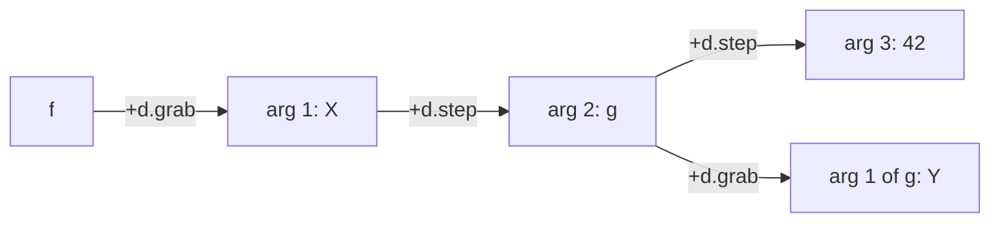
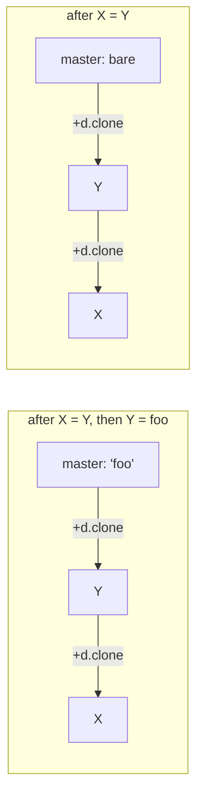
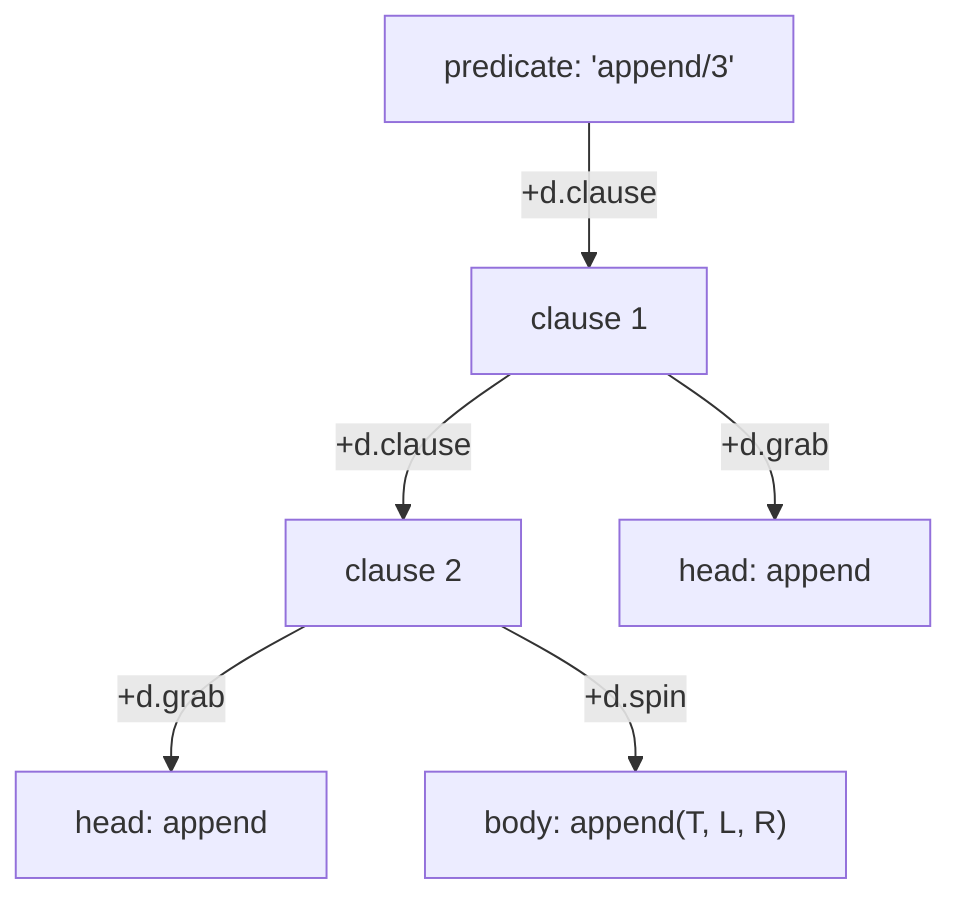

# Unification and Backtracking in Vortex

**Document Version:** 1.0 — Binding Is a Clone Link **Status:** Speculative design; nothing here is
wired into the gleditor build **Core changes required:** two methods and one vector, on a class that
does not exist yet (§8)

The original Vortex draft listed "Prolog-style unification and backtracking" as a deferred idea and
said nothing more about it. This note is the elaboration, written now because the architecture
changed underneath it in a way that makes the idea much cheaper than it was when it was deferred.

Two things happened. `d.entangle` was deleted and replaced by **`d.clone` rank traversal**, where
one master holds the content and every cell on the rank reads through it
([vortex-hyperstructural-runtime.md](vortex-hyperstructural-runtime.md) §5.2). And the store became
an **append-only operations spool folded into a manifold**, where every state has a name and two
operations naming one parent are two futures that do not destroy each other
([store-slice-convergence.md](store-slice-convergence.md)). The first of those is a variable
binding. The second is a choice point. Neither was built with logic programming in mind, and both
are exactly the mechanism a resolution engine needs.

**This is Vortex gaining elements of Prolog, not a Prolog that compiles to Vortex.** The distinction
matters and is the whole reason this is worth writing down: there is no separate term
representation, no heap, no trail, and no binding environment. A term is a cell. A variable is a
cell. A binding is a link. Resolution is a program written in Vortex's two primitives, in the same
sense that [VQL](vql-query-language.md) and [VPL](vpl-array-language.md) are — and it is held to the
same acceptance test they are (§2).

______________________________________________________________________

## Contents

- [1. What is being claimed](#1-what-is-being-claimed)
- [2. The acceptance test: `link` and `value`, and nothing else](#2-the-acceptance-test-link-and-value-and-nothing-else)
- [3. Terms](#3-terms)
  - [3.1 A term is a cell; its arguments are the Inputs Wing](#31-a-term-is-a-cell-its-arguments-are-the-inputs-wing)
  - [3.2 A variable is a cell on a `d.vars` rank](#32-a-variable-is-a-cell-on-a-dvars-rank)
  - [3.3 `deref` is `cloneMaster`, and it already exists](#33-deref-is-clonemaster-and-it-already-exists)
- [4. Unification is one link along `d.clone`](#4-unification-is-one-link-along-dclone)
  - [4.1 The four cases](#41-the-four-cases)
  - [4.2 Variable-to-variable aliasing is why the clone rank is the right mechanism](#42-variable-to-variable-aliasing-is-why-the-clone-rank-is-the-right-mechanism)
  - [4.3 Union is splicing two ranks; find is deliberately not compressed](#43-union-is-splicing-two-ranks-find-is-deliberately-not-compressed)
  - [4.4 Rational trees are the default, and the occurs check is the opt-in](#44-rational-trees-are-the-default-and-the-occurs-check-is-the-opt-in)
- [5. Backtracking is already implemented, twice, at two scales](#5-backtracking-is-already-implemented-twice-at-two-scales)
  - [5.1 Persistent: a choice point is a microversion](#51-persistent-a-choice-point-is-a-microversion)
  - [5.2 Arena: a choice point is a pair of high-water marks](#52-arena-a-choice-point-is-a-pair-of-high-water-marks)
  - [5.3 The WAM's trail condition falls out of the arena rather than being imposed on it](#53-the-wams-trail-condition-falls-out-of-the-arena-rather-than-being-imposed-on-it)
  - [5.4 Cut is one comparison against a barrier](#54-cut-is-one-comparison-against-a-barrier)
- [6. The database](#6-the-database)
  - [6.1 Clauses are a rank on `d.clause`](#61-clauses-are-a-rank-on-dclause)
  - [6.2 `assertz`, `retract`, and the logical update view for free](#62-assertz-retract-and-the-logical-update-view-for-free)
  - [6.3 First-argument indexing wants random access, which is U1](#63-first-argument-indexing-wants-random-access-which-is-u1)
- [7. Worked example: `append/3`](#7-worked-example-append3)
- [8. What the C++ core actually has to gain](#8-what-the-c-core-actually-has-to-gain)
- [9. What this buys that a conventional Prolog does not have](#9-what-this-buys-that-a-conventional-prolog-does-not-have)
- [10. Breakages and costs](#10-breakages-and-costs)
- [11. Reconciliation with the convergence](#11-reconciliation-with-the-convergence)
- [Appendix: Versioning and Change History](#appendix-versioning-and-change-history)

______________________________________________________________________

## 1. What is being claimed

| Prolog concept               | Vortex mechanism                                       | New machinery |
| ---------------------------- | ------------------------------------------------------ | ------------- |
| Compound term `f(A, B)`      | A cell holding `"f"`; arguments on `+d.grab`/`+d.step` | none          |
| Atom, integer, float         | A cell with content; a scalar cell for numbers (R6)    | none          |
| Unbound variable             | A cell on a `d.vars` rank whose clone master is bare   | none          |
| `deref`                      | `Manifold::cloneMaster()`                              | none          |
| Binding `X = T`              | One `SetLink` joining `X`'s clone rank onto `T`'s      | none          |
| Variable aliasing `X = Y`    | The same operation, in the same direction              | none          |
| The binding environment      | The clone ranks themselves; there is no other store    | none          |
| Choice point (persistent)    | A `MicroversionId`                                     | none          |
| Choice point (arena)         | Arena high-water marks                                 | `mark()`      |
| Undo on failure (persistent) | `Store::rebuildManifold(M)`                            | none          |
| Undo on failure (arena)      | `resize()` plus a conditional trail                    | `release()`   |
| The trail                    | Only writes to cells older than the mark               | one vector    |
| Retry as a new branch        | `apply(M, op)` where `M` already has a successor       | none          |
| Cut                          | A recorded barrier, compared against before undoing    | none          |
| The clause database          | A rank on `d.clause` off a predicate cell              | none          |
| `assertz` / `retract`        | Link at the rank tail / rearrange to limbo             | none          |
| The logical update view      | Resolve against the microversion of call entry         | none          |
| Tabling, memo tables         | A pinned ephemeral island (§5.6 of the Vortex spec)    | none          |

The right-hand column is the argument. Everything structural is already there; what is missing is a
way to take a cheap snapshot of an *ephemeral* manifold, because the persistent one's snapshots are
already free and are too expensive to use a million times per query (§10).

______________________________________________________________________

## 2. The acceptance test: `link` and `value`, and nothing else

VQL and VPL are each held to the rule that every construct must lower to a finite sequence of

```text
link(cell, ±dim, [target])   ->  cell_id or nothing
value(cell, [offset], [length], [replacement])  ->  cell_id
```

and that an expression which cannot be written that way is a defect in the document rather than a
feature of the language. The same rule binds this note, and it is a sharper test here than it was
there, because resolution is the first thing proposed for Vortex that has a *control* structure of
its own. The temptation is to give the engine a `unify` primitive and a `choice_point` primitive and
declare victory. The rest of this document is the claim that neither is needed:

- **Unification is a program.** §4's pseudocode calls `link`, `value` and `cloneMaster`, recursing
  over an argument rank. It is longer than a primitive would be and that is all.
- **A choice point is not an operation at all.** It is a *reading* of state the runtime already
  keeps — a microversion id, or two vector lengths. Nothing is written to take one.
- **Cut writes nothing either.** It compares.

So the logic engine adds no primitive, and the Single-Primitive Invariant survives a feature that
looks, from the outside, like it ought to break it.

______________________________________________________________________

## 3. Terms

### 3.1 A term is a cell; its arguments are the Inputs Wing

A compound term is a cell whose content is the functor name, with its arguments hanging off the
Inputs Wing of §3 of the Vortex spec: the first argument posward on `+d.grab`, the rest chained
posward on `+d.step`.



This is not a term representation invented for the occasion — it is *literally* the dual-wing
calling convention, which is what makes a goal and a term the same object in Vortex as they are in
Prolog. `call/N` needs no conversion step because there is nothing to convert, and `=..` (univ) is a
walk along `+d.step` counting cells.

Arity is the length of that rank, which means:

- An **atom** is a cell with content and no `+d.grab` link.
- A **number** is a scalar cell — content holding its shortest round-trip rendering, plus canonical
  bits in the same cell (convergence R6). Numeric unification is therefore a 64-bit comparison and
  never parses text, which is exactly why R6 put the bits there.
- A **list** is `'.'/2` in the ordinary way, or — better, and available here — a rank on a dimension
  of its own, which costs one cell per element instead of two and gives `length/2` a walk instead of
  a recursion. Both are expressible; the second is not expressible in Prolog at all.

### 3.2 A variable is a cell on a `d.vars` rank

Variablehood is **membership of a rank**, not a flag bit. This follows the precedent convergence R12
set for dimensions: a dimension is a cell on the `d.dims` rank rather than a cell with a
`isDimension` bit, because a rank is already a thing the manifold can answer questions about and a
bit is not.

So a variable is minted onto the `d.vars` rank of the scope cursor that introduced it (§4 of the
Vortex spec), and:

```text
is_unbound(C)  ==  on_vars_rank(deref(C))  and  value_is_empty(deref(C))
```

The second conjunct is what separates an unbound variable from a bound one, and the first is what
separates an unbound variable from the atom `''`. Once `C` is bound, `deref(C)` is the *term*, which
was not minted onto a `d.vars` rank, so the first conjunct fails and no separate "bound" marker is
ever written.

Note what is *not* here: §4's `d.values` axis. The Vortex spec uses `d.vars`/`d.values` as an
associative scope — a name cell on one axis, its binding on the other. A logic variable does not
want that, because a `d.values` link is a pointer to a value and a clone link *is* the value. Using
`d.values` would give two mechanisms for one idea and would lose the aliasing property §4.2 is
about. `d.vars` keeps its role as the rank that says "these cells are the variables of this scope";
`d.values` stays for ordinary imperative bindings, which are assignable and therefore genuinely a
different thing.

### 3.3 `deref` is `cloneMaster`, and it already exists

```cpp
CellRef Manifold::cloneMaster(CellRef ref, DimRef cloneDim) const noexcept;
```

It walks negward along the given dimension to the end of the rank, is bounded by the slot count, and
answers the cell it started from if the rank loops. That is `deref` — including the cycle guard,
which §4.4 needs and which was written for a completely different reason.

______________________________________________________________________

## 4. Unification is one link along `d.clone`

A clone rank has one master at its negward end; every cell on the rank reads the master's content,
and a write through any of them lands on the master and is instantly visible from all of them. That
is the semantics of a logic variable binding, stated without reference to logic programming, in a
mechanism that was designed to let a spreadsheet cell appear in two places.

**To bind `X` to `T`, splice `X`'s clone rank onto the posward tail of `T`'s.** The master of the
combined rank is `T`'s master, so `X` now reads `T`.

### 4.1 The four cases

```text
unify(A, B):
    a = deref(A);  b = deref(B)
    if a == b:                        succeed          # already the same rank
    if unbound(a):                    splice(a, b);  succeed
    if unbound(b):                    splice(b, a);  succeed
    # both bound: compare, then recurse
    if arity(a) == 0 and arity(b) == 0:
        succeed if scalar_bits(a) == scalar_bits(b)    # numbers: 64-bit compare
               or render(a) == render(b)               # atoms
        else fail
    if render(a) != render(b):        fail             # functor mismatch
    x = link(a, +d.grab);  y = link(b, +d.grab)
    while x and y:
        if not unify(x, y):           fail
        x = link(x, +d.step);  y = link(y, +d.step)
    fail if x or y                                     # arity mismatch
    succeed

splice(v, t):
    vh = walk(v, -d.clone)            # head of v's rank
    tt = walk(t, +d.clone)            # tail of t's rank
    link(tt, +d.clone, vh)            # one call
```

`splice` is **one** `link` call rather than a pair, because `Manifold::applyStructure()` writes the
reciprocal end of a dimensional link in the same operation and evicts whatever was previously linked
there. Since `tt` is a rank tail it has no posward neighbour to evict, so the single call is also
the whole of the edit. This is worth stating precisely because it is the one place where
"unification is a link" could have turned out to mean "unification is three links and a repair."

### 4.2 Variable-to-variable aliasing is why the clone rank is the right mechanism

The var–var case is the one that decides whether a binding mechanism is correct, and it is where
most naive representations fail. After `X = Y` with both unbound, and then `Y = foo`, `X` must be
`foo`. A representation that binds by copying a value has nothing to copy at the first step and no
record of the obligation; a representation that binds by pointer needs the first step to install a
pointer whose target is later overwritten, which is the destructive assignment a trail exists to
undo.

Here the first step splices two ranks whose master holds no content, and the second step writes
content to that master. The Vortex spec's own headline property for clone ranks — *creating a new
head instantly changes the value of every cell along `d.clone`* — **is** the propagation that makes
aliasing correct, and no step of it is a mutation of anything but the master's content.



### 4.3 Union is splicing two ranks; find is deliberately not compressed

What §4.1 describes is union-find. `splice` is union, in one operation and independent of rank
length. `deref` is find, and it is a walk.

A conventional union-find would now apply **path compression**: after finding the master, relink
every cell visited directly to it, making the next find O(1). Vortex will not do that, and the
reason is a principle rather than an oversight:

> **Path compression is a mutation, and every mutation of persistent structure has a name in
> hypertime.** Compressing a path would mint a `SetLink` per cell visited, which means a *read*
> would append to the operations spool, and scrubbing to an earlier microversion would show the
> compression as an edit to the document. R8 exists to forbid exactly this: navigation never
> persists.

So find is $O(k)$ for a rank of $k$ cells, against union-find's near-constant. The mitigation is
already specified and is not a compromise: **compression belongs in an ephemeral pinned island.**
§5.6 of the Vortex spec describes a `d.cache` structure held up by a cursor on `d.pinning-cursors`,
whose cells carry `ephemeralBit` and which the fold *refuses* to write into an operations spool even
if asked. A memoised `deref` lives there. It is path compression with no name in hypertime, released
by breaking one link, and it cannot leak into the document by construction.

That is the general shape of the answer whenever a logic engine wants a data structure Prolog would
put in the heap: it goes in a pinned ephemeral island, and the reason it is allowed to exist is that
it is provably not part of the document.

### 4.4 Rational trees are the default, and the occurs check is the opt-in

`X = f(X)` must either be refused (ISO Prolog, with `unify_with_occurs_check/2`), or build a cyclic
term (rational trees, what most implementations actually do by default for `=/2` because the check
costs a traversal per unification).

Vortex builds the cyclic term, and this is a deliberate divergence rather than an accident of
implementation: **a zzstructure is happy with a cycle.** `cloneMaster()` already answers the cell it
started from when the rank loops; a rank that closes on itself is a legal structure the visualizer
will draw. The occurs check is available — it is a traversal of the argument ranks looking for `a` —
and it is opt-in, on the grounds that a manifold which can represent the cyclic term has no reason
to refuse to build it.

The one thing that is *not* optional is that every traversal written for this engine must be
cycle-bounded, the way `cloneMaster()` is. A resolution engine over rational trees will meet cycles
in ordinary operation, not only in pathological programs.

______________________________________________________________________

## 5. Backtracking is already implemented, twice, at two scales

### 5.1 Persistent: a choice point is a microversion

`ops.hpp` says it, about operations rather than about search:

> Every op also names the state it applies to. That is what makes time a graph rather than a line:
> two ops naming the same parent are two futures of the same document, and neither destroys the
> other.

Read that as a description of a choice point and it is complete. Taking a choice point is *reading
the current microversion id* — no write, no allocation. Failing is `Store::rebuildManifold(M)`,
which folds the spool back to that state. Retrying is `apply(M, op)` with a different op, which
branches automatically **because the parent already has a successor**, and the first attempt remains
in the spool untouched.

There is no trail, because nothing was destroyed. There is no undo log, because the log is the whole
history and it only ever grew. The search tree is the hypertime DAG, and `d.ops_dag` — already
declared in the convergence — is the dimension along which you walk it.

### 5.2 Arena: a choice point is a pair of high-water marks

The persistent regime is semantically perfect and operationally ruinous: a binding is a 64-byte
`CompactOpNode`, and a query performing $10^6$ inferences would append tens of megabytes to the
author's operations spool, all of it search scaffolding that is not a document. R8's answer applies
directly — resolution runs in an `ArenaManifold` and only the *answer* is promoted.

An `ArenaManifold` (convergence step 21, not yet written) holds dense vectors and only ever appends.
So:

```text
Mark = (cellCount, linkArenaSize, contentArenaSize, trailSize)
mark()            ->  read four lengths
release(Mark m)   ->  resize all four back, replaying m.trailSize.. in reverse
```

**Undo is truncation.** A choice point is four integers and costs no allocation; discarding one on
success costs nothing at all. This is the WAM's cost model reached from the other direction: the WAM
allocates a choice-point frame and pushes trail entries; the arena's structure means the frame *is*
the lengths it would have recorded.

The symmetry with §5.1 is the point worth keeping: **persistent backtracking scrubs to a state that
has a name; arena backtracking truncates to one that does not.** The difference between the two
regimes is precisely whether the intermediate state deserves a name — and a failed branch of a
search does not.

### 5.3 The WAM's trail condition falls out of the arena rather than being imposed on it

Truncation alone is not enough, and the gap is instructive.

If a cell minted *before* the mark is linked to a cell minted *after* it, truncating leaves the old
cell holding a dangling reference. Binding an old variable is not an edge case — it is what head
unification does on every call. So the arena needs a trail after all, recording the previous
contents of slots it overwrites, and `release()` replays it in reverse.

But it only needs to record writes to cells **older than the mark**, because a write to a younger
cell is undone by the truncation that removes the cell entirely. The condition is one comparison:

```math
\text{trail if } \quad \mathit{cellRef} < \mathit{mark}.\mathit{cellCount}
```

This is the WAM's conditional-trailing rule, verbatim — "trail a binding only if the variable is
older than the most recent choice point" — and it arrives here as a *consequence of the arena being
an arena* rather than as an optimisation someone thought of. The common case in head unification is
binding a variable minted for this clause activation, which is younger than the mark, so it is not
trailed and the trail stays empty through most of a deterministic call.

Size: a trail entry is `(CellRef cell, DimRef dim, bool negward, CellRef old)` — 12 bytes padded to
16\. That is the entire new data structure this document asks for.

### 5.4 Cut is one comparison against a barrier

Cut discards the choice points created since entry to the current predicate, **without undoing the
bindings made under them**. That distinction is what makes cut awkward in implementations that
conflate the choice-point stack with the undo mechanism.

Here they are already separate. In the arena regime, a cut pops the *mark stack* down to the mark
recorded at predicate entry, and merges each discarded mark's trail segment into the enclosing
mark's rather than replaying it — the trail entries still matter to any outer choice point, they
just no longer have an inner one to serve. No cell is touched and no binding is undone.

In the persistent regime a cut records the entry microversion as a barrier, and the failure handler
refuses to scrub past it. One comparison on a `MicroversionId`.

Both spellings are a change to a stack the engine keeps for itself, so cut — like a choice point —
writes nothing to the manifold.

______________________________________________________________________

## 6. The database

### 6.1 Clauses are a rank on `d.clause`

A predicate is a cell; its clauses are a rank posward from it along **`d.clause`**, the one new
dimension this design introduces. Introducing it costs no code: R12 made a dimension a cell on the
`d.dims` rank, so minting one is `MakeCell` plus `SetLink` and nothing in C++ learns its name.

A clause cell's content is unread; its head hangs off `+d.grab` and its body off `+d.spin`, which
means a clause body is an instruction stream in exactly the sense §1 of the Vortex spec already
means — `d.spin` is the process instruction stream, and a conjunction of goals is a rank along it.
Trying the clauses in order is a walk posward. There is no "next clause" pointer to save in a choice
point, because the choice point is a state and the position in the rank is part of that state.

### 6.2 `assertz`, `retract`, and the logical update view for free

`assertz` links a clause cell at the posward tail of the rank. `asserta` links it at the head.
`retract` is `link(clause, ±d.clause, 0)` — which is REARRANGE TO LIMBO, OSMIC's actual name for
deletion, so **the retracted clause is still in the spool** and the microversion before the retract
still has it.

That last fact disposes of the single fiddliest requirement in ISO Prolog. The **logical update
view** says a call must see the clauses as they were when the call was made, regardless of what
subsequent `assert`s and `retract`s do during backtracking into it. Implementations satisfy it with
generation counters on clauses, death stamps, and a reclamation scheme for clauses that are dead but
still visible to an active call.

Here it is: *resolve against the microversion the call entered with.* A generation counter is a
microversion id that the store was already keeping, clause death is a link the spool already
remembers, and reclamation is unnecessary because nothing is reclaimed. The hardest part of the
specification is a consequence of append-only-ness.

### 6.3 First-argument indexing wants random access, which is U1

Selecting candidate clauses by the principal functor of the first argument is what makes Prolog fast
on large fact tables. It wants a hash from a key to a set of clauses.

A rank cannot answer that. Convergence **U1** is exactly this open question: a rank answers
successor and predecessor, not "the *n*-th thing" or "the one matching this key," so clause
selection over a rank of $n$ facts is $O(n)$ per call. VPL hit the same wall from the array side
(`A[5000]` walks five thousand cells) and this is the same workload from the logic side.

The mitigation is §4.3's again — an index is a pinned ephemeral island keyed by the canonical scalar
bits or the functor's content hash, rebuilt lazily and released by breaking one link — and the
honest statement is that **two independent surface languages now want the same primitive from U1**,
which is the strongest argument yet for resolving it rather than deferring it further.

______________________________________________________________________

## 7. Worked example: `append/3`

```prolog
append([], L, L).
append([H|T], L, [H|R]) :- append(T, L, R).
```

The database, as cells:



Solving `append(X, Y, [a, b])`:

1. `mark()` — four integers read, nothing written. Try clause 1.
1. Head unification: `X = []`, `Y = L`, `L = [a, b]`. Three `splice` calls, one `link` each. The
   first binds a caller variable — older than the mark — so it is **trailed**; `L` was minted for
   this activation and is younger, so it is not.
1. Clause 1 succeeds. First solution: `X = []`, `Y = [a, b]`, read off by `render(deref(X))`.
1. The caller asks for another. `release(mark)` — three vector truncations and one trail entry
   replayed. `X` and `Y` are unbound again, and the cells minted for clause 1's variables are gone
   from the arena entirely rather than garbage.
1. Walk `+d.clause` to clause 2, `mark()` again, and recurse. The recursive call's mark sits above
   this one; its own bindings to `T`, `L`, `R` are untrailed for the same reason as step 2.
1. Three more solutions, then the clause rank is exhausted, the last `release` returns the arena to
   its state before the query, and the engine reports failure.

Total persistent writes across the whole query: **zero**, until the caller promotes an answer.

Now the part a conventional Prolog cannot do. Run the same query in the *persistent* regime and
every step above has a microversion id. The failed attempt at clause 1 for a non-empty first
argument is still in the spool; `xudu-dump --section=ops` will render it; `d.ops_dag` walks from the
query's root to each of the four solutions and to each dead end. **The search tree is a document.**
That is an interactive debugger for a logic program, and nobody wrote it — it is what the store does
with every operation it is given.

______________________________________________________________________

## 8. What the C++ core actually has to gain

The brief for this document was "as few changes to the C++ core as possible." The answer is:

**Nothing in `ops.hpp`, `compact_op.hpp`, `binary_ops.cpp`, `Store`, `Manifold`, the wire format, or
any on-disk format changes at all.** No new `OpKind`, no new `StructureVerb`, no flag bit, no format
version bump, no fixture regeneration.

What is added, entirely inside `ArenaManifold` — **a class that does not exist yet**, since it is
convergence step 21:

1. `Mark mark() const` — reads four vector lengths.
1. `void release(Mark)` — resizes four vectors, replaying the trail tail in reverse.
1. `std::vector<TrailEntry> trail_` — 16 bytes per entry, appended only when the written cell is
   older than the innermost mark.

That is the whole bill, and being able to present it this way is the entire reason the idea was
worth revisiting now rather than when it was deferred. Adding two methods to a class before it is
written is free; adding them to `Manifold` after seventeen fixtures depend on its layout is not. **A
speculative feature that lands its requirements on an unwritten class has found the cheapest moment
it will ever have.**

Everything else — unification, term shape, clause selection, cut, negation as failure, the occurs
check, tabling — is a program over `link` and `value`, per §2.

______________________________________________________________________

## 9. What this buys that a conventional Prolog does not have

- **The search tree is inspectable after the fact.** §7. In the persistent regime every attempted
  derivation has a name and still exists, so "why did this query fail" is a navigation problem
  rather than a re-run-under-a-tracer problem.
- **The logical update view is free.** §6.2, and it is the requirement implementations find hardest.
- **Bindings can be transclusions.** `value(cell, offset, length)` yields an ephemeral cell quoting
  a *range* of another cell's content, so unifying against a substring shares addresses instead of
  copying characters. Prolog copies terms into the heap; here a term is an address, and two terms
  that share a passage are visibly the same passage.
- **Terms have structure Prolog cannot express.** A list can be a rank rather than nested `'.'/2`
  cells; a term can carry links on dimensions the resolution engine never looks at, which is how a
  clause can also be a paragraph in a document.
- **Multiple solutions are a rank.** Enumerating them is walking `d.ops_dag`, so "all solutions" is
  a traversal rather than a control-flow trick, and a solution set can be handed to
  [VQL](vql-query-language.md) or [VPL](vpl-array-language.md) without leaving the manifold.
- **Memo tables have a lifetime that is neither "this query" nor "forever."** §5.6's pinned islands,
  which is what SLG resolution's tables want and what a heap cannot offer.

______________________________________________________________________

## 10. Breakages and costs

Stated in the same spirit as VPL §5 — these are real, and two of them are gating.

1. **`deref` is $O(k)$ in the clone rank's length, not near-constant.** §4.3. Path compression is a
   mutation and therefore refused on persistent structure; the ephemeral-island workaround is
   specified but unbuilt. A program that aliases a long chain of variables pays for it.
1. **Clause indexing needs random access by key, which U1 has not resolved.** §6.3. Without it,
   resolution over a large fact base is linear in the number of facts per call, which is the
   difference between a toy and a usable engine.
1. **Persistent-regime resolution is unaffordable at scale.** §5.2. $10^6$ inferences is $\approx$
   64 MB of operations, and it is *correct* — this is the regime with the inspectable search tree —
   so the interesting question is not how to avoid it but how to bound it. A plausible answer is to
   run in the arena and promote only the derivation of a *found* answer, giving a proof term without
   the dead ends; that is not specified here.
1. **This document is gated on step 21.** `ArenaManifold` and `promote()` do not exist. Everything
   in §5.2, §5.3, §4.3 and §6.3's mitigation is written against a class that is a design note. So is
   [VPL](vpl-array-language.md), for the same reason, and so is VQL's own write path. Step 21 is now
   blocking three documents.
1. **Rational trees diverge from ISO.** §4.4, deliberately, and it means a program ported from a
   conforming Prolog can loop where it would have failed.
1. **Nothing here addresses the standard library, exceptions, or arithmetic evaluation.** `is/2`
   over scalar cells is straightforward given R6's canonical bits and is simply not written up;
   `catch/3` interacts with the mark stack in ways that want their own section.

______________________________________________________________________

## 11. Reconciliation with the convergence

- **R5 (`noCell == 0`)**: `link(..., 0)` is `retract`, and "there is no cell zero" is why absence
  needs no sentinel in a clause rank.
- **R6 (scalar cells)**: numeric unification is a 64-bit comparison, never a parse, because the
  canonical bits sit in the cell beside the rendering.
- **R7 (micro-history chain)**: a cell's `lastOp` chain means "how did this variable come to be
  bound" is answerable per cell, not only per query.
- **R8 (only user-generated updates persist)**: the governing constraint of §5.2 and §4.3. It is why
  resolution belongs in the arena and why path compression may not touch the document.
- **R11 (bump the version, delete the old reader)**: not invoked. This design bumps no format, which
  is the strongest thing §8 has to say for itself.
- **R12 (a dimension is a cell on `d.dims`)**: `d.clause` costs no code, and §3.2 follows the same
  precedent for variablehood.
- **U1 (random access along a rank)**: §6.3. Now wanted by both VPL and this document.
- **U3 (a cell's content is a run of spans)**: `Splice` is what lets a term's content be edited
  without severing the addresses a transclusion-binding shares, so §9's third bullet depends on U3
  having been resolved the way it was.
- **Step 21 (`ArenaManifold` + `promote()`)**: gating, per §10.4.

______________________________________________________________________

## Appendix: Versioning and Change History

The rule is the one [VQL](vql-query-language.md) and [Vortex](vortex-hyperstructural-runtime.md)
use:

- **Major** — a change a conforming implementation could not ignore: a mechanism gains, loses or
  changes meaning; a core requirement is added or withdrawn.
- **Minor** — an addition that breaks nothing, a refinement, a clarification, a correction to prose
  in a normative section, punctuation.

Editorial changes that alter no normative text bump neither component.

| version | commit    | date       | change                                                                      |
| ------- | --------- | ---------- | --------------------------------------------------------------------------- |
| 1.0     | `734513a` | 2026-09-11 | Initial specification: binding as a clone link, backtracking as truncation. |
