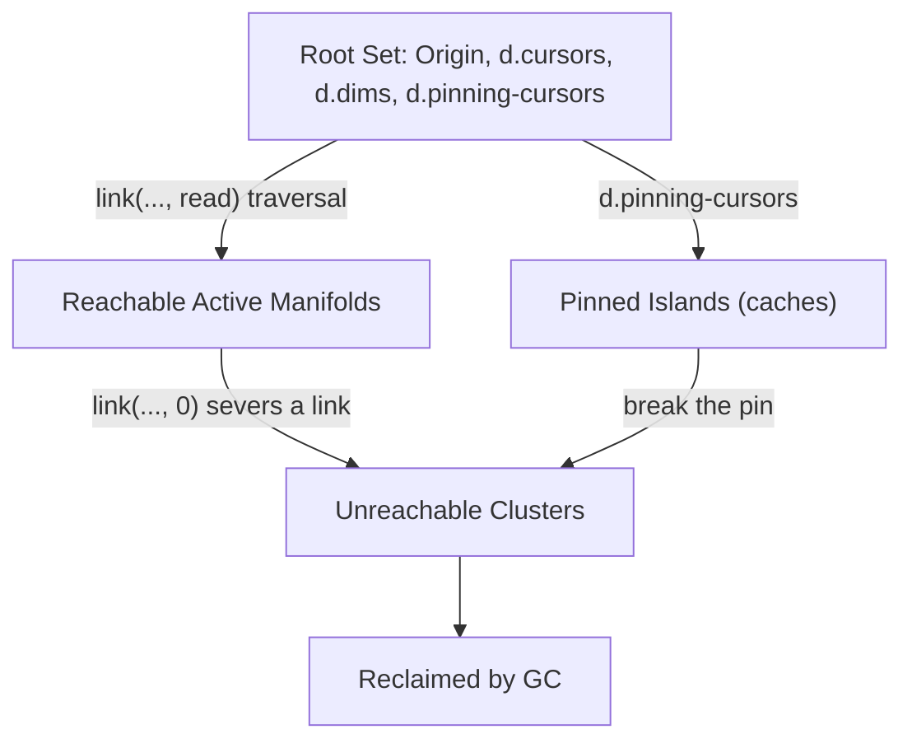

# Vortex Query Language (VQL) Specification

**Document Version:** 12.0 — Placement, Yield and Clone Ranks **Compilation Target:** Vortex
Hyperstructural Runtime Core (Single-Primitive Matrix Manifold)

VQL is the declarative, XQuery-like companion language for
[Vortex](vortex-hyperstructural-runtime.md): every VQL query compiles down to the same
`link`/`value` primitives that make up Vortex's two-primitive core. As with the Vortex spec, this
document specifies a language design consuming the Zigzag `zzstructure` manifold model (see
[zigzag-multidimensional-space-and-projection.md](zigzag-multidimensional-space-and-projection.md));
nothing here is wired into the gleditor build.

The language rests on three design choices: a single directional traversal operator (`/`, with
direction carried by a sign on the dimension name rather than a second token), `%` creation sugar so
a path can extend the manifold instead of only reading it, and a Xanalogical mutation model —
`weave`, ordinary path expressions evaluated for effect — in place of an XQuery-style `update { }`
block, since a query and an edit are the same kind of walk over the same primitives.

> **§7 reconciles this specification with
> [`store-slice-convergence.md`](store-slice-convergence.md)**, which makes a zigzag cell an
> operation in the xudu ops spool. The grammar is unaffected; what moves is which cells a mutation
> is allowed to persist into, what `##` resolves to, and what `><` is built on. Read it alongside
> §1's invariants.

______________________________________________________________________

## 1. Architectural Foundations & Operational Invariants

Vortex Query Language (VQL) is a declarative, zero-allocation path navigation and graph mutation
language tailored specifically for **zzstructures** (multidimensional bidirectional graphs). VQL
queries do not evaluate into ephemeral tabular heaps, relational tuples, or serialized JSON arrays.
Instead, every query expression compiles down to spatial traversals, generator pipelines, and link
mutations driven by the atomic engine:

```math
\mathcal{M} = \langle \text{link}, \, \text{get}, \, \text{set} \rangle
```

### Fundamental Invariants

- **The Single-Primitive Core**: Path traversal and every mutation, update, insertion, and
  allocation compile strictly to `link(cell, dim, dir, [target])` — reading if `target` is omitted,
  and otherwise writing: `target == -1` allocates, `target == 0` isolates — **`0` is the absence of
  a cell, not a sentinel standing in for one (R5), so "link this at nothing" and "link this at cell
  zero" are the same instruction** — and any other value links straight to that cell. `link` returns
  the linked/allocated/broken cell, or nothing if there wasn't one; VQL treats an empty result the
  same way any other step that "returns nothing" is treated (§3).
  `value(cell, [offset], [length], [replacement])` is the matching content primitive — one call for
  both directions, answering in a `cell_id` either way, so a write composes in a path like anything
  else — see Vortex §2's `get_cell_value`/`set_cell_value`, renamed here to match how they're
  spelled in every VQL surface form. Vortex §2 also defines
  `new(cell, dim, dir, [value])`/`break(cell, dim, dir)` as named entry points fixing `link`'s
  `target` to `-1`/`0` respectively (`new`'s optional `value` is a `value()` applied to the freshly
  allocated cell); VQL reaches all three the same way — as ordinary `FunctionInvocation`s (§3) — so
  `$cell/break(d.foo, +1)` and `$cell/link(d.foo, +1, 0)` compile to the same call.
- **Dual-Wing Invocation Topology**: Built-in functions, custom routines, and opcodes adhere to the
  dual-wing interface. Out-parameters project negward along `-d.grab` (chained posward along
  `+d.step` for multiple returns). In-parameters project posward along `+d.grab` and chain along
  `+d.step`.
- **Snapshot-Before-Write Execution**: When updating nodes in-place or writing query projections,
  all input operand payloads are fully dereferenced and snapshotted prior to invoking `value()` or
  mutating pointers, preventing self-aliasing hazards.
- **Associative Cursor Scopes**: Query variables are not stored in stack frames or hash lookups.
  They resolve directly against the active Spin-Head cursor along `+d.vars`, with bound payloads or
  complex subgraphs projecting perpendicularly along `+d.values`.
- **Shared Identity by Clone Rank (`d.clone`)**: `$a><$b` joins two cells on a `d.clone` rank —
  sugar for `link($a, d_clone, +1, $b)` directly (§4.6). A clone holds no content of its own: it
  reads the rank's **master**, found by walking `d.clone` negward until nothing precedes. So setting
  any member's content sets the master's, and every member sees it at once, across all viewports and
  observer ranks — not because they share a pointer, but because they were always reading the same
  cell. Link a new cell negward of the master and it *becomes* the master: every cell on the rank
  changes value in that one operation, with nothing copied and nobody notified.
- **Zero-Allocation Lazy Rank-Streaming**: A path step (`/dim`) does not materialize an intermediate
  collection. It instantiates an $O(1)$ spatial cursor that lazily yields matching `cell_id`
  coordinates along `dim`'s entire rank until `link`'s read form returns nothing or a loopback
  boundary is reached — a single `/` step already walks the whole rank, not one hop of it. Absence
  of a link, not a `cell_id` of `0`, is what ends the stream, so a rank can freely pass through Cell
  0 without truncating early.
- **Xanalogical Mutation**: VQL does not have a separate "update" sublanguage. `%` creation sugar
  and `link`/`set` calls are ordinary path steps with side effects; a query that reads and a query
  that writes are the same grammar, evaluated under `return` or `weave` respectively. This mirrors
  the rest of the system: an edit is a walk that happens to allocate and link, not a different kind
  of operation layered on top of the read path.
- **Persistent Star-Pivot Caching**: Expensive generative transformations (e.g., regex compilation
  or macro expansions) memoize their topological results along `+d.cache`, anchoring invocation
  nodes to input and output manifolds. The rank hangs off a detached head cell held up by a named
  pin on `d.pinning-cursors`, **not** off the origin — an origin-anchored cache is immortal, since
  the origin is in the Root Set. See §7.5.

______________________________________________________________________

## 2. Syntactic Token & Structural Shorthand Matrix

| Token / Operator       | Structural Equivalent             | Functional & Spatial Semantic Mapping                                                                                                                                                          |
| ---------------------- | --------------------------------- | ---------------------------------------------------------------------------------------------------------------------------------------------------------------------------------------------- |
| `##`                   | Origin Anchor (`home`)            | Grounds query context to the system origin: a minted genesis cell. Never `0`, which is the absence of a cell -- see §7.2.                                                                      |
| `#`                    | Root Metacells                    | Lazily streams all disjoint root manifold entry points across the matrix.                                                                                                                      |
| `^`                    | Process Manifold (`d.cursors`)    | Streams all active Spin-Head execution cursor threads. Never a pinning cursor -- those are on their own Root Set rank, `d.pinning-cursors` (§7.5).                                             |
| `^NAME`                | `^[./d.name[. = "NAME"]]`         | Short-circuits the cursor scan, locking directly onto the named thread node. A cursor is named by a cell on its `d.name` rank rather than by its own content -- §6.1 spells the long form out. |
| `.`                    | Context Identity                  | The current step's context cell — a valid anchor on its own, or `render(context)` when a host value is wanted.                                                                                 |
| `/dim`                 | `LazyRankStream(dim, posward)`    | Traverses `dim`'s entire rank posward from the context cell.                                                                                                                                   |
| `/-dim`                | `LazyRankStream(dim, negward)`    | Traverses `dim`'s entire rank negward — the `-` binds to the dimension name, not the operator.                                                                                                 |
| `/dim%`                | Create (`link(., dim, dir, -1)`)  | Allocates a new cell along `dim` (at the tail of any existing rank); see §4.5.                                                                                                                 |
| `/dim%VALUE`           | Create + init                     | Allocates and initializes a new cell's content to `VALUE` — bare, quoted, or `$variable`.                                                                                                      |
| `/dim%%...`            | Batch create                      | Each additional `%` allocates one more cell along `dim`; all of them join the step's result set — see §4.5.                                                                                    |
| `A><B`                 | Clone (`link(A, d_clone, +1, B)`) | Puts `A` and `B` on one clone rank, so both read its master; chainable (`A><B><C`) and combinable with `%` — see §4.6.                                                                         |
| `.[offset, length]`    | `value(ctx, off, len)`            | A slice, answered as an ephemeral cell quoting that range of addresses — a transclusion, not a copy.                                                                                           |
| ~~`@`~~                | *retired*                         | Was "the numerical `cell_id` of the context node". A cell reference *is* a `cell_id`, so this was `.` spelled twice — see §7.6.                                                                |
| `[...]`                | Predicate / Index Window          | Applies inline boolean filters or relative index clamps to a stream. Negative indices count from the end, `-1` being the last cell, so `[1, -2]` is every cell but the last.                   |
| `dim::tail/head/fixed` | Placement                         | Where on the rank a step acts, and whether the path's context follows. `::tail` is the default and is what `%` used to do silently — see §4.5.                                                 |
| `any/all/none(...)`    | Predicate Assertion               | Quantifies a stream instead of leaving the quantifier implied by position — see §4.3, and the reason `[. != $x]` is not the negation of `[. = $x]`.                                            |
| `(...)`                | Macro Dimension Group             | Groups dimensional sequences into a compound traversal segment.                                                                                                                                |
| `*`                    | Kleene Repetition                 | Repeats the preceding macro group zero or more times until termination.                                                                                                                        |
| `{...}`                | Weave Block                       | Groups a comma-separated list of effect items under `weave`.                                                                                                                                   |

There is a single traversal operator: `/` already walks a whole rank, so there is no "one hop" form
to distinguish it from, and direction is a property of the dimension name (an optional leading `-`),
not a second operator. Recursive or compound repetition is `(...)*`'s job (§3).

______________________________________________________________________

## 3. Formal EBNF Grammar

```
QueryExpression       ::= ExecutionBlock | PathExpression

ExecutionBlock         ::= ( ForClause | LetClause )+ WhereClause? ActionClause

ForClause              ::= "for" VariableRef "in" PathExpression
LetClause              ::= "let" VariableRef ":=" ( PathExpression | ValueExpr )
WhereClause            ::= "where" BooleanExpr ( ( "and" | "or" ) BooleanExpr )*
ActionClause           ::= ReturnClause | EffectClause | ConditionalClause

ReturnClause           ::= "return" ReturnItem ( "," ReturnItem )*
ReturnItem             ::= PathExpression | FieldWeave
FieldWeave             ::= PathStep+

EffectClause           ::= "weave" ( EffectItem | "{" EffectItem ( "," EffectItem )* "}" )
EffectItem             ::= LetClause | PathExpression | ForClause EffectClause

ConditionalClause      ::= "if" BooleanExpr ActionClause ( "else" ActionClause )?

PathExpression         ::= AnchorNode PathStep* CloneTail?
AnchorNode             ::= "##" | "#" | NamedCursor | VariableRef | LiteralCellId | "."
NamedCursor            ::= "^" [a-zA-Z_][a-zA-Z0-9_]*
VariableRef            ::= "$" [a-zA-Z_][a-zA-Z0-9_]*
LiteralCellId          ::= [0-9]+

PathStep               ::= "/" StepSelector PredicateClause* RangeClamp? Yield?
StepSelector           ::= SignedDimension CreateSuffix? | MacroDimensionGroup | FunctionInvocation
SignedDimension        ::= "-"? DimensionIdentifier Placement?
Placement              ::= "::" ( "from" | "rank" | "head" | "tail" )
Yield                  ::= "!" ( "new" | "last" | "both" | "keep" )?
                                   (* what the step hands on; bare "!" is "!keep" *)
CreateSuffix           ::= ( "%" CreateValue? )+
CreateValue            ::= ValueExpr | BareLiteral
BareLiteral            ::= (run of characters excluding whitespace, "%", ",", "(", ")", "[", "]", "{", "}")

CloneTail               ::= ( "><" CloneOperand )+
CloneOperand            ::= PathExpression | BareCreate
BareCreate              ::= "%" CreateValue?

DimensionIdentifier    ::= [a-zA-Z_][a-zA-Z0-9_]* ( "." [a-zA-Z_][a-zA-Z0-9_]* )*
MacroDimensionGroup    ::= "(" PathStep+ ")" RepetitionModifier?
RepetitionModifier      ::= "*" | "+" | "?"

PredicateClause        ::= "[" BooleanExpr "]"
RangeClamp             ::= "[" IndexParam ( "," IndexParam )? "]"
IndexParam             ::= "-"? [0-9]+

BooleanExpr            ::= BooleanTerm ( "or" BooleanTerm )*
BooleanTerm            ::= BooleanFactor ( "and" BooleanFactor )*
BooleanFactor           ::= "not"? ( ComparisonExpr | PredicateTest )
ComparisonExpr         ::= ValueExpr CompOp ValueExpr
CompOp                 ::= "=" | "!=" | "<" | ">" | "<=" | ">="
PredicateTest          ::= PathExpression | "." | ExtendedTruthinessCheck | FunctionInvocation

ExtendedTruthinessCheck ::= "?" ( PathExpression | ValueExpr )

ValueExpr              ::= PathExpression | ScalarLiteral | VariableRef | FunctionInvocation
ScalarLiteral           ::= StringLiteral | NumericLiteral | BooleanLiteral
StringLiteral           ::= '"' [^"\\]* '"'
NumericLiteral          ::= ("-" | "+")? [0-9]+ ( "." [0-9]+ )?
BooleanLiteral          ::= "true" | "false"

FunctionInvocation      ::= Identifier "(" ArgumentList? ")"
                          (* any/all/none are ordinary invocations taking a
                             PathExpression -- no new grammar, see §4.3 *)
ArgumentList            ::= ValueExpr ( "," ValueExpr )*
```

A few grammar points worth calling out explicitly:

- **A bare `PathExpression` is a complete query.** `##/d.people[. = "Alice"]` is valid on its own —
  no `for`/`return` ceremony required for a one-off traversal. Chaining a function onto a path is
  just another step (`$path/func()`, reachable via `StepSelector`'s `FunctionInvocation`
  alternative), applied per cell in `$path`'s stream and terminating to an empty set wherever `func`
  returns nothing — the same map-and-terminate behavior every other `PathStep` already has, so there
  is no separate pipe-forward operator layered on top of it.
- **Direction lives on `SignedDimension`'s optional leading `-`.** `/-d.parent` traverses `d.parent`
  negward; there is no second traversal operator for it.
- **`.` is a valid `AnchorNode`.** This is what lets a predicate step *into* a dimension from its
  own candidate cell — `[./d.inputs[. = $pattern]]` reads as "this candidate's `d.inputs` rank has a
  member equal to `$pattern`."
- **A `FunctionInvocation` reached via `StepSelector` takes its context implicitly, and there is
  nothing left to choose.** If its `ArgumentList` does not already open with an explicit `.`, the
  context cell is prepended as the first argument. That rule used to have a branch — prepend `@` for
  a function whose first parameter expects a cell, `.` for one expecting a value, fixed by the
  declared signature — and the branch is gone, because **every function's first parameter is a cell
  now.** `value()` is cell-in and cell-out (Vortex §1), and the content wrappers over it are too. So
  `$cell/link(d.foo, +1, $target)` means `link(., d.foo, +1, $target)`, and `$path/value("foo")` and
  `$path/append("bar")` need no explicit context argument for the same reason rather than for a
  different one. Mutation is not a separate "statement" grammar competing with the "expression"
  grammar; it's the same PathExpression machinery, evaluated for effect under `weave` instead of for
  value under `return`.
- **`NumericLiteral` accepts a leading `+`.** Every example writes directions as `+1`/`-1` for
  visual symmetry, so the grammar accepts the `+` explicitly rather than relying on it being
  optional-and-ignored.
- **`><` is a suffix on `PathExpression`, not a `PathStep`.** `CloneTail` binds after all
  `PathStep`s have run, so `$a><$b` clones the *results* of `$a` and `$b`'s full paths, not an
  intermediate cell partway through either one. See §4.6 for the creation-combining forms
  (`%VALUE><$a`, `$a><%VALUE`).

______________________________________________________________________

## 4. Evaluation Semantics & Compilation Rules

### 4.1 Lazy Rank-Streaming Engine

`/dim` and `/-dim` compile to the same loop; the sign only picks `direction`:

```cpp
cell_id current = start_node;
int direction = signed_dimension.negated ? -1 : +1;
cell_id target_dim = signed_dimension.dim;
while (true) {
    std::optional<cell_id> next = link(current, target_dim, direction);
    if (!next || *next == start_node) break; // Terminate on absence or loopback
    if (eval_predicates(*next)) {
        yield *next;
    }
    current = *next;
}
```

`start_node` is an ordinary cell — `##` resolves to the minted `home` cell, never to zero (§7.2) —
and the loop terminates purely on `link`'s read form returning nothing rather than on a `cell_id`
value, so nothing here has to special-case anything.

- **Index Clamping (`[n]`)**: Evaluated lazily with 1-based indexing, **over the stream the step
  yielded** — which is to say over the cells that matched, after any predicate, not over the rank
  they were drawn from.

  - `[1]`: the first matching cell. Short-circuits traversal, so a dense rank is not walked further
    than it has to be.
  - `[-1]`: **the last match.** An earlier draft said "scans to the rank tail, returning only the
    final matching coordinate", which is the same answer only when nothing filtered the stream.
    `d.name[. = "x"][-1]` is the last cell that *matched*, and if the rank's actual tail did not
    match then `[-1]` must not return it. Wanting the rank's tail regardless of matching is a
    different question with its own spelling now: `d.name::tail`. Wanting the last cell of the
    *whole* rank rather than of the walk from the context is `d.name::rank[-1]` — and the fact that
    those are three distinct questions, all previously spelled `d.name[-1]`, is the reason for
    §4.5's placements.
  - `[start, end]`: an index-windowed slice over the matching elements, inclusive, with negative
    indices counting from the end — `[1, -2]` is every match but the last.

  The two readings were previously the same token doing two jobs, exactly as `dim` was under `%`.
  Indices belong to the stream; placement belongs to the rank.

### 4.2 Slicing Semantics

VQL supports zero-copy virtual slicing on text payloads:

- **Direct Path Step**: `$node/.[offset, length]` calls `value($node, offset, length)`, which
  answers an ephemeral cell quoting that range rather than a string.
- **Mutation Patching**: `$node/value(replacement, offset, length)` calls
  `value($node, offset, length, replacement)` and **returns `$node`**, so a path continues through
  the write: `$path/value("foo")/d.bar%`. Numeric and boolean variants ignore offsets and lengths
  entirely.

### 4.3 Extended Truthiness Rules

Predicates evaluate conditions according to canonical truthiness semantics:

- **Truthy**: `true`, non-zero double, and case-insensitive strings: `"true"`, `"1"`, `"yes"`,
  `"on"`. Unrecognized non-empty strings default to true. A bare `PathExpression` used as a
  condition (`PredicateTest`) is truthy if it selects at least one cell, independent of that cell's
  own content.
- **Falsy**: `false`, `0.0`, empty string `""`, and case-insensitive strings: `"false"`, `"0"`,
  `"no"`, `"off"`. A `PathExpression` used as a condition is falsy if it selects nothing.

A direct scalar comparison like `where $inv/d.inputs = $pattern` is a type error in intent even
where it happens to parse: `$inv/d.inputs` is a rank, not a value, and may stream zero, one, or many
cells. The correct form filters the rank with a predicate and lets its non-emptiness stand for the
condition — `where $inv/d.inputs[. = $pattern]` — or binds a single dereferenced value first with
`let` before comparing it.

#### The quantifier that form hides, and the three that name it

`where <stream>` is truthy when the stream selects at least one cell, so
`where $inv/d.inputs[. = $pattern]` is **existential**: *some* input equals the pattern. That is
usually what is wanted and it reads well, but the quantifier is implied by position rather than
written, and one consequence of leaving it implied is a trap:

> **`[. != $x]` is not the negation of `[. = $x]`.** The first is "some member differs from `$x`",
> the second "some member equals `$x`", and a rank holding `"a"` and `"b"` satisfies *both*.
> Negating a filter negates the comparison, not the quantifier, and the quantifier is the part that
> was never written down.

So VQL has three predicate assertions, each taking a stream and answering a boolean:

| form             | true when                                                          |
| ---------------- | ------------------------------------------------------------------ |
| `any(<stream>)`  | at least one cell is selected — what bare truthiness already means |
| `all(<stream>)`  | every cell in the *source* rank satisfies the predicate            |
| `none(<stream>)` | no cell does; exactly `!any(...)`                                  |

`none($inv/d.inputs[. = $x])` is what `[. != $x]` is usually mistaken for, and
`all($inv/d.inputs[. = $x])` has no spelling in the filtering form at all — which is the real
argument for having them, rather than mere explicitness.

Two rules worth stating rather than discovering:

- **`all()` over an empty rank is true**, as vacuous truth requires. An invoice with no inputs
  satisfies "all inputs match the pattern". If that is the wrong answer for a query, the query wants
  `all(...) and any(...)`, and having to write that is the point — the alternative is an `all()`
  that quietly means something else for one input size.
- **`all()` needs the source rank, not just the filtered stream**, since a filter discards exactly
  the cells that would falsify it. It is therefore defined over a `PathExpression` whose final step
  is a predicate: `all($path/d.dim[<test>])` compares the count the predicate kept against the count
  `$path/d.dim` yields. A stream with no predicate on its final step is all-true trivially.

Bare truthiness is left alone and is not deprecated: it *is* `any()`, it reads naturally in `where`,
and rewriting every existing query to say so would add a word to each without adding a fact. Write
the quantifier when a reader might otherwise assume a different one.

### 4.4 Result Materialization: Topological Return Weaving

`return` avoids heap allocations or string serializations, and it does not introduce a JSON-shaped
literal that has nothing to do with the cell model it's returning from:

1. The engine instantiates an Invocation Result Cell appended posward along the active cursor's
   `+d.results` rank.

1. A `PathExpression` return item (e.g. `return $status_code`) links its resolved value posward off
   the invocation cell along `+d.values` — the scalar-return case.

1. A `FieldWeave` return item — a bare chain of `PathStep`s with no anchor, always starting with `/`
   — is implicitly rooted at the Invocation Result Cell instead of the current query context. This
   is what lets a multi-field result be written as ordinary `%`-creation (§4.5) rather than a
   bracketed record literal:

   ```
   return
       /d.vars%"worker_id"/d.values%$worker,
       /d.vars%"status"/d.values%$status_code
   ```

   Each item creates a labeled `d.vars` cell off the result cell and pairs it with a `d.values` cell
   holding the projected value — exactly the same `d.vars`/`d.values` shape Vortex §4 uses for
   cursor scopes, so a query result and a variable scope are the same structure, walkable the same
   way.

### 4.5 Cell Creation Sugar (`%`)

`%`, suffixed onto a `SignedDimension` step, is sugar over allocation:

- **Bare (`/dim%`)**: `link(., dim, dir, -1)`. Applied once per cell in the current context stream
  (like any other step).

- **Initialized (`/dim%VALUE`)**: the same allocation, immediately followed by
  `value(., 0, -1, VALUE)` on the newly allocated cell. `VALUE` may be a bare token
  (`/d.status%OK`), a quoted string when it contains spaces or punctuation
  (`/d.status%"needs review"`), or a variable (`/d.status%$value`).

- **Placement (`::from`, `::rank`, `::head`, `::tail`)**: which cells on the rank the step acts on.
  Every one of them means something whether or not a `%` follows, which is what makes them one
  family; whether the context *follows* a create is a different axis and has its own spelling below.

  This is the rule that used to be called *tail-seeking* and was **implied by `%` rather than
  written**: if the context cell already had a link along `dim`, `%` silently walked to the tail of
  that rank and allocated there. The behaviour was right — without it a loop calling `/d.step%$ch`
  per character overwrites one cell instead of building a chain — but it meant **`dim` denoted two
  different things depending on the operator applied to it**: the rank reachable from the context in
  a read, and that rank's tail cell under a `%`. One token, two meanings, chosen by something at the
  other end of the step.

  | placement | selects                                                         | on a create  |
  | --------- | --------------------------------------------------------------- | ------------ |
  | `::from`  | the cells from the context outward, in the step's direction     | —            |
  | `::rank`  | every cell on the rank, head to tail, wherever the context sits | —            |
  | `::head`  | the rank's negward-most cell                                    | insert there |
  | `::tail`  | the rank's posward-most cell                                    | append there |

  **The defaults differ by position, and that asymmetry *is* the old ambiguity — now visible.** A
  read defaults to `::from` and a create to `::tail`, which is exactly what `dim` already meant in
  each place. Nothing existing changes meaning; what changes is that the two readings have names, so
  a query that wants the other one can say so.

  **`::from` against `::rank`.** `::from` walks outward from where you are, so a context in the
  middle of a rank sees only what is ahead of it in the step's direction — which is what you want
  for "the rest of the document from here". `::rank` is every sibling on that dimension regardless
  of where the context sits: it seeks to the head first and streams to the tail. The step's sign
  still applies, but to the *order* rather than the extent — `-d.name::rank` is the whole rank
  emitted backwards, where `-d.name::from` is the part behind the context. `::head` and `::tail` are
  absolute and ignore the sign entirely; `-d.name::tail` is still the posward-most cell, because the
  tail of a rank is not a matter of which way you were walking.

  **`::head` matters more than symmetry.** A `d.clone` rank's **master** is its negward end (§4.6),
  so `d.clone::head%` mints a cell that becomes the master — and every existing member of the rank
  shows its content from the next read onward. That is the "change the default for everyone in one
  operation" property of §6.3, spelled as a placement rather than as a special case.

  **`::from` and `::rank` have no meaning on a create** and are an error there rather than a guess.
  They select a stream, and "insert at a stream" names no position — `::from%` would have to mean
  the end of the walk, which is `::tail` said obscurely.

- **Yield (`!new`, `!last`, `!both`, `!keep`), which is a different axis from placement.** Placement
  asks *which cells on the rank does this step act on*; yield asks *what does the step hand to the
  step after it*. A create has four useful answers and they are all reachable:

  | yield            | the step yields                                 |
  | ---------------- | ----------------------------------------------- |
  | `!new` (default) | every cell this step created                    |
  | `!last`          | only the most recently created cell             |
  | `!both`          | the context cells **and** the created cells     |
  | `!keep` (`!`)    | the context cells only — the path does not move |

  ```
  $page/d.children%"Alice"/d.status%"active"       # status lands on Alice
  $page/d.children%"Alice"!/d.status%"active"      # status lands on $page
  $page/d.children%"A"%"B"!both/d.tag%"x"          # $page, A and B all get a d.tag
  $page/d.children%"A"%"B"!last/d.next%"C"         # only B gets d.next
  ```

  **`!new` and `!last` differ only when a step creates more than one cell** — through batching
  (`%"A"%"B"`) or through fanning out over a multi-cell context — which is why they are easy to
  conflate. For the single-create case every query writes, they are the same thing.

  **`!new` is the default because it is what the language already does**, and that is worth stating
  precisely rather than assumed: §4.5's batching rule says the step's result is "the set of every
  cell it just created, **not only the last one**", so `/d.child%"Alice"%"Bob"/d.status%"active"`
  gives *both* new cells a status. Making `!last` the default would silently change what every
  existing batching query means.

  **This axis was first proposed as `::fixed`, a fifth placement, and it does not belong there.**
  `::from`, `::rank`, `::head` and `::tail` all answer the placement question, and each means
  something whether or not a `%` follows. Yield means nothing without something produced to yield.
  Putting it under `::` would have made that operator mean two kinds of thing chosen by whether a
  `%` appeared later in the step — the shape of the ambiguity placements were introduced to retire,
  reintroduced one level up. And it would have hidden that there are *four* answers, not two: a
  single `::fixed` flag can only say "don't follow", leaving `!both` and `!last` unspellable.

  The suffix sits on the **step**, where a `RangeClamp` sits, applying after everything else the
  step did — because what a step yields is the last question about it. It composes with any
  placement: `/d.clone::head%"override"!` mints a new master and leaves the path on the cell that
  had one.

  On a read step only `!keep` means anything, since nothing was created: it reads as "walk here but
  keep my place", which is either what was meant or a sign the step should not have been written.
  Bare `!` is sugar for `!keep` because that is the one worth having a short spelling for.

  Considered and rejected: `%!VALUE`, which attaches to the create rather than to the step and reads
  as though it modified the *value*; and `::stay`, which keeps the word but leaves `::` meaning two
  kinds of thing depending on where it sits.

- **Chainable**: whatever `%` lands on (freshly allocated or, on repeat, freshly appended) becomes
  the new context for the rest of the path, same as any other step — `/d.name%/d.results%VALUE`
  creates an empty cell along `d.name`, then from there creates and initializes a cell along
  `d.results`.

- **Batching (`/dim%%`, `/dim%VALUE1%VALUE2`, ...)**: each `%` after the first allocates *another*
  new cell along the same dimension, at the step's placement, so under the default it lands after
  the one just created — rather than re-describing the same cell. `/d.child%%` creates two empty
  cells on `d.child`; `/d.child%"Alice"%"Bob"` creates two, each initialized in order. The step's
  result is the set of every cell it just created, not only the last one — that is `!new`, the
  default yield above — so a later step fans out over all of them:
  `/d.child%"Alice"%"Bob"/d.status%"active"` gives *both* new cells their own `d.status` child, the
  same way a later step already fans out over any other multi-cell result (like a plain `/dim`
  rank). This is the one place `!new` and `!last` come apart. A `for` loop calling `/dim%$value`
  once per iteration (§6.2) reaches the same "many new siblings" outcome for a runtime-determined
  count; `%%` is for a compile-time-known one.

- **Existing targets don't go through `%`.** Pointing a dimension at a cell that already exists — as
  opposed to allocating a new one — is `link(dim, dir, target)` directly, reachable as an ordinary
  `FunctionInvocation` step (§3). `%` is specifically the "make a new cell" case.

### 4.6 Clone Sugar (`><`)

`><` is sugar over `link(A, d_clone, +1, B)`: two cells put on one `d.clone` rank. A clone holds no
content of its own and reads the rank's master — the cell reached by walking `d.clone` negward until
nothing precedes — so setting either one's content afterwards sets what both show, because both were
already reading the same cell.

- **Base form (`A><B`)**: `link(A, d_clone, +1, B)`. `A` and `B` are each a full `PathExpression`'s
  result — `CloneTail` (§3) binds after all of a path's own `PathStep`s, not mid-traversal. `B` goes
  *posward* of `A`, which leaves `A` nearer the master.
- **Chainable (`A><B><C`)**: each additional operand nests the accumulated expression as the new
  `target` argument of a fresh `link` call rooted at the new operand —
  `link(C, d_clone, +1, link(A, d_clone, +1, B))`. Since a literal, already-existing `target` always
  echoes back out as `link`'s return value, the inner call returns `B`, so the outer call reduces to
  `link(C, d_clone, +1, B)`: `A` and `B` are linked directly, and `C` joins the same rank through
  `B`. Every member resolves to the same master regardless of which pair is directly linked, because
  resolution is a walk to the end of the rank rather than membership of a set.
- **Payload authority follows argument order, not chain length — and it is now a fact about
  structure rather than a seeding rule.** In `link(cell, dim, dir, target)` the new member goes
  posward, so `cell` stays nearer the rank's negward end and remains the master. Since the leftmost
  operand in a `CloneTail` always ends up as `cell` in the first `link` call that establishes the
  rank (see the chaining rule above), **the leftmost operand is the master, and its content is what
  the whole rank shows.** Nothing is discarded and nothing is copied: a member's own prior content
  simply stops being read while it is a clone, and is there again if it leaves the rank.
- **Combines with `%` (`A><%`, `A><%VALUE`, `%VALUE><A`)**: a bare `%` — with no dimension prefix,
  distinct from `/dim%`'s dimension-attached form — allocates a free cell with no incoming
  structural link at all; `%VALUE` allocates and immediately `value()`s it to `VALUE`, same as
  `/dim%VALUE` does for a dimension-attached create. Because payload authority follows argument
  order (previous bullet), where the `%` sits in the chain determines whether its `VALUE` survives:
  - **`%VALUE><$a`**: the fresh cell is the leftmost (`cell`) operand, so its `VALUE` is
    authoritative — after the join, `$a` is the master and shows `VALUE`.
  - **`$a><%VALUE`**: `$a` is leftmost, so `$a`'s existing value is authoritative; the fresh cell's
    `VALUE` is overwritten by the join and never observed. Write `$a><%` instead if the intent is
    just "give me a new cell cloning `$a`" — the value is never read either way, so spelling out a
    `VALUE` there is misleading.
  - Any `VALUE` past the first operand in a longer chain is likewise ignored, for the same reason.
- **Maps over a rank like any other step.** `$path/d.name><%` takes each cell in `d.name`'s posward
  rank (§4.1) and clones it into its own freshly created partner — one new cell per rank member, not
  one new cell shared by the whole rank. §4.7 covers the mirror case: an *existing* single cell
  reused as the target for many context cells.

### 4.7 Existing-Target Fan-Out

A dimension link is a single pos/neg pair (§1) — one cell's `dim`/`dir` slot holds exactly one
partner. `%` (§4.5) never collides with this, because it allocates a fresh cell per context-stream
member; but `link(dim, dir, target)` naming an *existing* cell as `target` (§4.5's "existing
targets" case) has no such escape hatch on its own. Evaluated once per context-stream cell like
every other step, the second and later calls would each overwrite `target`'s own back-link, silently
discarding the previous context cell's connection — `$context/link(dim, dir, $a)` over a multi-cell
`$context` is not "link every context cell to `$a`," it's "link the last context cell to `$a`, and
quietly drop the rest."

VQL resolves this the same way §4.6 resolves "one cell, many partners": an existing-cell `target` is
always drawn from `clone_generator(target)` (Vortex §2) rather than being reused directly — one pull
per context-stream cell, unconditionally, with no branch on how many cells are in the context. Every
pull allocates a fresh cell posward of `target` on its clone rank, reading `target`'s content
because `target` remains the master (§4.6), and *that* fresh cell becomes the structural link
partner for one context cell.

#### Which cell the first attachment gets, and why it stopped being obvious

Under entanglement there was one sensible answer, because entangled cells were interchangeable: the
generator's **first pull returned `target` itself**, so a single-cell context got exactly what
writing `target` directly would have given it, with no synthetic cell and no special case. Nothing
distinguished the members, so consuming one of them was free.

Cloning distinguishes them. A rank has a **master** — the negward end, where content lives and
through which every member resolves — so "which member does the first context cell attach to" is a
real question with two real answers:

- **Adopt the target.** First pull is `target`; the rest are fresh clones. One cell cheaper, and a
  one-cell context behaves exactly as if the generator were not there.
- **Clone for every attachment.** `target` is never handed out; all *N* context cells attach to *N*
  fresh clones, and the master is left alone.

**VQL takes the second**, and the deciding argument is not cost. A link consumes a slot at *both*
ends, so adopting the target means the first attachment consumes the **master's** own `dim`/`dir`
slot — displacing whatever was there, since a link is one edge and setting it breaks what either end
held (§4.6). That mixes the master's two roles: it is the cell content resolves through *and* now a
structural participant in somebody else's fan-out. Cloning for every attachment keeps those apart,
so the master stays purely authoritative and its existing structure is untouched.

Two smaller things follow from the same choice. The attachments become **interchangeable** — under
"adopt the target" the first context cell's partner is the master and the rest are clones, so
breaking one out behaves differently depending on which one it was, for no reason the query
expressed. And it removes an **unearned privilege of position**: nothing about being first in a
context stream should decide which cell gets the master.

The price is honest and worth stating: one extra cell, and a *single*-attachment case that now goes
through a clone rather than landing on `target` directly. The reader sees no difference — a clone
shows the master's content — but the structure has one more cell in it than the query looks like it
asked for. That is the cost of the master never being consumed by accident.

No spelling is offered for "adopt the target". It is a coherent policy and this section names it so
the choice is visible, but no query has yet wanted it, and adding a modifier for an unexercised
preference is how a language accumulates vocabulary nobody can motivate later. If one does, it
belongs on the `link` step rather than on the dimension — the choice is about the target, not about
the rank.

This is transparent at the call site: `$context/link(dim, dir, $a)` parses and means the same thing,
and compiles the same way, whether `$context` has one cell or many — a 1-node and an N-node context
both draw from the same generator, they just happen to draw a different number of times.

______________________________________________________________________

## 5. Memory Management & Topological Garbage Collection

VQL relies on geometric reachability rather than linear allocation trackers:



The Root Set has four parts, not three. `d.dims` is where the dimensions themselves hang (§7.1);
`d.pinning-cursors` is what holds up a detached island that must outlive the query that built it,
and §7.5 is the case it exists for.

- **Allocation**: `%` (§4.5) or a direct `link(cell, dim, dir, -1)` materializes a new cell directly
  into the coordinate system.
- **Disconnection & Re-linking**: `link(cell, dim, dir, -2)` — or `break(cell, dim, dir)` (§1) —
  severs a pointer. If a cell's aggregate link count reaches zero across all dimensions, the cell is
  eagerly evicted from the matrix storage map.
- **Sub-graph Isolation**: If a pipeline or temporary manifold is severed from the root set, it is
  marked as unreachable during the next sweep phase and reclaimed without manual deallocation.

______________________________________________________________________

## 6. Canonical Production Query Examples

### 6.1 Deep Structural Navigation with Zero-Copy Slice

Locates an active worker thread, pulls its buffer variable, slices a token out of the string, and
weaves the result as a `d.vars`/`d.values` pair off the invocation cell instead of a JSON-shaped
literal:

```
for $worker in ^
where $worker/d.name[. = "HTTP_WORKER"]
let $raw_header := $worker/d.vars[. = "buffer"]/d.values/.
let $status_code := $raw_header.[9, 3]
where $status_code = "200"
return
    /d.vars%"worker_id"/d.values%$worker,
    /d.vars%"status"/d.values%$status_code
```

`^` already streams every cursor cell (§2), so no further dimension step is needed to reach them.
`where $worker/d.name[. = "HTTP_WORKER"]` filters the rank instead of comparing it directly;
`where $status_code = "200"` stays a direct comparison because `$status_code` is already a
dereferenced scalar from `let`, not a rank.

### 6.2 Topological Regex Compilation with Star-Pivot Caching

Checks whether a regular expression has already been woven into an NFA manifold. On a cache hit, it
returns the cached entry root directly. On a cache miss, it weaves a new Thompson NFA graph and
caches the result on the regex cache's pinned island, using `if`/`else` (§3) to choose between the
two:

```
for $compiler in ^COMPILER_THREAD
let $pattern := $compiler/d.vars[. = "regex"]/d.values/.
let $cache_root := ##/d.pinning-cursors[./d.name[. = "regex_compile"]]/d.cache
let $hit := $cache_root/d.invocations[./d.inputs[. = $pattern]][1]
if $hit
  return $hit/d.outputs
else
  weave {
    let $new_inv := $cache_root/d.invocations%,
    $new_inv/d.inputs%$pattern,
    let $nfa_start := $new_inv/d.outputs%"#START",
    for $ch in EXPLODE($pattern, "")
      weave $nfa_start/d.step%$ch,
    $compiler/link(d.results, +1, $nfa_start)
  }
```

The character loop leans on §4.5's tail-seeking: each `$nfa_start/d.step%$ch` walks to wherever the
chain currently ends and appends there, so the loop builds one linked rank instead of repeatedly
overwriting `$nfa_start`'s own `d.step` link. The final line points `d.results` at the NFA's actual
entry cell — an existing target, so it's spelled with `link`, not `%`.

Everything this weaves lands on the regex cache's island, which is held up by one named pin and
nothing else (§7.5). Discarding every compiled NFA is therefore
`##/d.pinning-cursors[./d.name[. = "regex_compile"]]/break(d.cache, +1)` — one break, after which
the whole graph this example built is unreachable and collected, with the pin left in place to be
filled again.

### 6.3 Shared Identity via a Clone Rank

Seeds a new user's `d.theme` cell from the system default by cloning the default instead of copying
its value, so a later change to the default is seen by every user who has not set their own theme —
and is seen the instant it happens, because none of them held a copy to update:

```
for $new_user in ##/d.users%$username
let $default_theme := ##/d.settings[. = "default_theme"]/d.values
weave $default_theme><$new_user/d.theme%
```

`$default_theme` is written first, so it is the rank's master and its content is what every member
shows (§4.6). The right-hand operand is an ordinary `/dim%` create with no `VALUE` of its own, so
there is nothing to discard.

**Changing the default for everyone is one link, not a sweep.** Weaving a new cell *negward* of
`$default_theme` makes that cell the master, and every user's theme cell resolves to it from the
next read onwards — no iteration over users, no invalidation, no notification, because no user cell
ever held the old value. And because that link is an ordinary operation in hypertime, scrubbing
behind it restores the previous default for the whole population at once.

A user who later sets their own theme leaves the rank with `$new_user/d.theme/break(d_clone, +1)` —
`link(..., 0)` under the hood (§1), not a different "unclone" primitive — and keeps whatever content
is its own.

### 6.4 In-Place Graph Rewriting & Edge Re-Targeting

Updates a deprecated microservice node, rewires active event routes to its replacement, and
disconnects the retired cell for automatic garbage collection:

```
for $old_service in ##/d.services[. = "auth_v1"]
let $new_service := ##/d.services[. = "auth_v2"]
weave {
    for $caller in $old_service/-d.route
      weave $caller/link(d.route, +1, $new_service),

    // Clear all incoming and outgoing connections of old service
    $old_service/break(d.services, +1),
    $old_service/break(d.services, -1)
    // Topological GC automatically reclaims $old_service once isolated
}
```

`/-d.route` walks `d.route` negward from `$old_service` — the same traversal operator as every other
step in the query, with the direction living on the dimension name rather than the operator.

______________________________________________________________________

## 7. Reconciliation with the Unified Store/Slice

[`store-slice-convergence.md`](store-slice-convergence.md) makes a zigzag cell an operation in the
xudu ops spool, which changes what the primitives underneath this language are operating on. Its §13
works the compatibility through from the storage side, and
[`vortex-hyperstructural-runtime.md`](vortex-hyperstructural-runtime.md) §5 records the engine
consequences. **The grammar in §3 is unaffected.** What follows is the surface-level fallout, for
whoever writes the compiler.

### 7.1 Two regimes, and a query can be in either

The convergence splits the manifold in two (its R8). A `Manifold` is a replay of an operations
spool: durable, addressable, and the thing a document *is*. An `ArenaManifold` is scratch: cells
that exist because a query made them, backed by no operation and collected when unreachable.

The rule for which one a VQL mutation lands in is **not** "reads are ephemeral, writes are
persistent". It is:

> **Only a user-generated update persists. Navigation never does.**

So `weave` on behalf of a person editing a document writes operations. A cursor moving, a rank being
streamed, an intermediate manifold a pipeline built and will discard — none of these earn a name in
hypertime, however much structure they create along the way. §5's reachability GC below is
`ArenaManifold`'s garbage collector specifically; the persistent side has no garbage, because an
append-only spool never drops anything.

This is what `promote()` is for: an arena result a person decides to keep is folded into the
persistent manifold as operations, at the moment they decide, and not before.

### 7.2 `##` is the origin cell, but the origin is not cell zero

Convergence R5 makes `0` mean *no cell*, because a cell's address is its index in the operations
spool and index 0 is the state-zero slot — nothing is recorded there. The origin is a genesis cell
named `home`.

`##` therefore keeps working exactly as §2 describes, because it was always a token rather than a
number. Two smaller things change: `LiteralCellId` may not be written as `0`, and §4.1's remark that
"a rank can freely pass through cell zero without truncating early" needs no defending any more —
absence and zero are the same value again, and the loop still terminates on `link`'s read form
returning nothing rather than on an id.

**`link`'s isolate sentinel is now simply `0`.** It needed a sentinel only because zero was an
addressable cell; it is not one, so `break(...)` compiles to `link(., dim, dir, 0)` and means what
it reads as. `link`'s remaining `-1` goes the same way (Vortex §5.1): `CellRef` is unsigned, so
allocate becomes a verb. `new(...)`/`break(...)` (§1) were already the spellings this language
preferred; they stop being sugar over a magic target and become the primary forms, with
`link(dim, dir, target)` reserved for the literal-target case.

### 7.3 `><` links along `d.clone`, and the master is the leftmost operand

§4.6 says payload authority follows argument order — the leftmost operand's content is what the rank
shows. That is a rank with a distinguished **master**, which is precisely what zigzag's `d.clone`
already is: `Manifold::cloneMaster()` walks negward until nothing precedes, and that cell is where
content lives. There is no `d.entangle`, and no shared pointer; there is a rank and a direction.

Everything in §4.6 and §4.7 survives, including `clone_generator`, which is still needed for exactly
the reason it was introduced — a dimension slot holds one partner per direction, and that is as true
of a 12-byte `{dim, pos, neg}` triple as it was of a `LinkSlot`.

**Two things improve, and the second is the reason the model was replaced rather than ported.**

A `set()` on the rank records one operation against the master, so **every prior value remains
addressable**. §6.3's worked example — a user's theme cloning the system default — now leaves a
history of what the default was, which a shared mutable box destroys by construction.

And **changing what an entire rank shows is one link.** Weave a new cell negward of the master and
it becomes the master; every member resolves to it from the next read, because no member was ever
holding a value to invalidate. A shared-pointer group had to fuse pools on join, copy back on leave,
and could still only change a value by writing through the box — which is a mutation with no name,
no history and no way back. A rank changes the answer for every member by changing *where the walk
ends*, and that change is an ordinary operation in hypertime: scrub behind it and the old master is
the master again, for all of them at once.

### 7.4 `value(replacement, offset, length)` is **one** operation on a persistent cell

An earlier draft of this section predicted two — an insert and a delete against the cell's own text
— because a cell held a single span and splicing inside it meant taking it apart.
`StructureVerb::Splice` is that operation, singular: it replaces a range of a cell's content and
keeps the addresses of the text either side, which is U3 in the convergence note.

So the syntax, the semantics *and* the cost are unchanged from the arena regime. What a persistent
cell adds is that the edit has a name in hypertime and the text it did not touch keeps its identity
— so a quotation of the untouched part survives the edit, which under one-span-per-cell it did not.

`value()` also returns the cell in both directions, so a write is an ordinary path step:
`$path/value("foo")/d.bar%` walks on from the cell it just wrote. That is the same property `link()`
has always had, and the reason the two content accessors became one primitive — see Vortex §1.

### 7.5 `d.cache` is a pinned island

§1 memoises off the origin along `+d.cache`. The origin is in the Root Set, so §5's sweep can never
reach a conclusion about the cache: it is unreachable-by-design from the collector and grows without
bound. Moving it to the query cursor would fix the leak by destroying the cache — a compiled NFA
that dies with the query that compiled it has memoised nothing.

A cache wants a third lifetime: longer than a query, shorter than the process. It gets one by being
**deliberately detached from the origin and pinned by a cursor of its own**.

- Cache entries are **ephemeral cells**, so nothing about them reaches the operations spool and the
  island cannot outlive a restart. That is enforced rather than intended: the fold rejects a link
  whose target is ephemeral (§7.1), so there is no way to accidentally persist a cache.
- Entries hang off a **head cell** along `d.cache`, in rank order.
- Nothing links the head to `##`. The island's only inbound path is a **dedicated cursor** attached
  to the head, sitting on `d.pinning-cursors` — a rank off `##`, in the Root Set — whose whole job
  is to hold the island up.

Because that cursor is the only way in, **discarding a whole cache is one `break`**. Sever the pin
and the island becomes unreachable in a single act, to be reclaimed wholesale by the next sweep — no
walk, no per-entry bookkeeping, and no way for half a cache to survive. Bounding it falls out of the
rank: entries are ordered, so eviction is a `break` at the tail, and whatever subgraph only that
entry referenced goes with it.

Give each cache its own island and its own pin, **named the way every other cursor is named**: a
cell on the pin's `d.name` rank, exactly as §6.1 names a worker with
`$worker/d.name[. = "HTTP_WORKER"]`. A pinning cursor is a cursor, so it is addressed like one, and
finding a cache or dropping one is an ordinary path expression:

```
##/d.pinning-cursors[./d.name[. = "regex_compile"]]/d.cache                       (: the entries :)
##/d.pinning-cursors[./d.name[. = "regex_compile"]]/break(d.cache, +1)            (: flush it :)
##/d.pinning-cursors[./d.name[. = "regex_compile"]]/break(d.pinning-cursors, +1)  (: retire it :)
```

The predicate steps into `d.name` from its own candidate cell, which is the `[./dim[...]]` idiom §3
already calls out — the same shape as `[./d.inputs[. = $pattern]]`. Naming through a rank rather
than through the cell's own content leaves the pin's payload free for whatever a pin wants to say
about itself, and lets one pin answer to more than one name, since `d.name` is a rank like any
other.

The last two lines are different operations and both are worth having. Breaking the pin's `d.cache`
link drops the island and keeps the pin, so the cache refills without being re-created. Breaking the
pin off `d.pinning-cursors` makes the pin unreachable too, and it takes the island with it.

§6.2's example changes shape accordingly: `##/d.cache[. = "regex_compile"]` becomes
`##/d.pinning-cursors[./d.name[. = "regex_compile"]]/d.cache`.

**Pins are deliberately not on `d.cursors`.** `^` streams the scheduler's rank, so
`for $worker in ^` never sees a pin — which is the whole reason the rank is separate, since a pinned
cache would otherwise be indistinguishable from an idle thread. No new token is needed to reach one:
`^NAME` exists because `d.cursors` is scanned constantly, and a pin lookup is the same predicate
against a different rank. Adding a sigil for it would privilege it for no gain.

**The cursor shape is load-bearing, not ceremonial.** A cursor already carries `d.name` for its
identity and `d.vars`/`d.values` for its scope (§4.4, Vortex §4) — and the scope is where a cache's
own configuration belongs, capacity and eviction policy and counters:

```
let $pin := ##/d.pinning-cursors[./d.name[. = "regex_compile"]]
let $cap := $pin/d.vars[. = "capacity"]/d.values/.
```

A pin that later wanted to refill itself in the background is therefore already the right kind of
cell; it would only need linking onto `d.cursors` as well, at which point `^` *should* see it.

### 7.6 `.` is the context cell, and `@` is retired

`@` was "the numerical `cell_id` coordinate of the context node" and `.` was the context node
dereferenced. That split made sense while content and structure were reached by different primitives
returning different kinds of thing. They are not any more: `value()` is cell-in and cell-out, so a
path step, a link, a read and a write all answer in a cell.

**A cell reference *is* a `cell_id`.** So `@` and `.` denote the same thing, and `$path/@` yields
exactly what `$path` does. It is deleted rather than kept as a synonym: two spellings for one value
is a thing to explain forever, and the explanation would be a piece of history.

**`[. = "Alice"]` still works, unchanged, and the rule moved rather than vanished.** Comparison
between a cell and a scalar renders the cell — `=`, `!=` and the ordering operators all do this,
once, in the operator. Previously the rendering was smuggled into `.` itself, which made `.` mean a
cell in `[./d.inputs]` and a value in `[. = "x"]`, two things in one token depending on where it
sat. Now `.` means a cell everywhere and **comparison is the only place a cell becomes characters**,
which is the same boundary `render()` draws in Vortex and `materialize()` draws for a `Version`.

Two consequences worth stating:

- `[. = .]` compares two cells by rendered content, not by identity. Identity is `[. == .]` — or
  simply not a question a predicate usually wants, since a path already yields the cells it matched.
- A cell compared against a scalar is rendered through its **clone rank's master** (§4.6), so a
  predicate over a rank of clones matches on what the members show rather than on what each
  separately holds, which is nothing.

______________________________________________________________________

## Appendix: Versioning and Change History

**The version means something from here on.** It had not: both this document and its companion sat
at "5.0.0 — Xanalogical Revision" through a dozen changes that moved primitives and retired
operators, because nobody was bumping it. The history below is reconstituted from the commits that
actually changed this file, so the numbering is a record rather than a decoration.

The rule, two components:

- **Major** — a change a conforming implementation could not ignore: a primitive gains, loses or
  changes meaning; an operator is retired; a default changes what an existing program does.
- **Minor** — everything else that is still a change to the specification: an addition that breaks
  nothing, a refinement, a clarification, a correction to prose in a normative section, punctuation.

Editorial changes that alter no normative text do not bump either component; they are not in the
table.

| version | commit    | date       | change                                                                                                                        |
| ------- | --------- | ---------- | ----------------------------------------------------------------------------------------------------------------------------- |
| 1.0     | `846c0ed` | 2026-09-09 | Initial specification: paths, predicates, and the compilation target.                                                         |
| 2.0     | `bd9b58b` | 2026-09-09 | Reworked around `%`, `weave`, and a real zzstructure `Cell`.                                                                  |
| 3.0     | `a7d36d8` | 2026-09-09 | `\\` traversal replaced; `%` batches; `fuse` renamed `entangle`.                                                              |
| 4.0     | `bca523d` | 2026-09-09 | Compilation retargeted onto the single `link` primitive.                                                                      |
| 4.1     | `a6fffe4` | 2026-09-09 | §4.7 existing-target fan-out, drawing partners from a generator.                                                              |
| 4.2     | `22b4aec` | 2026-09-09 | The generator's first pull returns the target itself.                                                                         |
| 4.3     | `c8864ee` | 2026-09-10 | Checked against the convergence's measured cell layout.                                                                       |
| 5.0     | `88524a9` | 2026-09-10 | V1–V4 accepted; `d.cache` pinned to a cursor rather than hung off the origin.                                                 |
| 5.1     | `3d1cb53` | 2026-09-10 | `d.pinning-cursors` given its own Root Set rank.                                                                              |
| 5.2     | `05c79d9` | 2026-09-10 | A pin is named on `d.name`.                                                                                                   |
| 6.0     | `563c93a` | 2026-09-11 | **`d.entangle` deleted.** `><` links along `d.clone`; `EntangleTail` becomes `CloneTail`; the master is the leftmost operand. |
| 7.0     | `4720419` | 2026-09-11 | **Compilation retargeted onto `value()`**; §7.4 corrected — a splice is one operation, not two.                               |
| 8.0     | `8f7d4bd` | 2026-09-11 | **`@` retired.** `.` is the context cell everywhere; comparison renders it; the implicit-context rule loses its branch.       |
| 8.1     | `ae4e800` | 2026-09-11 | `any()`/`all()`/`none()` added; negative index windows stated as counting from the end.                                       |
| 9.0     | `69ad10d` | 2026-09-11 | **The break sentinel is `0`**, and `LiteralCellId` may not be written as `0`.                                                 |
| 10.0    | `072b394` | 2026-09-11 | **`::` placement added**, retiring `dim`'s two meanings; `[-1]` is the last *match*, not the rank's tail.                     |
| 10.1    | `b92bbe3` | 2026-09-11 | `::from` and `::rank` added; the read and create defaults named.                                                              |
| 11.0    | `715c525` | 2026-09-11 | **`::fixed` removed from the placement family**, becoming a step suffix.                                                      |
| 11.1    | `ae9362f` | 2026-09-11 | The yield axis given four values — `!new`, `!last`, `!both`, `!keep` — with bare `!` as `!keep`.                              |
| 12.0    | `a03ddcc` | 2026-09-11 | **The fan-out generator never hands out the master**; every attachment is a fresh clone.                                      |
