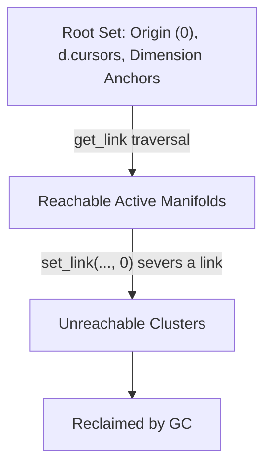

# Vortex Query Language (VQL) Specification

**Document Version:** 5.0.0 — Xanalogical Revision **Compilation Target:** Vortex Hyperstructural
Runtime Core (Two-Primitive Matrix Manifold)

VQL is the declarative, XQuery-like companion language for
[Vortex](vortex-hyperstructural-runtime.md): every VQL query compiles down to the same
`get_link`/`set_link`/`get`/`set` primitives that make up Vortex's two-primitive core. As with the
Vortex spec, this document specifies a language design consuming the Zigzag `zzstructure` manifold
model (see
[zigzag-multidimensional-space-and-projection.md](zigzag-multidimensional-space-and-projection.md));
nothing here is wired into the gleditor build.

The language rests on three design choices: a single directional traversal operator (`/`, with
direction carried by a sign on the dimension name rather than a second token), `%` creation sugar so
a path can extend the manifold instead of only reading it, and a Xanalogical mutation model —
`weave`, ordinary path expressions evaluated for effect — in place of an XQuery-style `update { }`
block, since a query and an edit are the same kind of walk over the same primitives.

______________________________________________________________________

## 1. Architectural Foundations & Operational Invariants

Vortex Query Language (VQL) is a declarative, zero-allocation path navigation and graph mutation
language tailored specifically for **zzstructures** (multidimensional bidirectional graphs). VQL
queries do not evaluate into ephemeral tabular heaps, relational tuples, or serialized JSON arrays.
Instead, every query expression compiles down to spatial traversals, generator pipelines, and link
mutations driven by the atomic engine:

```math
\mathcal{M} = \langle \text{get\_link}, \, \text{set\_link}, \, \text{get}, \, \text{set} \rangle
```

### Fundamental Invariants

- **The Two-Primitive Core**: Path traversal compiles strictly to `get_link(cell, dim, dir)`.
  Mutations, updates, insertions, and allocations compile strictly to
  `set_link(cell, dim, dir, target)`, with `target == -1` for allocation and `target == 0` for
  deallocation/isolation. `get(cell, [offset], [length])`/`set(cell, value, [offset], [length])` are
  the matching content accessors — see Vortex §2's `get_cell_value`/`set_cell_value`, renamed here
  to match how they're spelled in every VQL surface form.
- **Dual-Wing Invocation Topology**: Built-in functions, custom routines, and opcodes adhere to the
  dual-wing interface. Out-parameters project negward along `-d.grab` (chained posward along
  `+d.step` for multiple returns). In-parameters project posward along `+d.grab` and chain along
  `+d.step`.
- **Snapshot-Before-Write Execution**: When updating nodes in-place or writing query projections,
  all input operand payloads are fully dereferenced and snapshotted prior to invoking `set()` or
  mutating pointers, preventing self-aliasing hazards.
- **Associative Cursor Scopes**: Query variables are not stored in stack frames or hash lookups.
  They resolve directly against the active Spin-Head cursor along `+d.vars`, with bound payloads or
  complex subgraphs projecting perpendicularly along `+d.values`.
- **Quantum Identity Synchronization (`d.fuse`)**: Pipelined assignments using the pipe operator
  (`|>`) or variable aliases utilize `d.fuse` links. Fused nodes share an underlying pointer to a
  single `CellValue` variant. Mutations immediately propagate across all viewports and observer
  ranks.
- **Zero-Allocation Lazy Rank-Streaming**: A path step (`/dim`) does not materialize an intermediate
  collection. It instantiates an $O(1)$ spatial cursor that lazily yields matching `cell_id`
  coordinates along `dim`'s entire rank until it encounters 0 (null) or a loopback boundary — a
  single `/` step already walks the whole rank, not one hop of it.
- **Xanalogical Mutation**: VQL does not have a separate "update" sublanguage. `%` creation sugar
  and `set_link`/`set` calls are ordinary path steps with side effects; a query that reads and a
  query that writes are the same grammar, evaluated under `return` or `weave` respectively. This
  mirrors the rest of the system: an edit is a walk that happens to allocate and link, not a
  different kind of operation layered on top of the read path.
- **Persistent Star-Pivot Caching**: Expensive generative transformations (e.g., regex compilation
  or macro expansions) memoize their topological results off the root origin (`##` / Cell 0) along
  `+d.cache`, anchoring invocation nodes to input and output manifolds.

______________________________________________________________________

## 2. Syntactic Token & Structural Shorthand Matrix

| Token / Operator    | Structural Equivalent                | Functional & Spatial Semantic Mapping                                                             |
| ------------------- | ------------------------------------ | ------------------------------------------------------------------------------------------------- |
| `##`                | Origin Anchor (`cell_id = 0`)        | Grounds query context to the absolute system environment origin.                                  |
| `#`                 | Root Metacells                       | Lazily streams all disjoint root manifold entry points across the matrix.                         |
| `^`                 | Process Manifold (`d.cursors`)       | Streams all active Spin-Head execution cursor threads.                                            |
| `^NAME`             | `^[. = "NAME"]`                      | Short-circuits the cursor scan, locking directly onto the named thread node.                      |
| `.`                 | Context Identity                     | The current step's context cell — a valid anchor on its own, or `get(context)` when dereferenced. |
| `/dim`              | `LazyRankStream(dim, posward)`       | Traverses `dim`'s entire rank posward from the context cell.                                      |
| `/-dim`             | `LazyRankStream(dim, negward)`       | Traverses `dim`'s entire rank negward — the `-` binds to the dimension name, not the operator.    |
| `/dim%`             | Create (`set_link(@, dim, dir, -1)`) | Allocates a new cell along `dim` (at the tail of any existing rank); see §4.5.                    |
| `/dim%VALUE`        | Create + init                        | Allocates and initializes a new cell's content to `VALUE` — bare, quoted, or `$variable`.         |
| `.[offset, length]` | `get(ctx, off, len)`                 | Zero-copy virtual string slice dereference.                                                       |
| `@`                 | Context Identity Address             | Evaluates to the numerical `cell_id` coordinate of the context node itself.                       |
| `\|>`               | Pipe-Forward Operator                | Chains a path result into a function invocation.                                                  |
| `[...]`             | Predicate / Index Window             | Applies inline boolean filters or relative index clamps to a stream.                              |
| `(...)`             | Macro Dimension Group                | Groups dimensional sequences into a compound traversal segment.                                   |
| `*`                 | Kleene Repetition                    | Repeats the preceding macro group zero or more times until termination.                           |
| `{...}`             | Weave Block                          | Groups a comma-separated list of effect items under `weave`.                                      |

There is a single traversal operator: `/` already walks a whole rank, so there is no "one hop" form
to distinguish it from, and direction is a property of the dimension name (an optional leading `-`),
not a second operator. Recursive or compound repetition is `(...)*`'s job (§3).

______________________________________________________________________

## 3. Formal EBNF Grammar

```
QueryExpression       ::= ExecutionBlock | PipelineChain

ExecutionBlock         ::= ( ForClause | LetClause )+ WhereClause? ActionClause
PipelineChain          ::= PathExpression ( "|>" FunctionInvocation )*

ForClause              ::= "for" VariableRef "in" PathExpression
LetClause              ::= "let" VariableRef ":=" ( PathExpression | ValueExpr )
WhereClause            ::= "where" BooleanExpr ( ( "and" | "or" ) BooleanExpr )*
ActionClause           ::= ReturnClause | EffectClause | ConditionalClause

ReturnClause           ::= "return" ReturnItem ( "," ReturnItem )*
ReturnItem             ::= PathExpression | FieldWeave
FieldWeave             ::= PathStep+

EffectClause           ::= "weave" ( EffectItem | "{" EffectItem ( "," EffectItem )* "}" )
EffectItem             ::= LetClause | PathExpression | ForClause EffectClause

ConditionalClause      ::= "if" BooleanExpr ActionClause ( "else" ActionClause )?

PathExpression         ::= AnchorNode PathStep*
AnchorNode             ::= "##" | "#" | NamedCursor | VariableRef | LiteralCellId | "."
NamedCursor            ::= "^" [a-zA-Z_][a-zA-Z0-9_]*
VariableRef            ::= "$" [a-zA-Z_][a-zA-Z0-9_]*
LiteralCellId          ::= [0-9]+

PathStep               ::= "/" StepSelector PredicateClause* RangeClamp?
StepSelector           ::= SignedDimension CreateSuffix? | MacroDimensionGroup | FunctionInvocation
SignedDimension        ::= "-"? DimensionIdentifier
CreateSuffix           ::= "%" CreateValue?
CreateValue            ::= ValueExpr | BareLiteral
BareLiteral            ::= (run of characters excluding whitespace, ",", "(", ")", "[", "]", "{", "}")

DimensionIdentifier    ::= [a-zA-Z_][a-zA-Z0-9_]* ( "." [a-zA-Z_][a-zA-Z0-9_]* )*
MacroDimensionGroup    ::= "(" PathStep+ ")" RepetitionModifier?
RepetitionModifier      ::= "*" | "+" | "?"

PredicateClause        ::= "[" BooleanExpr "]"
RangeClamp             ::= "[" IndexParam ( "," IndexParam )? "]"
IndexParam             ::= "-"? [0-9]+

BooleanExpr            ::= BooleanTerm ( "or" BooleanTerm )*
BooleanTerm            ::= BooleanFactor ( "and" BooleanFactor )*
BooleanFactor           ::= "not"? ( ComparisonExpr | PredicateTest )
ComparisonExpr         ::= ValueExpr CompOp ValueExpr
CompOp                 ::= "=" | "!=" | "<" | ">" | "<=" | ">="
PredicateTest          ::= PathExpression | "." | ExtendedTruthinessCheck | FunctionInvocation

ExtendedTruthinessCheck ::= "?" ( PathExpression | ValueExpr )

ValueExpr              ::= PathExpression | ScalarLiteral | VariableRef | FunctionInvocation | "@"
ScalarLiteral           ::= StringLiteral | NumericLiteral | BooleanLiteral
StringLiteral           ::= '"' [^"\\]* '"'
NumericLiteral          ::= ("-" | "+")? [0-9]+ ( "." [0-9]+ )?
BooleanLiteral          ::= "true" | "false"

FunctionInvocation      ::= Identifier "(" ArgumentList? ")"
ArgumentList            ::= ValueExpr ( "," ValueExpr )*
```

A few grammar points worth calling out explicitly:

- **Direction lives on `SignedDimension`'s optional leading `-`.** `/-d.parent` traverses `d.parent`
  negward; there is no second traversal operator for it.
- **`.` is a valid `AnchorNode`.** This is what lets a predicate step *into* a dimension from its
  own candidate cell — `[./d.inputs[. = $pattern]]` reads as "this candidate's `d.inputs` rank has a
  member equal to `$pattern`." `unify(...)` reaches `PredicateTest` the same way any other
  boolean-returning `FunctionInvocation` does, so `where unify($a, $b)` needs nothing beyond that.
- **`set_link(dim, dir, target)` and `set(value, ...)` are ordinary `FunctionInvocation`s**,
  reachable from `StepSelector`. `$cell/set_link(d.foo, +1, $target)` parses the same way
  `$cell/d.foo` does, and — because `set_link` returns the cell it just linked — is just as
  chainable. Mutation is not a separate "statement" grammar competing with the "expression" grammar
  for the same syntax; it's the same PathExpression machinery, evaluated for effect under `weave`
  instead of for value under `return`.
- **`NumericLiteral` accepts a leading `+`.** Every example writes directions as `+1`/`-1` for
  visual symmetry, so the grammar accepts the `+` explicitly rather than relying on it being
  optional-and-ignored.

______________________________________________________________________

## 4. Evaluation Semantics & Compilation Rules

### 4.1 Lazy Rank-Streaming Engine

`/dim` and `/-dim` compile to the same loop; the sign only picks `direction`:

```cpp
cell_id current = start_node;
int direction = signed_dimension.negated ? -1 : +1;
cell_id target_dim = signed_dimension.dim;
while (current != 0) {
    cell_id next = get_link(current, target_dim, direction);
    if (next == 0 || next == start_node) break; // Terminate on null or loopback
    if (eval_predicates(next)) {
        yield next;
    }
    current = next;
}
```

- **Index Clamping (`[n]`)**: Evaluated lazily with 1-based indexing.
  - `[1]`: Short-circuits traversal on the first matching cell, avoiding unnecessary traversals over
    dense ranks.
  - `[-1]`: Scans to the rank tail, returning only the final matching coordinate.
  - `[start, end]`: Emits an index-windowed slice over the matching elements.

### 4.2 Slicing Semantics

VQL supports zero-copy virtual slicing on text payloads:

- **Direct Path Step**: `$node/.[offset, length]` calls `get($node, offset, length)`.
- **Mutation Patching**: `$node/set(replacement, offset, length)` calls
  `set($node, replacement, offset, length)`. Numeric and boolean variants ignore offsets and lengths
  entirely.

### 4.3 Extended Truthiness Rules

Predicates evaluate conditions according to canonical truthiness semantics:

- **Truthy**: `true`, non-zero double, and case-insensitive strings: `"true"`, `"1"`, `"yes"`,
  `"on"`. Unrecognized non-empty strings default to true. A bare `PathExpression` used as a
  condition (`PredicateTest`) is truthy if it selects at least one cell, independent of that cell's
  own content.
- **Falsy**: `false`, `0.0`, empty string `""`, and case-insensitive strings: `"false"`, `"0"`,
  `"no"`, `"off"`. A `PathExpression` used as a condition is falsy if it selects nothing.

A direct scalar comparison like `where $inv/d.inputs = $pattern` is a type error in intent even
where it happens to parse: `$inv/d.inputs` is a rank, not a value, and may stream zero, one, or many
cells. The correct form filters the rank with a predicate and lets its non-emptiness stand for the
condition — `where $inv/d.inputs[. = $pattern]` — or binds a single dereferenced value first with
`let` before comparing it.

### 4.4 Result Materialization: Topological Return Weaving

`return` avoids heap allocations or string serializations, and it does not introduce a JSON-shaped
literal that has nothing to do with the cell model it's returning from:

1. The engine instantiates an Invocation Result Cell appended posward along the active cursor's
   `+d.results` rank.

1. A `PathExpression` return item (e.g. `return $status_code`) links its resolved value posward off
   the invocation cell along `+d.values` — the scalar-return case.

1. A `FieldWeave` return item — a bare chain of `PathStep`s with no anchor, always starting with `/`
   — is implicitly rooted at the Invocation Result Cell instead of the current query context. This
   is what lets a multi-field result be written as ordinary `%`-creation (§4.5) rather than a
   bracketed record literal:

   ```
   return
       /d.vars%"worker_id"/d.values%$worker/@,
       /d.vars%"status"/d.values%$status_code
   ```

   Each item creates a labeled `d.vars` cell off the result cell and pairs it with a `d.values` cell
   holding the projected value — exactly the same `d.vars`/`d.values` shape Vortex §4 uses for
   cursor scopes, so a query result and a variable scope are the same structure, walkable the same
   way.

### 4.5 Cell Creation Sugar (`%`)

`%`, suffixed onto a `SignedDimension` step, is sugar over allocation:

- **Bare (`/dim%`)**: `set_link(@, dim, dir, -1)`. Applied once per cell in the current context
  stream (like any other step).
- **Initialized (`/dim%VALUE`)**: the same allocation, immediately followed by `set(@, VALUE)` on
  the newly allocated cell. `VALUE` may be a bare token (`/d.status%OK`), a quoted string when it
  contains spaces or punctuation (`/d.status%"needs review"`), or a variable (`/d.status%$value`).
- **Tail-seeking**: if the context cell already has a link along `dim` in the given direction, `%`
  walks to the tail of that rank first (the same traversal §4.1 already performs) and allocates
  there, rather than clobbering the context cell's own link slot. Without this, a loop that calls
  `/d.step%$ch` once per character would overwrite the same cell every iteration instead of building
  a chain; with it, `for $ch in EXPLODE($pattern, "") weave $nfa_start/d.step%$ch` builds the chain
  directly (§7.2), with no separate "insert at end" primitive needed.
- **Chainable**: whatever `%` lands on (freshly allocated or, on repeat, freshly appended) becomes
  the new context for the rest of the path, same as any other step — `/d.name%/d.results%VALUE`
  creates an empty cell along `d.name`, then from there creates and initializes a cell along
  `d.results`.
- **Existing targets don't go through `%`.** Pointing a dimension at a cell that already exists — as
  opposed to allocating a new one — is `set_link(dim, dir, target)` directly, reachable as an
  ordinary `FunctionInvocation` step (§3). `%` is specifically the "make a new cell" case.

______________________________________________________________________

## 5. Memory Management & Topological Garbage Collection

VQL relies on geometric reachability rather than linear allocation trackers:



- **Allocation**: `%` (§4.5) or a direct `set_link(cell, dim, dir, -1)` materializes a new cell
  directly into the coordinate system.
- **Disconnection & Re-linking**: `set_link(cell, dim, dir, 0)` severs a pointer. If a cell's
  aggregate link count reaches zero across all dimensions, the cell is eagerly evicted from the
  matrix storage map.
- **Sub-graph Isolation**: If a pipeline or temporary manifold is severed from the root set, it is
  marked as unreachable during the next sweep phase and reclaimed without manual deallocation.

______________________________________________________________________

## 6. Logic Programming & Unification Integration

VQL seamlessly expresses relational and logic unification queries:

### Syntax

```
for $ans in ##/d.parent
where unify($ans, "Bob")
return $ans
```

### Unification Compilation Semantics

`unify(TermA, TermB)` is an ordinary boolean-returning built-in (§3's `PredicateTest` reaches it
directly, the same way it reaches any other `FunctionInvocation`), executing Robinson unification
directly in the matrix:

1. **Dereferencing**: Follows `+d.values` until a non-forwarding cell is reached.
1. **Variable Aliasing**: If both terms are unbound variables (`+d.values == 0`), they are fused
   along `d.fuse` (`set_link(A, d_fuse, +1, B)`) and the binding is logged to the active choice
   point's trail rank.
1. **Variable Binding**: If one term is unbound, its `+d.values` is set to the other term's node and
   recorded on the cursor's `+d.stack`/`+d.trail` rank.
1. **Ground Comparison**: If both terms are bound, their payloads are compared using `get()`.
1. **Backtracking**: Query iterations that fail backtrack by popping the choice point from
   `+d.stack`, unsetting all trail-recorded links via `set_link(target, d_values, +1, 0)`, and
   resuming the search at the alternate branch address (`+d.warp`).

______________________________________________________________________

## 7. Canonical Production Query Examples

### 7.1 Deep Structural Navigation with Zero-Copy Slice

Locates an active worker thread, pulls its buffer variable, slices a token out of the string, and
weaves the result as a `d.vars`/`d.values` pair off the invocation cell instead of a JSON-shaped
literal:

```
for $worker in ^
where $worker/d.name[. = "HTTP_WORKER"]
let $raw_header := $worker/d.vars[. = "buffer"]/d.values/.
let $status_code := $raw_header.[9, 3]
where $status_code = "200"
return
    /d.vars%"worker_id"/d.values%$worker/@,
    /d.vars%"status"/d.values%$status_code
```

`^` already streams every cursor cell (§2), so no further dimension step is needed to reach them.
`where $worker/d.name[. = "HTTP_WORKER"]` filters the rank instead of comparing it directly;
`where $status_code = "200"` stays a direct comparison because `$status_code` is already a
dereferenced scalar from `let`, not a rank.

### 7.2 Topological Regex Compilation with Star-Pivot Caching

Checks whether a regular expression has already been woven into an NFA manifold. On a cache hit, it
returns the cached entry root directly. On a cache miss, it weaves a new Thompson NFA graph and
caches the result off the origin cell, using `if`/`else` (§3) to choose between the two:

```
for $compiler in ^COMPILER_THREAD
let $pattern := $compiler/d.vars[. = "regex"]/d.values/.
let $cache_root := ##/d.cache[. = "regex_compile"]
let $hit := $cache_root/d.invocations[./d.inputs[. = $pattern]][1]
if $hit
  return $hit/d.outputs/@
else
  weave {
    let $new_inv := $cache_root/d.invocations%,
    $new_inv/d.inputs%$pattern,
    let $nfa_start := $new_inv/d.outputs%"#START",
    for $ch in EXPLODE($pattern, "")
      weave $nfa_start/d.step%$ch,
    $compiler/set_link(d.results, +1, $nfa_start/@)
  }
```

The character loop leans on §4.5's tail-seeking: each `$nfa_start/d.step%$ch` walks to wherever the
chain currently ends and appends there, so the loop builds one linked rank instead of repeatedly
overwriting `$nfa_start`'s own `d.step` link. The final line points `d.results` at the NFA's actual
entry cell — an existing target, so it's spelled with `set_link`, not `%`.

### 7.3 Kinship Logic Unification (Prolog-Style Query)

Finds all common ancestors of "Alice" and "Bob" using logic unification. `/d.parent` already walks
the whole rank (§1), so no separate recursive-closure operator is needed:

```
for $alice_ancestor in ##/d.people[. = "Alice"]/d.parent
for $bob_ancestor in ##/d.people[. = "Bob"]/d.parent
where unify($alice_ancestor, $bob_ancestor)
return
    /d.vars%"ancestor_id"/d.values%$alice_ancestor/@,
    /d.vars%"ancestor_name"/d.values%$alice_ancestor/.
```

### 7.4 In-Place Graph Rewriting & Edge Re-Targeting

Updates a deprecated microservice node, rewires active event routes to its replacement, and
disconnects the retired cell for automatic garbage collection:

```
for $old_service in ##/d.services[. = "auth_v1"]
let $new_service := ##/d.services[. = "auth_v2"]/@
weave {
    for $caller in $old_service/-d.route
      weave $caller/set_link(d.route, +1, $new_service),

    // Clear all incoming and outgoing connections of old service
    $old_service/set_link(d.services, +1, 0),
    $old_service/set_link(d.services, -1, 0)
    // Topological GC automatically reclaims $old_service once isolated
}
```

`/-d.route` walks `d.route` negward from `$old_service` — the same traversal operator as every other
step in the query, with the direction living on the dimension name rather than the operator.
