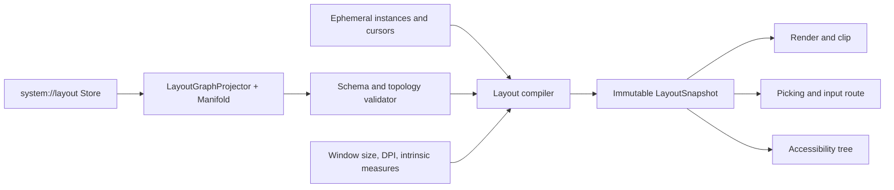

# Window Layout as a ZigZag System Structure

**Status:** Proposed architecture and implementation plan, 2026-09-24. No component layout graph or
layout compositor described here is implemented yet. **Scope:** Xudu, Xuzz, and standalone ZigZag;
the plain gleditor editor retains its YAML configuration and no Xanadu dependency.

## 1. Decision and reader promise

`system://layout` becomes the authored source for the spatial arrangement of **every Xudu, Xuzz, and
ZigZag interface element**: document and cell viewports, tab strips, menus and their items, pouch
drawer and link forge, publish and other dialogs, the OSMIC map and diff view, notifications, and
nested controls. Each element is addressable as a ZigZag cell. Its relationships to other elements,
layout constraints, and available view projections are inspectable and editable in the same system
store. Runtime instances of dynamic elements are cells in an ephemeral overlay on that structure.

The arrangement resembles the screen in the common projection: posward on `d.layout.x` reads
left-to-right, posward on `d.layout.y` reads top-to-bottom, and `d.layout.depth` reads
back-to-front. Those ranks express **relative intent**, not a frozen grid of pixel coordinates. The
user may rotate which dimensions a layout view shows, step a view cursor through tabs or nested
components, and inspect a component's relationships without losing the ordinary screen layout. A
saved layout edit is a named hypertime operation; simply moving the cursor or opening a modal is
not.

```text
Layout-space view                         Default screen projection
workspace                                 +-------------------------------------+
  window A                                | menu                                |
    shell                                 +--------------------------+----------+
      document viewport --x--> pouch     | 3D document/cell         | pouch    |
      tabs --tab--> another view          | viewport                 | + forge  |
      OSMIC map --depth--> publish modal  |                          |          |
                                          +--------------------------+----------+
                                          | status / notifications             |
                                          +-------------------------------------+
```

This diagram describes the default projected neighborhood. It does not assert that the whole ZigZag
space is a Euclidean screen. In Nelson's account, a cell has at most one neighbor in each direction
of each dimension; views select a region and dimensions rather than revealing one canonical
visualization. He explicitly describes system objects, parameters, executable menus, windows, and
cursors as cells or ranks. Our use of a contained component graph plus freely rotatable relationship
dimensions is an engineering interpretation of that model, not a claim that his account specifies
this UI layout schema. ([Nelson, *Cosmology*](https://xanadu.com/zigzag/ZZdnld/zzRefDef/),
[1998 ZigZag demonstration](https://xanadu.com.au/mail/zzdev/msg01894.html).)

### Non-negotiable outcomes

1. Every rendered, focusable, pickable, or announced element has one layout identity in the active
   projection. A transient item has an ephemeral instance cell linked to a persistent template or
   slot; transient state does not require a persistent Structure operation.
1. The same resolved bounds, transforms, visibility, stacking, and focus scope govern drawing,
   picking, modal input, and the accessibility tree. Hidden tabs cannot still be clicked or read by
   a screen reader.
1. A document or cell view retains its content identity, Xanadu links, provenance, and independent
   view cursor when its layout instance moves or appears in another tab. Layout adjacency is not a
   substitute for a xanalink. Nelson distinguishes zzstructure from hypertext and envisages the
   former behind the latter.
   ([Nelson, *Cosmology*, hypertext section](https://xanadu.com/zigzag/ZZdnld/zzRefDef/).)
1. The layout store is user-owned and recoverable. Invalid edits never blank the window or strand
   the user outside a modal. The last validated layout remains usable, and a built-in emergency
   layout can always open the layout editor.
1. Ordinary layout traversal, hover, resize, tab selection, modal open/close, and animation never
   append to the store. Explicit edits and explicit “Save workspace” do.

## 2. Current code and the gap

`system://layout` is already a `Store`, but today it contains typed scalar settings under the ten
system dimensions, read by `LayoutConfig::fromStore()` in `apps/common/xanadu/system_docs.hpp/.cpp`.
`Session::systemStoreIndex()` in `apps/xudu/session.cpp` lazily creates or loads it. The live
callback in `apps/xudu/main.cpp` applies beam physics, pouch docking, ZigZag presentation, and
bridge settings. `system://ui` separately supplies tab-bar and hypertime-map visibility, radial-menu
settings, and other UI preferences. There is no component graph in either store. Existing stores are
loaded without an `ensureAllSettings()` pass, so adding defaults only to genesis would miss
installed users.

The renderer currently draws document pages through a full-window projection before invoking
`FrameContributor`s (`src/renderer.cpp`). Contributors, `PickObserver`s, `CompositeModalInput`
handlers, and accessibility sources are separately registered in `apps/xudu/main.cpp`; their order
is not one shared z/focus model. Pouch, hypertime map, form, switcher, and other widgets compute
some bounds inside their own draw methods. `ZigzagVisualizer` already owns a
`UnifiedTransclusionEngine` over a `Manifold`, but standalone `apps/zigzag/main.cpp` currently loads
its keymap store, not `system://layout`. Xuzz enters via xudu's `main.cpp` under `XUZZ_BUILD` and
can share the xudu integration path.

The present `system://layout` schema and its two human-facing, xanalinked companion pages remain.
Its old scalar values are inputs to the new graph where relevant, not a parallel authority for
component placement. The [system xanadocs design](system-xanadocs-customization-and-metasystem.md)
§6.2 describes the live ten-dimension setting geometry; its §2.3 YAML-shaped example is historical
exposition, not the current loader. The [store/slice convergence](store-slice-convergence.md) rules
out treating navigation as an operation (R8) and makes a cell an operation in the store.

## 3. The layout graph

### 3.1 Cells, instances, and dimensions

A persistent **component definition** cell names a registered capability such as
`xudu.document-viewport`, `xudu.pouch`, `xudu.link-forge`, `xudu.publish-form`, `xudu.osmic-map`,
`xudu.radial-menu`, `xudu.notification-stack`, or `zigzag.cell-viewport`. A persistent **layout
instance** cell places one use of that capability in a window. It has a stable user-visible ID
within the layout store and its own constraints. A definition can have several instances; an
instance can move without changing the definition. The compiler resolves local definition links or
`d.clone` relationships where appropriate, but never treats two instances as one hit target or one
focus scope.

A persistent **container** cell is also an instance: workspace, window, split, grid, tab group,
overlay layer, menu, or modal. Its children are components or other containers. A persistent
**template** cell defines repeated item structure, such as one tab, menu item, form field, pouch
zone, or result row. When data supplies more items, the runtime materializes ephemeral instance
cells in an `ArenaManifold` view. They still receive layout IDs, hit identities, and a11y nodes;
materializing search results or opening a dialog does not spool operations.

| Dimension                                                | Meaning and constraint                                                                  |
| -------------------------------------------------------- | --------------------------------------------------------------------------------------- |
| `d.layout.windows`                                       | Ordered window roots from workspace home. Each root has its own cursor and DPI context. |
| `d.layout.child`                                         | Container to its first child only; that child points negward to the container.          |
| `d.layout.sibling`                                       | Ordered children of one container, beginning at its child head.                         |
| `d.layout.x`, `d.layout.y`                               | Optional sibling adjacency in the default projected horizontal and vertical directions. |
| `d.layout.depth`                                         | Relative stacking or 3D layer among siblings; modal priority is additional policy.      |
| `d.layout.tab`                                           | Ordered alternative view instances within one tab group.                                |
| `d.layout.variant`                                       | Named alternatives for breakpoint, presentation, or saved workspace.                    |
| `d.layout.definition`                                    | Instance-to-definition relation when no rank is shared; relation cells handle fan-out.  |
| `d.layout.props`, `d.layout.prop-next`, `d.layout.value` | Typed property cells, an ordered property rank, and scalar values.                      |
| `d.layout.target`                                        | Optional content-binding relation cell, resolved by a named store/content reference.    |
| `d.schemas`, `d.default`, `d.notes`                      | Existing system metadata dimensions for property schema, defaults, and notes.           |

All dimensions are minted as ordinary cells on `d.dims`; none is a privileged C++ field or a new
`CompactOpNode` shape. The existing `d.vars`/`d.values` setting rank stays intact.
`SystemStoreModel::fromStore()` continues to read settings while a separate `LayoutGraphProjector`
reads only the `d.layout.*` ranks. `d.layout.props` links a node to the head of its property rank;
each property cell has a name, typed value, schema and units. Examples: `min-width` in logical
pixels, `width-weight` as a positive ratio, `anchor` as an enum, and `clip` as a boolean. Text
labels are stored once as primedia; a view may quote them by span.

A ZigZag cell has only one posward and one negward neighbor per dimension. `d.layout.child` thus
points to **one child head**; `d.layout.sibling` carries the rest. A child finds its owner by
walking negward on the sibling rank to the head, then negward on `d.layout.child`. The validated,
compiled snapshot holds a direct parent index so rendering never performs that walk. A component
used in two places needs two instance cells. A cross-container visual relationship uses a relation
cell or a Xanadu link and does not silently create a second parent.

### 3.2 Semantic geometry and responsive projection

The default view maps authored x/y/depth adjacency to screen directions, so the graph is legible by
looking at the window. Physical rectangles are **derived** from constraints and the current window
size, DPI, safe area, font metrics, and intrinsic component sizes. A rank cannot encode arbitrary
split ratios, min/max widths, clipping, or a viewport aspect ratio. Those are typed property cells.

The deterministic compiler first measures leaves, then allocates container space from the root, then
resolves overlays and z order. Splits honor axis, minimum and maximum extents, weights, padding, and
gaps. Grids honor explicit rows/columns and validate x/y adjacency consistency. A tab group lays out
its strip and only the active child. Overlays anchor to the containing window, component, pointer,
or selected content span, with safe-area clamping. A 3D viewport receives a screen-space rectangle
and its own projection/camera, while document/page physics remain in world coordinates. Logical
units, not raw device pixels, persist; the compiler converts to physical pixels per window and
rounds deterministically before rendering and hit testing.

The projection must remain useful outside the default axes. A layout inspection view can bind
`d.layout.tab` to X and `d.layout.child` to Y, or depth to Z, without mutating the authored default
layout. In that view the user edits relation cells, constraints, or component properties directly;
ordinary drag, resize, dock, and reorder gestures are commands against the same structure. They show
a preview from an ephemeral candidate graph and commit one validated user edit on release.

### 3.3 Validation rules

A graph version is valid only when it has a recognized schema marker and one or more window roots;
all IDs and required component kinds are unique and registered. Each renderable instance belongs to
exactly one parent within one window. Child and sibling ranks form a rooted, acyclic forest. All
members of an x/y/depth/tab rank belong to the same container unless an explicit portal relation
says otherwise. Links are reciprocal as enforced by `Manifold`; validators also reject duplicate
slots, orphan cells, crossing sibling sequences, unknown required constraints, ambiguous anchors,
invalid tab targets, and a modal with no focusable escape path. Scalar constraints must be finite,
within schema ranges, and mutually satisfiable. Configured limits on node count, nesting depth, and
generated instances bound adversarial or accidental graphs.

Unknown optional component kinds become labelled placeholders in the layout inspector. An unknown
required viewport or invalid root rejects the candidate snapshot. A failed live edit keeps the last
valid snapshot; startup with no valid version uses a compiled-in minimal viewport, layout editor,
and close/dismiss controls. This emergency layout is a fallback **projection**, not a silent rewrite
of the user's store. The invalid version and diagnostic remain inspectable.

## 4. The view cursor and user interactions

A `LayoutViewCursor` belongs to one window instance. It names the focused layout instance, the
active projection axes, a breadcrumb of nested containers, and one active child per tab group that
has been entered. Nested groups therefore have distinct tab selections; one global active-tab
integer cannot describe them. Multiple windows have independent cursors. A cursor may point to an
element whose content has its own document caret or ZigZag accursed cell; these are different
positions and moving the layout cursor does not edit the content.

| Command           | Effect                                                                                                    |
| ----------------- | --------------------------------------------------------------------------------------------------------- |
| Step X/Y/depth    | Move to the connected sibling on the selected layout dimension; a boundary leaves focus in place.         |
| Enter/Exit        | Descend to the remembered child or ascend to its container, preserving the previous child per scope.      |
| Next/previous tab | Choose a sibling on `d.layout.tab` in the innermost active tab group.                                     |
| Rotate axes       | Change which layout dimensions the inspector projects onto X/Y/Z.                                         |
| Activate          | Invoke the focused component's registered action, or enter its content view if it is a viewport.          |
| Save workspace    | Persist selected variant, dock/order changes, and explicitly chosen tab defaults as Structure operations. |

Pointer selection, sovereign keymap actions, Vortex macros, and accessibility actions call these
same semantic commands. The user can click a tab, move the layout cursor to its host, step through
its alternatives, enter a nested split, open a menu, and return to the originating component. A
modal opening records its prior focus scope, makes the modal scope exclusive for keyboard and pick,
and restores focus on close. Its **placement** is persistent; its **open state** is transient. Menus
follow the same rule. Tab switches hide inactive descendants from drawing, hit testing, and a11y
while retaining their view state according to an explicit suspend/keep-alive policy.

The cursor and modal stack live in a session `ArenaManifold` or equivalent typed ephemeral overlay.
They may be checkpointed in the separate reader-activity system when that system exists, but they do
not become OSMIC versions merely through movement. An explicit Save workspace writes a user
operation and may store preferred starting tabs and viewport dimensions. Back/forward in document
hypertime and future activity walks do not overwrite the layout store's branch ancestry.

## 5. Complete component coverage

The graph has a placement node or template for each of the following; there is no free-floating
widget exempt from the compositor.

| Component family                                    | Persistent layout representation                                              | Runtime binding                                                                     |
| --------------------------------------------------- | ----------------------------------------------------------------------------- | ----------------------------------------------------------------------------------- |
| 3D document and cell viewports                      | Viewport instance, camera/projection policy, clip and tab/child relationships | Store/version or cell focus, camera, independent view cursor                        |
| Document switcher and tab strips                    | Tab-group and strip templates, tab rank                                       | One ephemeral tab item per open view; active selection per group                    |
| Pouch drawer, zones, link forge bench               | Dock container, child slots, zone and left/right bench templates              | Pouch contents from `system://pouches`; clasp selections stay in their owning model |
| Publish, import, settings, and other forms          | Modal container and field/control templates in child order                    | Form answers, masking, validation, and open state remain transient                  |
| Radial and ordinary menus                           | Overlay container and item templates; semantic action IDs                     | Action resolution through `system://keymap`/registered Vortex routines              |
| OSMIC map, scrubber, version diff                   | Panel or viewport instances, optional nested tabs                             | Current store versions and selected comparison                                      |
| Beams, provenance hints, satelloids                 | Overlay or world-layer instances associated with a viewport                   | Xanadu link identities, spans, and live world anchors                               |
| Notifications, status and tooltips                  | Overlay stack and reusable item templates                                     | Timers, diagnostics, and transient content                                          |
| ZigZag palette, VQL omnibar, topology/content views | Nested panel and view instances                                               | Active manifold and projection mode                                                 |

The graph stores **placement and references**, not copies of a pouch span, document text, link
endset, or query result. A content binding needs a durable store/scroll identity and a
`GlobalSpan`/`GlobalOpRef` or an explicit external-reference record, plus a resolver and unavailable
placeholder. A raw `CellRef` is a store-local operation index and is not a durable cross-store
reference. Until a persistent cross-store reference path is complete, layout instances bind to
registered local runtime view handles; saved arrangements reopen unresolved content as labelled
placeholders and resolve asynchronously. No DHT, swarm, file load, or store replay blocks the render
or input thread.

## 6. Architecture and data flow



`apps/common/xanadu/layout/` owns graph vocabulary, store projection, validation, migration, and
typed property decoding. Its input is a selected `system://layout` microversion and its output is a
domain-neutral, validated graph model. New persistent edits use the existing `Store::makeDimension`,
`makeCell`, `makeScalarCell`, and `setLink` operations. Build or advance one `Manifold` per selected
version; do not call `Store::rebuildManifold()` for each frame, tab step, or keystroke. Structural
editing commands may be Vortex routines that invoke the Store host API; C++ is justified for bounded
validation/constraint compilation and the rendering/OS boundary.

`include/gleditor/layout/` and `src/layout/` own only app-neutral structs and algorithms:
`LayoutSnapshot`, `ResolvedRegion`, `ViewportRegion`, `HitRoute`, `FocusScope`, a deterministic
constraint solver, and a compositor-facing interface. No header in `src/` or `include/` includes
`apps/` or knows `Store`, `CellRef`, or a Xanadu link. Xudu and ZigZag adapters map validated graph
instances to registered components; plain gleditor may later feed the same library snapshot from its
YAML configuration but does not open `system://layout`.

The snapshot contains a generation, window/DPI key, resolved logical and physical bounds,
transforms, z order, clip chain, active tab membership, visibility, modal barrier, draw commands or
adapter handles, hit routing, and accessibility parent/order. It is immutable for consumers and
replaced atomically after a complete successful compile. Draw, pick, input, and a11y consume the
**same generation**. If a pick result arrives asynchronously after a tab switch, its generation and
window/viewport identity determine whether to dispatch or discard it. Resize and DPI changes
invalidate the snapshot even when the store version has not changed.

The rendering prerequisite is substantial: `src/renderer.cpp` currently projects document pages into
one whole-window view before contributors. It must accept per-viewport camera/projection and clip
regions for documents as well as overlays; all GL/GLES/Vulkan paths must support matching
scissor/clip and picking-coordinate transforms. Vulkan currently sets a full-swapchain scissor in
`src/render/vulkan/device_vk_frame.cpp`, so moving a viewport in the graph alone will not clip it.
The compositor orders world layers, page draws, overlay contributors, forms, and notifications from
the snapshot. Component adapters stop choosing their own final screen rectangle inside
`drawFrame()`. Modal input no longer depends on reverse registration order; a `FocusScope` and modal
barrier route actions. Accessibility source nodes are composed in layout order and omit inactive
descendants.

The compiler runs on an explicit invalidation: graph version, resolved external binding, viewport
size/DPI/safe area, intrinsic measure, explicit cursor/tab switch, or modal state. It caches
validated topology and stable subtrees, updates only affected regions, and publishes one snapshot
per committed change. The steady frame reads the snapshot and performs no Store IO, graph replay, or
per-frame layout allocation. If an edit conflicts with an active pointer gesture, the gesture
finishes or cancels against its starting generation; it never silently hits a new element.

## 7. Persistence, migration, and recovery

1. Add a layout-graph schema marker and dimensions inside the existing `system://layout` Store. This
   is an application-schema revision, **not** an `ops.nodes` or `store.tables` format change.
   Preserve the existing ten setting dimensions and their values.
1. For a new store, mint the default graph after `initializeSystemStore()` has created its two
   human-facing pages, the bidirectional Comment link, and the standard setting cells. Update the
   Schema and Purpose page with plain text plus native `LinkType::Format` formatting links; leave
   the user's Notes page untouched. No Markdown syntax is stored in either xanadoc page.
1. For an existing store, run an idempotent `ensureLayoutGraph()` **after load**, not only during
   genesis. It detects the marker, reuses existing IDs and settings, and mints only missing
   structure. Stage new operations on a candidate branch, validate the candidate manifold, then
   designate the new current version and save. A second launch produces no new operations.
1. On malformed but readable custom graphs, keep the old branch and current version for inspection,
   launch with the last valid snapshot or emergency projection, and offer a clear repair/reset
   command. Do not silently replace authored layout. Typed unreadable system stores follow the
   existing `Session::systemStoreIndex()` move-aside-and-default path.
1. Saving a migration must be crash-recoverable across `ops.nodes` and `store.tables`. Stage and
   reload a candidate directory, retain a previous-good directory, then publish the active directory
   with a small recovery marker or equivalent transactional handoff. Startup completes or rolls back
   an interrupted handoff; it never treats one new file and one old file as a valid layout. This is
   a prerequisite infrastructure task, not a property of current `Store::save()`.
1. `system://ui`'s existing tab/map visibility settings are read for one-time migration into layout
   defaults. After cutover, `system://layout` alone owns component presence, order, and placement;
   `system://ui` keeps appearance and nonspatial preferences. `system://pouches` remains the
   authority for pouch contents. The old `LayoutConfig` scalar settings remain for beam, physics,
   and intrinsic presentation values until each has a clear graph property owner; no duplicate live
   writer may control one property.
1. Standalone ZigZag gains layout-store bootstrap and live reload; Xuzz reuses xudu's path. The
   first default graph is app-capability aware: unknown optional components stay inspectable as
   placeholders, while required viewport/escape controls are validated before activation.

The author may branch, annotate, and compare layout versions in OSMIC hypertime. Changing the
selected layout version recompiles one candidate snapshot. A layout branch is not the tree of the
reader's navigation walks: the former records authored configuration edits, the latter records
visits and may be stored separately as the Xuzz activity vision describes.

## 8. Dialectical resolution and boundaries

| Thesis or pressure                                    | Ruling                                                                                                                                                                             |
| ----------------------------------------------------- | ---------------------------------------------------------------------------------------------------------------------------------------------------------------------------------- |
| Nelsonian “everything is a cell” and rotatable views  | Every persistent UI definition/placement and transient generated element is cell-addressable; selected dimensions can be projected independently of default screen geometry.       |
| One neighbor per direction per dimension              | Use child-head plus sibling rank, relation cells for fan-out, and validated x/y/depth/tab ranks. Never encode a general tree as repeated `setLink` on one parent edge.             |
| Spatial screen mimicry versus coordinate-free zzspace | Authored adjacency mirrors common screen reading order; typed constraints and a deterministic projector produce pixels. Layoutfilade-like indexes are derived, not editable cells. |
| Render and input latency                              | Compile on invalidation into one immutable snapshot; frame work is bounded and contains no Store replay or network request.                                                        |
| Xanadu provenance versus UI structure                 | A layout cell references a content binding; the content stays in its source scroll/store with its xanalinks and attribution.                                                       |
| Sovereign configuration versus plain editor isolation | Xudu/Xuzz/ZigZag use `system://layout`; `apps/gleditor` remains YAML-only and can share only app-neutral compiled layout interfaces.                                               |

Nelson's [Xanadu technologies account](https://xanadu.com/tech/) describes enfilade crums as
indexing pointers. They are suitable inspiration for derived spatial indexing, not visible layout
cells. This preserves the convergence ruling that index crums are replay products and that only
user-generated structure edits persist.

## 9. Implementation sequence and acceptance gates

| Stage              | Deliverable                                                                                                             | Proof before proceeding                                                                            |
| ------------------ | ----------------------------------------------------------------------------------------------------------------------- | -------------------------------------------------------------------------------------------------- |
| 0. Baseline        | Instrument current frame, resize, tab, modal, pick, and a11y paths; capture reference scenes and CPU/allocation traces. | Repeatable p50/p95/p99 and event-to-visible measurements on the same machine/backend.              |
| 1. Graph           | Dimensions, default graph, schemas, projector, validator, and safe inspector; idempotent existing-store migration.      | Round-trip, version branch, repeated-start, corrupt/cyclic/fan-out rejection, recovery tests.      |
| 2. Snapshot        | App-neutral compiler, cache, generation IDs, responsive logical-unit constraints, per-window and nested cursors.        | Deterministic bounds, DPI/resize, tab and modal visibility, zero frame-path Store reads.           |
| 3. Render boundary | Per-viewport camera/scissor and routed picking for GL/GLES/Vulkan; page draws and contributors consume the snapshot.    | Backend image and pick parity, clipped documents and beams, stale-pick rejection.                  |
| 4. UI adapters     | Migrate viewport, switcher, pouch/forge, OSMIC map/diff, menus, forms, toasts, ZigZag palette and all overlays.         | Every visible node has one layout/a11y identity; hidden nodes cannot draw, pick, or receive input. |
| 5. Editing         | Sovereign keymap/Vortex commands, drag/reorder/dock preview, layout inspector, explicit Save workspace, branch/restore. | Pointer, keyboard and a11y equivalence; failed edit preserves last good view.                      |
| 6. Cutover         | Remove duplicate placement flags and hardcoded registration-order policy; document system schema.                       | Xudu, Xuzz and standalone ZigZag pass end-to-end and restart/migration scenarios.                  |

Stage 0 establishes baselines before any speed claim. Provisional design targets are no steady-state
layout allocation, no Store IO/replay on a frame or cursor movement, and layout compile/commit below
1 ms at p95 for 100 visible nodes on a reference machine. Exercise 1, 100, 1,000, and 10,000-node
graphs, deep nesting, crowded overlays, resize and DPI changes, on GL/GLES/Vulkan. Report
p50/p95/p99 for frame time, layout compile time, event-to-visible latency, allocations, and
dirty-node count; revise numeric budgets from measured data rather than presenting them as achieved
results. A software-rendered frame target must account for renderer baseline and cannot be assumed
to meet 16.7 ms today.

Meaningful tests belong in `tests/xudu/system_docs_test.cpp` and new graph/compiler suites, plus
Xuzz and ZigZag integration tests for hidden tabs, nested focus, modal isolation, exact pick
routing, persistence, and accessibility order. Test window/DPI changes without changing the store
version; a cached widget position keyed only by session generation is insufficient. Use the
Makefile's offscreen XDG environment for every test, `make -j$(nproc) test`, and
`xvfb-run -s "-screen 0 1024x768x24" ./tools/compare-backends.sh` for visual/backend checks. The
swarm/network tests are not a layout gate unless a content-resolution path changes.

## 10. Explicit non-goals and unresolved prerequisites

- The graph does not replace the document's content model, the ZigZag data manifold, or Xanadu
  many-to-many links. It controls where views of them appear and how those views are traversed.
- It does not persist every hover, caret move, animation frame, or modal answer. R8 and the separate
  activity-walk vision govern those decisions.
- It does not execute arbitrary program text read from layout cells. Component kinds and actions
  resolve through registered capabilities and sovereign keymap/Vortex governance. Unknown code is
  never run as a side effect of loading a layout.
- Persistent cross-store content targets require durable external-reference naming and asynchronous
  resolution. Runtime local view handles and labelled placeholders allow layout work to proceed
  before that prerequisite is complete.
- Native SDL message boxes remain an OS modal boundary; the internal graph controls only the
  project's own rendered UI. Multiwindow support requires independent SDL windows, swapchains,
  cursors, DPI keys, and a11y roots even though their authored roots share one layout store.

The design is complete enough to implement in stages. The intentionally deferred decision is the
exact wire shape for durable cross-store view targets, which belongs to the external-reference work
rather than to window geometry. Until it lands, no layout cell claims a raw store-local `CellRef`
can reopen foreign content after restart.
